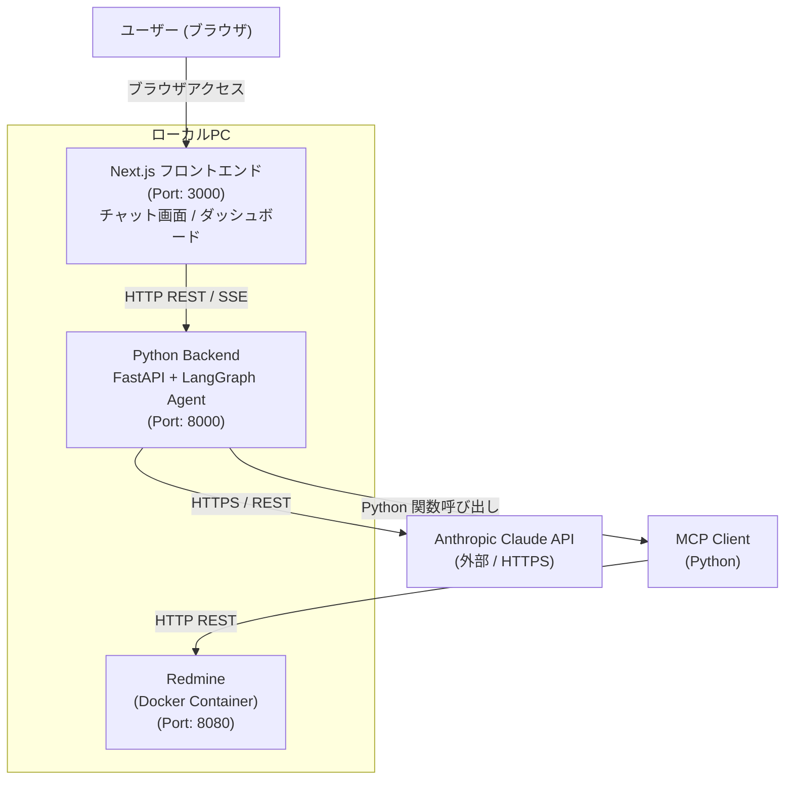
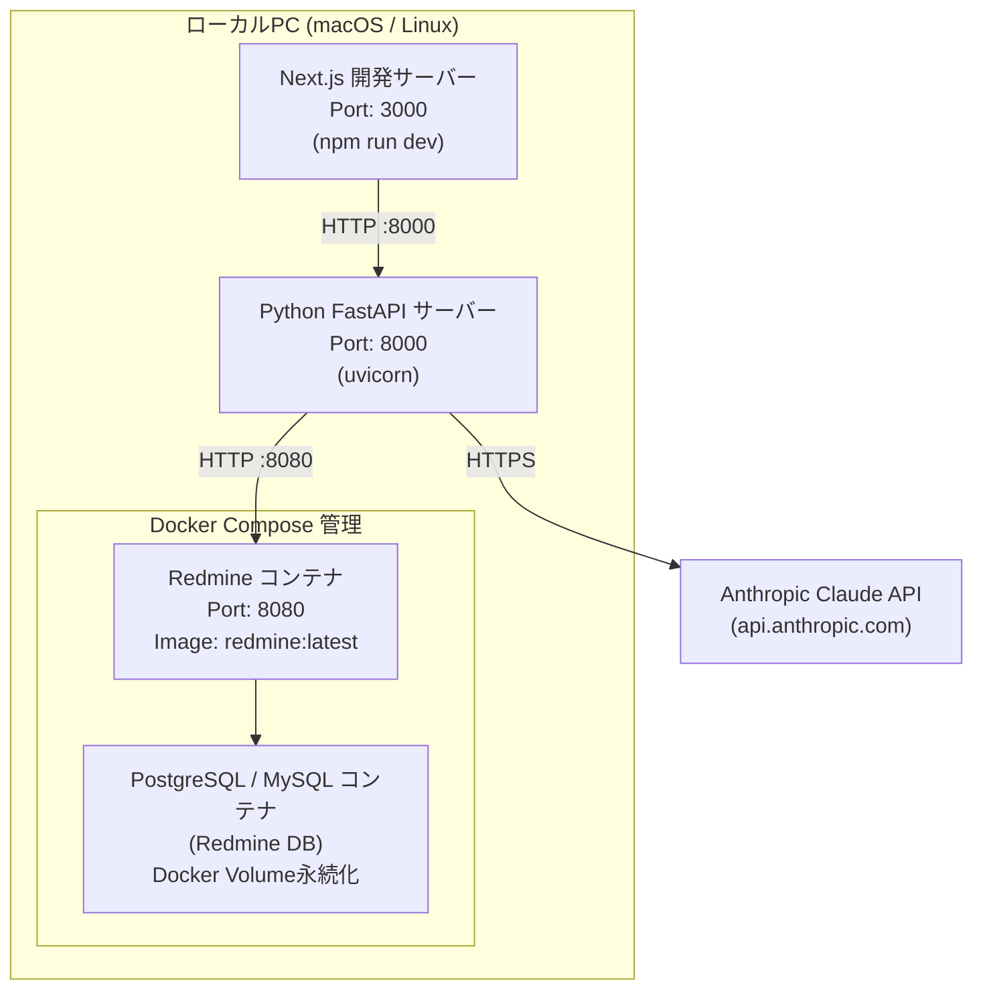

# BSD-001 システムアーキテクチャ設計書

| 項目 | 値 |
|---|---|
| ドキュメントID | BSD-001 |
| バージョン | 1.0 |
| 作成日 | 2026-03-03 |
| 入力元 | REQ-001, REQ-003, REQ-004 |
| ステータス | 初版 |

---

## 1. システム概要

### 1.1 目的・スコープ

**システム名**: personal-agent（パーソナルエージェントシステム）

**目的**: 日常的なタスク管理から作業の調整・依頼まで、様々なユースケースに対応するAIエージェントシステムを構築する。チャット形式の自然言語インターフェースを通じて、Redmineと連携したタスク管理・スケジュール調整・情報収集・文書作成支援を行う個人向けAIアシスタントを実現する。

**スコープ（フェーズ1）**:
- Redmineタスク管理（CRUD）: タスクの作成・検索・更新・優先度調整
- チャットUI: 自然言語でエージェントに指示を出す画面
- タスク一覧ダッシュボード: Redmineタスクの状態を可視化する画面

**スコープ外**:
- マルチユーザー対応（認証・権限管理）
- クラウドデプロイ・外部公開
- Redmine以外のプロジェクト管理ツール連携（フェーズ1）

### 1.2 システム全体構成図



### 1.5 アーキテクチャスタイルと DDD 整合

#### アーキテクチャスタイル選定

| 候補 | 概要 | 適用判断 | 選定理由 |
|---|---|---|---|
| レイヤードアーキテクチャ | プレゼンテーション→アプリケーション→ドメイン→インフラの4層構成 | 採用 | シングルユーザーの個人利用システムとして複雑性を抑えつつ、明確な責務分離を実現するために適切。フェーズ2への拡張も容易。 |
| ヘキサゴナルアーキテクチャ | ポート＆アダプタによる外部依存の分離 | 部分採用 | バックエンドにおいてMCPクライアント（Redmine連携）とClaude API連携をアダプターとして分離する。外部依存の差し替えを容易にする。 |
| クリーンアーキテクチャ | 依存性の方向を内側（ドメイン）に統一 | 不採用 | 個人利用のシンプルなシステムに対してオーバーエンジニアリングとなるため不採用。レイヤードで十分。 |

**選定結論**: バックエンドはレイヤードアーキテクチャを基本としつつ、外部依存部分（MCP・Claude API）はアダプターパターンで分離する。フロントエンドはNext.jsの標準構成（Pages/App Router）に準拠する。

#### レイヤー責務定義

| レイヤー | 責務 | 依存方向 |
|---|---|---|
| プレゼンテーション層 | FastAPI ルーター: HTTPリクエスト受付・レスポンス返却・SSEストリーミング配信。Next.js: UIコンポーネント・画面遷移・ユーザー入力受付 | → アプリケーション層 |
| アプリケーション層 | LangGraphエージェントのワークフロー実行・ユースケース制御（チャット処理・タスク操作フロー） | → ドメイン層 |
| ドメイン層 | Task・Message・ConversationSession等のエンティティ/値オブジェクト定義。ビジネスルール（タスク削除禁止・プロジェクト存在前提など） | 依存なし（最内層） |
| インフラストラクチャ層 | MCPクライアント（Redmine REST API呼び出し）・Claude APIクライアント・ログ出力・環境変数管理 | → ドメイン層（インターフェース実装） |

#### 境界づけられたコンテキストの配置戦略

| 戦略 | 概要 | 適用判断 | 選定理由 |
|---|---|---|---|
| モノリス内モジュール | 単一アプリケーション内でモジュール（パッケージ/ネームスペース）で分離 | 採用 | 個人利用・シングルユーザーのシステムにおいてマイクロサービス分割は不要。Pythonパッケージ単位でコンテキストを分離する。 |
| モジュラーモノリス | モノリス内で厳密なモジュール境界を設け、将来の分離に備える | 不採用 | 現フェーズでは複雑性が過大。モジュール内モジュールで対応可能。 |
| マイクロサービス | コンテキストごとに独立したサービスとしてデプロイ | 不採用 | ローカルPC上での個人利用であり、運用コストに見合わない。 |

**コンテキスト配置方針**:
- `chat/` パッケージ: Chat Contextの責務（メッセージ管理・会話履歴）
- `task/` パッケージ: Task Management Contextの責務（タスクCRUD）
- `agent/` パッケージ: Agent Core Contextの責務（LangGraphワークフロー・ツール定義）
- `integration/` パッケージ: Integration Contextの責務（MCP・Claude API連携）

> 詳細は BSD-009（ドメインモデル設計書）、BSD-010（データアーキテクチャ設計書）を参照。

---

## 2. 技術スタック

| 領域 | 技術・フレームワーク | バージョン | 選定理由 |
|---|---|---|---|
| フロントエンド | Next.js (React) | Node.js 18 以上 | REQ-001記載の技術スタック選定。Reactベースの構造化されたUIフレームワーク。SSE受信・Markdown表示の実装が容易。 |
| UIスタイリング | Tailwind CSS / Shadcn UI | 最新版 | 迅速なUI構築のため（OI-02: 基本設計フェーズで確定）。 |
| バックエンド | Python + FastAPI | Python 3.11 以上 | LangGraphがPythonネイティブ。FastAPIはSSE対応・非同期処理が容易。 |
| エージェントフレームワーク | LangGraph | 最新安定版（requirements.txtでピン留め） | CON-T-03: 技術スタック選定。ノード/エッジによるワークフロー定義・状態管理が可能。 |
| AIモデル | Anthropic Claude API | claude-opus-4-6 推奨 | CON-T-06: 技術スタック選定。高精度な自然言語処理・ツール呼び出し機能。 |
| 外部連携プロトコル | MCP (Model Context Protocol) | 最新版 | CON-T-05: 拡張性・標準化のため。将来的に複数MCPサーバーを追加可能。 |
| タスク管理基盤 | Redmine | 安定版（Docker） | CON-T-04: 業務要件。Dockerコンテナで動作。REST APIを提供。 |
| コンテナ | Docker / Docker Compose | 最新版 | CON-T-08: Redmineをコンテナで動作させる要件。docker-compose upで一括起動。 |
| キャッシュ | なし（フェーズ1） | - | 個人利用・低トラフィックのため不要。 |
| メッセージキュー | なし（フェーズ1） | - | 同期処理で対応可能。将来的なフェーズ2での検討余地あり。 |
| 認証 | なし（フェーズ1） | - | CON-B-01: シングルユーザー・ローカル環境のため認証不要。 |

---

## 3. インフラ構成

### 3.1 環境一覧

| 環境 | 用途 | ホスト/クラウド | 備考 |
|---|---|---|---|
| 開発（development） | 機能開発・デバッグ | ローカルPC | `.env.local` で環境変数管理 |
| テスト（staging） | 動作確認・結合テスト | ローカルPC | `.env.test` で環境変数管理。本番相当の設定で検証。 |
| 本番（production） | 実際の個人利用 | ローカルPC | `.env` で環境変数管理。クラウドデプロイは対象外（CON-B-03）。 |

### 3.2 インフラ構成図



### 3.3 ネットワーク構成

- 外部公開ポート: なし（ローカルホスト内完結。NFR-SEC-05）
- 内部通信ポート:
  - フロントエンド: localhost:3000
  - バックエンド: localhost:8000
  - Redmine: localhost:8080
- VPC/セキュリティグループ方針: ローカル環境のため不適用。外部通信はAnthropicへのHTTPS（443）のみ。

---

## 4. デプロイ構成

### 4.1 コンテナ/サービス構成

Redmineはdocker-composeで管理。フロントエンド・バックエンドは開発サーバーとしてネイティブ実行する。

```yaml
# docker-compose.yml 概要
services:
  redmine:
    image: redmine:latest
    ports:
      - "8080:3000"
    volumes:
      - redmine_data:/usr/src/redmine/files
    environment:
      REDMINE_DB_POSTGRES: db
  db:
    image: postgres:15
    volumes:
      - db_data:/var/lib/postgresql/data
volumes:
  redmine_data:
  db_data:
```

**NFR-OPS-01対応**: `docker-compose up -d` でRedmineを起動後、バックエンド・フロントエンドを起動する起動スクリプト（Makefile / シェルスクリプト）を提供する。

### 4.2 CI/CDパイプライン概要

個人利用のローカル環境のため、CI/CDパイプライン（GitHub Actions等）は**フェーズ1では省略**。

- コード品質チェック: pre-commit hook（flake8/ruff + eslint）
- テスト実行: 手動（pytest / npm test）
- デプロイ: ローカル手動起動

---

## 5. 通信方式

| 通信 | プロトコル | 形式 | 認証 |
|---|---|---|---|
| ブラウザ ↔ Next.js | HTTP | HTML/JSON | なし（ローカル） |
| フロントエンド ↔ バックエンド（チャット） | HTTP + SSE | JSON / text/event-stream | なし（ローカル環境のため。NFR-SEC-05） |
| フロントエンド ↔ バックエンド（タスク一覧） | HTTP REST | JSON | なし（ローカル環境のため） |
| バックエンド ↔ Redmine | HTTP REST | JSON | X-Redmine-API-Key ヘッダー（環境変数 REDMINE_API_KEY） |
| バックエンド ↔ Claude API | HTTPS REST | JSON | x-api-key ヘッダー（環境変数 ANTHROPIC_API_KEY） |
| バックエンド内 LangGraph ↔ MCP Client | Python 関数呼び出し | Python オブジェクト | なし |

---

## 6. スケーラビリティ・可用性方針

### 6.1 スケーラビリティ

個人利用・ローカル環境のため、水平スケーリングは対象外。

- **同時利用ユーザー**: 1人（NFR-PERF-05）
- **最大リクエスト数**: 1分間60回（NFR-PERF-06、Redmine API制限考慮）
- **拡張性**: NFR-EXT-01〜EXT-04に基づき、新しいMCPサーバー追加・LangGraphノード追加でフェーズ2機能を拡張可能な設計とする

### 6.2 可用性目標

| 指標 | 目標値 | 根拠 |
|---|---|---|
| ローカル環境での起動成功率 | 99%以上（手動起動時） | NFR-AVAIL-01 |
| Redmine接続失敗時 | 最大3回リトライ後にエラーメッセージ返却 | NFR-AVAIL-02 |
| 例外ハンドリング | 未処理例外をユーザーに通知し次の操作を継続可能 | NFR-AVAIL-03 |

### 6.3 障害対策

- **フェイルオーバー方針**: ローカル環境のため冗長化は不要。エラー発生時はユーザーフレンドリーなメッセージを表示し、操作継続を促す。
- **バックアップ方針**: Redmineデータ（チケット・添付ファイル）はDocker Volumeで永続化する（NFR-OPS-03）。ホストOS側でのバックアップは任意運用とする。
- **Claude APIタイムアウト**: タイムアウト設定を実装し、応答遅延時にユーザーへ通知する（RISK-T-05対策）。

---

## 7. 後続フェーズへの影響

| 影響先 | 内容 |
|---|---|
| BSD-009 | 4つのコンテキスト（Chat / TaskManagement / AgentCore / Integration）のパッケージ構成と依存方向の前提 |
| BSD-010 | ローカルPC上のOLTPのみ構成（Redmineデータ + アプリログ）、分析基盤は不要 |
| DSD-001〜006 | 技術スタック（FastAPI / LangGraph / Next.js）・通信方式（HTTP REST / SSE）に基づく詳細設計 |
| DSD-007 | コーディング規約の前提となるフレームワーク（Python/FastAPI + Next.js/TypeScript） |
| DSD-009_{FEAT-ID} | レイヤードアーキテクチャ + 4コンテキスト構成に基づくドメインモデル詳細設計 |
| IMP-003 | 環境構築手順: Docker Compose + Python venv + Node.js セットアップ手順 |
