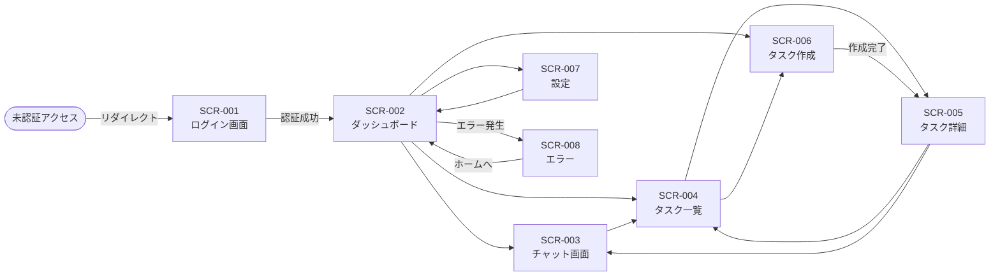

# BSD-003 画面設計書

| 項目 | 内容 |
|---|---|
| ドキュメントID | BSD-003 |
| バージョン | 1.0 |
| 作成日 | 2026-03-03 |
| 入力元 | REQ-003, REQ-005 |
| ステータス | 初版 |
| プロジェクト | PRJ-001 personal-agent |

---

## 1. 画面設計方針

### 1.1 UIフレームワーク・デザインシステム

- UI フレームワーク: Next.js 14+ (App Router) + React + TypeScript
- コンポーネントライブラリ: Shadcn/ui（Tailwind CSS ベース）または MUI（要確認: デザインシステム選定はDSD-002で確定）
- CSS フレームワーク: Tailwind CSS
- アイコン: Lucide React

### 1.2 レスポンシブ対応

- 対応デバイス: PC を主対象とする。タブレット・スマートフォンは補助対応（要確認）
- ブレークポイント（Tailwind CSS 準拠）:
  - sm: 640px 以上（スマートフォン横向き）
  - md: 768px 以上（タブレット縦向き）
  - lg: 1024px 以上（PC・デスクトップ）
  - xl: 1280px 以上（大型ディスプレイ）

### 1.3 共通デザイン規則

- カラーパレット: システムデフォルト（要確認：ブランドガイドライン未定）
  - プライマリ: #3B82F6（Blue 500）
  - セカンダリ: #6B7280（Gray 500）
  - アクセント: #10B981（Green 500）
  - エラー: #EF4444（Red 500）
  - 背景: #F9FAFB（Gray 50）
- フォント・タイポグラフィ: Noto Sans JP（日本語）/ Inter（英数字）
- アイコンセット: Lucide React（MIT ライセンス）
- グリッドシステム: Tailwind CSS の 12カラムグリッド

---

## 2. 画面一覧

| 画面ID | 画面名 | URL/パス | 説明 | 遷移元 | 遷移先 |
|---|---|---|---|---|---|
| SCR-001 | ログイン画面 | `/login` | ユーザー認証画面 | 未認証時すべての画面 | SCR-002 |
| SCR-002 | ダッシュボード | `/` | タスク概要・エージェント状態の一覧表示 | SCR-001 | SCR-003, SCR-004, SCR-005 |
| SCR-003 | チャット画面 | `/chat` | エージェントとの対話・作業依頼 | SCR-002 | SCR-002, SCR-004 |
| SCR-004 | タスク一覧画面 | `/tasks` | Redmine タスクの一覧・検索・フィルタ | SCR-002, SCR-003 | SCR-005 |
| SCR-005 | タスク詳細画面 | `/tasks/[id]` | タスクの詳細表示・編集 | SCR-004 | SCR-004, SCR-003 |
| SCR-006 | タスク作成画面 | `/tasks/new` | 新規タスク作成フォーム | SCR-002, SCR-004 | SCR-004, SCR-005 |
| SCR-007 | 設定画面 | `/settings` | ユーザー設定・API 連携設定（要確認） | SCR-002 | SCR-002 |
| SCR-008 | エラー画面 | `/error` | システムエラー・404 表示 | 全画面 | SCR-002 |

---

## 3. 画面遷移図



---

## 4. 共通コンポーネント

| コンポーネント名 | 説明 | 使用画面 |
|---|---|---|
| ヘッダー | グローバルナビゲーション（ロゴ・メニュー）・ユーザー情報・ログアウトボタン | SCR-002〜008 |
| サイドバー | ナビゲーションメニュー（ダッシュボード・チャット・タスク・設定）| SCR-002〜007 |
| ローディングスピナー | API 呼び出し中・エージェント実行中のインジケータ | 全画面 |
| トースト通知 | 操作完了・エラーの一時通知 | 全画面 |
| モーダルダイアログ | 確認ダイアログ・フォームモーダル | SCR-004, SCR-005 |
| タスクカード | タスク情報のカード表示（ステータス・優先度・期日） | SCR-002, SCR-004 |
| チャットバブル | エージェントとユーザーの発言表示 | SCR-003 |
| ページネーション | タスク一覧のページング | SCR-004 |
| 検索バー | タスク・キーワード検索 | SCR-004 |
| フォーム共通スタイル | 入力・ラベル・バリデーションエラー表示 | SCR-001, SCR-006, SCR-007 |

---

## 5. 画面別ワイヤーフレーム

### 5.1 SCR-001: ログイン画面

**URL**: `/login`
**アクター**: 未認証ユーザー
**概要**: ユーザー名（またはメールアドレス）とパスワードによる認証を行う。

**レイアウト（ASCII ワイヤーフレーム）:**
```
+------------------------------------------+
|              personal-agent              |
|          パーソナルエージェント           |
+------------------------------------------+
|                                          |
|   +----------------------------------+   |
|   |      ログイン                    |   |
|   |                                  |   |
|   |  メールアドレス                  |   |
|   |  [___________________________]   |   |
|   |                                  |   |
|   |  パスワード                      |   |
|   |  [___________________________]   |   |
|   |                                  |   |
|   |  [ ログイン ]                    |   |
|   |                                  |   |
|   |  ※エラーメッセージ表示エリア     |   |
|   +----------------------------------+   |
|                                          |
+------------------------------------------+
```

**主要コンポーネント:**
- 入力項目: メールアドレス（必須）・パスワード（必須）
- ボタン: ログイン → SCR-002（ダッシュボード）
- バリデーション: メールアドレス形式チェック・必須チェック

**エラー表示:**
- 認証失敗: 「メールアドレスまたはパスワードが正しくありません」
- アカウントロック: 「アカウントがロックされています。しばらく後に再試行してください」
- 入力必須: 各フィールドのインラインエラー表示

---

### 5.2 SCR-002: ダッシュボード

**URL**: `/`
**アクター**: 認証済みユーザー
**概要**: タスクの進捗サマリー・最近の会話履歴・クイックアクションを表示する。

**レイアウト（ASCII ワイヤーフレーム）:**
```
+------------------------------------------+
| [ロゴ] personal-agent    [ユーザー名] [v]|
+----------+-------------------------------+
|          |  ダッシュボード               |
| [ダッシュ |                               |
|  ボード] |  +--------+ +--------+        |
|          |  |未完了  | |今日の  |        |
| [チャット]|  |タスク  | |タスク  |        |
|          |  |  12    | |  3     |        |
| [タスク] |  +--------+ +--------+        |
|          |                               |
| [設定]   |  最近の会話                   |
|          |  +---------------------------+|
|          |  | AI: タスクを作成しました  ||
|          |  | ...                       ||
|          |  +---------------------------+|
|          |                               |
|          |  [+ 新規タスク]  [チャット開始]|
+----------+-------------------------------+
```

**主要コンポーネント:**
- サマリーカード: 未完了タスク数・今日のタスク数
- 最近の会話プレビュー（直近3件）
- クイックアクションボタン: 新規タスク作成 → SCR-006・チャット開始 → SCR-003

---

### 5.3 SCR-003: チャット画面

**URL**: `/chat`
**アクター**: 認証済みユーザー
**概要**: エージェントとの自然言語による対話で、タスク管理・作業依頼を行う。

**レイアウト（ASCII ワイヤーフレーム）:**
```
+------------------------------------------+
| [ロゴ] personal-agent    [ユーザー名] [v]|
+----------+-------------------------------+
|          |  チャット                     |
| [ダッシュ |                               |
|  ボード] |  +---------------------------+|
|          |  |  AI: こんにちは！         ||
| [チャット]|  |  何かお手伝いできますか？ ||
|          |  |                           ||
| [タスク] |  |  User: タスクを作成して   ||
|          |  |                           ||
| [設定]   |  |  AI: [実行中...] ...      ||
|          |  +---------------------------+|
|          |                               |
|          |  [入力欄___________________]  |
|          |  [ファイル添付]    [送信 ▶]  |
+----------+-------------------------------+
```

**主要コンポーネント:**
- チャット履歴表示エリア（スクロール可能）
- エージェント実行中インジケータ（ストリーミング表示）
- テキスト入力エリア（複数行対応・Shift+Enter で改行・Enter で送信）
- 送信ボタン

**エラー表示:**
- API 呼び出し失敗: 「エージェントとの通信に失敗しました。再試行してください」
- タイムアウト: 「処理に時間がかかっています。しばらくお待ちください」

---

### 5.4 SCR-004: タスク一覧画面

**URL**: `/tasks`
**アクター**: 認証済みユーザー
**概要**: Redmine から同期したタスクの一覧を表示・検索・フィルタリングする。

**レイアウト（ASCII ワイヤーフレーム）:**
```
+------------------------------------------+
| [ロゴ] personal-agent    [ユーザー名] [v]|
+----------+-------------------------------+
|          |  タスク一覧        [+ 新規]   |
| [ダッシュ |                               |
|  ボード] |  [検索___________] [ステータス▼]|
|          |                               |
| [チャット]|  +---------------------------+|
|          |  | [#] タイトル  状態  優先度 ||
| [タスク] |  +---------------------------+|
|          |  | 1  タスクA   進行中  高   ||
| [設定]   |  | 2  タスクB   未着手  中   ||
|          |  | 3  タスクC   完了    低   ||
|          |  +---------------------------+|
|          |  [< 前へ] 1/5 [次へ >]        |
+----------+-------------------------------+
```

**主要コンポーネント:**
- 検索バー（タイトル・担当者での検索）
- フィルター: ステータス・優先度・担当者
- タスク一覧テーブル（ソート可能）
- ページネーション（1ページ20件）
- 新規タスク作成ボタン → SCR-006

---

### 5.5 SCR-005: タスク詳細画面

**URL**: `/tasks/[id]`
**アクター**: 認証済みユーザー
**概要**: タスクの詳細情報の表示・編集を行う。

**レイアウト（ASCII ワイヤーフレーム）:**
```
+------------------------------------------+
| [ロゴ] personal-agent    [ユーザー名] [v]|
+----------+-------------------------------+
|          |  [< タスク一覧]               |
| [ダッシュ |                               |
|  ボード] |  タスク #1: タスクタイトル    |
|          |  ステータス: [進行中   v]      |
| [チャット]|  優先度:    [高       v]      |
|          |  担当者:    [山田 太郎 v]      |
| [タスク] |  期日:      2026-03-31        |
|          |                               |
| [設定]   |  説明:                        |
|          |  [タスクの詳細説明............]|
|          |                               |
|          |  [保存]  [エージェントに依頼]  |
+----------+-------------------------------+
```

**主要コンポーネント:**
- タスク詳細情報（ステータス・優先度・担当者・期日・説明）
- インライン編集機能
- 保存ボタン（Redmine への更新反映）
- エージェントに依頼ボタン → SCR-003（該当タスクのコンテキストを引き継いでチャット開始）

---

### 5.6 SCR-006: タスク作成画面

**URL**: `/tasks/new`
**アクター**: 認証済みユーザー
**概要**: 新規タスクを作成して Redmine に登録する。

**レイアウト（ASCII ワイヤーフレーム）:**
```
+------------------------------------------+
| [ロゴ] personal-agent    [ユーザー名] [v]|
+----------+-------------------------------+
|          |  新規タスク作成               |
| [ダッシュ |                               |
|  ボード] |  タイトル（必須）             |
|          |  [___________________________]|
| [チャット]|                               |
|          |  説明                         |
| [タスク] |  [___________________________]|
|          |  [___________________________]|
| [設定]   |                               |
|          |  優先度         ステータス    |
|          |  [中      v]    [未着手  v]   |
|          |                               |
|          |  担当者         期日          |
|          |  [________v]   [____/__/__]   |
|          |                               |
|          |         [キャンセル] [作成]   |
+----------+-------------------------------+
```

**主要コンポーネント:**
- タイトル（必須）・説明・優先度・ステータス・担当者・期日の入力フォーム
- 作成ボタン → Redmine への登録後、SCR-005 へ遷移
- キャンセルボタン → SCR-004 へ戻る
- バリデーション: タイトル必須・最大200文字

**エラー表示:**
- タイトル未入力: 「タイトルは必須項目です」
- Redmine 連携失敗: 「タスクの作成に失敗しました。再試行してください」

---

### 5.7 SCR-007: 設定画面

**URL**: `/settings`
**アクター**: 認証済みユーザー
**概要**: ユーザープロファイル・通知設定・連携設定を管理する（要確認：設定項目の詳細は DSD-002 で確定）。

**レイアウト（ASCII ワイヤーフレーム）:**
```
+------------------------------------------+
| [ロゴ] personal-agent    [ユーザー名] [v]|
+----------+-------------------------------+
|          |  設定                         |
| [ダッシュ |                               |
|  ボード] |  [プロファイル] [通知] [連携] |
|          |  +---------+                  |
| [チャット]|  プロファイル設定             |
|          |  名前: [___________________]  |
| [タスク] |  メール: [_________________]  |
|          |  パスワード変更               |
| [設定]   |  現在: [___________________]  |
|          |  新規:  [___________________]  |
|          |  確認:  [___________________]  |
|          |                               |
|          |             [保存]            |
+----------+-------------------------------+
```

---

## 6. 後続フェーズへの影響

| 影響先 | 内容 |
|---|---|
| DSD-002 | Next.js フロントエンドの詳細コンポーネント設計（SCR-001〜008 の実装仕様） |
| DSD-003 | 各画面から呼び出す API エンドポイントの詳細仕様 |
| ST-001 | システムテストのシナリオ（画面遷移フローに基づくテストケース） |
