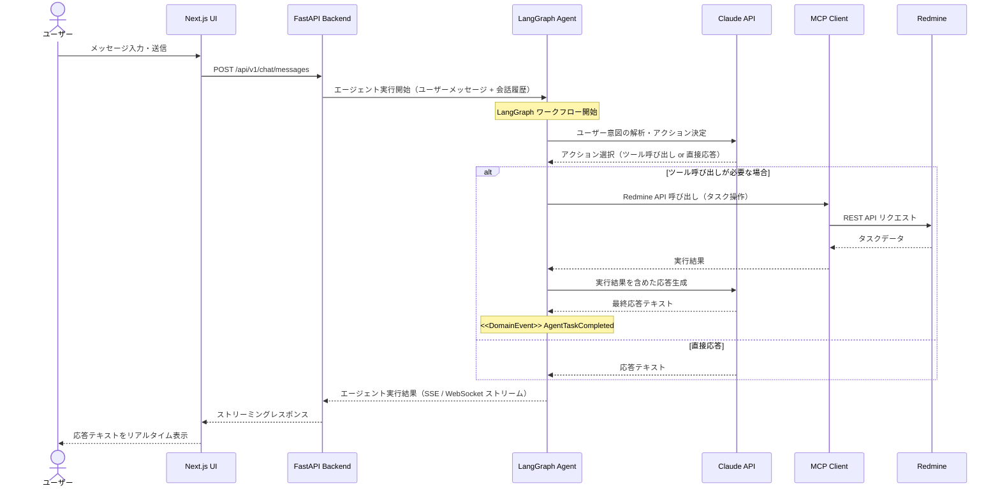
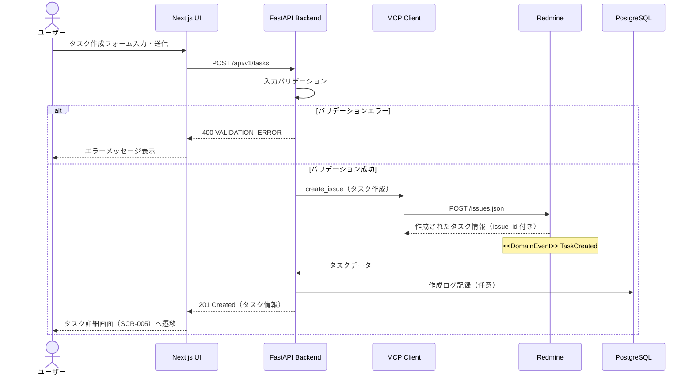
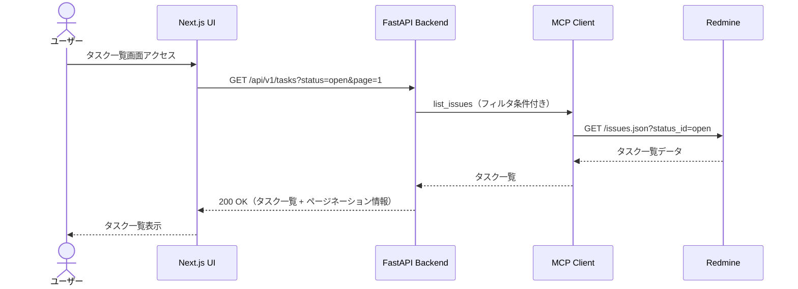
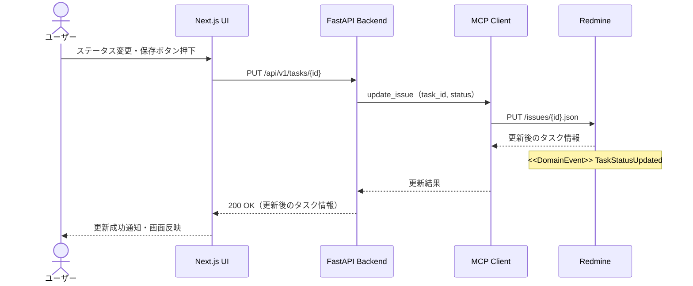
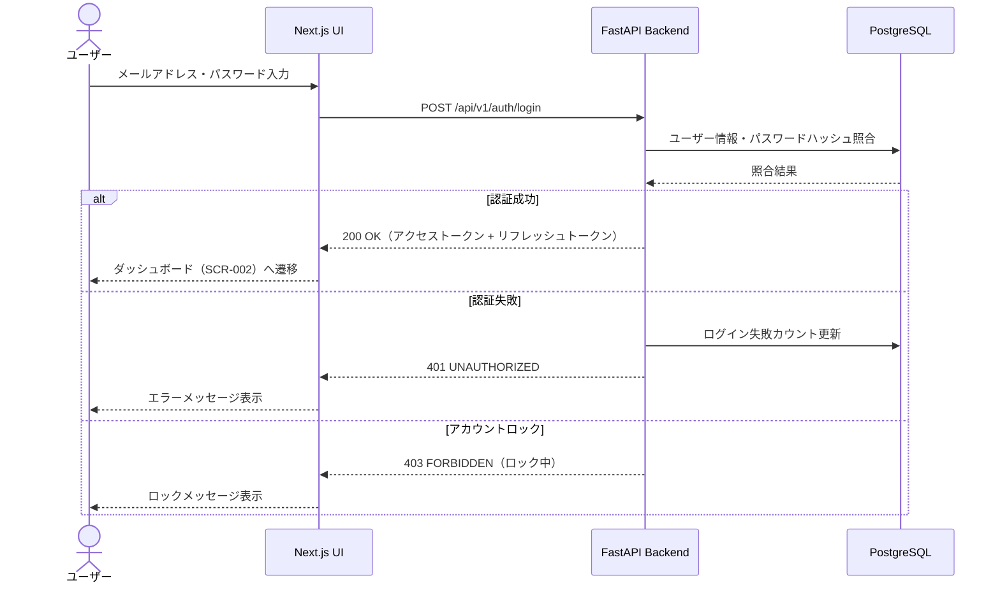

# BSD-004 業務フロー設計書

| 項目 | 内容 |
|---|---|
| ドキュメントID | BSD-004 |
| バージョン | 1.0 |
| 作成日 | 2026-03-03 |
| 入力元 | REQ-002, REQ-005 |
| ステータス | 初版 |
| プロジェクト | PRJ-001 personal-agent |

---

## 1. 業務フロー設計方針

### 1.1 対象業務の概要

personal-agent は以下の業務フローを中心に設計する:

1. **エージェントへの作業依頼**: ユーザーが自然言語でエージェントに指示を出し、エージェントが適切なアクション（Redmine タスク操作・情報検索・スケジューリング）を実行する
2. **タスク管理（CRUD）**: Redmine に対してタスクの作成・参照・更新・削除を行う
3. **タスクステータス更新**: タスクの進捗状況をエージェント経由または直接操作で更新する
4. **スケジューリング・調整**: 作業の優先順位付けとスケジュール最適化

### 1.2 アクター一覧

| アクターID | アクター名 | 役割 |
|---|---|---|
| ACT-001 | ユーザー | パーソナルエージェントを利用する一般ユーザー |
| ACT-002 | LangGraph エージェント | ユーザーの依頼を受けて自律的に処理を実行するAIエージェント |
| ACT-003 | Redmine | タスク管理を担う外部システム |
| ACT-004 | Anthropic Claude API | エージェントの推論・判断を担うLLM |

---

## 2. 業務フロー一覧

| フローID | 業務フロー名 | 対象アクター | 関連ユースケース |
|---|---|---|---|
| BF-001 | エージェントへの作業依頼 | ACT-001, ACT-002, ACT-004 | 自然言語による作業指示・エージェント実行 |
| BF-002 | タスク作成 | ACT-001, ACT-002, ACT-003 | Redmine への新規タスク登録 |
| BF-003 | タスク一覧・検索 | ACT-001, ACT-002, ACT-003 | Redmine タスクの取得・表示 |
| BF-004 | タスクステータス更新 | ACT-001, ACT-002, ACT-003 | タスクの進捗状態変更 |
| BF-005 | ログイン認証 | ACT-001 | ユーザー認証・セッション開始 |

---

## 3. 業務フロー詳細

### 3.1 BF-001: エージェントへの作業依頼

**目的**: ユーザーが自然言語でエージェントに指示し、エージェントが適切なツール（Redmine MCP 等）を選択・実行して結果をユーザーに返す
**トリガー**: ユーザーがチャット画面（SCR-003）にメッセージを入力・送信
**終了条件**:
- 正常終了: エージェントがタスクを完了し結果をチャット画面に表示
- 異常終了: API エラー・タイムアウト発生時にエラーメッセージを表示

**フロー図（シーケンス図）:**

**正常フロー（主フロー）:**
1. ユーザーがチャット画面にメッセージを入力して送信
2. フロントエンドが POST /api/v1/chat/messages を呼び出す
3. バックエンドが LangGraph エージェントを起動し、ユーザーメッセージと会話履歴を渡す
4. LangGraph が Claude API にメッセージを送り、意図解析・アクション決定を行う
5. ツール呼び出しが必要な場合は MCP 経由で Redmine API を実行する
6. 実行結果を Claude API に戻し、ユーザーへの応答テキストを生成する
7. ストリーミングで応答をフロントエンドに返し、チャット画面にリアルタイム表示する

**代替フロー:**
- ツール呼び出しが不要な場合: Claude API が直接応答を生成してフロントエンドに返す
- 複数のツール呼び出しが必要な場合: LangGraph の条件分岐ノードで複数ツールを順次実行する

**例外フロー:**
- Claude API タイムアウト（30秒以上）: エラーメッセージを表示し、再試行を促す
- Redmine 接続エラー: 「Redmine への接続に失敗しました」を表示し、部分的に取得できた情報で応答する
- LangGraph 実行エラー: エラーログを記録し、ユーザーにシステムエラーを通知する

**ドメイン不変条件:**
- エージェントは認証済みユーザーのみ実行可能である
- 会話履歴はセッション中に保持され、コンテキストとして利用される
- 1ユーザーあたり同時に1つのエージェント実行のみ許可する（要確認）

**ドメインイベント:**

| イベント名 | トリガー | 発行コンテキスト | 購読コンテキスト | ペイロード概要 |
|---|---|---|---|---|
| AgentTaskCompleted | エージェント実行完了 | CTX-002（エージェント） | CTX-001（タスク管理） | user_id, session_id, action_type, result_summary |
| AgentTaskFailed | エージェント実行失敗 | CTX-002（エージェント） | CTX-003（通知） | user_id, session_id, error_code, error_message |

---

### 3.2 BF-002: タスク作成

**目的**: ユーザーが新規タスクを作成し、Redmine に登録する
**トリガー**: タスク作成フォーム（SCR-006）での作成ボタン押下、またはエージェントへの「タスクを作成して」という指示
**終了条件**:
- 正常終了: Redmine にタスクが登録され、タスク詳細画面（SCR-005）に遷移
- 異常終了: バリデーションエラーまたは Redmine 連携エラー時にエラーメッセージを表示

**フロー図（シーケンス図）:**

**正常フロー（主フロー）:**
1. ユーザーがタスク作成フォーム（SCR-006）に必要情報を入力して送信
2. フロントエンドが POST /api/v1/tasks を呼び出す
3. バックエンドが入力バリデーションを実施する（タイトル必須・最大200文字等）
4. MCP クライアントが Redmine の Issue 作成 API を呼び出す
5. Redmine がタスクを登録し、issue_id を含むタスク情報を返す
6. バックエンドが 201 Created を返し、フロントエンドがタスク詳細画面へ遷移する

**例外フロー:**
- タイトル未入力: バリデーションエラー「タイトルは必須項目です」
- Redmine 接続失敗: 「タスクの作成に失敗しました。Redmine との接続を確認してください」

**ドメイン不変条件:**
- タスクのタイトルは必須であり、空文字は許可しない
- タスク作成者は認証済みユーザーである必要がある

**ドメインイベント:**

| イベント名 | トリガー | 発行コンテキスト | 購読コンテキスト | ペイロード概要 |
|---|---|---|---|---|
| TaskCreated | タスク作成成功 | CTX-001（タスク管理） | CTX-002（エージェント）, CTX-003（通知） | task_id, title, status, creator_id, created_at |

---

### 3.3 BF-003: タスク一覧・検索

**目的**: Redmine に登録されたタスクを一覧表示し、検索・フィルタリングを行う
**トリガー**: タスク一覧画面（SCR-004）へのアクセス、または検索条件の入力
**終了条件**: タスク一覧が画面に表示される

**フロー図（シーケンス図）:**

**正常フロー（主フロー）:**
1. ユーザーがタスク一覧画面（SCR-004）にアクセスする
2. フロントエンドが GET /api/v1/tasks を呼び出す（フィルタ・ページ番号をクエリパラメータで指定）
3. バックエンドが MCP 経由で Redmine の Issue 一覧 API を呼び出す
4. Redmine からタスク一覧を取得してフロントエンドに返す
5. フロントエンドがタスク一覧を表示する

---

### 3.4 BF-004: タスクステータス更新

**目的**: タスクの進捗状態（ステータス）を変更して Redmine に反映する
**トリガー**: タスク詳細画面（SCR-005）でのステータス変更・保存操作、またはエージェント経由の更新指示
**終了条件**:
- 正常終了: Redmine のタスクステータスが更新され、画面に反映される
- 異常終了: 更新エラー時にエラーメッセージを表示

**フロー図（シーケンス図）:**

**ドメイン不変条件:**
- ステータス遷移は Redmine の定義するフローに従う（要確認：Redmine のワークフロー設定による）
- 完了（Closed）ステータスのタスクは原則として再オープンが可能（要確認）

**ドメインイベント:**

| イベント名 | トリガー | 発行コンテキスト | 購読コンテキスト | ペイロード概要 |
|---|---|---|---|---|
| TaskStatusUpdated | タスクステータス変更 | CTX-001（タスク管理） | CTX-002（エージェント）, CTX-003（通知） | task_id, old_status, new_status, updated_by, updated_at |

---

### 3.5 BF-005: ログイン認証

**目的**: ユーザーがシステムにログインし、認証済みセッションを開始する
**トリガー**: ログイン画面（SCR-001）での認証情報入力・送信
**終了条件**:
- 正常終了: JWT 発行・セッション開始・ダッシュボード（SCR-002）へ遷移
- 異常終了: 認証失敗・アカウントロック

**フロー図（シーケンス図）:**

---

## 4. フロントエンド/バックエンド連携概要

| 業務処理 | フロントエンドの役割 | バックエンドの役割 | API概要 |
|---|---|---|---|
| エージェント実行 | メッセージ送信・ストリーミング表示 | LangGraph 起動・SSE/WebSocket 配信 | POST /api/v1/chat/messages |
| タスク作成 | フォーム送信・バリデーション表示 | バリデーション・Redmine MCP 呼び出し | POST /api/v1/tasks |
| タスク一覧取得 | 一覧表示・ページング・フィルタ UI | Redmine からのデータ取得・整形 | GET /api/v1/tasks |
| タスク詳細取得 | 詳細情報表示 | Redmine から単一タスク取得 | GET /api/v1/tasks/{id} |
| タスク更新 | フォーム送信・結果表示 | Redmine MCP 経由での更新 | PUT /api/v1/tasks/{id} |
| ログイン | フォーム送信・トークン保存 | パスワード照合・JWT 発行 | POST /api/v1/auth/login |

---

## 5. 後続フェーズへの影響

| 影響先 | 内容 |
|---|---|
| DSD-001 | FastAPI バックエンドの処理フロー詳細設計（BF-001〜005 の実装） |
| DSD-002 | Next.js フロントエンドの UI ロジック設計（チャット・タスク管理画面） |
| BSD-009 | ドメインイベント（AgentTaskCompleted・TaskCreated 等）の詳細定義 |
| DSD-009_{FEAT-ID} | ドメインイベント・不変条件の詳細設計 |
