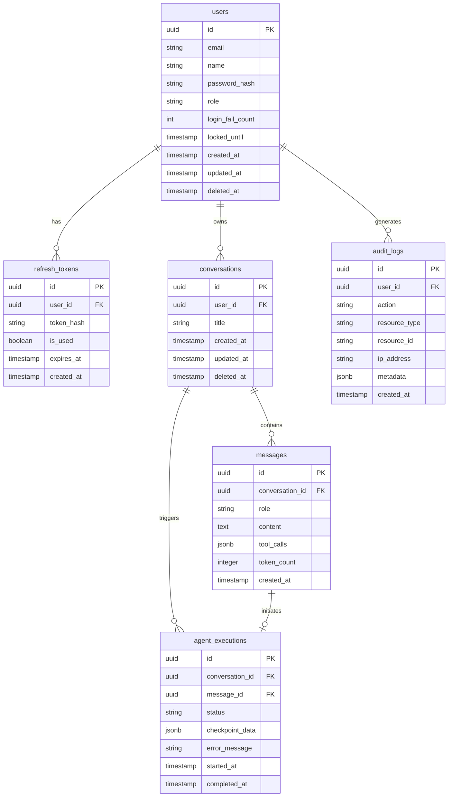

# BSD-006 データベース基本設計書

| 項目 | 内容 |
|---|---|
| ドキュメントID | BSD-006 |
| バージョン | 1.0 |
| 作成日 | 2026-03-03 |
| 入力元 | REQ-003, REQ-006, REQ-007 |
| ステータス | 初版 |
| プロジェクト | PRJ-001 personal-agent |

---

## 1. データベース設計方針

### 1.1 使用DBMS

- DBMS: PostgreSQL 15+
- 文字コード: UTF-8
- タイムゾーン: Asia/Tokyo（保存はすべて TIMESTAMPTZ で UTC 管理し、表示時に JST 変換）

### 1.2 設計方針

- 正規化レベル: 第3正規形（3NF）を基本とし、パフォーマンス上の理由がある場合のみ非正規化を検討する
- 論理削除: 採用（`deleted_at` カラム）。タスク・会話・メッセージは論理削除を適用する。ユーザーは個人情報保護の観点から物理削除を最終目標とする
- 監査カラム: 全テーブルに `created_at`・`updated_at` を設ける。操作者の追跡が必要なテーブルには `created_by`・`updated_by` を追加する
- ID方針: UUID v4 を主キーとして採用する。Redmine Issue ID は外部参照用に別カラムで保持する

### 1.3 DDD 整合データモデリング方針

- テーブルは集約単位でグループ化する。1つの集約は1つのトランザクション境界に対応する
- 境界づけられたコンテキスト（BSD-009）ごとにテーブルプレフィックスで所有権を表現する:
  - CTX-001（タスク管理）: `task_` プレフィックス（※Redmine が主データストアのため、ローカルはキャッシュ/ログ用途が中心）
  - CTX-002（エージェント）: `agent_` プレフィックス
  - CTX-003（認証）: `auth_` プレフィックス（または `users` など）
- 値オブジェクトの永続化戦略:
  - 単純な値オブジェクト（TaskStatus・TaskPriority 等）: 文字列型カラムとして同一テーブルに埋め込む
  - Redmine 側のエンティティ（Issue）は Redmine DB が正とするため、本システム DB にはキャッシュまたはローカル拡張データのみを保持する

> 詳細は BSD-009（ドメインモデル設計書）、BSD-010（データアーキテクチャ設計書）を参照。

---

## 2. ER図（概念レベル）

---

## 3. テーブル一覧

| テーブル名 | 論理名 | 概要 | 境界づけられたコンテキスト | 集約 | 関連機能 |
|---|---|---|---|---|---|
| `users` | ユーザー | システム利用者の認証情報・プロファイル | CTX-003（認証） | User 集約ルート | ログイン・ユーザー管理 |
| `refresh_tokens` | リフレッシュトークン | JWT リフレッシュトークンの管理 | CTX-003（認証） | User 集約（従属） | トークン更新 |
| `conversations` | 会話 | ユーザーとエージェントの対話セッション | CTX-002（エージェント） | Conversation 集約ルート | エージェント実行 |
| `messages` | メッセージ | 会話内の個別メッセージ（ユーザー・エージェント） | CTX-002（エージェント） | Conversation 集約（従属） | チャット |
| `agent_executions` | エージェント実行 | エージェントの実行インスタンス・チェックポイント | CTX-002（エージェント） | AgentExecution 集約ルート | エージェント実行 |
| `audit_logs` | 監査ログ | 全コンテキスト横断の操作ログ | 横断 | - | セキュリティ監査 |

---

## 4. テーブル定義（主要テーブル）

### 4.1 `users`（ユーザー）

**概要**: システムに登録されたユーザーの認証情報・プロファイルを管理する。パスワードはハッシュ化して保存する。

| カラム名 | 型 | 制約 | 説明 |
|---|---|---|---|
| `id` | UUID | PK, NOT NULL, DEFAULT gen_random_uuid() | 主キー |
| `email` | VARCHAR(255) | NOT NULL, UNIQUE | メールアドレス（一意制約） |
| `name` | VARCHAR(100) | NOT NULL | 表示名 |
| `password_hash` | VARCHAR(255) | NOT NULL | bcrypt ハッシュ化パスワード |
| `role` | VARCHAR(20) | NOT NULL, DEFAULT 'user' | ロール（`admin` / `user`） |
| `login_fail_count` | INTEGER | NOT NULL, DEFAULT 0 | 連続ログイン失敗回数 |
| `locked_until` | TIMESTAMPTZ | NULL | アカウントロック解除日時（NULL = 非ロック） |
| `created_at` | TIMESTAMPTZ | NOT NULL, DEFAULT NOW() | 作成日時 |
| `updated_at` | TIMESTAMPTZ | NOT NULL, DEFAULT NOW() | 更新日時 |
| `deleted_at` | TIMESTAMPTZ | NULL | 論理削除日時（NULL = 有効） |

**インデックス:**

| インデックス名 | カラム | 種別 | 用途 |
|---|---|---|---|
| `users_pkey` | `id` | PRIMARY KEY | 主キー |
| `users_email_unique` | `email` | UNIQUE | メールアドレス検索・重複防止 |
| `idx_users_deleted_at` | `deleted_at` | B-tree | 論理削除フィルタ |

---

### 4.2 `refresh_tokens`（リフレッシュトークン）

**概要**: JWT リフレッシュトークンのハッシュ値・有効期限・使用済みフラグを管理する。

| カラム名 | 型 | 制約 | 説明 |
|---|---|---|---|
| `id` | UUID | PK, NOT NULL, DEFAULT gen_random_uuid() | 主キー |
| `user_id` | UUID | NOT NULL, FK → users.id | ユーザーID（外部キー） |
| `token_hash` | VARCHAR(255) | NOT NULL, UNIQUE | リフレッシュトークンの SHA-256 ハッシュ |
| `is_used` | BOOLEAN | NOT NULL, DEFAULT false | 使用済みフラグ（ローテーション用） |
| `expires_at` | TIMESTAMPTZ | NOT NULL | トークン有効期限 |
| `created_at` | TIMESTAMPTZ | NOT NULL, DEFAULT NOW() | 発行日時 |

**インデックス:**

| インデックス名 | カラム | 種別 | 用途 |
|---|---|---|---|
| `refresh_tokens_pkey` | `id` | PRIMARY KEY | 主キー |
| `refresh_tokens_token_hash_unique` | `token_hash` | UNIQUE | トークン検索 |
| `idx_refresh_tokens_user_id` | `user_id` | B-tree | ユーザー別トークン検索 |

---

### 4.3 `conversations`（会話）

**概要**: ユーザーとエージェントの対話セッションを管理する。複数のメッセージとエージェント実行を内包する集約ルート。

| カラム名 | 型 | 制約 | 説明 |
|---|---|---|---|
| `id` | UUID | PK, NOT NULL, DEFAULT gen_random_uuid() | 主キー |
| `user_id` | UUID | NOT NULL, FK → users.id | 会話オーナーのユーザーID |
| `title` | VARCHAR(200) | NULL | 会話タイトル（最初のメッセージから自動生成、要確認） |
| `created_at` | TIMESTAMPTZ | NOT NULL, DEFAULT NOW() | 作成日時 |
| `updated_at` | TIMESTAMPTZ | NOT NULL, DEFAULT NOW() | 最終更新日時 |
| `deleted_at` | TIMESTAMPTZ | NULL | 論理削除日時 |

**インデックス:**

| インデックス名 | カラム | 種別 | 用途 |
|---|---|---|---|
| `conversations_pkey` | `id` | PRIMARY KEY | 主キー |
| `idx_conversations_user_id` | `user_id` | B-tree | ユーザー別会話一覧取得 |
| `idx_conversations_user_updated` | `user_id, updated_at DESC` | B-tree | ユーザー別・更新日時順取得 |

---

### 4.4 `messages`（メッセージ）

**概要**: 会話内のメッセージ（ユーザー入力・エージェント応答）を時系列で管理する。ツール呼び出し情報は JSONB で保持する。

| カラム名 | 型 | 制約 | 説明 |
|---|---|---|---|
| `id` | UUID | PK, NOT NULL, DEFAULT gen_random_uuid() | 主キー |
| `conversation_id` | UUID | NOT NULL, FK → conversations.id | 会話ID |
| `role` | VARCHAR(20) | NOT NULL | メッセージロール（`user`/`assistant`/`tool`） |
| `content` | TEXT | NULL | メッセージ本文（ツール呼び出しのみの場合は NULL 許容） |
| `tool_calls` | JSONB | NULL | ツール呼び出し情報（名前・入力・出力） |
| `token_count` | INTEGER | NULL | このメッセージのトークン数（コスト管理用） |
| `created_at` | TIMESTAMPTZ | NOT NULL, DEFAULT NOW() | メッセージ送信日時 |

**インデックス:**

| インデックス名 | カラム | 種別 | 用途 |
|---|---|---|---|
| `messages_pkey` | `id` | PRIMARY KEY | 主キー |
| `idx_messages_conversation_id` | `conversation_id` | B-tree | 会話別メッセージ取得 |
| `idx_messages_conversation_created` | `conversation_id, created_at ASC` | B-tree | 会話別・時系列順取得 |

---

### 4.5 `agent_executions`（エージェント実行）

**概要**: LangGraph エージェントの各実行インスタンスを管理する。チェックポイントデータにより中断・再開を可能にする。

| カラム名 | 型 | 制約 | 説明 |
|---|---|---|---|
| `id` | UUID | PK, NOT NULL, DEFAULT gen_random_uuid() | 主キー |
| `conversation_id` | UUID | NOT NULL, FK → conversations.id | 会話ID |
| `message_id` | UUID | NULL, FK → messages.id | トリガーとなったメッセージID |
| `status` | VARCHAR(20) | NOT NULL, DEFAULT 'running' | 実行状態（`running`/`completed`/`failed`/`cancelled`） |
| `checkpoint_data` | JSONB | NULL | LangGraph チェックポイントデータ（グラフ状態） |
| `error_message` | TEXT | NULL | エラー時のエラーメッセージ |
| `started_at` | TIMESTAMPTZ | NOT NULL, DEFAULT NOW() | 実行開始日時 |
| `completed_at` | TIMESTAMPTZ | NULL | 実行完了日時 |

**インデックス:**

| インデックス名 | カラム | 種別 | 用途 |
|---|---|---|---|
| `agent_executions_pkey` | `id` | PRIMARY KEY | 主キー |
| `idx_agent_executions_conversation_id` | `conversation_id` | B-tree | 会話別実行履歴取得 |
| `idx_agent_executions_status` | `status` | B-tree | 実行中エージェントの監視 |

---

### 4.6 `audit_logs`（監査ログ）

**概要**: ユーザーの操作ログ・認証イベントを記録する。セキュリティ監査・不正アクセス検知に使用する。追記のみで更新・削除は禁止する。

| カラム名 | 型 | 制約 | 説明 |
|---|---|---|---|
| `id` | UUID | PK, NOT NULL, DEFAULT gen_random_uuid() | 主キー |
| `user_id` | UUID | NULL, FK → users.id | 操作者ユーザーID（未認証時は NULL） |
| `action` | VARCHAR(50) | NOT NULL | アクション（`login`/`logout`/`task_created`/`agent_executed` 等） |
| `resource_type` | VARCHAR(50) | NULL | 対象リソース種別（`task`/`conversation` 等） |
| `resource_id` | VARCHAR(100) | NULL | 対象リソースID |
| `ip_address` | INET | NULL | クライアント IP アドレス |
| `metadata` | JSONB | NULL | 追加メタデータ（ユーザーエージェント等） |
| `created_at` | TIMESTAMPTZ | NOT NULL, DEFAULT NOW() | ログ記録日時 |

**インデックス:**

| インデックス名 | カラム | 種別 | 用途 |
|---|---|---|---|
| `audit_logs_pkey` | `id` | PRIMARY KEY | 主キー |
| `idx_audit_logs_user_id` | `user_id` | B-tree | ユーザー別ログ検索 |
| `idx_audit_logs_action` | `action` | B-tree | アクション別ログ検索 |
| `idx_audit_logs_created_at` | `created_at` | B-tree | 日時範囲検索・パーティション基準 |

---

## 5. データモデル方針

### 5.1 マイグレーション方針

- マイグレーションツール: Alembic（SQLAlchemy との統合・Python エコシステムとの親和性）
- 命名規則: `{revision_id}_{description}.py`（Alembic 自動採番）
- ロールバック対応: 各マイグレーションに `downgrade()` 関数を実装して可逆性を確保する
- 本番適用: CI/CD パイプラインでのマイグレーション自動適用（マニュアル承認後）

### 5.2 シーディング（初期データ）

- 管理者ユーザー（admin）: インストール時に初期管理者アカウントを1件作成する。パスワードは環境変数から設定する

### 5.3 バックアップ方針

- バックアップ方式: PostgreSQL pg_dump による日次フルバックアップ + WAL アーカイブによるポイントインタイムリカバリ（PITR）
- 詳細は OPS-004 にて定義する

### 5.5 データフロー・分析基盤考慮

#### 読み取りモデル / マテリアライズドビュー戦略

CQRS は初期フェーズでは不採用。単純な RDBMS クエリでパフォーマンス要件を満たす前提とする。スケールアウトが必要になった場合に ReadReplica + マテリアライズドビューを検討する。

| ビュー名 | 元テーブル | 更新頻度 | 用途 |
|---|---|---|---|
| （初期フェーズでは不採用） | - | - | - |

#### イベントストアテーブル設計（イベントソーシング採用時）

イベントソーシングは初期フェーズでは**不採用**。`agent_executions.checkpoint_data`（JSONB）に LangGraph のグラフ状態をスナップショットとして保存するアプローチを採用する。

#### 監査証跡テーブル設計

`audit_logs` テーブルで全コンテキスト横断の監査証跡を記録する（4.6 参照）。

| カラム名 | 型 | 説明 |
|---|---|---|
| `audit_id` | UUID | 監査ログID（`id` カラムとして実装） |
| `table_name` | VARCHAR | 対象テーブル（`resource_type` カラムとして実装） |
| `record_id` | UUID | 対象レコードID（`resource_id` カラムとして実装） |
| `operation` | VARCHAR | 操作（`action` カラムとして実装） |
| `operated_by` | UUID | 操作者ID（`user_id` カラムとして実装） |
| `operated_at` | TIMESTAMPTZ | 操作日時（`created_at` カラムとして実装） |

---

## 6. 後続フェーズへの影響

| 影響先 | 内容 |
|---|---|
| DSD-004 | 機能別のテーブル詳細定義・インデックス詳細・SQLAlchemy ORM モデル定義 |
| DSD-009_{FEAT-ID} | 集約-テーブルマッピング（Conversation→conversations・AgentExecution→agent_executions）の前提 |
| BSD-010 | データアーキテクチャ設計の OLTP 基盤としてのテーブル構造 |
| IMP-004 | Alembic マイグレーションスクリプトの作成手順 |
| OPS-004 | バックアップ・リストア手順書（pg_dump / WAL アーカイブ設定） |
