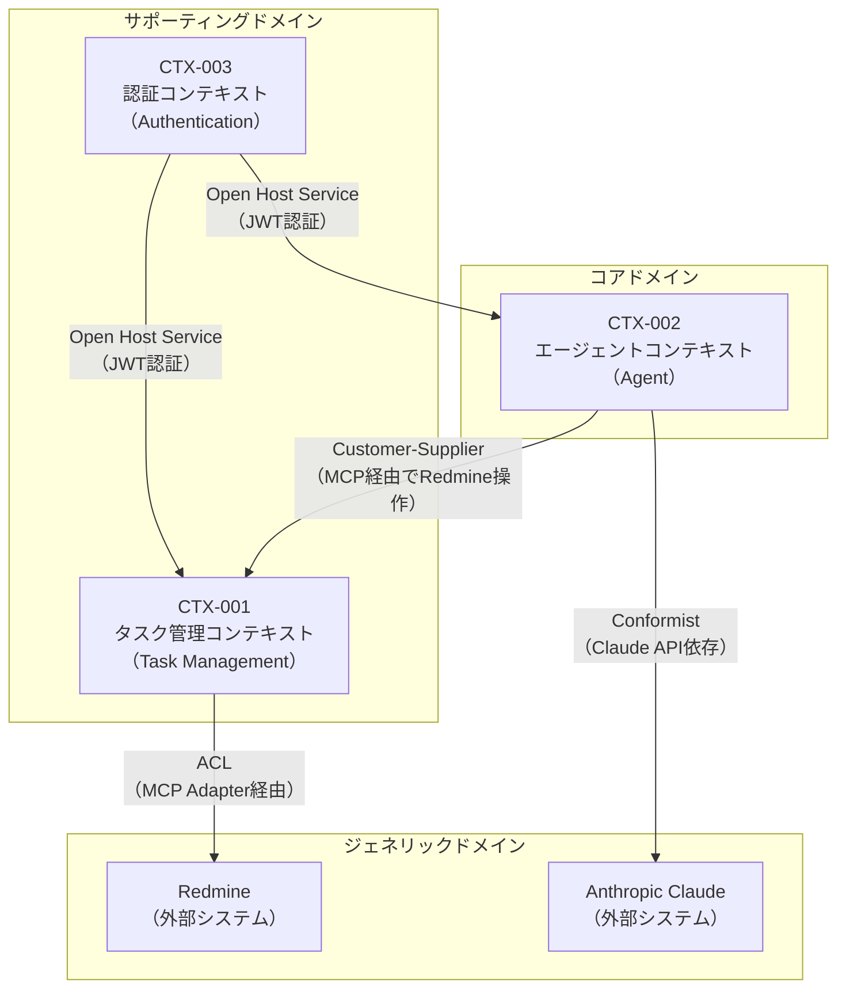

# BSD-009 ドメインモデル設計書（DDD 戦略設計）

| 項目 | 内容 |
|---|---|
| ドキュメントID | BSD-009 |
| バージョン | 1.0 |
| 作成日 | 2026-03-03 |
| 入力元 | REQ-002, REQ-005, REQ-006 |
| ステータス | 初版 |
| プロジェクト | PRJ-001 personal-agent |

---

## 目次
1. ユビキタス言語辞書
2. 境界づけられたコンテキストマップ
3. コンテキスト定義詳細
4. コンテキスト間統合パターン
5. サブドメイン分類
6. 後続フェーズへの影響

---

## 1. ユビキタス言語辞書

### 1.1 全体共通用語

| 用語（日本語） | 用語（英語） | 定義 | 備考 |
|---|---|---|---|
| パーソナルエージェント | Personal Agent | ユーザーの作業依頼を受け、自律的に処理を実行するAIシステム | システム全体の呼称 |
| タスク | Task | ユーザーが完了すべき作業単位。Redmine の Issue に対応する | Redmine 上では「Issue」とも呼ばれる |
| エージェント実行 | Agent Execution | ユーザーの指示に基づき LangGraph エージェントが処理を実行すること | |
| セッション | Session | ユーザーとエージェント間の一連の対話コンテキスト | 会話履歴を保持する単位 |
| ユーザー | User | システムを利用する人間のアクター | |
| MCP | Model Context Protocol | エージェントと外部システム（Redmine）を繋ぐ標準化されたプロトコル | |
| ワークフロー | Workflow | LangGraph で定義されるエージェントの処理グラフ | |

### 1.2 コンテキスト別用語

#### タスク管理コンテキスト（CTX-001）

| 用語（日本語） | 用語（英語） | このコンテキストでの定義 | 他コンテキストとの違い |
|---|---|---|---|
| タスク | Task | Redmine の Issue として管理される作業単位。ステータス・優先度・担当者・期日を持つ | エージェントコンテキストでは「実行すべきアクション」を指す場合がある |
| ステータス | Status | タスクの進捗状態（未着手・進行中・完了・却下等）。Redmine のステータス定義に準拠する | |
| 優先度 | Priority | タスクの重要度（低・通常・高・緊急）。Redmine の優先度定義に準拠する | |
| 担当者 | Assignee | タスクの実行責任者となる Redmine ユーザー | |
| プロジェクト | Project | タスクが属する Redmine プロジェクト | |
| Issue ID | Issue ID | Redmine が自動採番するタスクの一意識別子 | |

#### エージェントコンテキスト（CTX-002）

| 用語（日本語） | 用語（英語） | このコンテキストでの定義 | 他コンテキストとの違い |
|---|---|---|---|
| 会話 | Conversation | ユーザーとエージェント間のメッセージのやりとり。セッション内で管理される | タスク管理コンテキストの「タスク」とは独立した概念 |
| メッセージ | Message | 会話の構成単位。ユーザーメッセージまたはエージェント応答 | |
| ツール呼び出し | Tool Call | エージェントが外部システム（Redmine 等）を操作するためのアクション | |
| グラフノード | Graph Node | LangGraph ワークフロー内の処理単位 | |
| チェックポイント | Checkpoint | エージェント実行状態の永続化スナップショット。中断・再開を可能にする | |
| 推論 | Inference | Claude LLM がユーザー意図を解析し次アクションを決定すること | |

#### 認証コンテキスト（CTX-003）

| 用語（日本語） | 用語（英語） | このコンテキストでの定義 | 他コンテキストとの違い |
|---|---|---|---|
| ユーザー | User | システムに登録され認証される主体。メールアドレスとパスワードで識別される | タスク管理コンテキストでは「担当者」としても現れる |
| アクセストークン | Access Token | 認証済みユーザーを識別するための JWT。有効期限60分 | |
| リフレッシュトークン | Refresh Token | アクセストークンを更新するためのトークン。有効期限7日 | |
| ロール | Role | ユーザーの権限区分（admin / user）| |

---

## 2. 境界づけられたコンテキストマップ

### 2.1 コンテキストマップ図

### 2.2 コンテキスト一覧

| コンテキストID | コンテキスト名 | サブドメイン分類 | 主要責務 | 含有 FEAT-ID |
|---|---|---|---|---|
| CTX-001 | タスク管理コンテキスト | サポーティング | Redmine タスクの CRUD・ステータス管理・検索 | FEAT-002（タスク作成）, FEAT-003（タスク一覧）, FEAT-004（タスク更新） |
| CTX-002 | エージェントコンテキスト | コア | 自然言語理解・ツール選択・ワークフロー実行・会話履歴管理 | FEAT-001（エージェント実行）, FEAT-005（スケジューリング） |
| CTX-003 | 認証コンテキスト | ジェネリック | ユーザー認証・JWT 発行・セッション管理・ロール管理 | FEAT-006（ログイン）, FEAT-007（ユーザー管理） |

---

## 3. コンテキスト定義詳細

### 3.1 CTX-001: タスク管理コンテキスト

**責務**: Redmine に登録されたタスクの作成・参照・更新・削除を管理し、タスクのライフサイクルを統制する
**サブドメイン分類**: サポーティング

**含有 FEAT-ID:**

| FEAT-ID | 機能名 | 役割 |
|---|---|---|
| FEAT-002 | タスク作成 | 新規タスクを Redmine に登録する |
| FEAT-003 | タスク一覧・検索 | Redmine からタスク一覧を取得・フィルタリングする |
| FEAT-004 | タスク更新 | タスクのステータス・内容を更新する |

**主要エンティティ:**

| エンティティ名 | 役割 | 集約ルート候補 |
|---|---|---|
| Task（タスク） | Redmine Issue の写像。タスクの全属性を保持する | はい（Task 集約のルート） |
| TaskStatus（タスクステータス） | タスクの状態値オブジェクト（未着手・進行中・完了等） | いいえ（値オブジェクト） |
| TaskPriority（優先度） | タスクの優先度値オブジェクト（低・通常・高・緊急） | いいえ（値オブジェクト） |

**ドメインルール概要:**
- タスクのタイトルは必須であり空文字を許可しない
- タスクのステータス遷移は Redmine のワークフロー定義に従う
- タスクは必ず1つの Redmine プロジェクトに属する（要確認）

**ドメインイベント概要:**

| イベント名 | トリガー | 影響先コンテキスト |
|---|---|---|
| TaskCreated | タスク作成成功 | CTX-002（エージェントへの通知） |
| TaskStatusUpdated | タスクステータス変更 | CTX-002（エージェントへの通知） |
| TaskDeleted | タスク削除 | CTX-002（エージェントへの通知） |

---

### 3.2 CTX-002: エージェントコンテキスト

**責務**: ユーザーの自然言語入力を解釈し、LangGraph ワークフローを実行して適切なアクション（ツール呼び出し）を選択・実行し、結果をユーザーに返す。このシステムの中核となる競争優位領域
**サブドメイン分類**: コア

**含有 FEAT-ID:**

| FEAT-ID | 機能名 | 役割 |
|---|---|---|
| FEAT-001 | エージェント実行 | 自然言語入力からアクションを推論・実行する |
| FEAT-005 | スケジューリング・調整 | タスクの優先順位付けとスケジュール最適化を行う |

**主要エンティティ:**

| エンティティ名 | 役割 | 集約ルート候補 |
|---|---|---|
| Conversation（会話） | ユーザーとエージェントの対話セッション。メッセージ履歴を保持する | はい（Conversation 集約のルート） |
| Message（メッセージ） | 会話の構成単位。ロール（user/assistant）とコンテンツを持つ | いいえ（Conversation に従属） |
| AgentExecution（エージェント実行） | 単一のエージェント実行インスタンス。LangGraph のチェックポイントと対応する | はい（AgentExecution 集約のルート） |
| ToolCall（ツール呼び出し） | エージェントが外部システムを操作するアクションの記録 | いいえ（AgentExecution に従属） |

**ドメインルール概要:**
- 1つの Conversation は1人のユーザーに帰属し、他ユーザーはアクセスできない
- AgentExecution は Conversation に属し、実行中は並行して複数のエージェントを起動しない（1セッション1エージェント実行）
- ToolCall の結果は AgentExecution に記録され、次の推論に利用される

**ドメインイベント概要:**

| イベント名 | トリガー | 影響先コンテキスト |
|---|---|---|
| AgentTaskCompleted | エージェント実行完了 | CTX-001（タスク操作結果の反映） |
| AgentTaskFailed | エージェント実行失敗 | なし（ログ記録のみ） |
| ConversationStarted | 新規会話開始 | なし |

---

### 3.3 CTX-003: 認証コンテキスト

**責務**: ユーザーの認証（ID/パスワード検証）・JWT 発行・セッション管理・ロールに基づく認可の基盤を提供する
**サブドメイン分類**: ジェネリック

**含有 FEAT-ID:**

| FEAT-ID | 機能名 | 役割 |
|---|---|---|
| FEAT-006 | ログイン / ログアウト | ユーザー認証・セッション開始・終了 |
| FEAT-007 | ユーザー管理 | ユーザー情報の登録・更新（管理者機能） |

**主要エンティティ:**

| エンティティ名 | 役割 | 集約ルート候補 |
|---|---|---|
| User（ユーザー） | システムに登録された利用者。メールアドレス・ハッシュ化パスワード・ロールを持つ | はい（User 集約のルート） |
| RefreshToken（リフレッシュトークン） | JWT リフレッシュトークンの管理。有効期限・使用済みフラグを持つ | いいえ（User に従属） |

**ドメインルール概要:**
- メールアドレスはシステム内で一意である
- パスワードは bcrypt でハッシュ化して保存し、平文は保持しない
- ログイン失敗5回でアカウントを15分間ロックする

**ドメインイベント概要:**

| イベント名 | トリガー | 影響先コンテキスト |
|---|---|---|
| UserLoggedIn | ログイン成功 | なし（監査ログ記録） |
| UserLoggedOut | ログアウト | CTX-002（会話セッションの終了処理） |
| UserLockedOut | アカウントロック | なし（監査ログ記録） |

---

## 4. コンテキスト間統合パターン

### 4.1 統合パターン一覧

| 上流コンテキスト | 下流コンテキスト | 統合パターン | データ連携方式 | 説明 |
|---|---|---|---|---|
| CTX-003（認証） | CTX-002（エージェント） | Open Host Service | 同期API（JWT検証） | 認証コンテキストが JWT 検証サービスを公開し、エージェントコンテキストが利用する |
| CTX-003（認証） | CTX-001（タスク管理） | Open Host Service | 同期API（JWT検証） | 同上。タスク管理 API の認可チェックに使用 |
| CTX-002（エージェント） | CTX-001（タスク管理） | Customer-Supplier | 同期API（MCP経由） | エージェントがタスク管理操作を要求する顧客。タスク管理は供給者としてMCPツールを提供する |
| CTX-001（タスク管理） | Redmine（外部） | ACL（Anti-Corruption Layer） | 同期API（REST/MCP） | MCP クライアントが Redmine の REST API モデルを内部ドメインモデルに変換するACLとして機能する |
| CTX-002（エージェント） | Anthropic Claude（外部） | Conformist | 同期API（HTTPS） | Claude API のモデルにエージェントコンテキストが従属する。API の変更に追従する必要がある |

### 4.2 統合パターン詳細

#### CTX-002（エージェント） → CTX-001（タスク管理）

**パターン**: Customer-Supplier
**選定理由**: エージェントコンテキストがタスク管理コンテキストを消費する関係であり、エージェントの要求がタスク管理のAPI設計を形作る。MCP ツールインターフェースを通じて疎結合を維持する

**データ連携:**
- 連携方式: 同期API（MCP プロトコル経由）
- 連携データ: タスク ID・タイトル・ステータス・優先度・担当者・期日
- 変換ルール: MCP ツール応答の JSON を内部の Task ドメインオブジェクトに変換する
- 障害時の振る舞い: Redmine 接続失敗時はリトライ（最大3回・指数バックオフ）後にエラーをユーザーに通知する

#### CTX-001（タスク管理） → Redmine

**パターン**: ACL（Anti-Corruption Layer）
**選定理由**: Redmine は外部システムであり、そのデータモデル（Issue・Tracker・Project 等）を内部ドメインモデルに直接マッピングするのは保守性が低下するため、ACL として MCP クライアントを位置づける

**データ連携:**
- 連携方式: 同期 REST API（JSON）
- 連携データ: Redmine Issue の全フィールド
- 変換ルール: Redmine の `status_id`（整数）を内部の `TaskStatus` 値オブジェクトに変換する。`priority_id` 同様
- 障害時の振る舞い: タイムアウト30秒・リトライ3回。失敗時はエラーを上位レイヤーに伝播する

---

## 5. サブドメイン分類

### 5.1 分類表

| サブドメイン | 分類 | コンテキスト | 投資方針 | 実装戦略 |
|---|---|---|---|---|
| エージェント実行・推論 | コア | CTX-002 | 最大投資・独自実装 | DDD 戦術パターンをフル適用。LangGraph ワークフロー設計に最も注力する |
| タスク管理 | サポーティング | CTX-001 | 適度な投資 | Redmine の機能を最大限活用し、内部での実装は MCP 連携ラッパーに留める |
| 認証・認可 | ジェネリック | CTX-003 | 最小投資 | 既製ライブラリ（FastAPI Security・python-jose）を活用して実装コストを削減する |

### 5.2 分類の根拠

#### コアドメイン

- エージェント実行・推論（CTX-002）
- 選定理由: personal-agent の本質的な価値は「自然言語で指示したタスクを AI が自律的に実行する」点にある。LangGraph を活用した高品質なエージェントワークフロー設計こそが競争優位性の源泉であり、最大の開発投資を行う

#### サポーティングドメイン

- タスク管理（CTX-001）
- 選定理由: タスク管理機能は重要だが、Redmine という成熟した外部システムを活用することで差別化せず、MCP 連携のラッパー実装に留める。内部独自のタスク管理ロジックは最小化する

#### ジェネリックドメイン

- 認証・認可（CTX-003）
- 選定理由: ユーザー認証は汎用的な機能であり、どのシステムにも必要。FastAPI の Security モジュールと JWT ライブラリを活用して低コストで実装し、差別化領域への投資を優先する

---

## 6. 後続フェーズへの影響

| 影響先 | 内容 |
|---|---|
| BSD-010 | データアーキテクチャのコンテキスト別データオーナーシップ（CTX-001: タスクデータ・CTX-002: 会話データ・CTX-003: ユーザーデータ）定義の前提 |
| BSD-006 | テーブルのコンテキスト単位グループ化（tasks/agent_conversations/users）・集約単位の定義の前提 |
| DSD-009_{FEAT-ID} | 各機能のドメインモデル詳細設計（集約・エンティティ・値オブジェクト・ドメインイベント）の前提 |
| DSD-001_{FEAT-ID} | FastAPI バックエンドの DDD レイヤード構成・コンテキスト別モジュール配置の前提 |
| DSD-004_{FEAT-ID} | 集約-テーブルマッピング（Task 集約→tasks テーブル・Conversation 集約→conversations テーブル等）の前提 |
| DSD-007 | DDD 実装規約（コンテキスト別パッケージ構成・命名規則）の前提 |
