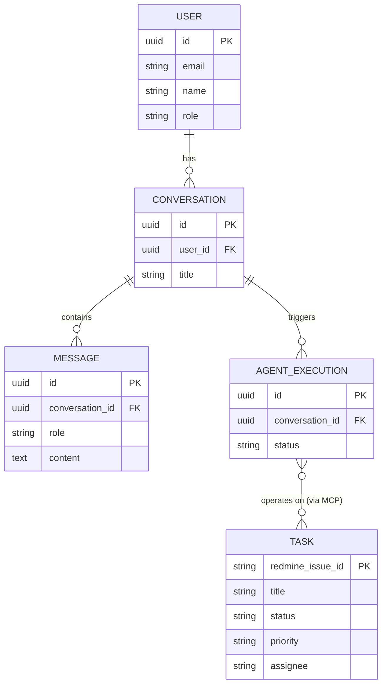
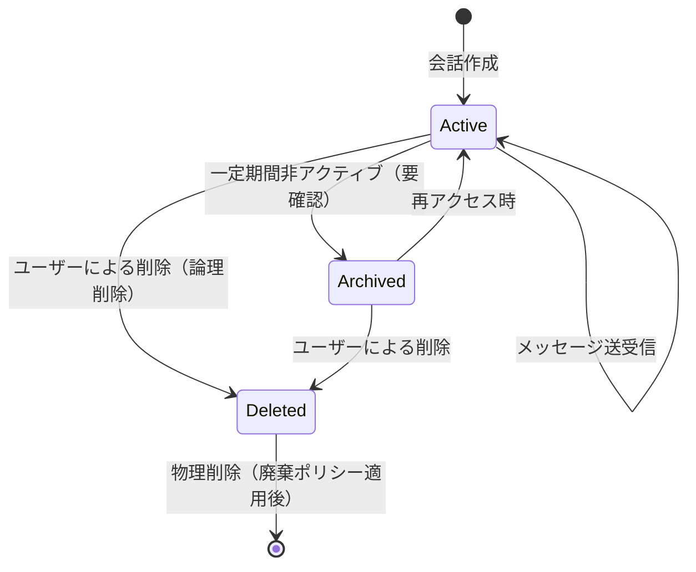
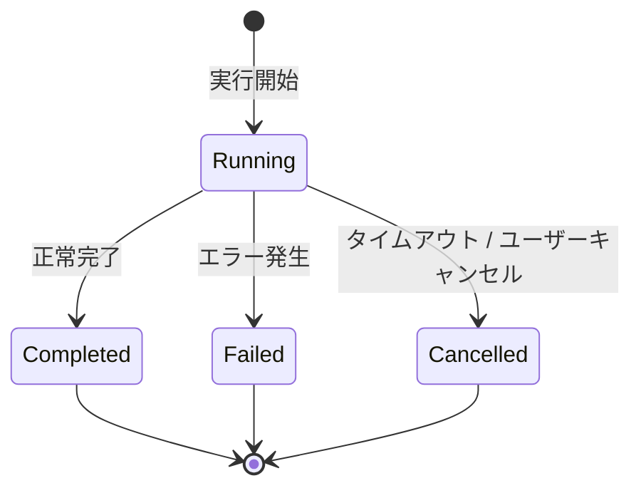
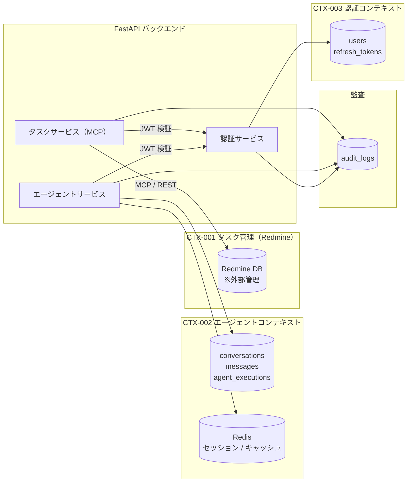

# BSD-010 データアーキテクチャ設計書

| 項目 | 内容 |
|---|---|
| ドキュメントID | BSD-010 |
| バージョン | 1.0 |
| 作成日 | 2026-03-03 |
| 入力元 | REQ-004, REQ-007, BSD-006, BSD-009 |
| ステータス | 初版 |
| プロジェクト | PRJ-001 personal-agent |

---

## 目次
1. データ戦略概要
2. 概念データモデル
3. データフローアーキテクチャ
4. データライフサイクル管理
5. 分析基盤設計
6. データ品質・ガバナンス
7. 後続フェーズへの影響

---

## 1. データ戦略概要

### 1.1 データファースト設計方針

- データモデルを先に設計し、アプリケーション層はデータモデルに従う
- ビジネスデータのライフサイクル全体（生成→利用→保管→廃棄）を設計対象とする
- BSD-009 で定義したコンテキスト境界に基づくデータオーナーシップを確立する

**重要な設計決定**: Redmine が「タスク」の主データストアであり、本システムは Redmine のデータを MCP 経由で参照・操作する。タスクデータをローカル DB に複製しないことで、データの二重管理リスクを排除する。

### 1.2 データオーナーシップ

| コンテキスト（BSD-009） | オーナーシップ対象データ | 読み取り許可コンテキスト | 書き込み権限 |
|---|---|---|---|
| CTX-001（タスク管理）※Redmine | タスク（Issue）データ全般 | CTX-002（エージェント）, フロントエンド | CTX-001 のみ（MCP 経由） |
| CTX-002（エージェント） | 会話データ（conversations・messages・agent_executions） | CTX-003（認証確認時） | CTX-002 のみ |
| CTX-003（認証） | ユーザーデータ（users・refresh_tokens） | CTX-001・CTX-002（認証確認のみ）| CTX-003 のみ |
| 横断（監査） | 監査ログ（audit_logs） | 管理者のみ | 全コンテキスト（追記のみ） |

### 1.3 データ分類

| データ分類 | 説明 | 例 | 保護レベル |
|---|---|---|---|
| マスタデータ | 業務の基盤となる参照データ | ユーザー情報 | 高（個人情報含む） |
| トランザクションデータ | 業務活動の記録 | 会話・メッセージ・エージェント実行履歴 | 高 |
| 外部参照データ | Redmine から都度取得するタスクデータ | Task（Redmine Issue） | 中（Redmine 管理） |
| 一時データ | セッション・キャッシュ等 | Redis セッション・チェックポイントキャッシュ | 低 |
| 監査データ | セキュリティ・操作ログ | audit_logs | 高（改ざん禁止） |

---

## 2. 概念データモデル

### 2.1 ビジネスエンティティ関連図

> BSD-009 のコンテキスト境界を反映した概念レベルの ER 図。Redmine 管理のエンティティと内部管理のエンティティを区別して示す。

### 2.2 エンティティライフサイクル状態遷移

#### Conversation（会話）

| 状態 | 説明 | 遷移条件 | データ保持方針 |
|---|---|---|---|
| Active | アクティブな会話 | 会話作成時 | OLTP テーブル（conversations）に保持 |
| Archived | 非アクティブ会話 | 30日間アクセスなし（要確認） | OLTP テーブルに保持（パーティション分離を将来検討） |
| Deleted | 論理削除済み | ユーザー削除操作 | `deleted_at` を設定。90日後に物理削除 |

#### AgentExecution（エージェント実行）

| 状態 | 説明 | 遷移条件 | データ保持方針 |
|---|---|---|---|
| Running | 実行中 | エージェント起動時 | OLTP テーブルに保持 |
| Completed | 正常完了 | 処理成功時 | OLTP テーブルに保持（30日後にアーカイブ対象） |
| Failed | 失敗 | エラー発生時 | OLTP テーブルに保持（エラー情報も含む） |
| Cancelled | キャンセル | タイムアウト / ユーザー操作時 | OLTP テーブルに保持 |

---

## 3. データフローアーキテクチャ

### 3.1 コンテキスト間データフロー図

### 3.2 データ連携方式一覧

| 連携元 | 連携先 | 方式 | 頻度 | データ量目安 | 整合性保証 |
|---|---|---|---|---|---|
| フロントエンド | FastAPI バックエンド | 同期 REST API | ユーザー操作時 | 低〜中 | 強整合性 |
| FastAPI エージェントサービス | Claude API（Anthropic） | 同期 HTTPS | エージェント実行時 | 中（テキスト） | 同期・強整合性 |
| FastAPI タスクサービス | Redmine（MCP経由） | 同期 REST | タスク操作時 | 低〜中 | 同期・強整合性 |
| FastAPI バックエンド | PostgreSQL | 同期 TCP | 全リクエスト | 低〜中 | ACID トランザクション |
| FastAPI バックエンド | Redis | 同期 TCP | セッション操作時 | 低 | 最終整合性 |

### 3.3 CQRS / イベントソーシング適用判断

| コンテキスト | CQRS 適用 | イベントソーシング適用 | 判断理由 |
|---|---|---|---|
| CTX-001（タスク管理） | 不適用 | 不適用 | Redmine が主データストアであり、本システムは MCP アダプターとして機能する。CQRS の導入メリットがないため不採用 |
| CTX-002（エージェント） | 不適用 | 不適用 | 初期フェーズのデータ量・クエリ要件では通常の CRUD で十分。LangGraph チェックポイントがイベントソーシングの代替として機能する |
| CTX-003（認証） | 不適用 | 不適用 | 標準的な認証フローのため、複雑なパターンは不要 |

> CQRS 適用基準: 読み取りと書き込みのスケーリング要件が大きく異なる場合に検討する（現時点では不該当）
> イベントソーシング適用基準: 完全な監査証跡要件は `audit_logs` テーブルで代替する

---

## 4. データライフサイクル管理

### 4.1 データ保持ポリシー

| データ分類 | エンティティ例 | OLTP保持期間 | アーカイブ期間 | 完全削除タイミング | 法的根拠 |
|---|---|---|---|---|---|
| ユーザー情報 | users | アクティブ期間（論理削除後90日） | 論理削除後90日で物理削除 | 退会後90日後 | 個人情報保護法 |
| 会話・メッセージ | conversations, messages | 1年間（要確認） | 1年後にアーカイブテーブル移行 | 3年後 | 要確認 |
| エージェント実行履歴 | agent_executions | 90日間 | 90日後に削除（アーカイブ不要） | 90日後 | 要確認 |
| 監査ログ | audit_logs | 1年間 | 1年後にコールドストレージ移行 | 3年後 | セキュリティポリシー（要確認） |
| リフレッシュトークン | refresh_tokens | 有効期限まで（最大7日） | 期限後に物理削除 | 期限後 | - |

### 4.2 アーカイブ方針

- アーカイブ方式: 別テーブル移行（`conversations_archive`・`messages_archive` 等）を採用する。ストレージコストと検索性のバランスを考慮し、同一 PostgreSQL インスタンス内のアーカイブテーブルに移行する。将来的なデータ増加時はオブジェクトストレージへの移行を検討する
- アーカイブ実行タイミング: 月次バッチ（月初の低負荷時間帯）
- アーカイブデータへのアクセス: 管理者向け直接クエリ（API 経由のアクセスは初期フェーズでは不提供）

### 4.3 匿名化・仮名化

- 対象データ: `users`（メールアドレス・名前）・`messages`（会話コンテンツに個人情報が含まれる可能性）
- 匿名化手法: 論理削除時のメールアドレス・名前のマスキング（`deleted_user_{id}@example.com` 形式に変換）
- 適用タイミング: ユーザーアカウント削除（論理削除）時にメールアドレス・名前を即時マスキングし、物理削除は90日後に実行する

### 4.4 監査証跡設計

- 監査対象操作: 認証（ログイン/ログアウト）・タスク作成/更新/削除・エージェント実行・ユーザー情報変更
- 監査ログ保持期間: 1年間（OLTP）+ 2年間（コールドストレージ）= 計3年間（要確認：セキュリティポリシーに基づき変更の可能性）
- 監査ログ形式: `audit_logs` テーブル（PostgreSQL）

---

## 5. 分析基盤設計

### 5.1 OLTP/OLAP 分離戦略

初期フェーズでは OLAP（分析処理）は対象外とする。運用が軌道に乗り、ビジネスメトリクスの集計ニーズが顕在化した段階で分析基盤への投資を検討する。

| 観点 | OLTP（トランザクション処理） | OLAP（分析処理） |
|---|---|---|
| データベース | PostgreSQL 15 | 初期フェーズでは不採用（要確認） |
| データモデル | 正規化（3NF） | 将来検討時: 非正規化（スタースキーマ等） |
| 更新頻度 | リアルタイム | 将来検討時: 日次バッチ |
| クエリパターン | ポイントクエリ（単一レコード操作） | 将来検討時: 集計クエリ |

### 5.2 マテリアライズドビュー戦略

初期フェーズでは不採用。パフォーマンス問題が顕在化した場合に以下を検討する。

| ビュー名 | 元テーブル | 更新頻度 | 用途 |
|---|---|---|---|
| `mv_user_conversation_stats` | conversations, messages | 日次 | ユーザーごとの会話数・メッセージ数サマリー（要確認） |

### 5.3 データウェアハウス連携

初期フェーズでは不採用。将来的に必要になった場合に CDC（Debezium）または バッチETL（Airflow）の導入を検討する。

---

## 6. データ品質・ガバナンス

### 6.1 バリデーション層設計

| バリデーション層 | 実施場所 | 対象 | 手法 |
|---|---|---|---|
| 入力バリデーション | プレゼンテーション層（FastAPI / Next.js） | ユーザー入力 | Pydantic モデル（FastAPI）・Zod（Next.js）によるスキーマバリデーション |
| ドメインバリデーション | ドメイン層（Python ドメインモデル） | ビジネスルール | エンティティコンストラクタでの不変条件チェック（タイトル必須・長さ制限等） |
| データ整合性 | インフラ層（PostgreSQL） | データ制約 | NOT NULL・UNIQUE・FK・CHECK 制約 |
| クロスコンテキスト整合性 | アプリケーション層 | コンテキスト間データ | 初期フェーズでは Redmine が主データストアのため、本質的な二重管理は発生しない |

### 6.2 整合性モデル

| コンテキスト間 | 整合性モデル | 許容遅延 | 補償トランザクション |
|---|---|---|---|
| CTX-002（エージェント）↔ CTX-001（タスク管理/Redmine） | 結果整合性（MCP 同期呼び出しで即時同期を試みる） | リクエスト内（同期） | Redmine 呼び出し失敗時: リトライ（最大3回）後にエラー応答。ユーザーへの明示的な通知を行う |
| CTX-003（認証）→ CTX-002（エージェント） | 強整合性（JWT 検証を毎リクエストで実施） | なし | - |

### 6.3 マスタデータ管理

| マスタデータ | オーナーコンテキスト | 配布方式 | 同期頻度 |
|---|---|---|---|
| ユーザー情報 | CTX-003（認証） | 同期 API（JWT ペイロードにユーザーID・ロールを含める） | リクエスト毎（JWT 検証時） |
| Redmine ユーザー（担当者候補） | Redmine（CTX-001） | MCP 経由での都度取得 | タスク作成・編集画面表示時 |

---

## 7. 後続フェーズへの影響

| 影響先 | 内容 |
|---|---|
| BSD-006 | テーブル設計のコンテキスト対応・論理削除・監査カラム方針（BSD-006 と相互参照） |
| DSD-004_{FEAT-ID} | データライフサイクル設計（アーカイブバッチ・論理削除処理）・SQLAlchemy モデルの詳細 |
| DSD-009_{FEAT-ID} | ドメインモデル詳細設計におけるデータフロー（CTX-002 のエージェント実行データフロー）の前提 |
| DSD-006_{FEAT-ID} | バッチ・非同期処理（アーカイブ処理・監査ログ クリーンアップ）の詳細 |
| IMP-004 | マイグレーション手順のアーカイブテーブル・監査テーブル考慮 |
| OPS-004 | バックアップ対象（PostgreSQL 全テーブル）・保持期間・アーカイブ運用の前提 |
