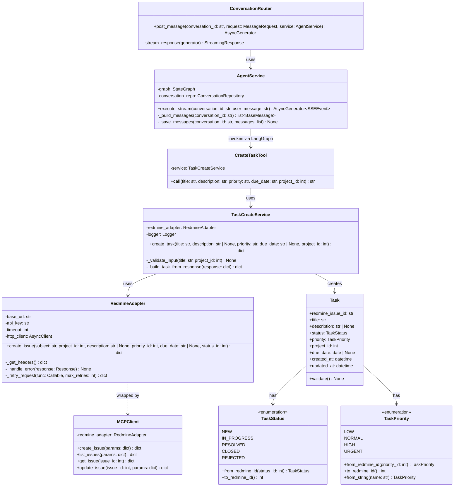
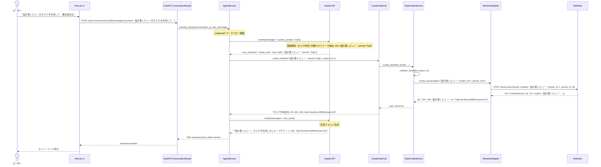
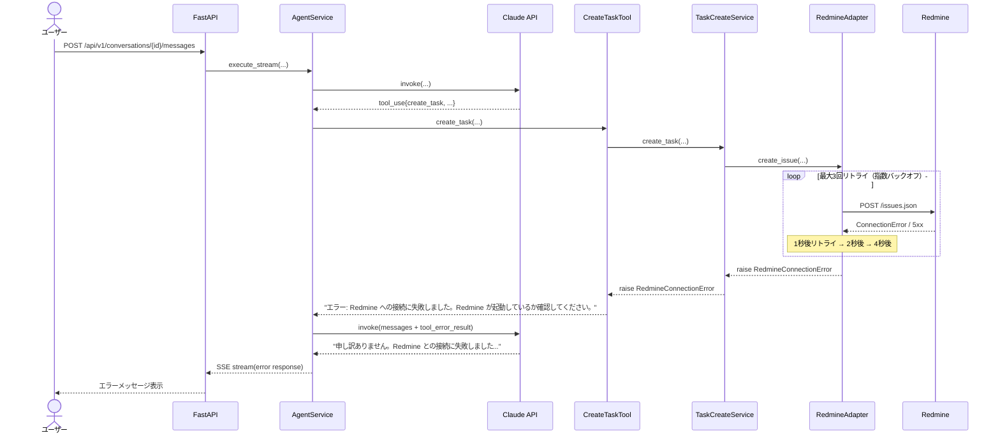

# DSD-001_FEAT-001 バックエンド機能詳細設計書（Redmineタスク作成）

| 項目 | 値 |
|---|---|
| ドキュメントID | DSD-001_FEAT-001 |
| バージョン | 1.0 |
| 作成日 | 2026-03-03 |
| 機能ID | FEAT-001 |
| 機能名 | Redmineタスク作成（redmine-task-create） |
| 入力元 | BSD-001, BSD-002, BSD-004, BSD-009 |
| ステータス | 初版 |

---

## 目次

1. 機能概要
2. レイヤー構成・モジュール分割
3. クラス図
4. シーケンス図
5. LangGraph ノード設計
6. ツール関数詳細設計
7. ドメインモデル
8. エラーハンドリング設計
9. 設定・環境変数
10. 後続フェーズへの影響

---

## 1. 機能概要

### 1.1 概要

ユーザーがチャット画面で「〇〇タスクを作成して」と指示すると、LangGraph エージェントがユーザーの自然言語入力を解析し、MCP（Model Context Protocol）経由で Redmine にチケットを作成して、作成完了メッセージ（チケット URL 含む）をチャット画面に返す機能。

### 1.2 対応ユースケース

| UC-ID | ユースケース名 | 説明 |
|---|---|---|
| UC-001 | タスクを作成する | ユーザーの自然言語指示からタスクを生成し Redmine に登録する |

### 1.3 ビジネスルール

| ルール ID | 内容 |
|---|---|
| BR-001 | タスクの作成対象は Redmine 上の既存プロジェクトに限る（新規プロジェクト作成は不可） |
| BR-002 | エージェントを通じたタスク削除操作は禁止（削除は Redmine Web UI からのみ） |
| BR-003 | タスクのタイトルは必須。空文字・空白のみは禁止 |
| BR-004 | タイトルの最大文字数は 200 文字 |

### 1.4 処理フロー概要

```
ユーザー入力（チャット）
    ↓
FastAPI エンドポイント（POST /api/v1/conversations/{id}/messages）
    ↓
AgentService（LangGraph ワークフロー起動）
    ↓
Claude LLM（意図解析・ツール選択）
    ↓
create_task_tool（ツール関数呼び出し）
    ↓
TaskCreateService（ビジネスロジック・バリデーション）
    ↓
RedmineAdapter（HTTP REST API 呼び出し）
    ↓
Redmine（POST /issues.json）
    ↓
SSE ストリーミング（チャット画面へ応答）
```

---

## 2. レイヤー構成・モジュール分割

### 2.1 レイヤー責務マッピング

| レイヤー | モジュール/クラス | 責務 |
|---|---|---|
| プレゼンテーション層 | `app/api/v1/conversations.py` | HTTP リクエスト受付・SSE ストリーミング配信・エラーレスポンス変換 |
| アプリケーション層 | `app/application/agent/agent_service.py` | LangGraph ワークフロー起動・会話履歴管理・ストリーミング制御 |
| アプリケーション層 | `app/application/task/task_create_service.py` | タスク作成のユースケース実行・バリデーション・ドメインオブジェクト変換 |
| ドメイン層 | `app/domain/task/task.py` | Task エンティティ・不変条件チェック |
| ドメイン層 | `app/domain/task/task_status.py` | TaskStatus 値オブジェクト |
| ドメイン層 | `app/domain/task/task_priority.py` | TaskPriority 値オブジェクト |
| インフラ層 | `app/agent/tools/create_task_tool.py` | LangGraph ツール関数定義・サービス呼び出し |
| インフラ層 | `app/agent/nodes/task_create_node.py` | LangGraph ノード実装 |
| インフラ層 | `app/infra/redmine/redmine_adapter.py` | Redmine REST API 呼び出し・レスポンス変換 |

### 2.2 依存方向

```
api/ → application/ → domain/
                  ↗
agent/tools/ → application/ → domain/
infra/redmine/ → domain/（インターフェースを通じて逆方向の依存を排除）
```

---

## 3. クラス図



---

## 4. シーケンス図

### 4.1 タスク作成（正常系）



### 4.2 タスク作成（Redmine 接続エラー時）



---

## 5. LangGraph ノード設計

### 5.1 エージェントグラフ全体構成

```python
# app/agent/graph.py
from langgraph.graph import StateGraph, START, END
from langgraph.prebuilt import ToolNode
from app.agent.state import AgentState
from app.agent.nodes.task_create_node import task_create_node
from app.agent.tools.create_task_tool import create_task_tool
from app.agent.tools.search_tasks_tool import search_tasks_tool


def build_agent_graph() -> StateGraph:
    """LangGraph エージェントワークフローを構築する。"""
    tools = [create_task_tool, search_tasks_tool]
    tool_node = ToolNode(tools)

    graph = StateGraph(AgentState)

    # ノード登録
    graph.add_node("agent", agent_node)      # LLM 推論ノード
    graph.add_node("tools", tool_node)        # ツール実行ノード

    # エッジ定義
    graph.add_edge(START, "agent")
    graph.add_conditional_edges(
        "agent",
        should_continue,                      # ツール呼び出しが必要か判定
        {"continue": "tools", "end": END},
    )
    graph.add_edge("tools", "agent")          # ツール実行後に再度 LLM へ

    return graph.compile()


def should_continue(state: AgentState) -> str:
    """エージェントがツールを呼び出すか、終了するかを判定する。"""
    messages = state["messages"]
    last_message = messages[-1]
    if hasattr(last_message, "tool_calls") and last_message.tool_calls:
        return "continue"
    return "end"
```

### 5.2 エージェント状態定義

```python
# app/agent/state.py
from typing import Annotated, TypedDict
from langgraph.graph.message import add_messages
from langchain_core.messages import BaseMessage


class AgentState(TypedDict):
    """LangGraph エージェントの状態スキーマ。"""

    # メッセージ履歴（add_messages アノテーションで自動的に追記される）
    messages: Annotated[list[BaseMessage], add_messages]

    # 会話 ID（コンテキスト管理用）
    conversation_id: str

    # ユーザーが最後に送信したメッセージ
    user_message: str
```

### 5.3 エージェントノード実装

```python
# app/agent/nodes/task_create_node.py
import structlog
from langchain_anthropic import ChatAnthropic
from langchain_core.messages import BaseMessage, SystemMessage
from app.agent.state import AgentState
from app.agent.tools.create_task_tool import create_task_tool
from app.agent.tools.search_tasks_tool import search_tasks_tool
from app.config import get_settings

logger = structlog.get_logger(__name__)

SYSTEM_PROMPT = """あなたはパーソナルAIエージェントです。ユーザーのRedmineタスク管理を支援します。

## 役割
- ユーザーの自然言語の指示を理解し、適切なツールを選択・実行する
- タスクの作成・検索・更新を MCP 経由で Redmine に反映する
- 実行結果をわかりやすく日本語でユーザーに報告する

## 制約事項
- タスクの削除操作は絶対に行わない（Redmine Web UI からの手動操作のみ）
- 存在しないプロジェクトへのタスク作成は行わない
- ユーザーが確認していない操作は勝手に実行しない

## タスク作成時の注意
- タイトルが不明確な場合は必ず確認する
- 優先度が指定されていない場合は「通常」を使用する
- プロジェクト ID が不明な場合はデフォルト（project_id=1）を使用する
"""


def agent_node(state: AgentState) -> AgentState:
    """LLM 推論を実行するエージェントノード。"""
    settings = get_settings()
    llm = ChatAnthropic(
        model="claude-opus-4-6",
        api_key=settings.anthropic_api_key,
        max_tokens=4096,
    )

    tools = [create_task_tool, search_tasks_tool]
    llm_with_tools = llm.bind_tools(tools)

    messages = state["messages"]
    # システムプロンプトを先頭に追加（まだ存在しない場合）
    if not messages or not isinstance(messages[0], SystemMessage):
        messages = [SystemMessage(content=SYSTEM_PROMPT)] + messages

    logger.info(
        "agent_node_invoked",
        message_count=len(messages),
        conversation_id=state.get("conversation_id"),
    )

    response = llm_with_tools.invoke(messages)

    logger.info(
        "agent_node_responded",
        stop_reason=getattr(response, "stop_reason", "unknown"),
        tool_calls=len(getattr(response, "tool_calls", [])),
    )

    return {"messages": [response]}
```

---

## 6. ツール関数詳細設計

### 6.1 create_task_tool 関数

```python
# app/agent/tools/create_task_tool.py
from __future__ import annotations

import structlog
from langchain_core.tools import tool
from app.application.task.task_create_service import TaskCreateService
from app.infra.redmine.redmine_adapter import RedmineAdapter
from app.config import get_settings

logger = structlog.get_logger(__name__)


@tool
async def create_task_tool(
    title: str,
    description: str = "",
    priority: str = "normal",
    due_date: str = "",
    project_id: int = 1,
) -> str:
    """Redmine に新しいタスク（チケット）を作成する。

    Args:
        title: タスクのタイトル（必須・最大200文字）。
        description: タスクの詳細説明（任意）。
        priority: 優先度（"low", "normal", "high", "urgent"）。デフォルトは "normal"。
        due_date: 期日（YYYY-MM-DD 形式、任意）。
        project_id: Redmine プロジェクト ID（デフォルト: 1）。

    Returns:
        タスク作成結果のメッセージ文字列。作成成功時はチケット URL を含む。

    Examples:
        >>> result = await create_task_tool(
        ...     title="設計書レビュー",
        ...     description="DSD-001 の詳細設計書をレビューする",
        ...     priority="high",
        ...     due_date="2026-03-31",
        ... )
        >>> print(result)
        タスクを作成しました。
        - ID: 124
        - タイトル: 設計書レビュー
        - 優先度: 高
        - 期日: 2026-03-31
        - URL: http://localhost:8080/issues/124
    """
    logger.info(
        "create_task_tool_called",
        title=title[:50],
        priority=priority,
        project_id=project_id,
        has_due_date=bool(due_date),
    )

    settings = get_settings()
    adapter = RedmineAdapter(
        base_url=settings.redmine_url,
        api_key=settings.redmine_api_key,
    )
    service = TaskCreateService(redmine_adapter=adapter)

    try:
        result = await service.create_task(
            title=title,
            description=description or None,
            priority=priority,
            due_date=due_date or None,
            project_id=project_id,
        )

        logger.info(
            "create_task_tool_succeeded",
            task_id=result["id"],
            title=title[:50],
        )

        priority_display = {
            "low": "低",
            "normal": "通常",
            "high": "高",
            "urgent": "緊急",
        }.get(priority, priority)

        lines = [
            "タスクを作成しました。",
            f"- ID: {result['id']}",
            f"- タイトル: {result['title']}",
            f"- 優先度: {priority_display}",
        ]
        if result.get("due_date"):
            lines.append(f"- 期日: {result['due_date']}")
        lines.append(f"- URL: {result['url']}")

        return "\n".join(lines)

    except Exception as e:
        logger.error(
            "create_task_tool_failed",
            error=str(e),
            title=title[:50],
        )
        return f"タスクの作成に失敗しました。エラー: {str(e)}"
```

### 6.2 TaskCreateService クラス

```python
# app/application/task/task_create_service.py
from __future__ import annotations

from datetime import date
import structlog
from app.domain.task.task import Task
from app.domain.task.task_priority import TaskPriority
from app.domain.task.task_status import TaskStatus
from app.domain.exceptions import TaskValidationError
from app.infra.redmine.redmine_adapter import RedmineAdapter

logger = structlog.get_logger(__name__)

PRIORITY_NAME_TO_ID = {
    "low": 1,
    "normal": 2,
    "high": 3,
    "urgent": 4,
}


class TaskCreateService:
    """タスク作成のユースケースを実装するサービスクラス。

    ビジネスロジックの検証と Redmine への登録を担う。
    """

    def __init__(self, redmine_adapter: RedmineAdapter) -> None:
        self._redmine_adapter = redmine_adapter

    async def create_task(
        self,
        title: str,
        description: str | None = None,
        priority: str = "normal",
        due_date: str | None = None,
        project_id: int = 1,
    ) -> dict:
        """タスクを作成して Redmine に登録する。

        Args:
            title: タスクタイトル（必須・最大200文字）。
            description: タスクの詳細説明（任意）。
            priority: 優先度（"low"/"normal"/"high"/"urgent"）。
            due_date: 期日（YYYY-MM-DD 形式）。
            project_id: Redmine プロジェクト ID。

        Returns:
            作成されたタスクの情報辞書。キー: id, title, status, priority,
            due_date, url, created_at。

        Raises:
            TaskValidationError: 入力値が不正な場合。
            RedmineConnectionError: Redmine への接続に失敗した場合。
            RedmineAPIError: Redmine API がエラーを返した場合。
        """
        # バリデーション
        self._validate_input(title=title, priority=priority, project_id=project_id)

        # 優先度 ID 変換
        priority_id = PRIORITY_NAME_TO_ID.get(priority, 2)

        logger.info(
            "task_create_service_create_started",
            title=title[:50],
            project_id=project_id,
            priority_id=priority_id,
        )

        # Redmine への登録
        response = await self._redmine_adapter.create_issue(
            subject=title,
            project_id=project_id,
            description=description,
            priority_id=priority_id,
            due_date=due_date,
        )

        # 結果の変換
        result = self._build_task_response(response, project_id=project_id)

        logger.info(
            "task_create_service_create_succeeded",
            task_id=result["id"],
        )

        return result

    def _validate_input(
        self,
        title: str,
        priority: str,
        project_id: int,
    ) -> None:
        """入力値のバリデーションを実施する。"""
        if not title or not title.strip():
            raise TaskValidationError(
                "タスクタイトルは必須です",
                field="title",
            )
        if len(title) > 200:
            raise TaskValidationError(
                f"タスクタイトルは200文字以内で入力してください（現在: {len(title)} 文字）",
                field="title",
            )
        if priority not in PRIORITY_NAME_TO_ID:
            raise TaskValidationError(
                f"優先度の値が不正です: {priority}。low/normal/high/urgent のいずれかを指定してください",
                field="priority",
            )
        if project_id < 1:
            raise TaskValidationError(
                f"プロジェクト ID は 1 以上の整数を指定してください: {project_id}",
                field="project_id",
            )

    def _build_task_response(self, redmine_response: dict, project_id: int) -> dict:
        """Redmine API レスポンスをアプリケーション内部の辞書形式に変換する。"""
        issue = redmine_response.get("issue", redmine_response)
        issue_id = str(issue["id"])
        settings = get_settings()

        return {
            "id": issue_id,
            "title": issue["subject"],
            "status": issue.get("status", {}).get("name", "新規"),
            "priority": issue.get("priority", {}).get("name", "通常"),
            "due_date": issue.get("due_date"),
            "project_id": project_id,
            "url": f"{settings.redmine_url}/issues/{issue_id}",
            "created_at": issue.get("created_on"),
        }
```

---

## 7. ドメインモデル

### 7.1 Task エンティティ

```python
# app/domain/task/task.py
from __future__ import annotations

from dataclasses import dataclass, field
from datetime import datetime, date
from app.domain.task.task_status import TaskStatus
from app.domain.task.task_priority import TaskPriority
from app.domain.exceptions import TaskValidationError


@dataclass
class Task:
    """Redmine のチケット（Issue）を表すエンティティ。

    ドメインオブジェクトとして、タスクに関するビジネスルールを内包する。
    Redmine が正のデータストアであるため、本システムでは Redmine の
    データを写像・変換する役割を持つ。
    """

    redmine_issue_id: str
    title: str
    status: TaskStatus
    priority: TaskPriority
    project_id: int
    description: str | None = None
    due_date: date | None = None
    created_at: datetime = field(default_factory=datetime.utcnow)
    updated_at: datetime = field(default_factory=datetime.utcnow)

    def __post_init__(self) -> None:
        """インスタンス生成時にドメイン不変条件を検証する。"""
        self.validate()

    def validate(self) -> None:
        """ドメイン不変条件を検証する。

        Raises:
            TaskValidationError: 不変条件に違反する場合。
        """
        if not self.title or not self.title.strip():
            raise TaskValidationError(
                "タスクタイトルは必須です",
                field="title",
            )
        if len(self.title) > 200:
            raise TaskValidationError(
                f"タスクタイトルは200文字以内です（現在: {len(self.title)} 文字）",
                field="title",
            )
        if self.project_id < 1:
            raise TaskValidationError(
                f"プロジェクト ID は 1 以上の整数です: {self.project_id}",
                field="project_id",
            )
```

### 7.2 TaskStatus 値オブジェクト

```python
# app/domain/task/task_status.py
from __future__ import annotations
from enum import Enum


class TaskStatus(str, Enum):
    """タスクのステータスを表す値オブジェクト。

    Redmine のデフォルトステータスに対応する。
    """

    NEW = "new"
    IN_PROGRESS = "in_progress"
    RESOLVED = "resolved"
    CLOSED = "closed"
    REJECTED = "rejected"

    @classmethod
    def from_redmine_id(cls, status_id: int) -> TaskStatus:
        """Redmine のステータス ID から TaskStatus を生成する。"""
        _MAPPING: dict[int, TaskStatus] = {
            1: cls.NEW,
            2: cls.IN_PROGRESS,
            3: cls.RESOLVED,
            4: cls.CLOSED,
            5: cls.REJECTED,
        }
        if status_id not in _MAPPING:
            # 未知のステータス ID はデフォルトで NEW を返す
            return cls.NEW
        return _MAPPING[status_id]

    def to_redmine_id(self) -> int:
        """Redmine のステータス ID に変換する。"""
        _MAPPING: dict[TaskStatus, int] = {
            TaskStatus.NEW: 1,
            TaskStatus.IN_PROGRESS: 2,
            TaskStatus.RESOLVED: 3,
            TaskStatus.CLOSED: 4,
            TaskStatus.REJECTED: 5,
        }
        return _MAPPING[self]

    def display_name(self) -> str:
        """日本語表示名を返す。"""
        _DISPLAY: dict[TaskStatus, str] = {
            TaskStatus.NEW: "新規",
            TaskStatus.IN_PROGRESS: "進行中",
            TaskStatus.RESOLVED: "解決済み",
            TaskStatus.CLOSED: "完了",
            TaskStatus.REJECTED: "却下",
        }
        return _DISPLAY[self]
```

---

## 8. エラーハンドリング設計

### 8.1 エラー種別と対処方針

| エラー種別 | 発生クラス | エラーコード | HTTP ステータス | ユーザーへのメッセージ |
|---|---|---|---|---|
| タイトル未入力 | TaskCreateService | VALIDATION_ERROR | 400 | 「タスクタイトルは必須項目です」 |
| タイトル 200 文字超 | TaskCreateService | VALIDATION_ERROR | 400 | 「タスクタイトルは200文字以内で入力してください」 |
| 優先度値不正 | TaskCreateService | VALIDATION_ERROR | 400 | 「優先度の値が不正です（low/normal/high/urgent）」 |
| プロジェクト不存在 | RedmineAdapter | REDMINE_API_ERROR | 422 | 「指定したプロジェクトが存在しません」 |
| Redmine 接続タイムアウト | RedmineAdapter | SERVICE_UNAVAILABLE | 503 | 「Redmine との接続に失敗しました。Redmine が起動しているか確認してください」 |
| Redmine 5xx エラー | RedmineAdapter | SERVICE_UNAVAILABLE | 503 | 「Redmine サーバーでエラーが発生しました」 |
| Redmine 認証エラー | RedmineAdapter | REDMINE_AUTH_ERROR | 503 | 「Redmine API キーの設定を確認してください」 |
| Claude API タイムアウト | AgentService | SERVICE_UNAVAILABLE | 503 | 「エージェントとの通信に失敗しました。再試行してください」 |

### 8.2 リトライ設計

```python
# app/infra/redmine/redmine_adapter.py（リトライ実装）
import asyncio
import httpx
import structlog
from app.domain.exceptions import RedmineConnectionError, RedmineAPIError

logger = structlog.get_logger(__name__)

MAX_RETRY_COUNT = 3
RETRY_DELAYS = [1.0, 2.0, 4.0]  # 秒（指数バックオフ）


class RedmineAdapter:
    async def _retry_request(
        self,
        method: str,
        url: str,
        **kwargs,
    ) -> httpx.Response:
        """HTTP リクエストをリトライ付きで実行する。

        接続エラーまたは 5xx エラー時に最大3回リトライする。
        リトライ間隔は指数バックオフ（1秒→2秒→4秒）。
        """
        last_error: Exception | None = None

        for attempt in range(MAX_RETRY_COUNT):
            try:
                async with httpx.AsyncClient(timeout=self._timeout) as client:
                    response = await client.request(
                        method=method,
                        url=url,
                        headers=self._get_headers(),
                        **kwargs,
                    )

                # 5xx エラーはリトライ対象
                if response.status_code >= 500:
                    logger.warning(
                        "redmine_server_error_retrying",
                        attempt=attempt + 1,
                        status_code=response.status_code,
                        url=url,
                    )
                    last_error = RedmineAPIError(
                        f"Redmine サーバーエラー: {response.status_code}",
                        status_code=response.status_code,
                    )
                    if attempt < MAX_RETRY_COUNT - 1:
                        await asyncio.sleep(RETRY_DELAYS[attempt])
                    continue

                return response

            except (httpx.ConnectError, httpx.TimeoutException) as e:
                logger.warning(
                    "redmine_connection_error_retrying",
                    attempt=attempt + 1,
                    error=str(e),
                    url=url,
                )
                last_error = RedmineConnectionError(f"Redmine 接続エラー: {str(e)}")
                if attempt < MAX_RETRY_COUNT - 1:
                    await asyncio.sleep(RETRY_DELAYS[attempt])

        # 全リトライ失敗
        logger.error(
            "redmine_all_retries_failed",
            max_retries=MAX_RETRY_COUNT,
            url=url,
        )
        raise last_error or RedmineConnectionError("Redmine への接続に失敗しました")
```

---

## 9. 設定・環境変数

### 9.1 必要な環境変数

| 環境変数名 | 説明 | デフォルト値 | 必須 |
|---|---|---|---|
| `ANTHROPIC_API_KEY` | Anthropic Claude API キー | なし | 必須 |
| `REDMINE_URL` | Redmine サーバーの URL | `http://localhost:8080` | 任意 |
| `REDMINE_API_KEY` | Redmine API キー | なし | 必須 |
| `REDMINE_DEFAULT_PROJECT_ID` | デフォルトプロジェクト ID | `1` | 任意 |
| `CLAUDE_MODEL` | 使用する Claude モデル名 | `claude-opus-4-6` | 任意 |
| `AGENT_MAX_TOKENS` | エージェント応答の最大トークン数 | `4096` | 任意 |

### 9.2 設定クラス

```python
# app/config.py
import os
from functools import lru_cache
from pydantic_settings import BaseSettings


class Settings(BaseSettings):
    """アプリケーション設定。環境変数から自動読み込みする。"""

    anthropic_api_key: str
    redmine_url: str = "http://localhost:8080"
    redmine_api_key: str
    redmine_default_project_id: int = 1
    claude_model: str = "claude-opus-4-6"
    agent_max_tokens: int = 4096
    redmine_timeout: int = 30
    redmine_max_retries: int = 3

    class Config:
        env_file = ".env"
        env_file_encoding = "utf-8"


@lru_cache
def get_settings() -> Settings:
    """設定シングルトンを返す。"""
    return Settings()
```

---

## 10. 後続フェーズへの影響

| 影響先 | 内容 |
|---|---|
| DSD-003_FEAT-001 | POST /api/v1/conversations/{id}/messages・POST /api/v1/tasks の詳細 API 仕様（本設計のシーケンス図に基づく） |
| DSD-004_FEAT-001 | messages・agent_executions テーブルへの会話履歴保存設計 |
| DSD-005_FEAT-001 | RedmineAdapter.create_issue の外部インターフェース詳細仕様 |
| DSD-008_FEAT-001 | create_task_tool・TaskCreateService・RedmineAdapter の単体テスト設計 |
| IMP-001_FEAT-001 | 本設計書に基づくバックエンド実装・TDD 実装報告書 |
