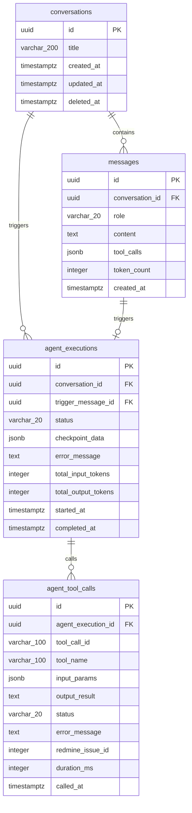

# DSD-004_FEAT-001 データベース詳細設計書（Redmineタスク作成）

| 項目 | 値 |
|---|---|
| ドキュメントID | DSD-004_FEAT-001 |
| バージョン | 1.0 |
| 作成日 | 2026-03-03 |
| 機能ID | FEAT-001 |
| 機能名 | Redmineタスク作成（redmine-task-create） |
| 入力元 | BSD-006 |
| ステータス | 初版 |

---

## 目次

1. 概要
2. テーブル一覧
3. テーブル詳細定義
   - conversations（会話）
   - messages（メッセージ）
   - agent_tool_calls（エージェントツール呼び出しログ）
   - agent_executions（エージェント実行）
4. ER 図
5. SQLAlchemy ORM モデル定義
6. マイグレーション設計
7. インデックス設計
8. データ操作パターン
9. 後続フェーズへの影響

---

## 1. 概要

### 1.1 データベース設計の方針

FEAT-001（Redmine タスク作成）では、タスクデータの正本は Redmine が保持する。本システムの PostgreSQL DB には以下のデータのみを保持する:

1. **会話履歴**（`conversations`・`messages` テーブル）: LangGraph エージェントの会話コンテキスト管理と UI 表示のため
2. **エージェント実行ログ**（`agent_executions`・`agent_tool_calls` テーブル）: デバッグ・監査・コスト管理のため

### 1.2 DDD コンテキストとテーブルの対応

| コンテキスト | テーブル | 説明 |
|---|---|---|
| CTX-002（エージェント） | `conversations` | Conversation 集約ルート |
| CTX-002（エージェント） | `messages` | Conversation 集約の従属エンティティ |
| CTX-002（エージェント） | `agent_executions` | AgentExecution 集約ルート |
| CTX-002（エージェント） | `agent_tool_calls` | AgentExecution 集約の従属エンティティ |

---

## 2. テーブル一覧

| テーブル名 | 論理名 | 概要 | FEAT-001 との関係 |
|---|---|---|---|
| `conversations` | 会話 | ユーザーとエージェントの対話セッション | タスク作成の会話コンテキストを管理 |
| `messages` | メッセージ | 会話内のメッセージ一覧（ユーザー/エージェント） | タスク作成指示・完了応答を保存 |
| `agent_executions` | エージェント実行 | LangGraph エージェントの実行インスタンス | タスク作成実行の状態管理 |
| `agent_tool_calls` | ツール呼び出しログ | エージェントのツール呼び出し記録 | `create_task_tool` の呼び出し記録 |

---

## 3. テーブル詳細定義

### 3.1 `conversations`（会話）テーブル

**概要**: ユーザーとエージェントの対話セッションを管理する Conversation 集約のルートテーブル。フェーズ 1 では認証なしのためシングルユーザーを想定し、`user_id` は NULL 許容とする。

| カラム名 | 論理名 | 型 | 制約 | デフォルト値 | 説明 |
|---|---|---|---|---|---|
| `id` | 会話 ID | `UUID` | PK, NOT NULL | `gen_random_uuid()` | 主キー（UUID v4） |
| `title` | 会話タイトル | `VARCHAR(200)` | NULL | NULL | 最初のメッセージから自動生成（フェーズ2）。フェーズ1では NULL |
| `created_at` | 作成日時 | `TIMESTAMPTZ` | NOT NULL | `NOW()` | 会話開始日時 |
| `updated_at` | 更新日時 | `TIMESTAMPTZ` | NOT NULL | `NOW()` | 最終メッセージ送信日時 |
| `deleted_at` | 削除日時 | `TIMESTAMPTZ` | NULL | NULL | 論理削除日時（NULL = 有効） |

**DDL:**
```sql
CREATE TABLE conversations (
    id UUID PRIMARY KEY DEFAULT gen_random_uuid(),
    title VARCHAR(200) NULL,
    created_at TIMESTAMPTZ NOT NULL DEFAULT NOW(),
    updated_at TIMESTAMPTZ NOT NULL DEFAULT NOW(),
    deleted_at TIMESTAMPTZ NULL
);

COMMENT ON TABLE conversations IS 'ユーザーとエージェントの対話セッション';
COMMENT ON COLUMN conversations.id IS '会話ID（UUID v4）';
COMMENT ON COLUMN conversations.title IS '会話タイトル（最初のメッセージから自動生成。フェーズ1ではNULL）';
COMMENT ON COLUMN conversations.deleted_at IS '論理削除日時（NULL=有効）';
```

**インデックス:**

| インデックス名 | カラム | 種別 | 目的 |
|---|---|---|---|
| `conversations_pkey` | `id` | PRIMARY KEY | 主キー |
| `idx_conversations_updated_at` | `updated_at DESC` | B-tree | 最近の会話一覧取得（ダッシュボード表示） |
| `idx_conversations_deleted_at` | `deleted_at` | B-tree | 論理削除フィルタ（WHERE deleted_at IS NULL） |

---

### 3.2 `messages`（メッセージ）テーブル

**概要**: 会話内の各メッセージを時系列で管理する。ユーザーのタスク作成指示とエージェントの完了応答を保存する。LangGraph の会話コンテキスト復元にも使用する。

| カラム名 | 論理名 | 型 | 制約 | デフォルト値 | 説明 |
|---|---|---|---|---|---|
| `id` | メッセージ ID | `UUID` | PK, NOT NULL | `gen_random_uuid()` | 主キー（UUID v4） |
| `conversation_id` | 会話 ID | `UUID` | NOT NULL, FK | - | 外部キー（conversations.id） |
| `role` | ロール | `VARCHAR(20)` | NOT NULL | - | メッセージ種別（`user`/`assistant`/`tool`） |
| `content` | 本文 | `TEXT` | NULL | NULL | メッセージ本文（ツール呼び出し専用メッセージは NULL 許容） |
| `tool_calls` | ツール呼び出し情報 | `JSONB` | NULL | NULL | LangGraph のツール呼び出し情報（名前・入力・出力を JSON で保存） |
| `token_count` | トークン数 | `INTEGER` | NULL | NULL | このメッセージのトークン数（コスト管理用） |
| `created_at` | 作成日時 | `TIMESTAMPTZ` | NOT NULL | `NOW()` | メッセージ送信日時 |

**DDL:**
```sql
CREATE TABLE messages (
    id UUID PRIMARY KEY DEFAULT gen_random_uuid(),
    conversation_id UUID NOT NULL REFERENCES conversations(id) ON DELETE CASCADE,
    role VARCHAR(20) NOT NULL CHECK (role IN ('user', 'assistant', 'tool', 'system')),
    content TEXT NULL,
    tool_calls JSONB NULL,
    token_count INTEGER NULL,
    created_at TIMESTAMPTZ NOT NULL DEFAULT NOW()
);

COMMENT ON TABLE messages IS '会話内のメッセージ（ユーザー入力・エージェント応答）';
COMMENT ON COLUMN messages.role IS 'メッセージロール（user/assistant/tool/system）';
COMMENT ON COLUMN messages.content IS 'メッセージ本文（ツール呼び出し専用の場合はNULL許容）';
COMMENT ON COLUMN messages.tool_calls IS 'ツール呼び出し情報のJSON（name, input, output）';
COMMENT ON COLUMN messages.token_count IS 'トークン数（コスト管理・Claude API使用量追跡用）';
```

**`tool_calls` カラムの JSON 形式:**
```json
[
  {
    "id": "toolu_01A09q90...",
    "name": "create_task",
    "input": {
      "title": "設計書レビュー",
      "priority": "high",
      "due_date": "2026-03-31",
      "project_id": 1
    },
    "output": "タスクを作成しました。\n- ID: 124\n- URL: http://localhost:8080/issues/124"
  }
]
```

**インデックス:**

| インデックス名 | カラム | 種別 | 目的 |
|---|---|---|---|
| `messages_pkey` | `id` | PRIMARY KEY | 主キー |
| `idx_messages_conversation_id` | `conversation_id` | B-tree | 会話別メッセージ取得 |
| `idx_messages_conversation_created` | `(conversation_id, created_at ASC)` | B-tree | 会話別・時系列順取得（LangGraph コンテキスト復元） |
| `idx_messages_role` | `role` | B-tree | ロール別フィルタリング |

---

### 3.3 `agent_executions`（エージェント実行）テーブル

**概要**: LangGraph エージェントの各実行インスタンスを管理する。エージェントの状態（実行中/完了/失敗）・所要時間・エラー情報を記録し、デバッグ・監査に使用する。

| カラム名 | 論理名 | 型 | 制約 | デフォルト値 | 説明 |
|---|---|---|---|---|---|
| `id` | 実行 ID | `UUID` | PK, NOT NULL | `gen_random_uuid()` | 主キー（UUID v4） |
| `conversation_id` | 会話 ID | `UUID` | NOT NULL, FK | - | 外部キー（conversations.id） |
| `trigger_message_id` | トリガーメッセージ ID | `UUID` | NULL, FK | NULL | エージェント実行を起動したユーザーメッセージの ID |
| `status` | 実行状態 | `VARCHAR(20)` | NOT NULL | `'running'` | 実行状態（`running`/`completed`/`failed`/`cancelled`） |
| `checkpoint_data` | チェックポイント | `JSONB` | NULL | NULL | LangGraph グラフ状態のスナップショット（中断・再開用） |
| `error_message` | エラーメッセージ | `TEXT` | NULL | NULL | エラー発生時のメッセージ |
| `total_input_tokens` | 入力トークン数合計 | `INTEGER` | NULL | NULL | Claude API 入力トークン数の合計（コスト管理） |
| `total_output_tokens` | 出力トークン数合計 | `INTEGER` | NULL | NULL | Claude API 出力トークン数の合計（コスト管理） |
| `started_at` | 開始日時 | `TIMESTAMPTZ` | NOT NULL | `NOW()` | エージェント実行開始日時 |
| `completed_at` | 完了日時 | `TIMESTAMPTZ` | NULL | NULL | エージェント実行完了日時（失敗時も記録） |

**DDL:**
```sql
CREATE TABLE agent_executions (
    id UUID PRIMARY KEY DEFAULT gen_random_uuid(),
    conversation_id UUID NOT NULL REFERENCES conversations(id) ON DELETE CASCADE,
    trigger_message_id UUID NULL REFERENCES messages(id) ON DELETE SET NULL,
    status VARCHAR(20) NOT NULL DEFAULT 'running'
        CHECK (status IN ('running', 'completed', 'failed', 'cancelled')),
    checkpoint_data JSONB NULL,
    error_message TEXT NULL,
    total_input_tokens INTEGER NULL,
    total_output_tokens INTEGER NULL,
    started_at TIMESTAMPTZ NOT NULL DEFAULT NOW(),
    completed_at TIMESTAMPTZ NULL
);

COMMENT ON TABLE agent_executions IS 'LangGraphエージェントの実行インスタンス管理';
COMMENT ON COLUMN agent_executions.status IS '実行状態（running/completed/failed/cancelled）';
COMMENT ON COLUMN agent_executions.checkpoint_data IS 'LangGraphグラフ状態スナップショット（JSONB）';
COMMENT ON COLUMN agent_executions.total_input_tokens IS 'Claude API入力トークン数合計（コスト管理）';
```

**インデックス:**

| インデックス名 | カラム | 種別 | 目的 |
|---|---|---|---|
| `agent_executions_pkey` | `id` | PRIMARY KEY | 主キー |
| `idx_agent_executions_conversation_id` | `conversation_id` | B-tree | 会話別実行履歴取得 |
| `idx_agent_executions_status` | `status` | B-tree | 実行中エージェントの監視 |
| `idx_agent_executions_started_at` | `started_at DESC` | B-tree | 最近の実行履歴取得 |

---

### 3.4 `agent_tool_calls`（エージェントツール呼び出しログ）テーブル

**概要**: エージェントが呼び出した各ツールの詳細ログを記録する。`create_task_tool` の呼び出し記録（入力パラメータ・Redmine 応答・所要時間）をデバッグ・監査に使用する。

| カラム名 | 論理名 | 型 | 制約 | デフォルト値 | 説明 |
|---|---|---|---|---|---|
| `id` | ツール呼び出し ID | `UUID` | PK, NOT NULL | `gen_random_uuid()` | 主キー（UUID v4） |
| `agent_execution_id` | エージェント実行 ID | `UUID` | NOT NULL, FK | - | 外部キー（agent_executions.id） |
| `tool_call_id` | ツール呼び出し ID（Claude） | `VARCHAR(100)` | NOT NULL | - | Claude API が発行するツール呼び出し ID（`toolu_xxx` 形式） |
| `tool_name` | ツール名 | `VARCHAR(100)` | NOT NULL | - | 呼び出したツール名（例: `create_task`） |
| `input_params` | 入力パラメータ | `JSONB` | NOT NULL | `'{}'` | ツールへの入力パラメータ（JSON） |
| `output_result` | 実行結果 | `TEXT` | NULL | NULL | ツールの実行結果テキスト |
| `status` | 実行状態 | `VARCHAR(20)` | NOT NULL | `'success'` | `success` / `error` |
| `error_message` | エラーメッセージ | `TEXT` | NULL | NULL | エラー時のメッセージ |
| `redmine_issue_id` | Redmine Issue ID | `INTEGER` | NULL | NULL | 作成・操作した Redmine チケット ID（タスク操作ツールのみ） |
| `duration_ms` | 処理時間（ミリ秒） | `INTEGER` | NULL | NULL | ツール実行にかかった時間（ミリ秒） |
| `called_at` | 呼び出し日時 | `TIMESTAMPTZ` | NOT NULL | `NOW()` | ツール呼び出し日時 |

**DDL:**
```sql
CREATE TABLE agent_tool_calls (
    id UUID PRIMARY KEY DEFAULT gen_random_uuid(),
    agent_execution_id UUID NOT NULL REFERENCES agent_executions(id) ON DELETE CASCADE,
    tool_call_id VARCHAR(100) NOT NULL,
    tool_name VARCHAR(100) NOT NULL,
    input_params JSONB NOT NULL DEFAULT '{}',
    output_result TEXT NULL,
    status VARCHAR(20) NOT NULL DEFAULT 'success'
        CHECK (status IN ('success', 'error')),
    error_message TEXT NULL,
    redmine_issue_id INTEGER NULL,
    duration_ms INTEGER NULL,
    called_at TIMESTAMPTZ NOT NULL DEFAULT NOW()
);

COMMENT ON TABLE agent_tool_calls IS 'エージェントのツール呼び出し詳細ログ';
COMMENT ON COLUMN agent_tool_calls.tool_call_id IS 'Claude APIが発行するツール呼び出しID';
COMMENT ON COLUMN agent_tool_calls.input_params IS 'ツール入力パラメータ（JSON）';
COMMENT ON COLUMN agent_tool_calls.redmine_issue_id IS '操作したRedmineチケットID（タスク操作ツールのみ）';
COMMENT ON COLUMN agent_tool_calls.duration_ms IS 'ツール実行処理時間（ミリ秒）';
```

**`input_params` カラムの JSON 形式（create_task ツール）:**
```json
{
  "title": "設計書レビュー",
  "description": "DSD-001 のレビューを行う",
  "priority": "high",
  "due_date": "2026-03-31",
  "project_id": 1
}
```

**インデックス:**

| インデックス名 | カラム | 種別 | 目的 |
|---|---|---|---|
| `agent_tool_calls_pkey` | `id` | PRIMARY KEY | 主キー |
| `idx_agent_tool_calls_execution_id` | `agent_execution_id` | B-tree | 実行別ツール呼び出し履歴取得 |
| `idx_agent_tool_calls_tool_name` | `tool_name` | B-tree | ツール名別統計・デバッグ |
| `idx_agent_tool_calls_redmine_issue_id` | `redmine_issue_id` | B-tree | Redmine チケット ID での検索 |
| `idx_agent_tool_calls_called_at` | `called_at DESC` | B-tree | 時系列でのログ検索 |

---

## 4. ER 図



---

## 5. SQLAlchemy ORM モデル定義

```python
# app/infra/db/models.py
from __future__ import annotations

import uuid
from datetime import datetime
from sqlalchemy import (
    String, Text, Integer, Boolean, ForeignKey,
    CheckConstraint, Index
)
from sqlalchemy.dialects.postgresql import UUID, JSONB, TIMESTAMPTZ
from sqlalchemy.orm import DeclarativeBase, Mapped, mapped_column, relationship
from sqlalchemy.sql import func


class Base(DeclarativeBase):
    """全テーブルの基底クラス。"""
    pass


class ConversationModel(Base):
    """conversations テーブルの ORM モデル。"""

    __tablename__ = "conversations"

    id: Mapped[uuid.UUID] = mapped_column(
        UUID(as_uuid=True),
        primary_key=True,
        default=uuid.uuid4,
        comment="会話ID（UUID v4）",
    )
    title: Mapped[str | None] = mapped_column(
        String(200),
        nullable=True,
        comment="会話タイトル（フェーズ1ではNULL）",
    )
    created_at: Mapped[datetime] = mapped_column(
        TIMESTAMPTZ,
        nullable=False,
        server_default=func.now(),
        comment="作成日時",
    )
    updated_at: Mapped[datetime] = mapped_column(
        TIMESTAMPTZ,
        nullable=False,
        server_default=func.now(),
        onupdate=func.now(),
        comment="更新日時",
    )
    deleted_at: Mapped[datetime | None] = mapped_column(
        TIMESTAMPTZ,
        nullable=True,
        comment="論理削除日時（NULL=有効）",
    )

    # リレーション
    messages: Mapped[list[MessageModel]] = relationship(
        "MessageModel",
        back_populates="conversation",
        cascade="all, delete-orphan",
        order_by="MessageModel.created_at",
    )
    agent_executions: Mapped[list[AgentExecutionModel]] = relationship(
        "AgentExecutionModel",
        back_populates="conversation",
        cascade="all, delete-orphan",
    )

    __table_args__ = (
        Index("idx_conversations_updated_at", updated_at.desc()),
        Index("idx_conversations_deleted_at", deleted_at),
    )


class MessageModel(Base):
    """messages テーブルの ORM モデル。"""

    __tablename__ = "messages"

    id: Mapped[uuid.UUID] = mapped_column(
        UUID(as_uuid=True),
        primary_key=True,
        default=uuid.uuid4,
    )
    conversation_id: Mapped[uuid.UUID] = mapped_column(
        UUID(as_uuid=True),
        ForeignKey("conversations.id", ondelete="CASCADE"),
        nullable=False,
        comment="会話ID（外部キー）",
    )
    role: Mapped[str] = mapped_column(
        String(20),
        nullable=False,
        comment="メッセージロール（user/assistant/tool/system）",
    )
    content: Mapped[str | None] = mapped_column(
        Text,
        nullable=True,
        comment="メッセージ本文",
    )
    tool_calls: Mapped[dict | None] = mapped_column(
        JSONB,
        nullable=True,
        comment="ツール呼び出し情報（JSON）",
    )
    token_count: Mapped[int | None] = mapped_column(
        Integer,
        nullable=True,
        comment="トークン数（コスト管理用）",
    )
    created_at: Mapped[datetime] = mapped_column(
        TIMESTAMPTZ,
        nullable=False,
        server_default=func.now(),
    )

    # リレーション
    conversation: Mapped[ConversationModel] = relationship(
        "ConversationModel",
        back_populates="messages",
    )

    __table_args__ = (
        CheckConstraint(
            "role IN ('user', 'assistant', 'tool', 'system')",
            name="ck_messages_role",
        ),
        Index("idx_messages_conversation_id", conversation_id),
        Index(
            "idx_messages_conversation_created",
            conversation_id,
            created_at,
        ),
    )


class AgentExecutionModel(Base):
    """agent_executions テーブルの ORM モデル。"""

    __tablename__ = "agent_executions"

    id: Mapped[uuid.UUID] = mapped_column(
        UUID(as_uuid=True),
        primary_key=True,
        default=uuid.uuid4,
    )
    conversation_id: Mapped[uuid.UUID] = mapped_column(
        UUID(as_uuid=True),
        ForeignKey("conversations.id", ondelete="CASCADE"),
        nullable=False,
    )
    trigger_message_id: Mapped[uuid.UUID | None] = mapped_column(
        UUID(as_uuid=True),
        ForeignKey("messages.id", ondelete="SET NULL"),
        nullable=True,
    )
    status: Mapped[str] = mapped_column(
        String(20),
        nullable=False,
        default="running",
        comment="実行状態（running/completed/failed/cancelled）",
    )
    checkpoint_data: Mapped[dict | None] = mapped_column(
        JSONB,
        nullable=True,
        comment="LangGraphグラフ状態スナップショット",
    )
    error_message: Mapped[str | None] = mapped_column(
        Text,
        nullable=True,
    )
    total_input_tokens: Mapped[int | None] = mapped_column(Integer, nullable=True)
    total_output_tokens: Mapped[int | None] = mapped_column(Integer, nullable=True)
    started_at: Mapped[datetime] = mapped_column(
        TIMESTAMPTZ,
        nullable=False,
        server_default=func.now(),
    )
    completed_at: Mapped[datetime | None] = mapped_column(
        TIMESTAMPTZ,
        nullable=True,
    )

    # リレーション
    conversation: Mapped[ConversationModel] = relationship(
        "ConversationModel",
        back_populates="agent_executions",
    )
    tool_calls: Mapped[list[AgentToolCallModel]] = relationship(
        "AgentToolCallModel",
        back_populates="agent_execution",
        cascade="all, delete-orphan",
        order_by="AgentToolCallModel.called_at",
    )

    __table_args__ = (
        CheckConstraint(
            "status IN ('running', 'completed', 'failed', 'cancelled')",
            name="ck_agent_executions_status",
        ),
        Index("idx_agent_executions_conversation_id", conversation_id),
        Index("idx_agent_executions_status", status),
    )


class AgentToolCallModel(Base):
    """agent_tool_calls テーブルの ORM モデル。"""

    __tablename__ = "agent_tool_calls"

    id: Mapped[uuid.UUID] = mapped_column(
        UUID(as_uuid=True),
        primary_key=True,
        default=uuid.uuid4,
    )
    agent_execution_id: Mapped[uuid.UUID] = mapped_column(
        UUID(as_uuid=True),
        ForeignKey("agent_executions.id", ondelete="CASCADE"),
        nullable=False,
    )
    tool_call_id: Mapped[str] = mapped_column(
        String(100),
        nullable=False,
        comment="Claude APIが発行するツール呼び出しID",
    )
    tool_name: Mapped[str] = mapped_column(
        String(100),
        nullable=False,
        comment="ツール名（create_task/search_tasks等）",
    )
    input_params: Mapped[dict] = mapped_column(
        JSONB,
        nullable=False,
        default=dict,
        comment="ツール入力パラメータ（JSON）",
    )
    output_result: Mapped[str | None] = mapped_column(Text, nullable=True)
    status: Mapped[str] = mapped_column(
        String(20),
        nullable=False,
        default="success",
    )
    error_message: Mapped[str | None] = mapped_column(Text, nullable=True)
    redmine_issue_id: Mapped[int | None] = mapped_column(Integer, nullable=True)
    duration_ms: Mapped[int | None] = mapped_column(Integer, nullable=True)
    called_at: Mapped[datetime] = mapped_column(
        TIMESTAMPTZ,
        nullable=False,
        server_default=func.now(),
    )

    # リレーション
    agent_execution: Mapped[AgentExecutionModel] = relationship(
        "AgentExecutionModel",
        back_populates="tool_calls",
    )

    __table_args__ = (
        CheckConstraint(
            "status IN ('success', 'error')",
            name="ck_agent_tool_calls_status",
        ),
        Index("idx_agent_tool_calls_execution_id", agent_execution_id),
        Index("idx_agent_tool_calls_tool_name", tool_name),
        Index("idx_agent_tool_calls_redmine_issue_id", redmine_issue_id),
    )
```

---

## 6. マイグレーション設計

### 6.1 マイグレーションファイル構成

```python
# alembic/versions/0001_initial_schema.py
"""Initial schema for FEAT-001: Redmine task creation.

Revision ID: 0001
Revises:
Create Date: 2026-03-03
"""
from alembic import op
import sqlalchemy as sa
from sqlalchemy.dialects import postgresql


def upgrade() -> None:
    """テーブルを作成する。"""
    # conversations テーブル
    op.create_table(
        "conversations",
        sa.Column("id", postgresql.UUID(as_uuid=True), primary_key=True,
                  server_default=sa.text("gen_random_uuid()")),
        sa.Column("title", sa.String(200), nullable=True),
        sa.Column("created_at", postgresql.TIMESTAMPTZ(), nullable=False,
                  server_default=sa.text("NOW()")),
        sa.Column("updated_at", postgresql.TIMESTAMPTZ(), nullable=False,
                  server_default=sa.text("NOW()")),
        sa.Column("deleted_at", postgresql.TIMESTAMPTZ(), nullable=True),
        comment="ユーザーとエージェントの対話セッション",
    )
    op.create_index("idx_conversations_updated_at", "conversations",
                    [sa.text("updated_at DESC")])
    op.create_index("idx_conversations_deleted_at", "conversations", ["deleted_at"])

    # messages テーブル
    op.create_table(
        "messages",
        sa.Column("id", postgresql.UUID(as_uuid=True), primary_key=True,
                  server_default=sa.text("gen_random_uuid()")),
        sa.Column("conversation_id", postgresql.UUID(as_uuid=True),
                  sa.ForeignKey("conversations.id", ondelete="CASCADE"), nullable=False),
        sa.Column("role", sa.String(20), nullable=False),
        sa.Column("content", sa.Text(), nullable=True),
        sa.Column("tool_calls", postgresql.JSONB(), nullable=True),
        sa.Column("token_count", sa.Integer(), nullable=True),
        sa.Column("created_at", postgresql.TIMESTAMPTZ(), nullable=False,
                  server_default=sa.text("NOW()")),
        sa.CheckConstraint("role IN ('user', 'assistant', 'tool', 'system')",
                           name="ck_messages_role"),
        comment="会話内のメッセージ",
    )
    op.create_index("idx_messages_conversation_id", "messages", ["conversation_id"])
    op.create_index("idx_messages_conversation_created", "messages",
                    ["conversation_id", "created_at"])

    # agent_executions テーブル
    op.create_table(
        "agent_executions",
        sa.Column("id", postgresql.UUID(as_uuid=True), primary_key=True,
                  server_default=sa.text("gen_random_uuid()")),
        sa.Column("conversation_id", postgresql.UUID(as_uuid=True),
                  sa.ForeignKey("conversations.id", ondelete="CASCADE"), nullable=False),
        sa.Column("trigger_message_id", postgresql.UUID(as_uuid=True),
                  sa.ForeignKey("messages.id", ondelete="SET NULL"), nullable=True),
        sa.Column("status", sa.String(20), nullable=False, server_default="running"),
        sa.Column("checkpoint_data", postgresql.JSONB(), nullable=True),
        sa.Column("error_message", sa.Text(), nullable=True),
        sa.Column("total_input_tokens", sa.Integer(), nullable=True),
        sa.Column("total_output_tokens", sa.Integer(), nullable=True),
        sa.Column("started_at", postgresql.TIMESTAMPTZ(), nullable=False,
                  server_default=sa.text("NOW()")),
        sa.Column("completed_at", postgresql.TIMESTAMPTZ(), nullable=True),
        sa.CheckConstraint(
            "status IN ('running', 'completed', 'failed', 'cancelled')",
            name="ck_agent_executions_status",
        ),
    )
    op.create_index("idx_agent_executions_conversation_id", "agent_executions",
                    ["conversation_id"])
    op.create_index("idx_agent_executions_status", "agent_executions", ["status"])

    # agent_tool_calls テーブル
    op.create_table(
        "agent_tool_calls",
        sa.Column("id", postgresql.UUID(as_uuid=True), primary_key=True,
                  server_default=sa.text("gen_random_uuid()")),
        sa.Column("agent_execution_id", postgresql.UUID(as_uuid=True),
                  sa.ForeignKey("agent_executions.id", ondelete="CASCADE"), nullable=False),
        sa.Column("tool_call_id", sa.String(100), nullable=False),
        sa.Column("tool_name", sa.String(100), nullable=False),
        sa.Column("input_params", postgresql.JSONB(), nullable=False,
                  server_default="{}"),
        sa.Column("output_result", sa.Text(), nullable=True),
        sa.Column("status", sa.String(20), nullable=False, server_default="success"),
        sa.Column("error_message", sa.Text(), nullable=True),
        sa.Column("redmine_issue_id", sa.Integer(), nullable=True),
        sa.Column("duration_ms", sa.Integer(), nullable=True),
        sa.Column("called_at", postgresql.TIMESTAMPTZ(), nullable=False,
                  server_default=sa.text("NOW()")),
        sa.CheckConstraint(
            "status IN ('success', 'error')",
            name="ck_agent_tool_calls_status",
        ),
    )
    op.create_index("idx_agent_tool_calls_execution_id", "agent_tool_calls",
                    ["agent_execution_id"])
    op.create_index("idx_agent_tool_calls_tool_name", "agent_tool_calls", ["tool_name"])
    op.create_index("idx_agent_tool_calls_redmine_issue_id", "agent_tool_calls",
                    ["redmine_issue_id"])


def downgrade() -> None:
    """テーブルを削除する（ロールバック用）。"""
    op.drop_table("agent_tool_calls")
    op.drop_table("agent_executions")
    op.drop_table("messages")
    op.drop_table("conversations")
```

---

## 7. インデックス設計

### 7.1 インデックス一覧

| テーブル | インデックス名 | カラム | 種別 | 使用クエリパターン |
|---|---|---|---|---|
| `conversations` | `conversations_pkey` | `id` | PRIMARY KEY | ID 直接検索 |
| `conversations` | `idx_conversations_updated_at` | `updated_at DESC` | B-tree | 最近の会話一覧（ダッシュボード） |
| `conversations` | `idx_conversations_deleted_at` | `deleted_at` | B-tree | `WHERE deleted_at IS NULL` フィルタ |
| `messages` | `messages_pkey` | `id` | PRIMARY KEY | ID 直接検索 |
| `messages` | `idx_messages_conversation_id` | `conversation_id` | B-tree | 会話別メッセージ取得 |
| `messages` | `idx_messages_conversation_created` | `(conversation_id, created_at)` | B-tree | LangGraph コンテキスト復元 |
| `agent_executions` | `agent_executions_pkey` | `id` | PRIMARY KEY | ID 直接検索 |
| `agent_executions` | `idx_agent_executions_conversation_id` | `conversation_id` | B-tree | 会話別実行履歴 |
| `agent_executions` | `idx_agent_executions_status` | `status` | B-tree | 実行中エージェント監視 |
| `agent_tool_calls` | `agent_tool_calls_pkey` | `id` | PRIMARY KEY | ID 直接検索 |
| `agent_tool_calls` | `idx_agent_tool_calls_execution_id` | `agent_execution_id` | B-tree | 実行別ツール呼び出し履歴 |
| `agent_tool_calls` | `idx_agent_tool_calls_tool_name` | `tool_name` | B-tree | ツール別統計 |
| `agent_tool_calls` | `idx_agent_tool_calls_redmine_issue_id` | `redmine_issue_id` | B-tree | チケット ID での検索 |

---

## 8. データ操作パターン

### 8.1 タスク作成時のDB操作シーケンス

```python
# タスク作成時のデータ操作パターン（会話・メッセージ・ツール呼び出しログの保存）

async def save_task_creation_log(
    session: AsyncSession,
    conversation_id: uuid.UUID,
    user_message: str,
    agent_response: str,
    tool_name: str,
    tool_input: dict,
    tool_output: str,
    redmine_issue_id: int | None,
    duration_ms: int,
    input_tokens: int,
    output_tokens: int,
) -> None:
    """タスク作成のログをDBに保存する。"""

    # 1. ユーザーメッセージを保存
    user_msg = MessageModel(
        conversation_id=conversation_id,
        role="user",
        content=user_message,
    )
    session.add(user_msg)
    await session.flush()  # ID を取得するために flush

    # 2. エージェント実行レコードを作成
    execution = AgentExecutionModel(
        conversation_id=conversation_id,
        trigger_message_id=user_msg.id,
        status="running",
    )
    session.add(execution)
    await session.flush()

    # 3. ツール呼び出しログを保存
    tool_call = AgentToolCallModel(
        agent_execution_id=execution.id,
        tool_call_id=f"toolu_{uuid.uuid4().hex[:12]}",
        tool_name=tool_name,
        input_params=tool_input,
        output_result=tool_output,
        status="success",
        redmine_issue_id=redmine_issue_id,
        duration_ms=duration_ms,
    )
    session.add(tool_call)

    # 4. エージェント応答メッセージを保存
    assistant_msg = MessageModel(
        conversation_id=conversation_id,
        role="assistant",
        content=agent_response,
        token_count=output_tokens,
    )
    session.add(assistant_msg)

    # 5. エージェント実行を完了状態に更新
    execution.status = "completed"
    execution.total_input_tokens = input_tokens
    execution.total_output_tokens = output_tokens
    execution.completed_at = datetime.utcnow()

    await session.commit()
```

### 8.2 LangGraph コンテキスト復元クエリ

```python
async def get_conversation_messages(
    session: AsyncSession,
    conversation_id: uuid.UUID,
    limit: int = 50,
) -> list[MessageModel]:
    """会話のメッセージ履歴を時系列順で取得する。"""
    from sqlalchemy import select

    result = await session.execute(
        select(MessageModel)
        .where(
            MessageModel.conversation_id == conversation_id,
            MessageModel.role.in_(["user", "assistant"]),  # system/tool は除外
        )
        .order_by(MessageModel.created_at.asc())
        .limit(limit)
    )
    return list(result.scalars().all())
```

---

## 9. 後続フェーズへの影響

| 影響先 | 内容 |
|---|---|
| IMP-001_FEAT-001 | Alembic マイグレーションの実装・ORM モデルの実装 |
| IMP-004 | DB マイグレーション手順書（`alembic upgrade head` の手順） |
| DSD-008_FEAT-001 | DB 操作のテスト設計（AsyncSession のモック・PostgreSQL テストDB使用） |
| OPS-004 | バックアップ対象テーブル一覧（conversations・messages・agent_executions・agent_tool_calls） |
