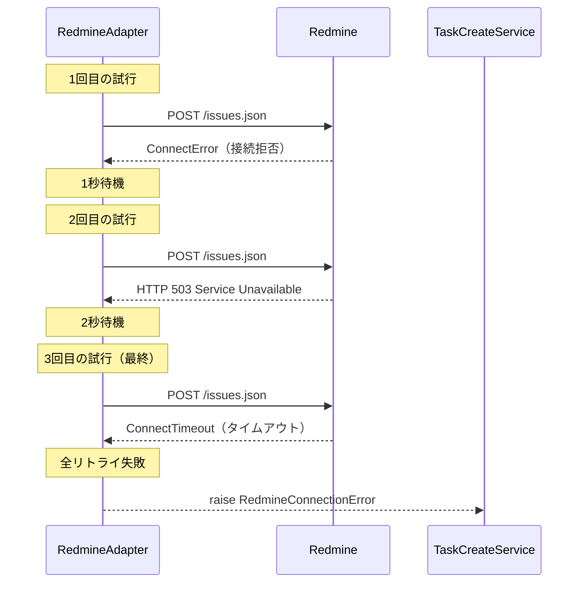

# DSD-005_FEAT-001 外部インターフェース詳細設計書（Redmineタスク作成）

| 項目 | 値 |
|---|---|
| ドキュメントID | DSD-005_FEAT-001 |
| バージョン | 1.0 |
| 作成日 | 2026-03-03 |
| 機能ID | FEAT-001 |
| 機能名 | Redmineタスク作成（redmine-task-create） |
| 入力元 | BSD-007 |
| ステータス | 初版 |

---

## 目次

1. 概要
2. 外部システム接続情報
3. Redmine REST API 詳細仕様（POST /issues.json）
4. ACL（Anti-Corruption Layer）変換設計
5. RedmineAdapter クラス詳細実装
6. リトライ設計
7. エラーハンドリング設計
8. タイムアウト設計
9. 後続フェーズへの影響

---

## 1. 概要

### 1.1 対象外部インターフェース

FEAT-001（Redmine タスク作成）で使用する外部インターフェースは以下の通り。

| 外部システム | エンドポイント | 用途 |
|---|---|---|
| Redmine REST API | `POST /issues.json` | 新規タスク（Issue）の作成 |

### 1.2 連携方式

```
LangGraph Agent
    ↓ Python 関数呼び出し
create_task_tool
    ↓ サービス呼び出し
TaskCreateService
    ↓ アダプター呼び出し
RedmineAdapter（ACL）
    ↓ HTTP REST API（httpx）
Redmine Server（Docker: localhost:8080）
```

### 1.3 ACL 設計の目的

RedmineAdapter は Anti-Corruption Layer（ACL）として機能し、以下の責務を持つ:

- Redmine の REST API 仕様（フィールド名・データ型・ID ベースの参照）を内部ドメインモデル（名前ベース・型安全）に変換する
- Redmine の API 仕様変更が内部ドメインロジックに影響しないよう分離する
- リトライ・タイムアウト・エラー変換を内包し、呼び出し側の実装を単純化する

---

## 2. 外部システム接続情報

### 2.1 Redmine サーバー接続設定

| 項目 | 値 | 環境変数 |
|---|---|---|
| エンドポイント | `http://localhost:8080`（デフォルト） | `REDMINE_URL` |
| 認証方式 | API キー（`X-Redmine-API-Key` ヘッダー） | `REDMINE_API_KEY` |
| プロトコル | HTTP（ローカル環境）/ HTTPS（本番環境） | - |
| データフォーマット | JSON（`Content-Type: application/json`） | - |
| 文字コード | UTF-8 | - |

### 2.2 接続タイムアウト設定

| タイムアウト種別 | 値 | 説明 |
|---|---|---|
| 接続タイムアウト | 10秒 | TCP 接続確立のタイムアウト |
| 読み取りタイムアウト | 30秒 | レスポンス受信完了のタイムアウト |
| 全体タイムアウト | 60秒 | 接続+読み取りの合計タイムアウト |

### 2.3 リトライ設定

| 設定 | 値 |
|---|---|
| 最大リトライ回数 | 3回（初回 + 最大2回のリトライ） |
| リトライ間隔（指数バックオフ） | 1秒 → 2秒 → 4秒 |
| リトライ対象エラー | 接続タイムアウト・接続エラー・5xx エラー |
| リトライ非対象エラー | 4xx エラー（クライアントエラー・リトライしても解決しない） |

---

## 3. Redmine REST API 詳細仕様（POST /issues.json）

### 3.1 エンドポイント概要

| 項目 | 内容 |
|---|---|
| メソッド | POST |
| URL | `{REDMINE_URL}/issues.json` |
| 例 | `http://localhost:8080/issues.json` |
| 認証 | `X-Redmine-API-Key: {REDMINE_API_KEY}` |
| Content-Type | `application/json` |
| 成功ステータス | 201 Created |

### 3.2 リクエスト仕様

**リクエストボディ JSON 構造:**
```json
{
  "issue": {
    "project_id": 1,
    "subject": "タスクタイトル（必須）",
    "description": "タスクの詳細説明（任意）",
    "priority_id": 2,
    "status_id": 1,
    "assigned_to_id": null,
    "due_date": "2026-03-31"
  }
}
```

**リクエストフィールド詳細:**

| フィールド名 | 型 | 必須 | 説明 | 有効値 |
|---|---|---|---|---|
| `issue.project_id` | integer | ○ | Redmine プロジェクト ID | 1 以上の整数（存在するプロジェクト ID） |
| `issue.subject` | string | ○ | タスクタイトル（件名） | 最大 255 文字（Redmine の制限） |
| `issue.description` | string | × | タスクの詳細説明（テキスト形式） | 最大 50000 文字（Redmine の制限） |
| `issue.priority_id` | integer | × | 優先度 ID | 1: 低, 2: 通常, 3: 高, 4: 緊急（デフォルト: 2） |
| `issue.status_id` | integer | × | ステータス ID | 1: 新規（デフォルト）, 2: 進行中, 3: 解決, 4: 終了 |
| `issue.assigned_to_id` | integer | × | 担当者のユーザー ID | Redmine ユーザー ID（NULL = 未アサイン） |
| `issue.due_date` | string | × | 期日（YYYY-MM-DD 形式） | ISO 8601 日付文字列 |
| `issue.tracker_id` | integer | × | トラッカー ID | Redmine で設定されたトラッカー ID（デフォルト: 1 = バグ） |

**リクエスト例（タスク作成）:**
```json
{
  "issue": {
    "project_id": 1,
    "subject": "設計書レビュー",
    "description": "DSD-001 バックエンド詳細設計書のレビューを行う\n\n## 確認ポイント\n- クラス図の正確性\n- シーケンス図の網羅性",
    "priority_id": 3,
    "status_id": 1,
    "due_date": "2026-03-31"
  }
}
```

### 3.3 レスポンス仕様

**成功レスポンス（201 Created）:**
```json
{
  "issue": {
    "id": 124,
    "project": {
      "id": 1,
      "name": "personal-agent"
    },
    "tracker": {
      "id": 1,
      "name": "バグ"
    },
    "status": {
      "id": 1,
      "name": "新規",
      "is_closed": false
    },
    "priority": {
      "id": 3,
      "name": "高"
    },
    "author": {
      "id": 1,
      "name": "admin"
    },
    "assigned_to": null,
    "subject": "設計書レビュー",
    "description": "DSD-001 バックエンド詳細設計書のレビューを行う",
    "due_date": "2026-03-31",
    "done_ratio": 0,
    "is_private": false,
    "estimated_hours": null,
    "total_estimated_hours": null,
    "spent_hours": 0.0,
    "total_spent_hours": 0.0,
    "created_on": "2026-03-03T10:00:00Z",
    "updated_on": "2026-03-03T10:00:00Z",
    "closed_on": null
  }
}
```

**レスポンスフィールド詳細（主要フィールドのみ）:**

| フィールド名 | 型 | 説明 |
|---|---|---|
| `issue.id` | integer | Redmine が自動採番した Issue ID |
| `issue.project.id` | integer | プロジェクト ID |
| `issue.project.name` | string | プロジェクト名 |
| `issue.status.id` | integer | ステータス ID |
| `issue.status.name` | string | ステータス名（日本語） |
| `issue.priority.id` | integer | 優先度 ID |
| `issue.priority.name` | string | 優先度名（日本語） |
| `issue.subject` | string | タスクタイトル |
| `issue.description` | string | タスク説明 |
| `issue.due_date` | string \| null | 期日（YYYY-MM-DD 形式） |
| `issue.created_on` | string | 作成日時（ISO 8601 UTC） |
| `issue.updated_on` | string | 更新日時（ISO 8601 UTC） |

### 3.4 エラーレスポンス仕様

**400 Bad Request（バリデーションエラー）:**
```json
{
  "errors": [
    "プロジェクトを入力してください",
    "件名を入力してください"
  ]
}
```

**401 Unauthorized（認証エラー）:**
```
HTTP/1.1 401 Unauthorized
（レスポンスボディなし）
```

**404 Not Found（プロジェクト不存在等）:**
```
HTTP/1.1 404 Not Found
（レスポンスボディなし）
```

**422 Unprocessable Entity（ビジネスルールエラー）:**
```json
{
  "errors": [
    "プロジェクトが見つかりません"
  ]
}
```

---

## 4. ACL（Anti-Corruption Layer）変換設計

### 4.1 リクエスト変換マッピング（内部 → Redmine）

| 内部ドメインモデル | Redmine API フィールド | 変換ルール |
|---|---|---|
| `title: str` | `issue.subject: str` | そのまま渡す |
| `description: str \| None` | `issue.description: str \| None` | そのまま渡す（None の場合はキーを省略） |
| `priority: "low" \| "normal" \| "high" \| "urgent"` | `issue.priority_id: int` | 名称→ID 変換（マッピングテーブル参照） |
| `due_date: str \| None` | `issue.due_date: str \| None` | `"YYYY-MM-DD"` 形式のままで渡す |
| `project_id: int` | `issue.project_id: int` | そのまま渡す |

**優先度名称→ID 変換マッピング:**

| 内部優先度名 | Redmine priority_id | Redmine priority 名称 |
|---|---|---|
| `"low"` | `1` | `"低"` |
| `"normal"` | `2` | `"通常"` |
| `"high"` | `3` | `"高"` |
| `"urgent"` | `4` | `"緊急"` |

### 4.2 レスポンス変換マッピング（Redmine → 内部）

| Redmine API フィールド | 内部ドメインモデル | 変換ルール |
|---|---|---|
| `issue.id: int` | `Task.redmine_issue_id: str` | 整数→文字列変換（`str(issue["id"])`） |
| `issue.subject: str` | `Task.title: str` | そのまま |
| `issue.status.id: int` | `Task.status: TaskStatus` | `TaskStatus.from_redmine_id(status_id)` |
| `issue.status.name: str` | 表示用文字列 | そのまま（ドメインオブジェクト内に含める必要はない） |
| `issue.priority.id: int` | `Task.priority: TaskPriority` | `TaskPriority.from_redmine_id(priority_id)` |
| `issue.description: str` | `Task.description: str \| None` | None 変換（空文字列 → None） |
| `issue.due_date: str \| null` | `Task.due_date: date \| None` | `date.fromisoformat()` でパース。null → None |
| `issue.created_on: str (UTC)` | `Task.created_at: datetime` | ISO 8601 パース（`datetime.fromisoformat()`） |
| `issue.project.id: int` | `Task.project_id: int` | そのまま |

---

## 5. RedmineAdapter クラス詳細実装

### 5.1 クラス定義

```python
# app/infra/redmine/redmine_adapter.py
from __future__ import annotations

import asyncio
import time
from datetime import date, datetime
from typing import Any

import httpx
import structlog

from app.domain.exceptions import (
    RedmineAPIError,
    RedmineAuthError,
    RedmineConnectionError,
    RedmineNotFoundError,
)

logger = structlog.get_logger(__name__)

# 優先度名称→ID マッピング
PRIORITY_NAME_TO_ID: dict[str, int] = {
    "low": 1,
    "normal": 2,
    "high": 3,
    "urgent": 4,
}

# リトライ設定
MAX_RETRY_COUNT = 3
RETRY_DELAYS_SEC: list[float] = [1.0, 2.0, 4.0]


class RedmineAdapter:
    """Redmine REST API との通信を担う ACL（Anti-Corruption Layer）クラス。

    Redmine のデータモデルを内部ドメインモデルに変換し、
    リトライ・タイムアウト・エラー変換を内包する。

    Args:
        base_url: Redmine サーバーのベース URL（例: "http://localhost:8080"）。
        api_key: Redmine API キー（環境変数 REDMINE_API_KEY から取得）。
        connect_timeout: TCP 接続タイムアウト秒数（デフォルト: 10秒）。
        read_timeout: レスポンス読み取りタイムアウト秒数（デフォルト: 30秒）。
    """

    def __init__(
        self,
        base_url: str,
        api_key: str,
        connect_timeout: float = 10.0,
        read_timeout: float = 30.0,
    ) -> None:
        self._base_url = base_url.rstrip("/")
        self._api_key = api_key
        self._timeout = httpx.Timeout(
            connect=connect_timeout,
            read=read_timeout,
            write=10.0,
            pool=5.0,
        )

    def _get_headers(self) -> dict[str, str]:
        """Redmine API 認証ヘッダーを返す。APIキーをログに出力しない。"""
        return {
            "X-Redmine-API-Key": self._api_key,
            "Content-Type": "application/json",
            "Accept": "application/json",
        }

    async def create_issue(
        self,
        subject: str,
        project_id: int,
        description: str | None = None,
        priority_id: int = 2,
        status_id: int = 1,
        due_date: str | None = None,
        assigned_to_id: int | None = None,
    ) -> dict[str, Any]:
        """Redmine に新規 Issue を作成する。

        Args:
            subject: Issue のタイトル（件名）。
            project_id: Redmine プロジェクト ID。
            description: Issue の詳細説明（任意）。
            priority_id: 優先度 ID（1:低, 2:通常, 3:高, 4:緊急）。
            status_id: ステータス ID（1:新規, デフォルト）。
            due_date: 期日（YYYY-MM-DD 形式、任意）。
            assigned_to_id: 担当者の Redmine ユーザー ID（任意）。

        Returns:
            Redmine API のレスポンス JSON（`{"issue": {...}}` の形式）。

        Raises:
            RedmineConnectionError: 接続に失敗した場合（タイムアウト・接続拒否）。
            RedmineAuthError: API キーが無効な場合。
            RedmineNotFoundError: プロジェクトが存在しない場合（404）。
            RedmineAPIError: その他の Redmine API エラー。
        """
        url = f"{self._base_url}/issues.json"

        # リクエストボディの構築
        issue_data: dict[str, Any] = {
            "project_id": project_id,
            "subject": subject,
            "priority_id": priority_id,
            "status_id": status_id,
        }
        if description:
            issue_data["description"] = description
        if due_date:
            issue_data["due_date"] = due_date
        if assigned_to_id is not None:
            issue_data["assigned_to_id"] = assigned_to_id

        payload = {"issue": issue_data}

        start_time = time.monotonic()
        logger.info(
            "redmine_create_issue_started",
            project_id=project_id,
            subject=subject[:50],
            priority_id=priority_id,
        )

        response = await self._retry_request(
            method="POST",
            url=url,
            json=payload,
        )

        duration_ms = int((time.monotonic() - start_time) * 1000)
        response_data = response.json()

        logger.info(
            "redmine_create_issue_succeeded",
            issue_id=response_data.get("issue", {}).get("id"),
            duration_ms=duration_ms,
        )

        return response_data

    async def _retry_request(
        self,
        method: str,
        url: str,
        **kwargs: Any,
    ) -> httpx.Response:
        """HTTP リクエストをリトライ付きで実行する。

        リトライ対象: 接続エラー・タイムアウト・HTTP 5xx エラー。
        非リトライ: HTTP 4xx エラー（即座にエラーを返す）。

        Returns:
            正常なレスポンス（2xx）。

        Raises:
            RedmineConnectionError: リトライ上限後も接続失敗した場合。
            RedmineAuthError: 401 Unauthorized。
            RedmineNotFoundError: 404 Not Found。
            RedmineAPIError: その他のエラー。
        """
        last_error: Exception | None = None

        for attempt in range(MAX_RETRY_COUNT):
            try:
                async with httpx.AsyncClient(timeout=self._timeout) as client:
                    response = await client.request(
                        method=method,
                        url=url,
                        headers=self._get_headers(),
                        **kwargs,
                    )

                # 4xx エラーはリトライしない
                if 400 <= response.status_code < 500:
                    self._handle_client_error(response)

                # 5xx エラーはリトライ対象
                if response.status_code >= 500:
                    logger.warning(
                        "redmine_server_error",
                        attempt=attempt + 1,
                        max_retries=MAX_RETRY_COUNT,
                        status_code=response.status_code,
                        url=url,
                    )
                    last_error = RedmineAPIError(
                        f"Redmine サーバーエラー: HTTP {response.status_code}",
                        status_code=response.status_code,
                    )
                    if attempt < MAX_RETRY_COUNT - 1:
                        await asyncio.sleep(RETRY_DELAYS_SEC[attempt])
                    continue

                return response

            except (httpx.ConnectError, httpx.ConnectTimeout) as e:
                logger.warning(
                    "redmine_connection_error",
                    attempt=attempt + 1,
                    max_retries=MAX_RETRY_COUNT,
                    error_type=type(e).__name__,
                    url=url,
                )
                last_error = RedmineConnectionError(
                    f"Redmine への接続に失敗しました: {str(e)}"
                )
                if attempt < MAX_RETRY_COUNT - 1:
                    await asyncio.sleep(RETRY_DELAYS_SEC[attempt])

            except httpx.ReadTimeout as e:
                logger.warning(
                    "redmine_read_timeout",
                    attempt=attempt + 1,
                    max_retries=MAX_RETRY_COUNT,
                    url=url,
                )
                last_error = RedmineConnectionError(
                    "Redmine からのレスポンスがタイムアウトしました"
                )
                if attempt < MAX_RETRY_COUNT - 1:
                    await asyncio.sleep(RETRY_DELAYS_SEC[attempt])

        logger.error(
            "redmine_all_retries_failed",
            max_retries=MAX_RETRY_COUNT,
            url=url,
        )
        raise last_error or RedmineConnectionError("Redmine への接続に失敗しました")

    def _handle_client_error(self, response: httpx.Response) -> None:
        """4xx クライアントエラーを適切な例外に変換する。"""
        if response.status_code == 401:
            raise RedmineAuthError(
                "Redmine API キーが無効です。REDMINE_API_KEY の設定を確認してください。"
            )
        if response.status_code == 404:
            raise RedmineNotFoundError(
                "指定したリソースが Redmine に存在しません（プロジェクト不存在等）"
            )
        if response.status_code == 422:
            # Redmine のバリデーションエラー（例: {"errors": ["件名を入力してください"]}）
            try:
                error_data = response.json()
                errors = error_data.get("errors", [])
                error_msg = "、".join(errors) if errors else f"HTTP {response.status_code}"
            except Exception:
                error_msg = f"HTTP {response.status_code}"
            raise RedmineAPIError(
                f"Redmine でエラーが発生しました: {error_msg}",
                status_code=response.status_code,
            )

        # その他の 4xx
        raise RedmineAPIError(
            f"Redmine API エラー: HTTP {response.status_code}",
            status_code=response.status_code,
        )
```

---

## 6. リトライ設計

### 6.1 リトライシーケンス図



### 6.2 リトライ対象・非対象の分類

| エラー種別 | リトライ対象 | 理由 |
|---|---|---|
| `httpx.ConnectError`（接続拒否） | ○ | Redmine が一時的に起動していない場合がある |
| `httpx.ConnectTimeout`（接続タイムアウト） | ○ | ネットワーク一時障害の可能性 |
| `httpx.ReadTimeout`（読み取りタイムアウト） | ○ | Redmine の一時的な処理遅延の可能性 |
| HTTP 5xx | ○ | Redmine サーバーの一時的なエラー |
| HTTP 400 Bad Request | × | クライアントのリクエストが不正（リトライしても解決しない） |
| HTTP 401 Unauthorized | × | API キーが無効（リトライしても解決しない） |
| HTTP 404 Not Found | × | リソースが存在しない（リトライしても解決しない） |
| HTTP 422 Unprocessable Entity | × | Redmine のビジネスルールエラー（リトライしても解決しない） |

---

## 7. エラーハンドリング設計

### 7.1 例外クラス階層

```python
# app/domain/exceptions.py
class PersonalAgentError(Exception):
    """基底例外クラス。"""
    def __init__(self, message: str, error_code: str = "INTERNAL_ERROR") -> None:
        self.message = message
        self.error_code = error_code
        super().__init__(message)


class RedmineConnectionError(PersonalAgentError):
    """Redmine への接続に失敗した場合の例外。"""
    def __init__(self, message: str = "Redmine への接続に失敗しました") -> None:
        super().__init__(message, error_code="SERVICE_UNAVAILABLE")


class RedmineAuthError(PersonalAgentError):
    """Redmine API キーが無効な場合の例外。"""
    def __init__(self, message: str = "Redmine API キーが無効です") -> None:
        super().__init__(message, error_code="SERVICE_UNAVAILABLE")


class RedmineNotFoundError(PersonalAgentError):
    """Redmine でリソースが見つからない場合の例外。"""
    def __init__(self, message: str = "指定したリソースが見つかりません") -> None:
        super().__init__(message, error_code="NOT_FOUND")


class RedmineAPIError(PersonalAgentError):
    """Redmine API がエラーレスポンスを返した場合の例外。"""
    def __init__(self, message: str, status_code: int) -> None:
        self.status_code = status_code
        super().__init__(message, error_code="REDMINE_API_ERROR")
```

### 7.2 エラー変換マッピング（Redmine → ユーザーメッセージ）

| RedmineAdapter 例外 | ユーザーへのメッセージ | ログレベル |
|---|---|---|
| `RedmineConnectionError` | 「Redmine との接続に失敗しました。Redmine が起動しているか確認してください。」 | ERROR |
| `RedmineAuthError` | 「Redmine API キーの設定を確認してください（REDMINE_API_KEY）。」 | ERROR |
| `RedmineNotFoundError` | 「指定したプロジェクトが見つかりません。プロジェクト ID を確認してください。」 | WARNING |
| `RedmineAPIError`（422） | 「タスクの作成に失敗しました: {Redmine のエラーメッセージ}」 | WARNING |

---

## 8. タイムアウト設計

### 8.1 タイムアウト設定値とその根拠

| タイムアウト | 設定値 | 根拠 |
|---|---|---|
| 接続タイムアウト | 10秒 | ローカル Docker コンテナへの接続は通常 1秒以内。10秒あれば十分 |
| 読み取りタイムアウト | 30秒 | Redmine の Issue 作成は通常 1-2秒。DB 負荷時でも 30秒以内に完了する想定 |
| 全体タイムアウト | 60秒 | リトライ間隔（最大 7秒 = 1+2+4）を含めた合計で 60秒以内に収束 |

### 8.2 httpx タイムアウト設定コード

```python
timeout = httpx.Timeout(
    connect=10.0,   # TCP 接続タイムアウト
    read=30.0,      # レスポンス読み取りタイムアウト
    write=10.0,     # リクエスト書き込みタイムアウト
    pool=5.0,       # 接続プールからの取得タイムアウト
)
```

---

## 9. 後続フェーズへの影響

| 影響先 | 内容 |
|---|---|
| IMP-001_FEAT-001 | RedmineAdapter クラスの実装・単体テスト（httpx モックを使用） |
| DSD-008_FEAT-001 | RedmineAdapter.create_issue のテストケース設計（正常系・接続エラー・認証エラー・422 エラー） |
| IT-001_FEAT-001 | Redmine Docker コンテナを使用した結合テスト（実際の API 呼び出し） |
| OPS-001 | Redmine 接続確認手順（`REDMINE_URL`・`REDMINE_API_KEY` 設定確認） |
