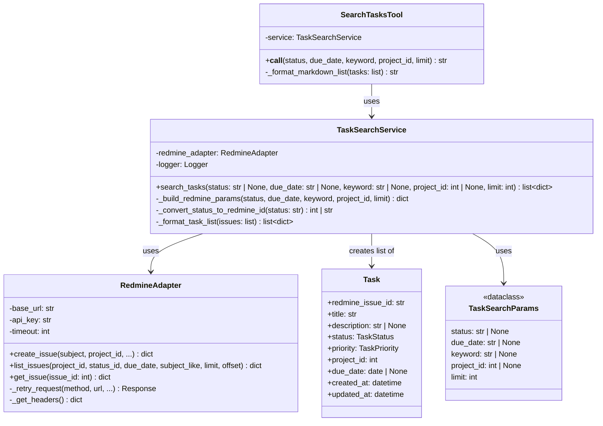
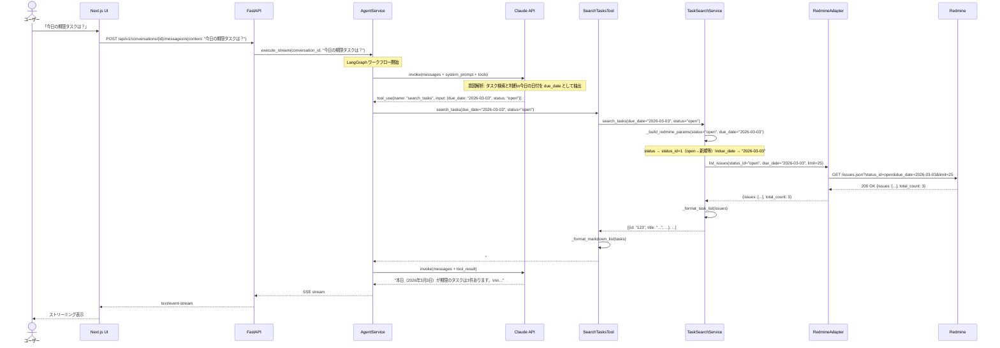
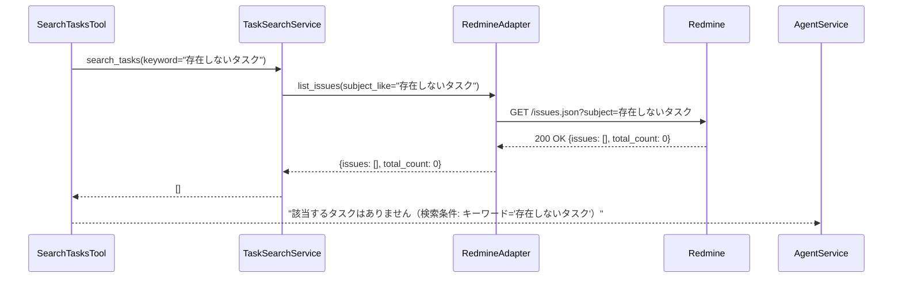

# DSD-001_FEAT-002 バックエンド機能詳細設計書（Redmineタスク検索・一覧表示）

| 項目 | 値 |
|---|---|
| ドキュメントID | DSD-001_FEAT-002 |
| バージョン | 1.0 |
| 作成日 | 2026-03-03 |
| 機能ID | FEAT-002 |
| 機能名 | Redmineタスク検索・一覧表示（redmine-task-search） |
| 入力元 | BSD-001, BSD-002, BSD-004, BSD-009 |
| ステータス | 初版 |

---

## 目次

1. 機能概要
2. レイヤー構成・モジュール分割
3. クラス図
4. シーケンス図
5. LangGraph ノード設計
6. ツール関数詳細設計
7. タスク検索ロジック設計
8. エラーハンドリング設計
9. 後続フェーズへの影響

---

## 1. 機能概要

### 1.1 概要

ユーザーがチャット画面で「タスク一覧を見せて」「今日の期限タスクは？」「優先度が高いタスクを検索して」と指示すると、LangGraph エージェントが検索条件を解析し、MCP 経由で Redmine からタスクを検索して Markdown 形式の一覧としてチャット画面に返す機能。

### 1.2 対応ユースケース

| UC-ID | ユースケース名 | 説明 |
|---|---|---|
| UC-002 | タスク一覧を確認する | エージェント経由で Redmine タスクを検索・表示 |
| UC-007 | 優先タスクのレポートを受け取る | 未完了タスクを分析し優先度・期日順で提案 |

### 1.3 ビジネスルール

| ルール ID | 内容 |
|---|---|
| BR-005 | 検索結果が 0 件の場合は「該当するタスクはありません」と返す |
| BR-006 | 一回のエージェント呼び出しで取得する最大タスク数は 100 件 |
| BR-007 | タスク一覧は Markdown 形式でチャット画面に表示する |
| BR-008 | タスクの URL をクリックすると Redmine チケット詳細ページへ遷移する |

### 1.4 処理フロー概要

```
ユーザー入力（「今日の期限タスクは？」）
    ↓
FastAPI エンドポイント（POST /api/v1/conversations/{id}/messages）
    ↓
AgentService（LangGraph ワークフロー起動）
    ↓
Claude LLM（意図解析・検索条件抽出）
    ↓
search_tasks_tool（ツール関数呼び出し）
    ↓ 引数: status="open", due_date="2026-03-03"
TaskSearchService（クエリ構築・Redmine 呼び出し）
    ↓
RedmineAdapter（HTTP REST API 呼び出し）
    ↓
Redmine（GET /issues.json?status_id=open&due_date=2026-03-03）
    ↓
Markdown 形式のタスク一覧テキスト生成
    ↓
SSE ストリーミング（チャット画面へ応答）
```

---

## 2. レイヤー構成・モジュール分割

### 2.1 レイヤー責務マッピング

| レイヤー | モジュール/クラス | 責務 |
|---|---|---|
| プレゼンテーション層 | `app/api/v1/conversations.py` | HTTP リクエスト受付・SSE ストリーミング配信（FEAT-001 と共有） |
| プレゼンテーション層 | `app/api/v1/tasks.py` | GET /api/v1/tasks エンドポイント（タスク一覧 API） |
| アプリケーション層 | `app/application/agent/agent_service.py` | LangGraph ワークフロー起動（FEAT-001 と共有） |
| アプリケーション層 | `app/application/task/task_search_service.py` | タスク検索のユースケース・検索条件変換・フィルタリング |
| インフラ層 | `app/agent/tools/search_tasks_tool.py` | LangGraph ツール関数定義 |
| インフラ層 | `app/agent/nodes/task_search_node.py` | LangGraph ノード実装（エージェントノードを共有） |
| インフラ層 | `app/infra/redmine/redmine_adapter.py` | Redmine REST API 呼び出し（FEAT-001 の `list_issues` メソッドを追加） |

---

## 3. クラス図



---

## 4. シーケンス図

### 4.1 タスク検索（正常系）



### 4.2 検索結果 0 件



---

## 5. LangGraph ノード設計

### 5.1 エージェントグラフへの統合

`search_tasks_tool` は FEAT-001 と同じエージェントグラフに追加する。エージェントノード（LLM）がユーザーの意図を解析し、タスク検索が必要と判断した場合に `search_tasks_tool` を選択する。

```python
# app/agent/graph.py（FEAT-001 から拡張）
from app.agent.tools.create_task_tool import create_task_tool
from app.agent.tools.search_tasks_tool import search_tasks_tool

def build_agent_graph() -> StateGraph:
    """LangGraph エージェントワークフローを構築する。"""
    tools = [
        create_task_tool,   # FEAT-001: タスク作成
        search_tasks_tool,  # FEAT-002: タスク検索
    ]
    tool_node = ToolNode(tools)
    # ... 以下 FEAT-001 と同様
```

---

## 6. ツール関数詳細設計

### 6.1 search_tasks_tool 関数

```python
# app/agent/tools/search_tasks_tool.py
from __future__ import annotations

import structlog
from langchain_core.tools import tool
from app.application.task.task_search_service import TaskSearchService
from app.infra.redmine.redmine_adapter import RedmineAdapter
from app.config import get_settings

logger = structlog.get_logger(__name__)


@tool
async def search_tasks_tool(
    status: str = "",
    due_date: str = "",
    keyword: str = "",
    project_id: int = 0,
    limit: int = 25,
) -> str:
    """Redmine からタスク（チケット）一覧を検索して返す。

    Args:
        status: 検索するタスクのステータス。
            - "open": 未完了（新規・進行中）のタスク
            - "closed": 完了したタスク
            - "all": すべてのタスク
            - 空文字: フィルタなし（デフォルト: "open"）
        due_date: 期日でフィルタ（YYYY-MM-DD 形式）。
            指定した日付が期日のタスクを取得する。
            空文字の場合はフィルタなし。
        keyword: タイトル・説明での検索キーワード（部分一致）。
            空文字の場合はフィルタなし。
        project_id: Redmine プロジェクト ID でフィルタ。
            0 または未指定の場合はフィルタなし（全プロジェクト）。
        limit: 取得件数の上限（デフォルト: 25, 最大: 100）。

    Returns:
        Markdown 形式のタスク一覧文字列。
        タスクが見つからない場合は「該当するタスクはありません」を返す。

    Examples:
        >>> result = await search_tasks_tool(status="open", due_date="2026-03-03")
        >>> print(result)
        ## 本日期限のタスク（3件）
        1. [設計書レビュー](http://localhost:8080/issues/123) - **高** - 期日: 2026-03-03
        2. [API テスト](http://localhost:8080/issues/124) - **通常** - 期日: 2026-03-03
        3. [ドキュメント更新](http://localhost:8080/issues/125) - **低** - 期日: 2026-03-03
    """
    logger.info(
        "search_tasks_tool_called",
        status=status,
        due_date=due_date,
        keyword=keyword[:30] if keyword else None,
        project_id=project_id,
        limit=limit,
    )

    settings = get_settings()
    adapter = RedmineAdapter(
        base_url=settings.redmine_url,
        api_key=settings.redmine_api_key,
    )
    service = TaskSearchService(redmine_adapter=adapter)

    try:
        tasks = await service.search_tasks(
            status=status or None,
            due_date=due_date or None,
            keyword=keyword or None,
            project_id=project_id if project_id > 0 else None,
            limit=min(limit, 100),
        )

        logger.info(
            "search_tasks_tool_succeeded",
            result_count=len(tasks),
        )

        if not tasks:
            conditions = []
            if status:
                conditions.append(f"ステータス='{status}'")
            if due_date:
                conditions.append(f"期日='{due_date}'")
            if keyword:
                conditions.append(f"キーワード='{keyword}'")
            condition_str = (
                f"（検索条件: {', '.join(conditions)}）" if conditions else ""
            )
            return f"該当するタスクはありません{condition_str}"

        return _format_markdown_list(tasks, due_date=due_date)

    except Exception as e:
        logger.error(
            "search_tasks_tool_failed",
            error=str(e),
        )
        return f"タスクの検索に失敗しました。エラー: {str(e)}"


def _format_markdown_list(tasks: list[dict], due_date: str | None = None) -> str:
    """タスク一覧を Markdown 形式にフォーマットする。"""
    count = len(tasks)
    title_suffix = f"（{due_date} 期限）" if due_date else ""
    header = f"## タスク一覧{title_suffix}（{count}件）\n\n"

    priority_display = {
        "low": "低",
        "normal": "通常",
        "high": "**高**",
        "urgent": "**🔴 緊急**",
    }

    lines = [header]
    for i, task in enumerate(tasks, start=1):
        priority_label = priority_display.get(task.get("priority", "normal"), "通常")
        due = task.get("due_date")
        due_str = f" - 期日: {due}" if due else ""
        url = task.get("url", "#")
        title = task.get("title", "（タイトルなし）")
        status = task.get("status", "")

        line = f"{i}. [{title}]({url}) - {priority_label}{due_str}"
        if status and status not in ("新規", "open"):
            line += f" - {status}"
        lines.append(line)

    return "\n".join(lines)
```

### 6.2 TaskSearchService クラス

```python
# app/application/task/task_search_service.py
from __future__ import annotations

import structlog
from app.infra.redmine.redmine_adapter import RedmineAdapter
from app.domain.exceptions import RedmineConnectionError

logger = structlog.get_logger(__name__)

# ステータス名称→Redmine ステータスID/文字列 マッピング
STATUS_MAP: dict[str, str | int] = {
    "open": "open",     # Redmine の "open" フィルタ（新規・進行中等）
    "closed": "closed", # Redmine の "closed" フィルタ
    "all": "*",         # 全ステータス
}


class TaskSearchService:
    """タスク検索のユースケースを実装するサービスクラス。"""

    def __init__(self, redmine_adapter: RedmineAdapter) -> None:
        self._redmine_adapter = redmine_adapter

    async def search_tasks(
        self,
        status: str | None = None,
        due_date: str | None = None,
        keyword: str | None = None,
        project_id: int | None = None,
        limit: int = 25,
    ) -> list[dict]:
        """Redmine からタスクを検索する。

        Args:
            status: ステータスフィルタ（"open"/"closed"/"all"）。
            due_date: 期日フィルタ（YYYY-MM-DD 形式）。
            keyword: キーワード検索（タイトル部分一致）。
            project_id: プロジェクト ID フィルタ。
            limit: 取得件数上限（最大 100）。

        Returns:
            タスク情報の辞書リスト。

        Raises:
            RedmineConnectionError: Redmine への接続に失敗した場合。
        """
        # パラメータ構築
        params = self._build_redmine_params(
            status=status,
            due_date=due_date,
            keyword=keyword,
            project_id=project_id,
            limit=limit,
        )

        logger.info(
            "task_search_service_search_started",
            params={k: str(v)[:30] for k, v in params.items()},
        )

        # Redmine API 呼び出し
        response = await self._redmine_adapter.list_issues(**params)

        issues = response.get("issues", [])
        total_count = response.get("total_count", len(issues))

        logger.info(
            "task_search_service_search_succeeded",
            result_count=len(issues),
            total_count=total_count,
        )

        # レスポンスを内部形式に変換
        return [self._format_task(issue) for issue in issues]

    def _build_redmine_params(
        self,
        status: str | None,
        due_date: str | None,
        keyword: str | None,
        project_id: int | None,
        limit: int,
    ) -> dict:
        """Redmine API のクエリパラメータを構築する。"""
        params: dict = {
            "limit": min(limit, 100),
            "offset": 0,
        }

        # ステータス変換
        if status:
            redmine_status = STATUS_MAP.get(status, "open")
            params["status_id"] = redmine_status
        else:
            params["status_id"] = "open"  # デフォルト: 未完了タスク

        # 期日フィルタ
        if due_date:
            params["due_date"] = due_date

        # キーワード検索
        if keyword:
            params["subject_like"] = keyword

        # プロジェクト ID フィルタ
        if project_id:
            params["project_id"] = project_id

        return params

    def _format_task(self, issue: dict) -> dict:
        """Redmine API の Issue レスポンスを内部形式に変換する（ACL）。"""
        settings = get_settings()
        issue_id = str(issue["id"])
        priority_id = issue.get("priority", {}).get("id", 2)
        priority_name = {1: "low", 2: "normal", 3: "high", 4: "urgent"}.get(
            priority_id, "normal"
        )

        return {
            "id": issue_id,
            "title": issue.get("subject", ""),
            "description": issue.get("description") or None,
            "status": issue.get("status", {}).get("name", ""),
            "priority": priority_name,
            "due_date": issue.get("due_date"),
            "project_id": issue.get("project", {}).get("id"),
            "project_name": issue.get("project", {}).get("name", ""),
            "url": f"{settings.redmine_url}/issues/{issue_id}",
            "created_at": issue.get("created_on"),
            "updated_at": issue.get("updated_on"),
        }
```

---

## 7. タスク検索ロジック設計

### 7.1 検索条件マッピング

| ユーザー入力の表現 | エージェントが解析する条件 | Redmine API パラメータ |
|---|---|---|
| 「未完了タスク」「オープンなタスク」 | `status="open"` | `status_id=open` |
| 「完了したタスク」「クローズされたタスク」 | `status="closed"` | `status_id=closed` |
| 「今日のタスク」「今日が期限のタスク」 | `due_date="YYYY-MM-DD"` | `due_date=YYYY-MM-DD` |
| 「設計書タスク」「設計書に関するタスク」 | `keyword="設計書"` | `subject_like=設計書` |
| 「高優先度のタスク」 | `status="open"` + LLM でフィルタ | `status_id=open` |
| 「全てのタスク」 | `status="all"` | `status_id=*` |

### 7.2 期日フィルタの注意事項

Redmine の `due_date` パラメータは等値フィルタ（指定した日付と完全一致）であり、範囲指定はできない。期日範囲検索（例: 「今週のタスク」）は、エージェントが複数の API 呼び出しを行うか、全件取得後にフィルタリングする。

```python
# 期日範囲フィルタの対応（将来の拡張）
# フェーズ 1: 単一日付のみ対応
# フェーズ 2: due_date_gte / due_date_lte パラメータ対応を検討
```

### 7.3 Redmine list_issues メソッドの実装

```python
# app/infra/redmine/redmine_adapter.py（search_tasks 対応の追加メソッド）
async def list_issues(
    self,
    project_id: int | None = None,
    status_id: str | int = "open",
    due_date: str | None = None,
    subject_like: str | None = None,
    limit: int = 25,
    offset: int = 0,
) -> dict:
    """Redmine の Issue 一覧を取得する。

    Args:
        project_id: プロジェクト ID でフィルタ（None = 全プロジェクト）。
        status_id: ステータス ID またはフィルタ文字列（"open"/"closed"/"*"）。
        due_date: 期日でフィルタ（YYYY-MM-DD 形式）。
        subject_like: タイトルの部分一致検索文字列。
        limit: 取得件数上限（デフォルト: 25、最大: 100）。
        offset: 取得開始位置（ページネーション用）。

    Returns:
        {"issues": [...], "total_count": N, "offset": N, "limit": N} の形式。
    """
    url = f"{self._base_url}/issues.json"

    # クエリパラメータ構築
    params: dict = {
        "status_id": status_id,
        "limit": min(limit, 100),
        "offset": offset,
    }
    if project_id:
        params["project_id"] = project_id
    if due_date:
        params["due_date"] = due_date
    if subject_like:
        params["subject"] = subject_like  # Redmine は subject パラメータで部分一致

    logger.info(
        "redmine_list_issues_started",
        project_id=project_id,
        status_id=status_id,
        due_date=due_date,
        limit=limit,
    )

    response = await self._retry_request(
        method="GET",
        url=url,
        params=params,
    )

    response.raise_for_status()
    return response.json()
```

---

## 8. エラーハンドリング設計

### 8.1 エラー種別と対処方針

| エラー種別 | 発生クラス | ユーザーへのメッセージ |
|---|---|---|
| Redmine 接続タイムアウト | RedmineAdapter | 「Redmine との接続に失敗しました。Redmine が起動しているか確認してください」 |
| Redmine 5xx エラー | RedmineAdapter | 「Redmine サーバーでエラーが発生しました」 |
| Redmine 認証エラー | RedmineAdapter | 「Redmine API キーの設定を確認してください」 |
| 検索結果 0 件 | TaskSearchService | 「該当するタスクはありません（検索条件: ...）」 |
| 検索結果が多すぎる場合 | TaskSearchService | 「タスクが多数あります。検索条件を絞り込んでください。最初の 25 件を表示します」 |

---

## 9. 後続フェーズへの影響

| 影響先 | 内容 |
|---|---|
| DSD-003_FEAT-002 | GET /api/v1/tasks・GET /api/v1/conversations/{id}/messages の詳細 API 仕様 |
| DSD-005_FEAT-002 | RedmineAdapter.list_issues の外部インターフェース詳細仕様 |
| DSD-008_FEAT-002 | search_tasks_tool・TaskSearchService の単体テスト設計 |
| IMP-001_FEAT-002 | 本設計書に基づくバックエンド実装・TDD 実装報告書 |
