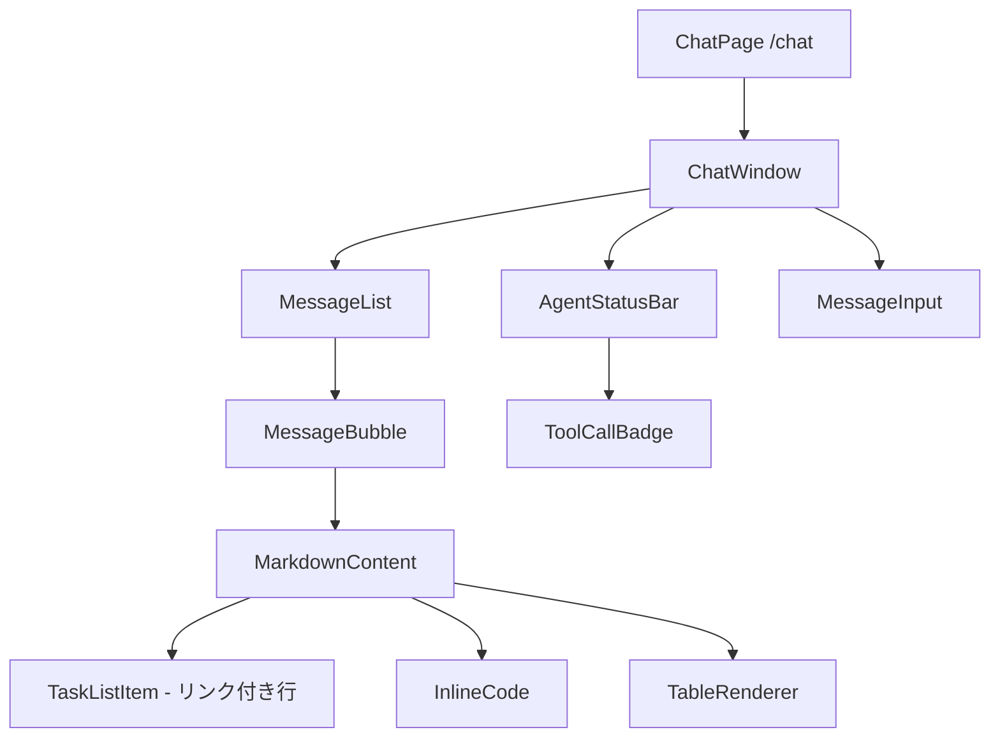

# DSD-002_FEAT-002 フロントエンド詳細設計書（Redmineタスク検索・一覧表示）

| 項目 | 値 |
|---|---|
| ドキュメントID | DSD-002_FEAT-002 |
| バージョン | 1.0 |
| 作成日 | 2026-03-03 |
| 機能ID | FEAT-002 |
| 機能名 | Redmineタスク検索・一覧表示（redmine-task-search） |
| 入力元 | BSD-003, BSD-004, DSD-001_FEAT-002 |
| ステータス | 初版 |

---

## 目次

1. 機能概要
2. コンポーネント構成
3. コンポーネント詳細設計
4. 状態管理設計
5. タスク一覧の Markdown 表示設計
6. タスク URL クリック遷移設計
7. SSE イベント処理（FEAT-002 拡張）
8. アクセシビリティ設計
9. エラー表示設計
10. 後続フェーズへの影響

---

## 1. 機能概要

### 1.1 概要

FEAT-002 のフロントエンド実装は FEAT-001 のチャット画面（`/chat`）を拡張する形で実現する。エージェントが Markdown 形式で返す「タスク一覧テキスト」をチャット画面上に適切にレンダリングし、埋め込まれた Redmine チケット URL をクリックすると新しいタブで Redmine チケット詳細ページへ遷移する機能を提供する。

新規コンポーネントは追加せず、既存の `MarkdownContent` コンポーネントと `useChat` フックが FEAT-002 の検索結果表示要件をカバーする設計とする。

### 1.2 対応ユースケース

| UC-ID | ユースケース名 | フロントエンドの役割 |
|---|---|---|
| UC-002 | タスク一覧を確認する | エージェント応答の Markdown タスク一覧をレンダリングし、URL リンクを機能させる |
| UC-007 | 優先タスクのレポートを受け取る | 太字強調（**高**、**緊急**）を含む Markdown を正確にレンダリングする |

### 1.3 FEAT-001 からの差分

| 項目 | FEAT-001（タスク作成） | FEAT-002（タスク検索）の追加要素 |
|---|---|---|
| エージェント応答 | 作成完了メッセージ（短い） | Markdown テーブルや箇条書きを含む長いタスク一覧テキスト |
| リンク | チケット URL 1 件 | 複数のチケット URL（1 行に 1 つ） |
| 強調表示 | なし | 高優先度タスクの **高** / **🔴 緊急** の太字 |
| 件数表示 | なし | 「タスク一覧（N件）」というヘッダ |
| スクロール | 短いので不要 | 長い一覧のためスクロール対応が必要 |

---

## 2. コンポーネント構成

### 2.1 コンポーネント階層図



> FEAT-002 で新たに追加するコンポーネントはない。
> 既存の `MarkdownContent` コンポーネントが `react-markdown` + `remark-gfm` でタスク一覧の Markdown を処理する。

### 2.2 ファイル構成

```
src/
├── app/
│   └── chat/
│       └── page.tsx                        # /chat ルートページ（FEAT-001 と共有）
├── components/
│   └── chat/
│       ├── ChatWindow.tsx                  # メインチャット画面（FEAT-001 と共有）
│       ├── MessageList.tsx                 # メッセージ一覧（FEAT-001 と共有）
│       ├── MessageBubble.tsx               # 1 件のメッセージ表示（FEAT-001 と共有）
│       ├── MessageInput.tsx                # 入力フォーム（FEAT-001 と共有）
│       ├── AgentStatusBar.tsx              # エージェント状態表示（FEAT-001 と共有）
│       └── MarkdownContent.tsx             # Markdown レンダラー（FEAT-002 対応強化）
├── hooks/
│   ├── useChat.ts                          # チャット状態管理（FEAT-001 と共有）
│   └── useConversationId.ts                # 会話 ID 管理（FEAT-001 と共有）
└── types/
    └── chat.ts                             # 型定義（FEAT-001 と共有）
```

---

## 3. コンポーネント詳細設計

### 3.1 MarkdownContent コンポーネント（FEAT-002 対応強化）

```tsx
// src/components/chat/MarkdownContent.tsx
import React from "react";
import ReactMarkdown from "react-markdown";
import remarkGfm from "remark-gfm";
import type { Components } from "react-markdown";

interface MarkdownContentProps {
  /** レンダリングする Markdown テキスト */
  content: string;
  /** ストリーミング中かどうか（true のとき最後にカーソルを表示） */
  isStreaming?: boolean;
}

/**
 * Markdown テキストを HTML にレンダリングするコンポーネント。
 * FEAT-002 対応: Redmine チケット URL を新しいタブで開くリンクとして処理する。
 * GFM（GitHub Flavored Markdown）対応: テーブル・太字・箇条書きを正確にレンダリングする。
 */
export const MarkdownContent: React.FC<MarkdownContentProps> = ({
  content,
  isStreaming = false,
}) => {
  /**
   * Markdown の各要素に対するカスタムレンダラー。
   * セキュリティ: 外部リンクは rel="noopener noreferrer" を付与する。
   * UX: Redmine チケット URL（http://localhost:8080/issues/{id}）は新しいタブで開く。
   */
  const components: Components = {
    // リンク: 新しいタブで開く（FEAT-002 の主要要件）
    a: ({ href, children, ...props }) => {
      const isExternal =
        href?.startsWith("http://") || href?.startsWith("https://");
      const isRedmineIssue = href?.includes("/issues/");

      return (
        <a
          href={href}
          target={isExternal ? "_blank" : undefined}
          rel={isExternal ? "noopener noreferrer" : undefined}
          className={[
            "text-blue-600 underline hover:text-blue-800 transition-colors",
            isRedmineIssue ? "font-medium" : "",
          ]
            .filter(Boolean)
            .join(" ")}
          {...props}
        >
          {children}
        </a>
      );
    },

    // 太字: 高優先度タスク（**高** / **🔴 緊急**）のスタイル
    strong: ({ children, ...props }) => (
      <strong className="font-bold text-gray-900" {...props}>
        {children}
      </strong>
    ),

    // 見出し: タスク一覧ヘッダ（## タスク一覧（N件））
    h2: ({ children, ...props }) => (
      <h2
        className="text-base font-semibold text-gray-800 mt-3 mb-2 border-b border-gray-200 pb-1"
        {...props}
      >
        {children}
      </h2>
    ),

    h3: ({ children, ...props }) => (
      <h3
        className="text-sm font-semibold text-gray-700 mt-2 mb-1"
        {...props}
      >
        {children}
      </h3>
    ),

    // 順序なしリスト: タスク一覧の箇条書き
    ul: ({ children, ...props }) => (
      <ul className="list-disc list-inside space-y-1 my-2 text-sm" {...props}>
        {children}
      </ul>
    ),

    // 順序付きリスト: 番号付きタスク一覧（1. 2. 3. ...）
    ol: ({ children, ...props }) => (
      <ol
        className="list-decimal list-inside space-y-1 my-2 text-sm"
        {...props}
      >
        {children}
      </ol>
    ),

    // リスト項目
    li: ({ children, ...props }) => (
      <li className="text-gray-800 leading-relaxed" {...props}>
        {children}
      </li>
    ),

    // 段落
    p: ({ children, ...props }) => (
      <p className="text-sm text-gray-800 leading-relaxed my-1" {...props}>
        {children}
      </p>
    ),

    // コードブロック
    code: ({ children, className, ...props }) => {
      const isBlock = className?.includes("language-");
      if (isBlock) {
        return (
          <code
            className="block bg-gray-100 rounded p-2 text-xs font-mono overflow-x-auto my-2"
            {...props}
          >
            {children}
          </code>
        );
      }
      return (
        <code
          className="bg-gray-100 rounded px-1 text-xs font-mono"
          {...props}
        >
          {children}
        </code>
      );
    },

    // テーブル（GFM）
    table: ({ children, ...props }) => (
      <div className="overflow-x-auto my-2">
        <table
          className="text-sm border-collapse w-full"
          {...props}
        >
          {children}
        </table>
      </div>
    ),

    th: ({ children, ...props }) => (
      <th
        className="border border-gray-300 bg-gray-50 px-3 py-1 text-left font-semibold text-gray-700"
        {...props}
      >
        {children}
      </th>
    ),

    td: ({ children, ...props }) => (
      <td
        className="border border-gray-300 px-3 py-1 text-gray-800"
        {...props}
      >
        {children}
      </td>
    ),
  };

  return (
    <div className="prose prose-sm max-w-none break-words">
      <ReactMarkdown remarkPlugins={[remarkGfm]} components={components}>
        {content}
      </ReactMarkdown>
      {isStreaming && (
        <span
          className="inline-block w-2 h-4 bg-gray-400 animate-pulse ml-0.5 align-text-bottom"
          aria-hidden="true"
        />
      )}
    </div>
  );
};
```

### 3.2 MessageBubble コンポーネント（FEAT-001 と共有・変更なし）

```tsx
// src/components/chat/MessageBubble.tsx
import React from "react";
import { MarkdownContent } from "./MarkdownContent";
import type { Message } from "@/types/chat";

interface MessageBubbleProps {
  message: Message;
  isStreaming?: boolean;
}

/**
 * 1 件のメッセージを表示するコンポーネント。
 * - user: 右寄せ・青背景
 * - assistant: 左寄せ・グレー背景（Markdown レンダリング）
 */
export const MessageBubble: React.FC<MessageBubbleProps> = ({
  message,
  isStreaming = false,
}) => {
  const isUser = message.role === "user";

  return (
    <div
      className={`flex ${isUser ? "justify-end" : "justify-start"} mb-3`}
      role="listitem"
    >
      <div
        className={[
          "max-w-[85%] rounded-2xl px-4 py-3 shadow-sm",
          isUser
            ? "bg-blue-600 text-white rounded-br-sm"
            : "bg-gray-100 text-gray-900 rounded-bl-sm",
        ].join(" ")}
      >
        {isUser ? (
          // ユーザーメッセージ: プレーンテキスト（XSS 防止）
          <p className="text-sm whitespace-pre-wrap break-words">
            {message.content}
          </p>
        ) : (
          // エージェント応答: Markdown レンダリング（タスク一覧含む）
          <MarkdownContent
            content={message.content}
            isStreaming={isStreaming}
          />
        )}
      </div>
    </div>
  );
};
```

### 3.3 MessageList コンポーネント（FEAT-001 と共有・変更なし）

```tsx
// src/components/chat/MessageList.tsx
import React, { useEffect, useRef } from "react";
import { MessageBubble } from "./MessageBubble";
import type { Message } from "@/types/chat";

interface MessageListProps {
  messages: Message[];
  /** ストリーミング中のメッセージ ID（最後のアシスタントメッセージ） */
  streamingMessageId?: string;
}

/**
 * メッセージ一覧コンポーネント。
 * - 新しいメッセージが追加されたとき自動で最下部にスクロールする。
 * - タスク一覧を含む長いメッセージにも対応（縦スクロール）。
 * - 空のとき歓迎メッセージを表示する。
 */
export const MessageList: React.FC<MessageListProps> = ({
  messages,
  streamingMessageId,
}) => {
  const bottomRef = useRef<HTMLDivElement>(null);

  // 新しいメッセージ追加・ストリーミング更新時に最下部へスクロール
  useEffect(() => {
    bottomRef.current?.scrollIntoView({ behavior: "smooth" });
  }, [messages, streamingMessageId]);

  if (messages.length === 0) {
    return (
      <div className="flex-1 flex items-center justify-center p-8">
        <div className="text-center text-gray-500">
          <p className="text-lg font-medium mb-2">パーソナルエージェント</p>
          <p className="text-sm">
            タスクの検索・作成・管理をチャットで依頼できます。
          </p>
          <ul className="mt-4 text-sm text-left space-y-1 list-none">
            <li>💬 「今日の期限タスクを見せて」</li>
            <li>💬 「未完了タスクの一覧を出して」</li>
            <li>💬 「設計書という名前のタスクを検索して」</li>
            <li>💬 「新しいタスクを作って」</li>
          </ul>
        </div>
      </div>
    );
  }

  return (
    <div
      className="flex-1 overflow-y-auto px-4 py-4 space-y-2"
      role="list"
      aria-label="チャット履歴"
      aria-live="polite"
      aria-atomic="false"
    >
      {messages.map((message) => (
        <MessageBubble
          key={message.id}
          message={message}
          isStreaming={
            streamingMessageId === message.id && message.role === "assistant"
          }
        />
      ))}
      <div ref={bottomRef} aria-hidden="true" />
    </div>
  );
};
```

---

## 4. 状態管理設計

### 4.1 Message 型定義（FEAT-001 と共有）

```typescript
// src/types/chat.ts
export type MessageRole = "user" | "assistant" | "tool" | "system";

export interface Message {
  id: string;          // UUID
  role: MessageRole;
  content: string;     // FEAT-002: Markdown 形式のタスク一覧テキストを含む
  createdAt: Date;
  isStreaming?: boolean;
}

export type AgentStatus =
  | "idle"
  | "thinking"
  | "tool_calling"
  | "generating";

export interface AgentToolCallInfo {
  toolName: string;    // "search_tasks" | "create_task"
  status: "running" | "completed" | "failed";
}

export interface ChatState {
  messages: Message[];
  agentStatus: AgentStatus;
  currentToolCall: AgentToolCallInfo | null;
  error: string | null;
  isLoading: boolean;
  conversationId: string;
  streamingMessageId: string | null;
}
```

### 4.2 useChat フック（FEAT-002 対応 - search_tasks ツール表示）

```typescript
// src/hooks/useChat.ts（FEAT-002 の変更箇所のみ抜粋）

/**
 * ツール呼び出し情報をユーザー向けに表示するマッピング。
 * FEAT-002 で search_tasks ツールを追加する。
 */
const TOOL_DISPLAY_NAMES: Record<string, string> = {
  create_task: "タスクを作成中...",
  search_tasks: "Redmine からタスクを検索中...",   // FEAT-002 で追加
};

/**
 * SSE イベントハンドラ内でのツール呼び出し処理。
 * tool_call イベントを受信したとき AgentStatus を "tool_calling" に変更し、
 * ToolCallBadge に表示するツール名を更新する。
 */
function handleToolCallEvent(
  event: SSEToolCallEvent,
  setState: React.Dispatch<React.SetStateAction<ChatState>>
): void {
  setState((prev) => ({
    ...prev,
    agentStatus: "tool_calling",
    currentToolCall: {
      toolName: event.tool_name,   // "search_tasks" | "create_task"
      status: "running",
    },
  }));
}
```

### 4.3 AgentStatusBar コンポーネント（FEAT-002 でツール名を追加表示）

```tsx
// src/components/chat/AgentStatusBar.tsx
import React from "react";
import type { AgentStatus, AgentToolCallInfo } from "@/types/chat";

interface AgentStatusBarProps {
  status: AgentStatus;
  currentToolCall: AgentToolCallInfo | null;
}

const TOOL_CALL_MESSAGES: Record<string, string> = {
  create_task: "Redmine にタスクを作成しています...",
  search_tasks: "Redmine からタスクを検索しています...",  // FEAT-002
};

const STATUS_MESSAGES: Record<AgentStatus, string> = {
  idle: "",
  thinking: "考えています...",
  tool_calling: "",
  generating: "回答を生成しています...",
};

/**
 * エージェントの処理状態を表示するステータスバー。
 * - thinking: スピナー + 「考えています...」
 * - tool_calling: ツール名バッジ + 処理中メッセージ
 * - generating: 「回答を生成しています...」
 */
export const AgentStatusBar: React.FC<AgentStatusBarProps> = ({
  status,
  currentToolCall,
}) => {
  if (status === "idle") return null;

  const message =
    status === "tool_calling" && currentToolCall
      ? TOOL_CALL_MESSAGES[currentToolCall.toolName] ?? "処理しています..."
      : STATUS_MESSAGES[status];

  return (
    <div
      className="flex items-center gap-2 px-4 py-2 bg-yellow-50 border-t border-yellow-100 text-sm text-yellow-800"
      role="status"
      aria-live="polite"
      aria-label={`エージェント状態: ${message}`}
    >
      {/* スピナー */}
      <span
        className="inline-block w-4 h-4 border-2 border-yellow-400 border-t-transparent rounded-full animate-spin"
        aria-hidden="true"
      />
      {/* ツール名バッジ */}
      {status === "tool_calling" && currentToolCall && (
        <ToolCallBadge toolName={currentToolCall.toolName} />
      )}
      {/* メッセージ */}
      <span>{message}</span>
    </div>
  );
};

interface ToolCallBadgeProps {
  toolName: string;
}

const TOOL_BADGE_LABELS: Record<string, string> = {
  create_task: "タスク作成",
  search_tasks: "タスク検索",   // FEAT-002
};

const ToolCallBadge: React.FC<ToolCallBadgeProps> = ({ toolName }) => {
  const label = TOOL_BADGE_LABELS[toolName] ?? toolName;
  return (
    <span className="px-2 py-0.5 bg-yellow-200 text-yellow-900 rounded-full text-xs font-medium">
      {label}
    </span>
  );
};
```

---

## 5. タスク一覧の Markdown 表示設計

### 5.1 エージェント応答の Markdown 例

エージェント（DSD-001_FEAT-002 の `_format_markdown_list`）が返す Markdown テキストの例:

```markdown
## タスク一覧（2026-03-03 期限）（3件）

1. [設計書レビュー](http://localhost:8080/issues/123) - **高** - 期日: 2026-03-03
2. [API テスト実施](http://localhost:8080/issues/124) - 通常 - 期日: 2026-03-03
3. [ドキュメント更新](http://localhost:8080/issues/125) - 低 - 期日: 2026-03-03
```

または、優先度レポート形式:

```markdown
## 未完了タスク（10件）

1. [インフラ設計](http://localhost:8080/issues/100) - **🔴 緊急** - 期日: 2026-03-01
2. [API 実装](http://localhost:8080/issues/101) - **高** - 期日: 2026-03-05
3. [テスト作成](http://localhost:8080/issues/102) - 通常 - 期日: 2026-03-10
...
```

### 5.2 レンダリング結果のマッピング

| Markdown 要素 | HTML 要素 | CSS クラス |
|---|---|---|
| `## タスク一覧（N件）` | `<h2>` | `text-base font-semibold border-b` |
| `[タスク名](URL)` | `<a target="_blank">` | `text-blue-600 underline` |
| `**高**` | `<strong>` | `font-bold text-gray-900` |
| `1. アイテム` | `<ol><li>` | `list-decimal list-inside` |

### 5.3 長い一覧のスクロール対応

タスク一覧が長い場合、`MessageList` の `overflow-y-auto` によりチャット領域全体がスクロールする。`MessageBubble` の `max-w-[85%]` はチャットバブルの横幅を制限する。

```tsx
// MessageList の overflow-y-auto がチャット全体のスクロールを処理する
<div className="flex-1 overflow-y-auto px-4 py-4 space-y-2">
  {messages.map((message) => (
    <MessageBubble key={message.id} message={message} />
  ))}
</div>
```

---

## 6. タスク URL クリック遷移設計

### 6.1 要件（BR-008）

> BR-008: タスクの URL をクリックすると Redmine チケット詳細ページへ遷移する。

### 6.2 実装方針

エージェントが返す Markdown テキストに含まれる Redmine チケット URL（`http://localhost:8080/issues/{id}` 形式）を、`MarkdownContent` コンポーネントのカスタム `a` レンダラーが `target="_blank"` のリンクとして処理する。

```tsx
// MarkdownContent.tsx 内の a レンダラー（再掲）
a: ({ href, children, ...props }) => {
  const isExternal =
    href?.startsWith("http://") || href?.startsWith("https://");

  return (
    <a
      href={href}
      target={isExternal ? "_blank" : undefined}
      rel={isExternal ? "noopener noreferrer" : undefined}
      className="text-blue-600 underline hover:text-blue-800 transition-colors"
      {...props}
    >
      {children}
    </a>
  );
},
```

### 6.3 セキュリティ考慮事項

| 対策 | 実装箇所 | 詳細 |
|---|---|---|
| `rel="noopener noreferrer"` | `MarkdownContent.tsx` `a` レンダラー | 外部リンクのタブから元ウィンドウへのアクセスを遮断 |
| XSS 防止 | `react-markdown` | Markdown テキストを HTML としてではなく Markdown としてパース。`dangerouslySetInnerHTML` は使用しない |
| ユーザーメッセージの非 Markdown 処理 | `MessageBubble.tsx` | ユーザーが入力したテキストは `whitespace-pre-wrap` のプレーンテキストとして表示（Markdown ではない） |

---

## 7. SSE イベント処理（FEAT-002 拡張）

### 7.1 SSE イベント型定義（FEAT-002 で追加する search_tasks）

```typescript
// src/types/chat.ts（追記）

/** tool_call SSE イベント（FEAT-001 create_task + FEAT-002 search_tasks） */
export interface SSEToolCallEvent {
  type: "tool_call";
  /** ツール名: "create_task" | "search_tasks" */
  tool_name: string;
  tool_call_id: string;
  /** ツール入力パラメータ（JSON） */
  input: Record<string, unknown>;
}

export interface SSEToolResultEvent {
  type: "tool_result";
  tool_call_id: string;
  /** search_tasks の場合: Markdown 形式のタスク一覧テキスト */
  output: string;
  /** "success" | "error" */
  status: "success" | "error";
}

/** すべての SSE イベント型の Union */
export type SSEEvent =
  | { type: "message_start"; message_id: string }
  | { type: "content_delta"; delta: string; message_id: string }
  | SSEToolCallEvent
  | SSEToolResultEvent
  | { type: "message_end"; message_id: string; finish_reason: string }
  | { type: "error"; error_code: string; message: string };
```

### 7.2 SSE ストリームの処理フロー（FEAT-002 タスク検索）

```
SSE ストリーム受信順序（タスク検索の例）:

event: message_start
data: {"type":"message_start","message_id":"msg_001"}

event: tool_call
data: {"type":"tool_call","tool_name":"search_tasks","tool_call_id":"call_001",
       "input":{"status":"open","due_date":"2026-03-03"}}

  → UI: AgentStatusBar に「Redmine からタスクを検索しています...」を表示
  → UI: ToolCallBadge に「タスク検索」バッジを表示

event: tool_result
data: {"type":"tool_result","tool_call_id":"call_001",
       "output":"## タスク一覧...","status":"success"}

  → UI: ToolCallBadge を非表示に

event: content_delta
data: {"type":"content_delta","delta":"本日（2026年3月3日）が","message_id":"msg_001"}

event: content_delta
data: {"type":"content_delta","delta":"期限のタスクは3件あります。\n\n","message_id":"msg_001"}

  [content_delta が複数回流れてメッセージバブルに逐次表示される]

event: message_end
data: {"type":"message_end","message_id":"msg_001","finish_reason":"end_turn"}

  → UI: AgentStatus を "idle" に更新
  → UI: isStreaming を false に更新（カーソルが消える）
```

### 7.3 useChat フック内の SSE ハンドラ（抜粋）

```typescript
// src/hooks/useChat.ts

/**
 * SSE イベントを処理してステートを更新する。
 * FEAT-002: "search_tasks" ツール呼び出しを追加。
 */
async function processSSEStream(
  reader: ReadableStreamDefaultReader<Uint8Array>,
  setState: React.Dispatch<React.SetStateAction<ChatState>>
): Promise<void> {
  const decoder = new TextDecoder();
  let buffer = "";

  while (true) {
    const { done, value } = await reader.read();
    if (done) break;

    buffer += decoder.decode(value, { stream: true });
    const lines = buffer.split("\n");
    buffer = lines.pop() ?? "";

    for (const line of lines) {
      if (!line.startsWith("data: ")) continue;

      let event: SSEEvent;
      try {
        event = JSON.parse(line.slice(6));
      } catch {
        continue;
      }

      switch (event.type) {
        case "message_start":
          setState((prev) => ({
            ...prev,
            agentStatus: "thinking",
            streamingMessageId: event.message_id,
          }));
          break;

        case "tool_call":
          // FEAT-001: create_task / FEAT-002: search_tasks
          setState((prev) => ({
            ...prev,
            agentStatus: "tool_calling",
            currentToolCall: {
              toolName: event.tool_name,
              status: "running",
            },
          }));
          break;

        case "tool_result":
          setState((prev) => ({
            ...prev,
            agentStatus: "generating",
            currentToolCall: prev.currentToolCall
              ? { ...prev.currentToolCall, status: event.status as "completed" | "failed" }
              : null,
          }));
          break;

        case "content_delta":
          setState((prev) => ({
            ...prev,
            agentStatus: "generating",
            messages: prev.messages.map((msg) =>
              msg.id === event.message_id
                ? { ...msg, content: msg.content + event.delta }
                : msg
            ),
          }));
          break;

        case "message_end":
          setState((prev) => ({
            ...prev,
            agentStatus: "idle",
            currentToolCall: null,
            isLoading: false,
            streamingMessageId: null,
          }));
          break;

        case "error":
          setState((prev) => ({
            ...prev,
            agentStatus: "idle",
            currentToolCall: null,
            isLoading: false,
            error: event.message,
          }));
          break;
      }
    }
  }
}
```

---

## 8. アクセシビリティ設計

### 8.1 ARIA 対応

| コンポーネント | ARIA 属性 | 目的 |
|---|---|---|
| `MessageList` | `role="list"` | スクリーンリーダーがリスト構造を認識 |
| `MessageList` | `aria-live="polite"` | 新しいメッセージを読み上げる |
| `MessageBubble` | `role="listitem"` | 各メッセージをリスト項目として認識 |
| `AgentStatusBar` | `role="status"` `aria-live="polite"` | 処理中の状態変化を通知 |
| `MarkdownContent` の `a` | `target="_blank"` のリンクに ` (新しいタブで開く)` を付与 | リンク先がわかる |

### 8.2 外部リンクのスクリーンリーダー対応

```tsx
// 外部リンク（Redmine チケット URL）にスクリーンリーダー向けテキストを付与
a: ({ href, children, ...props }) => {
  const isExternal =
    href?.startsWith("http://") || href?.startsWith("https://");

  return (
    <a
      href={href}
      target={isExternal ? "_blank" : undefined}
      rel={isExternal ? "noopener noreferrer" : undefined}
      aria-label={
        isExternal
          ? `${typeof children === "string" ? children : ""} (新しいタブで開く)`
          : undefined
      }
      className="text-blue-600 underline hover:text-blue-800 transition-colors"
      {...props}
    >
      {children}
    </a>
  );
},
```

### 8.3 キーボードナビゲーション

| 操作 | 動作 |
|---|---|
| Tab | メッセージ内のリンク（Redmine チケット URL）をフォーカス |
| Enter / Space | フォーカス中のリンクを新しいタブで開く |
| Escape | `MessageInput` にフォーカスを戻す（`onKeyDown` で処理） |

---

## 9. エラー表示設計

### 9.1 エラー状態の表示

```tsx
// src/components/chat/ChatWindow.tsx（エラー表示部分）
{state.error && (
  <div
    className="mx-4 my-2 p-3 bg-red-50 border border-red-200 rounded-lg text-sm text-red-700"
    role="alert"
    aria-live="assertive"
  >
    <span className="font-medium">エラー: </span>
    {state.error}
    <button
      className="ml-4 text-red-500 hover:text-red-700 underline text-xs"
      onClick={() => setState((prev) => ({ ...prev, error: null }))}
    >
      閉じる
    </button>
  </div>
)}
```

### 9.2 エラーメッセージのパターン

| エラー種別 | ユーザー向けメッセージ |
|---|---|
| Redmine 接続失敗 | 「タスクの検索に失敗しました。Redmine が起動しているか確認してください。」 |
| 0 件ヒット | チャットバブル内に「該当するタスクはありません（検索条件: ...）」と表示（エラーではなく通常応答） |
| ネットワークエラー | 「エラー: ネットワーク接続を確認してください。」 |
| タイムアウト | 「エラー: 応答がタイムアウトしました。再試行してください。」 |

---

## 10. 後続フェーズへの影響

| 影響先 | 内容 |
|---|---|
| DSD-008_FEAT-002 | `MarkdownContent`（リンクレンダリング）・`AgentStatusBar`（search_tasks バッジ）・`useChat`（SSE tool_call ハンドラ）の単体テスト設計 |
| IMP-002_FEAT-002 | 本設計書に基づくフロントエンド実装・TDD 実装報告書 |
| IT-001_FEAT-002 | FE/BE 連携テスト: エージェント応答の Markdown が正しくレンダリングされるか、Redmine URL が新しいタブで開くか |
