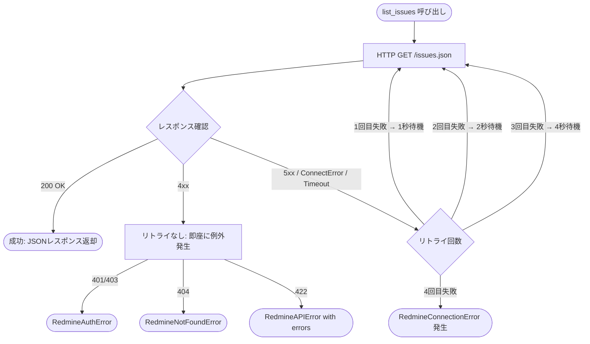

# DSD-005_FEAT-002 外部インターフェース詳細設計書（Redmineタスク検索・一覧表示）

| 項目 | 値 |
|---|---|
| ドキュメントID | DSD-005_FEAT-002 |
| バージョン | 1.0 |
| 作成日 | 2026-03-03 |
| 機能ID | FEAT-002 |
| 機能名 | Redmineタスク検索・一覧表示（redmine-task-search） |
| 入力元 | BSD-007, DSD-001_FEAT-002, DSD-003_FEAT-002 |
| ステータス | 初版 |

---

## 目次

1. 概要
2. 外部インターフェース一覧
3. Redmine REST API: GET /issues.json 詳細仕様
4. クエリパラメータ詳細
5. レスポンス仕様
6. エラーレスポンス仕様
7. ACL（Anti-Corruption Layer）設計
8. RedmineAdapter.list_issues 実装設計
9. タイムアウト・リトライ設計
10. ページネーション設計
11. 後続フェーズへの影響

---

## 1. 概要

FEAT-002（タスク検索・一覧表示）が使用する外部インターフェースの詳細仕様を定義する。

FEAT-002 は FEAT-001（タスク作成）と同じ Redmine REST API を使用するが、呼び出すエンドポイントが異なる。

| FEAT | 使用するエンドポイント | HTTPメソッド |
|---|---|---|
| FEAT-001 | `POST /issues.json` | タスク作成 |
| FEAT-002 | `GET /issues.json` | タスク一覧取得（本設計書の対象） |

### 1.1 外部システム接続情報

| 項目 | 値 |
|---|---|
| 外部システム名 | Redmine |
| 接続方式 | HTTP REST API |
| ベース URL | `${REDMINE_URL}` (デフォルト: `http://localhost:8080`) |
| 認証方式 | API キー（`X-Redmine-API-Key` ヘッダ） |
| API キー取得元 | 環境変数 `REDMINE_API_KEY` |
| API バージョン | Redmine REST API v1 |
| レスポンス形式 | JSON |

---

## 2. 外部インターフェース一覧

| IF-ID | メソッド | パス | 説明 |
|---|---|---|---|
| EXT-002-001 | GET | `/issues.json` | Redmine チケット一覧取得 |

> FEAT-001 で定義した EXT-001-001（POST /issues.json）は FEAT-002 では使用しない。

---

## 3. Redmine REST API: GET /issues.json 詳細仕様

### 3.1 エンドポイント情報

| 項目 | 値 |
|---|---|
| IF-ID | EXT-002-001 |
| メソッド | GET |
| URL | `{REDMINE_URL}/issues.json` |
| 認証ヘッダ | `X-Redmine-API-Key: {REDMINE_API_KEY}` |
| Content-Type | なし（GETリクエスト） |
| Accept | `application/json` |
| タイムアウト（接続） | 10 秒 |
| タイムアウト（読み込み） | 30 秒 |
| リトライ回数 | 最大 3 回（指数バックオフ） |

### 3.2 リクエスト例

```http
GET /issues.json?status_id=open&due_date=2026-03-03&limit=25&offset=0 HTTP/1.1
Host: localhost:8080
X-Redmine-API-Key: your_api_key_here
Accept: application/json
```

```http
GET /issues.json?subject=%E8%A8%AD%E8%A8%88%E6%9B%B8&status_id=open&limit=25 HTTP/1.1
Host: localhost:8080
X-Redmine-API-Key: your_api_key_here
Accept: application/json
```

```http
GET /issues.json?project_id=1&status_id=*&limit=100 HTTP/1.1
Host: localhost:8080
X-Redmine-API-Key: your_api_key_here
Accept: application/json
```

---

## 4. クエリパラメータ詳細

### 4.1 パラメータ一覧

| パラメータ名 | 型 | 必須 | 説明 | 設定値例 |
|---|---|---|---|---|
| `status_id` | string \| integer | 任意 | ステータスフィルタ | `open` / `closed` / `*` / 整数 |
| `project_id` | integer | 任意 | プロジェクト ID でフィルタ | `1` |
| `due_date` | string | 任意 | 期日でフィルタ（完全一致） | `2026-03-03` |
| `subject` | string | 任意 | タイトルの部分一致検索 | `設計書` |
| `assigned_to_id` | integer | 任意 | 担当者 ID でフィルタ | `1` |
| `priority_id` | integer | 任意 | 優先度 ID でフィルタ | `3`（高） |
| `limit` | integer | 任意 | 取得件数上限（デフォルト: 25、最大: 100） | `25` |
| `offset` | integer | 任意 | 取得開始位置（デフォルト: 0） | `0` |
| `sort` | string | 任意 | ソート順（例: `priority:desc`） | `priority:desc,due_date:asc` |

### 4.2 status_id パラメータの値

| パラメータ値 | 意味 | 対応する内部 status 値 |
|---|---|---|
| `open` | 未完了のチケット（Redmine のオープンステータスすべて） | `"open"` |
| `closed` | 完了したチケット（クローズステータスすべて） | `"closed"` |
| `*` | 全ステータスのチケット | `"all"` |
| 整数（例: `1`） | 特定のステータス ID（Redmine 設定による） | 未使用（Phase 1） |

> Phase 1 では `open` / `closed` / `*` の 3 種類のみ対応する。
> 整数 ID による特定ステータス指定は Phase 2 以降の対応とする。

### 4.3 due_date パラメータの注意事項

Redmine の `due_date` パラメータは **完全一致フィルタ** である。指定した日付と期日が完全に一致するチケットのみ返す。

```
# OK: 2026-03-03 が期日のチケットを取得
GET /issues.json?due_date=2026-03-03

# 注意: 範囲指定（Redmine Community Edition では未対応）
# 例えば「今週のタスク」を検索する場合は複数リクエストか全件取得後フィルタが必要
```

| 検索条件 | Redmine パラメータ | 備考 |
|---|---|---|
| 特定日（例: 今日） | `due_date=2026-03-03` | Phase 1 対応 |
| 期日範囲 | 未対応 | Phase 2 以降 |
| 期日なし | パラメータなし（全件取得） | Phase 1 対応 |

### 4.4 subject パラメータ（キーワード検索）

Redmine の `subject` パラメータはチケットのタイトル（subject）で**部分一致**検索を行う。

```
# タイトルに「設計書」を含むチケットを検索
GET /issues.json?subject=設計書

# URL エンコードが必要（日本語）
GET /issues.json?subject=%E8%A8%AD%E8%A8%88%E6%9B%B8
```

> httpx の `params` 引数を使用すると自動的に URL エンコードされる。

---

## 5. レスポンス仕様

### 5.1 成功レスポンス（200 OK）

```json
HTTP/1.1 200 OK
Content-Type: application/json; charset=utf-8

{
  "issues": [
    {
      "id": 123,
      "project": {
        "id": 1,
        "name": "パーソナルエージェント開発"
      },
      "tracker": {
        "id": 1,
        "name": "バグ"
      },
      "status": {
        "id": 1,
        "name": "新規"
      },
      "priority": {
        "id": 3,
        "name": "高"
      },
      "author": {
        "id": 1,
        "name": "Redmine Admin"
      },
      "assigned_to": {
        "id": 1,
        "name": "Redmine Admin"
      },
      "subject": "設計書レビュー",
      "description": "DSD-001〜DSD-008 のレビューを実施する",
      "start_date": "2026-03-01",
      "due_date": "2026-03-03",
      "done_ratio": 0,
      "is_private": false,
      "estimated_hours": null,
      "created_on": "2026-02-20T09:00:00Z",
      "updated_on": "2026-03-01T14:30:00Z",
      "closed_on": null
    },
    {
      "id": 124,
      "project": {
        "id": 1,
        "name": "パーソナルエージェント開発"
      },
      "tracker": {
        "id": 2,
        "name": "機能"
      },
      "status": {
        "id": 2,
        "name": "進行中"
      },
      "priority": {
        "id": 2,
        "name": "通常"
      },
      "author": {
        "id": 1,
        "name": "Redmine Admin"
      },
      "assigned_to": null,
      "subject": "API テスト実施",
      "description": null,
      "start_date": null,
      "due_date": "2026-03-03",
      "done_ratio": 30,
      "is_private": false,
      "estimated_hours": 4.0,
      "created_on": "2026-02-22T10:00:00Z",
      "updated_on": "2026-03-02T09:00:00Z",
      "closed_on": null
    }
  ],
  "total_count": 3,
  "offset": 0,
  "limit": 25
}
```

### 5.2 レスポンスフィールド定義

#### ルートレベル

| フィールド | 型 | 説明 |
|---|---|---|
| `issues` | array | チケットオブジェクトの配列 |
| `total_count` | integer | 全条件に一致する件数（ページネーション用） |
| `offset` | integer | 取得開始位置 |
| `limit` | integer | リクエストで指定した件数上限 |

#### issues[n] フィールド

| フィールド | 型 | 必須 | 説明 |
|---|---|---|---|
| `id` | integer | 必須 | チケット ID（数値） |
| `project.id` | integer | 必須 | プロジェクト ID |
| `project.name` | string | 必須 | プロジェクト名 |
| `tracker.id` | integer | 必須 | トラッカー ID |
| `tracker.name` | string | 必須 | トラッカー名 |
| `status.id` | integer | 必須 | ステータス ID |
| `status.name` | string | 必須 | ステータス名（日本語表示） |
| `priority.id` | integer | 必須 | 優先度 ID（1: 低、2: 通常、3: 高、4: 緊急） |
| `priority.name` | string | 必須 | 優先度名（日本語表示） |
| `author.id` | integer | 必須 | 作成者 ID |
| `author.name` | string | 必須 | 作成者名 |
| `assigned_to` | object \| null | 任意 | 担当者（未割り当ての場合 null） |
| `subject` | string | 必須 | チケットタイトル |
| `description` | string \| null | 任意 | チケット説明（空の場合 null または空文字） |
| `start_date` | string \| null | 任意 | 開始日（YYYY-MM-DD 形式） |
| `due_date` | string \| null | 任意 | 期日（YYYY-MM-DD 形式） |
| `done_ratio` | integer | 必須 | 進捗率（0〜100） |
| `is_private` | boolean | 必須 | プライベートチケットフラグ |
| `estimated_hours` | number \| null | 任意 | 予定工数（時間） |
| `created_on` | string | 必須 | 作成日時（ISO 8601 UTC） |
| `updated_on` | string | 必須 | 更新日時（ISO 8601 UTC） |
| `closed_on` | string \| null | 任意 | クローズ日時（未クローズの場合 null） |

### 5.3 検索結果 0 件のレスポンス

```json
HTTP/1.1 200 OK
Content-Type: application/json; charset=utf-8

{
  "issues": [],
  "total_count": 0,
  "offset": 0,
  "limit": 25
}
```

---

## 6. エラーレスポンス仕様

### 6.1 エラーレスポンス一覧

| HTTP ステータス | 発生条件 | Redmine のレスポンスボディ |
|---|---|---|
| 401 Unauthorized | API キーが無効または未設定 | ボディなし |
| 403 Forbidden | API キーに権限がない | ボディなし |
| 404 Not Found | 存在しないプロジェクト ID を指定 | ボディなし |
| 422 Unprocessable Entity | パラメータの形式が不正 | `{"errors": ["..."]}` |
| 500 Internal Server Error | Redmine サーバー内部エラー | HTML またはボディなし |
| 503 Service Unavailable | Redmine サーバーが利用不可 | ボディなし |
| （接続失敗） | Docker コンテナが停止中 | httpx.ConnectError |
| （タイムアウト） | 接続・読み込みタイムアウト | httpx.TimeoutException |

### 6.2 エラーレスポンス例

```http
HTTP/1.1 401 Unauthorized
```

```http
HTTP/1.1 404 Not Found
```

```http
HTTP/1.1 422 Unprocessable Entity
Content-Type: application/json

{"errors": ["Status is not included in the list"]}
```

---

## 7. ACL（Anti-Corruption Layer）設計

### 7.1 Redmine モデル → 内部モデル変換

`RedmineAdapter.list_issues()` が返す生の Redmine API レスポンスを、内部ドメインモデルの形式に変換する。

| Redmine フィールド | Redmine 型 | 内部フィールド | 内部型 | 変換ルール |
|---|---|---|---|---|
| `id` | integer | `id` | string | `str(issue["id"])` |
| `subject` | string | `title` | string | そのまま |
| `description` | string \| null | `description` | string \| None | 空文字 → None |
| `status.name` | string | `status` | string | そのまま（日本語） |
| `priority.id` | integer | `priority` | string | `{1:"low", 2:"normal", 3:"high", 4:"urgent"}` |
| `due_date` | string \| null | `due_date` | string \| None | そのまま（YYYY-MM-DD） |
| `project.id` | integer | `project_id` | integer | そのまま |
| `project.name` | string | `project_name` | string | そのまま |
| `id`（整数） | integer | `url` | string | `f"{REDMINE_URL}/issues/{id}"` |
| `created_on` | string (UTC) | `created_at` | string | そのまま（ISO 8601） |
| `updated_on` | string (UTC) | `updated_at` | string | そのまま（ISO 8601） |

### 7.2 ステータスマッピング（内部 → Redmine）

```python
# TaskSearchService._build_redmine_params() 内
STATUS_MAP: dict[str, str] = {
    "open":   "open",    # Redmine のオープンフィルタ（新規・進行中等）
    "closed": "closed",  # Redmine のクローズフィルタ（完了・却下等）
    "all":    "*",       # Redmine の全ステータスフィルタ
}
```

### 7.3 優先度マッピング（Redmine → 内部）

```python
# TaskSearchService._format_task() 内
PRIORITY_ID_TO_NAME: dict[int, str] = {
    1: "low",     # Redmine: 低
    2: "normal",  # Redmine: 通常
    3: "high",    # Redmine: 高
    4: "urgent",  # Redmine: 急いで（緊急）
}
```

> Redmine のデフォルト優先度設定に基づく。カスタム設定の場合は別途対応が必要。

### 7.4 変換コード（full implementation）

```python
# app/application/task/task_search_service.py
def _format_task(self, issue: dict) -> dict:
    """Redmine API の Issue レスポンスを内部形式に変換する（ACL）。

    ドメイン層が Redmine の詳細（数値 ID、日本語ステータス名等）に
    依存しないよう、この変換層で吸収する。
    """
    settings = get_settings()
    issue_id = str(issue["id"])

    # 優先度 ID → 内部優先度名に変換
    priority_id = issue.get("priority", {}).get("id", 2)
    priority_name = PRIORITY_ID_TO_NAME.get(priority_id, "normal")

    # description の空文字 → None 変換
    description = issue.get("description")
    if description == "" or description is None:
        description = None

    return {
        "id": issue_id,
        "title": issue.get("subject", ""),
        "description": description,
        "status": issue.get("status", {}).get("name", ""),
        "priority": priority_name,
        "due_date": issue.get("due_date"),     # YYYY-MM-DD or None
        "project_id": issue.get("project", {}).get("id"),
        "project_name": issue.get("project", {}).get("name", ""),
        "url": f"{settings.redmine_url}/issues/{issue_id}",
        "created_at": issue.get("created_on", ""),
        "updated_at": issue.get("updated_on", ""),
    }
```

---

## 8. RedmineAdapter.list_issues 実装設計

### 8.1 クラス全体設計

```python
# app/infra/redmine/redmine_adapter.py（list_issues メソッドの完全実装）
from __future__ import annotations

import httpx
import structlog
from app.domain.exceptions import (
    RedmineConnectionError,
    RedmineAuthError,
    RedmineNotFoundError,
    RedmineAPIError,
)

logger = structlog.get_logger(__name__)

# リトライ時の待機時間（秒）: 1回目→1秒、2回目→2秒、3回目→4秒
RETRY_DELAYS: list[float] = [1.0, 2.0, 4.0]


class RedmineAdapter:
    """Redmine REST API クライアント。

    FEAT-001 の create_issue と FEAT-002 の list_issues を提供する。
    """

    def __init__(self, base_url: str, api_key: str) -> None:
        self._base_url = base_url.rstrip("/")
        self._api_key = api_key  # ログに出力しない
        self._timeout = httpx.Timeout(
            connect=10.0,   # 接続タイムアウト
            read=30.0,      # 読み込みタイムアウト
            write=10.0,     # 書き込みタイムアウト
            pool=5.0,       # 接続プールタイムアウト
        )

    async def list_issues(
        self,
        project_id: int | None = None,
        status_id: str | int = "open",
        due_date: str | None = None,
        subject_like: str | None = None,
        assigned_to_id: int | None = None,
        limit: int = 25,
        offset: int = 0,
        sort: str | None = None,
    ) -> dict:
        """Redmine のチケット一覧を取得する。

        Args:
            project_id: プロジェクト ID（None = 全プロジェクト）。
            status_id: ステータスフィルタ
                       ("open" / "closed" / "*" / 整数 ID)。
            due_date: 期日フィルタ（YYYY-MM-DD 形式、完全一致）。
            subject_like: タイトルの部分一致検索文字列。
            assigned_to_id: 担当者 ID フィルタ。
            limit: 取得件数上限（最大 100）。
            offset: 取得開始位置（ページネーション用）。
            sort: ソート指定（例: "priority:desc,due_date:asc"）。

        Returns:
            {
                "issues": [...],
                "total_count": N,
                "offset": N,
                "limit": N
            }

        Raises:
            RedmineConnectionError: 接続タイムアウト、接続失敗。
            RedmineAuthError: API キー不正（401/403）。
            RedmineNotFoundError: プロジェクトが存在しない（404）。
            RedmineAPIError: その他の Redmine API エラー。
        """
        url = f"{self._base_url}/issues.json"

        # クエリパラメータ構築
        params: dict = {
            "status_id": status_id,
            "limit": min(limit, 100),
            "offset": offset,
        }
        if project_id is not None:
            params["project_id"] = project_id
        if due_date is not None:
            params["due_date"] = due_date
        if subject_like is not None:
            params["subject"] = subject_like  # Redmine は "subject" パラメータで部分一致
        if assigned_to_id is not None:
            params["assigned_to_id"] = assigned_to_id
        if sort is not None:
            params["sort"] = sort

        logger.info(
            "redmine_list_issues_started",
            project_id=project_id,
            status_id=status_id,
            due_date=due_date,
            limit=limit,
            offset=offset,
            # subject_like はキーワードを含む可能性があるため30文字に切り詰め
            subject_like=subject_like[:30] if subject_like else None,
        )

        response = await self._retry_request(
            method="GET",
            url=url,
            params=params,
        )

        self._handle_error_response(response)
        result = response.json()

        logger.info(
            "redmine_list_issues_succeeded",
            total_count=result.get("total_count", 0),
            returned_count=len(result.get("issues", [])),
        )

        return result

    async def _retry_request(
        self,
        method: str,
        url: str,
        params: dict | None = None,
        json: dict | None = None,
    ) -> httpx.Response:
        """指数バックオフでリトライする HTTP リクエスト送信。

        接続エラー・タイムアウトの場合は最大 3 回リトライする。
        4xx エラー（クライアントエラー）はリトライしない。
        """
        import asyncio

        last_error: Exception | None = None

        for attempt, delay in enumerate(RETRY_DELAYS, start=1):
            try:
                async with httpx.AsyncClient(timeout=self._timeout) as client:
                    response = await client.request(
                        method=method,
                        url=url,
                        params=params,
                        json=json,
                        headers=self._get_headers(),
                    )

                # 4xx はリトライしない（クライアントエラー）
                if 400 <= response.status_code < 500:
                    return response

                # 5xx はリトライ対象
                if response.status_code >= 500:
                    logger.warning(
                        "redmine_server_error_retry",
                        attempt=attempt,
                        status_code=response.status_code,
                        next_delay=delay if attempt < len(RETRY_DELAYS) else None,
                    )
                    last_error = Exception(
                        f"Redmine server error: {response.status_code}"
                    )
                    if attempt < len(RETRY_DELAYS):
                        await asyncio.sleep(delay)
                    continue

                return response

            except httpx.ConnectError as e:
                logger.warning(
                    "redmine_connect_error_retry",
                    attempt=attempt,
                    error=str(e),
                )
                last_error = e
                if attempt < len(RETRY_DELAYS):
                    await asyncio.sleep(delay)

            except httpx.TimeoutException as e:
                logger.warning(
                    "redmine_timeout_retry",
                    attempt=attempt,
                    error=str(e),
                )
                last_error = e
                if attempt < len(RETRY_DELAYS):
                    await asyncio.sleep(delay)

        raise RedmineConnectionError(
            f"Redmine への接続に失敗しました（{len(RETRY_DELAYS)} 回リトライ後）: {last_error}"
        ) from last_error

    def _handle_error_response(self, response: httpx.Response) -> None:
        """Redmine のエラーレスポンスを内部例外に変換する。"""
        if response.status_code == 200:
            return

        if response.status_code in (401, 403):
            raise RedmineAuthError(
                f"Redmine 認証エラー: ステータスコード {response.status_code}。"
                "REDMINE_API_KEY の設定を確認してください。"
            )

        if response.status_code == 404:
            raise RedmineNotFoundError(
                "指定した Redmine リソースが見つかりません（404）。"
                "project_id が正しいか確認してください。"
            )

        if response.status_code == 422:
            errors = response.json().get("errors", [])
            error_msg = ", ".join(errors) if errors else "不明なエラー"
            raise RedmineAPIError(
                f"Redmine バリデーションエラー（422）: {error_msg}"
            )

        raise RedmineAPIError(
            f"Redmine API エラー: ステータスコード {response.status_code}"
        )

    def _get_headers(self) -> dict:
        """リクエストヘッダを返す。API キーはログに記録しない。"""
        return {
            "X-Redmine-API-Key": self._api_key,
            "Accept": "application/json",
            "Content-Type": "application/json",
        }
```

---

## 9. タイムアウト・リトライ設計

### 9.1 タイムアウト設定

```python
self._timeout = httpx.Timeout(
    connect=10.0,   # TCP 接続確立まで 10 秒
    read=30.0,      # レスポンスの受信まで 30 秒（大量件数取得を考慮）
    write=10.0,     # リクエスト送信まで 10 秒
    pool=5.0,       # 接続プールからの取得まで 5 秒
)
```

> GET /issues.json は件数が多い場合にレスポンスが大きくなるため、
> read タイムアウトは POST /issues.json と同じ 30 秒に設定する。

### 9.2 リトライ方針



### 9.3 リトライ対象・非対象

| エラー種別 | リトライ | 例外クラス |
|---|---|---|
| `httpx.ConnectError`（接続拒否） | 最大 3 回 | `RedmineConnectionError` |
| `httpx.TimeoutException`（タイムアウト） | 最大 3 回 | `RedmineConnectionError` |
| HTTP 5xx（サーバーエラー） | 最大 3 回 | `RedmineConnectionError` |
| HTTP 401 / 403（認証エラー） | リトライなし | `RedmineAuthError` |
| HTTP 404（リソース不在） | リトライなし | `RedmineNotFoundError` |
| HTTP 422（バリデーションエラー） | リトライなし | `RedmineAPIError` |
| HTTP 400（不正リクエスト） | リトライなし | `RedmineAPIError` |

---

## 10. ページネーション設計

### 10.1 Redmine のページネーション仕組み

Redmine REST API はオフセット方式のページネーションを採用する。

```
# 1 ページ目（offset=0, limit=25）
GET /issues.json?status_id=open&limit=25&offset=0

レスポンス:
{
  "issues": [...],  // 25 件
  "total_count": 73,
  "offset": 0,
  "limit": 25
}

# 2 ページ目（offset=25, limit=25）
GET /issues.json?status_id=open&limit=25&offset=25

# 3 ページ目（offset=50, limit=25）
GET /issues.json?status_id=open&limit=25&offset=50
```

### 10.2 内部の offset 計算

`TaskSearchService` は `page` / `per_page` の形式で受け取り、`offset` に変換して `RedmineAdapter.list_issues()` を呼び出す。

```python
# app/application/task/task_search_service.py
async def search_tasks_paginated(
    self,
    status: str | None = None,
    due_date: str | None = None,
    keyword: str | None = None,
    project_id: int | None = None,
    page: int = 1,
    per_page: int = 25,
) -> dict:
    """ページネーション対応のタスク検索。

    Returns:
        {
            "tasks": [...],
            "total_count": N,
            "page": N,
            "per_page": N,
            "total_pages": N,
        }
    """
    offset = (page - 1) * per_page

    params = self._build_redmine_params(
        status=status,
        due_date=due_date,
        keyword=keyword,
        project_id=project_id,
        limit=per_page,
    )
    params["offset"] = offset

    response = await self._redmine_adapter.list_issues(**params)

    issues = response.get("issues", [])
    total_count = response.get("total_count", len(issues))
    total_pages = max(1, (total_count + per_page - 1) // per_page)

    return {
        "tasks": [self._format_task(issue) for issue in issues],
        "total_count": total_count,
        "page": page,
        "per_page": per_page,
        "total_pages": total_pages,
    }
```

### 10.3 エージェント経由の検索（FEAT-002 チャットフロー）

エージェント（`search_tasks_tool`）経由の場合は通常 1 リクエストで取得し、ページネーションは行わない。`limit` パラメータで最大 100 件に制限する。

```python
# エージェント呼び出し時
tasks = await service.search_tasks(
    status=status or None,
    due_date=due_date or None,
    keyword=keyword or None,
    project_id=project_id if project_id > 0 else None,
    limit=min(limit, 100),  # 最大 100 件
)
```

---

## 11. 後続フェーズへの影響

| 影響先 | 内容 |
|---|---|
| DSD-008_FEAT-002 | `RedmineAdapter.list_issues` の単体テスト設計（pytest-httpx でモック） |
| IMP-001_FEAT-002 | バックエンド実装: `RedmineAdapter.list_issues` 実装・TDD 実装報告 |
| IT-001_FEAT-002 | 結合テスト: Redmine Docker コンテナとの実動作確認（GET /issues.json） |
| IT-002 | API 結合テスト: GET /issues.json の全パラメータ組み合わせテスト |
