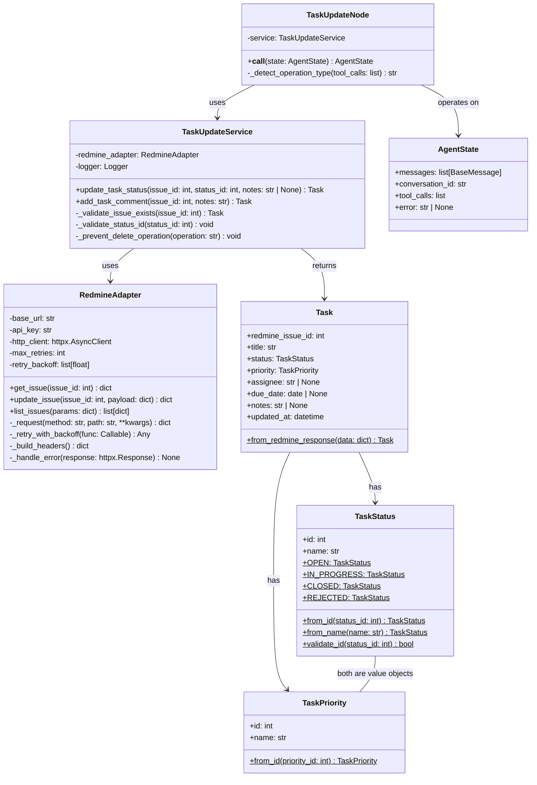
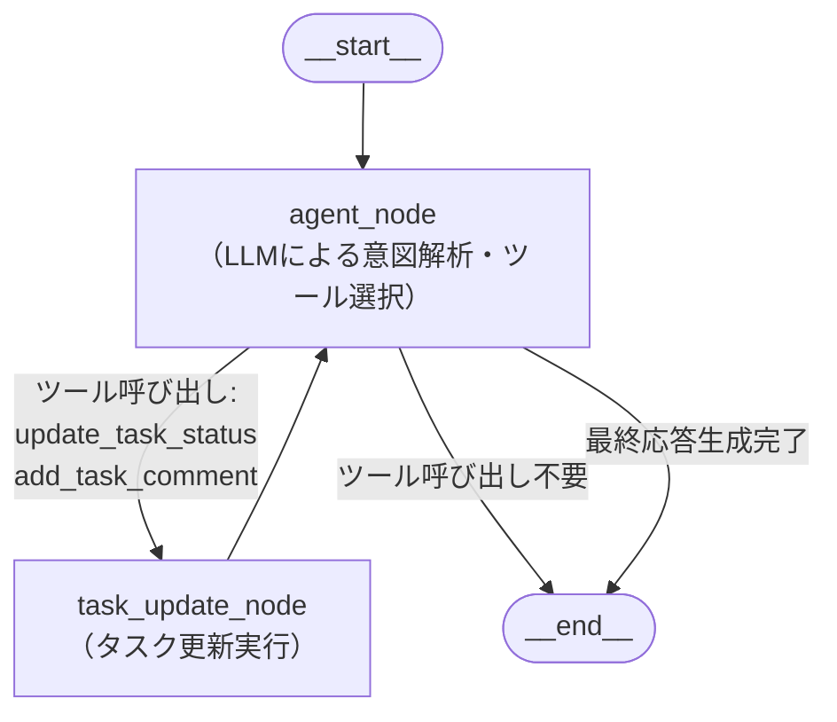
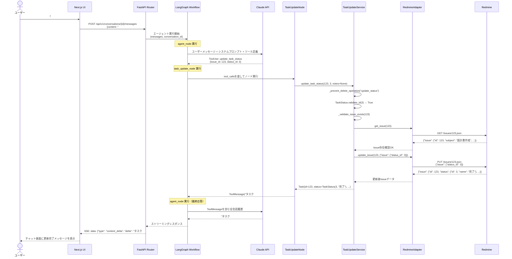
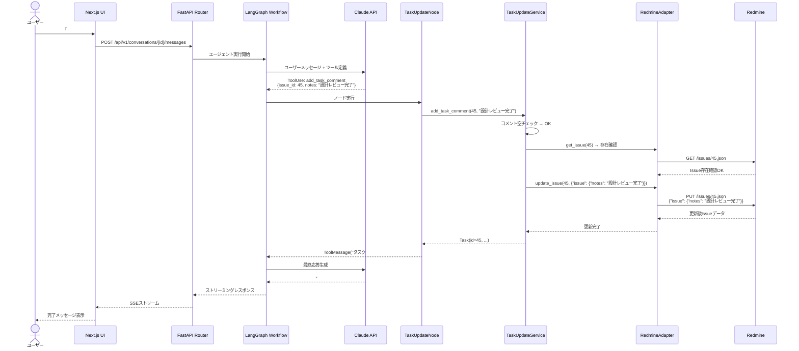
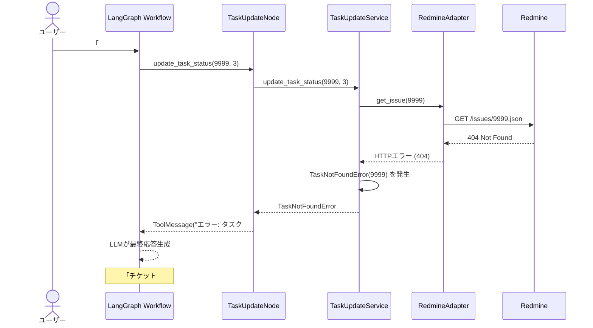

# DSD-001_FEAT-003 バックエンド機能詳細設計書（Redmineタスク更新・進捗報告）

| 項目 | 値 |
|---|---|
| ドキュメントID | DSD-001_FEAT-003 |
| バージョン | 1.0 |
| 作成日 | 2026-03-03 |
| 機能ID | FEAT-003 |
| 機能名 | Redmineタスク更新・進捗報告 |
| 入力元 | BSD-001, BSD-002, BSD-004, BSD-009, REQ-005 |
| ステータス | 初版 |

---

## 目次

1. 機能概要
2. レイヤード構成・モジュール配置
3. クラス図
4. ドメインモデル詳細
5. LangGraphノード設計
6. ツール関数仕様
7. タスク識別ロジック
8. ビジネスルール実装
9. シーケンス図
10. エラーハンドリング方針
11. ログ設計
12. 後続フェーズへの影響

---

## 1. 機能概要

### 1.1 対象ユースケース

| UC-ID | ユースケース名 | 概要 |
|---|---|---|
| UC-003 | タスクのステータスを更新する | 「#123を完了にして」などの自然言語指示でRedmineチケットのステータスを変更する |
| UC-004 | タスクに進捗コメントを追加する | 「#45に進捗コメントを追加して」などの指示でRedmineチケットにコメントを追加する |

### 1.2 処理方式

- エントリポイント: POST `/api/v1/conversations/{id}/messages`（チャットメッセージ送信）
- エージェント実行: LangGraphワークフローが自然言語を解析し、`update_task_status` または `add_task_comment` ツールを選択・実行する
- Redmine連携: MCPクライアント経由でRedmine REST API `PUT /issues/{id}.json` を呼び出す
- レスポンス: Server-Sent Events（SSE）でストリーミング返却

### 1.3 ビジネスルール適用

| ルールID | 内容 | 実装箇所 |
|---|---|---|
| BR-02 | タスク削除禁止（エージェント経由） | ツール定義でdelete_issueを除外。システムプロンプトで明示的に禁止する |
| BR-01 | 存在しないプロジェクトへの操作禁止 | update_task_status実行前にissue_id検証を実施する |

---

## 2. レイヤード構成・モジュール配置

### 2.1 パッケージ構成

```
backend/
├── app/
│   ├── presentation/              # プレゼンテーション層
│   │   ├── routers/
│   │   │   ├── conversations.py   # POST /conversations/{id}/messages
│   │   │   └── tasks.py           # PUT /api/v1/tasks/{id}
│   │   └── schemas/
│   │       └── task_update.py     # リクエスト/レスポンスのPydanticモデル
│   ├── application/               # アプリケーション層
│   │   ├── agent/
│   │   │   ├── workflow.py        # LangGraphワークフロー定義
│   │   │   ├── nodes/
│   │   │   │   └── task_update_node.py  # タスク更新ノード
│   │   │   └── tools/
│   │   │       └── task_update_tools.py # update_task_status / add_task_comment
│   │   └── services/
│   │       └── task_update_service.py   # TaskUpdateService（ユースケース調整）
│   ├── domain/                    # ドメイン層
│   │   ├── task/
│   │   │   ├── entities.py        # Task エンティティ
│   │   │   └── value_objects.py   # TaskStatus, TaskPriority 値オブジェクト
│   │   └── exceptions.py          # ドメイン例外定義
│   └── infrastructure/            # インフラストラクチャ層
│       ├── redmine/
│       │   └── redmine_adapter.py # RedmineAdapter（MCP経由Redmine連携）
│       └── claude/
│           └── claude_client.py   # Claude APIクライアント
```

### 2.2 依存方向

```
プレゼンテーション層 → アプリケーション層 → ドメイン層
インフラストラクチャ層 → ドメイン層（インターフェース実装）
```

---

## 3. クラス図



---

## 4. ドメインモデル詳細

### 4.1 Task エンティティ

**概要**: Redmine Issue の写像。タスク更新操作の主体となるエンティティ。

```python
from dataclasses import dataclass
from datetime import date, datetime
from typing import Optional

@dataclass
class Task:
    """Redmine Issue に対応するタスクエンティティ。"""
    redmine_issue_id: int          # Redmine Issue ID（整数）
    title: str                     # タスクタイトル（subject）
    status: "TaskStatus"           # ステータス値オブジェクト
    priority: "TaskPriority"       # 優先度値オブジェクト
    assignee: Optional[str]        # 担当者名
    due_date: Optional[date]       # 期日
    notes: Optional[str]           # 更新時のコメント（notes）
    updated_at: datetime           # 最終更新日時

    @classmethod
    def from_redmine_response(cls, data: dict) -> "Task":
        """Redmine APIレスポンスのIssueオブジェクトからTaskを生成する。"""
        issue = data.get("issue", data)
        return cls(
            redmine_issue_id=issue["id"],
            title=issue["subject"],
            status=TaskStatus.from_id(issue["status"]["id"]),
            priority=TaskPriority.from_id(issue["priority"]["id"]),
            assignee=issue.get("assigned_to", {}).get("name"),
            due_date=date.fromisoformat(issue["due_date"]) if issue.get("due_date") else None,
            notes=None,
            updated_at=datetime.fromisoformat(issue["updated_on"].replace("Z", "+00:00")),
        )
```

### 4.2 TaskStatus 値オブジェクト

**概要**: Redmineのステータス定義に対応する値オブジェクト。不変。

```python
from dataclasses import dataclass

@dataclass(frozen=True)
class TaskStatus:
    """タスクのステータスを表す値オブジェクト。"""
    id: int
    name: str

    # Redmineデフォルトステータス定数
    OPEN: "TaskStatus"           # id=1 未着手
    IN_PROGRESS: "TaskStatus"    # id=2 進行中
    CLOSED: "TaskStatus"         # id=3 完了
    REJECTED: "TaskStatus"       # id=5 却下

    # 有効なステータスIDのセット（Redmineデフォルト設定）
    VALID_STATUS_IDS = {1, 2, 3, 5}

    @classmethod
    def from_id(cls, status_id: int) -> "TaskStatus":
        """ステータスIDからTaskStatusを生成する。"""
        mapping = {
            1: cls(id=1, name="未着手"),
            2: cls(id=2, name="進行中"),
            3: cls(id=3, name="完了"),
            5: cls(id=5, name="却下"),
        }
        if status_id not in mapping:
            raise ValueError(f"無効なステータスID: {status_id}。有効値: {list(mapping.keys())}")
        return mapping[status_id]

    @classmethod
    def validate_id(cls, status_id: int) -> bool:
        """ステータスIDが有効範囲内かを検証する。"""
        return status_id in cls.VALID_STATUS_IDS
```

### 4.3 TaskPriority 値オブジェクト

```python
@dataclass(frozen=True)
class TaskPriority:
    """タスクの優先度を表す値オブジェクト。"""
    id: int
    name: str

    VALID_PRIORITY_IDS = {1, 2, 3, 4, 5}

    @classmethod
    def from_id(cls, priority_id: int) -> "TaskPriority":
        mapping = {
            1: cls(id=1, name="低"),
            2: cls(id=2, name="通常"),
            3: cls(id=3, name="高"),
            4: cls(id=4, name="緊急"),
            5: cls(id=5, name="即座に"),
        }
        if priority_id not in mapping:
            raise ValueError(f"無効な優先度ID: {priority_id}")
        return mapping[priority_id]
```

### 4.4 ドメイン例外

```python
class TaskNotFoundError(Exception):
    """指定されたIssue IDのタスクが存在しない場合に発生する。"""
    def __init__(self, issue_id: int):
        self.issue_id = issue_id
        super().__init__(f"タスク #{issue_id} は存在しません")

class TaskDeleteOperationForbiddenError(Exception):
    """エージェント経由のタスク削除試行時に発生する（BR-02）。"""
    def __init__(self):
        super().__init__("エージェント経由のタスク削除操作は禁止されています（BR-02）。削除はRedmine Web UIから行ってください。")

class InvalidStatusIdError(ValueError):
    """無効なステータスIDが指定された場合に発生する。"""
    def __init__(self, status_id: int, valid_ids: set):
        self.status_id = status_id
        super().__init__(f"無効なステータスID: {status_id}。有効値: {sorted(valid_ids)}")

class RedmineConnectionError(Exception):
    """Redmineへの接続失敗時（リトライ上限到達後）に発生する。"""
    pass
```

---

## 5. LangGraphノード設計

### 5.1 エージェントワークフロー概要

FEAT-003に関連するLangGraphのノードは `task_update_node` として実装する。エージェントのメインワークフロー（`agent_node`）がLLMのツール呼び出し判断後、`task_update_node` が実際のRedmine操作を実行する。



### 5.2 AgentState 定義

```python
from typing import Annotated, Sequence
from langchain_core.messages import BaseMessage
from langgraph.graph.message import add_messages
from pydantic import BaseModel

class AgentState(BaseModel):
    """LangGraphエージェントの状態定義。"""
    messages: Annotated[Sequence[BaseMessage], add_messages]
    conversation_id: str
    error: str | None = None
```

### 5.3 task_update_node 実装仕様

```python
from langchain_core.messages import ToolMessage
from app.application.services.task_update_service import TaskUpdateService
from app.domain.exceptions import (
    TaskNotFoundError,
    TaskDeleteOperationForbiddenError,
    InvalidStatusIdError,
)

class TaskUpdateNode:
    """タスク更新ノード。LangGraphワークフロー内でRedmineタスクの更新を実行する。"""

    def __init__(self, service: TaskUpdateService):
        self.service = service

    async def __call__(self, state: AgentState) -> dict:
        """
        ノード実行メソッド。
        stateのmessagesの最後のAIMessageからtool_callsを取り出し、
        対応するサービスメソッドを呼び出す。
        """
        last_message = state.messages[-1]
        tool_messages = []

        for tool_call in last_message.tool_calls:
            tool_name = tool_call["name"]
            tool_args = tool_call["args"]
            tool_call_id = tool_call["id"]

            try:
                if tool_name == "update_task_status":
                    result = await self.service.update_task_status(
                        issue_id=tool_args["issue_id"],
                        status_id=tool_args["status_id"],
                        notes=tool_args.get("notes"),
                    )
                    content = (
                        f"タスク #{result.redmine_issue_id}「{result.title}」の"
                        f"ステータスを「{result.status.name}」に更新しました。"
                    )
                elif tool_name == "add_task_comment":
                    result = await self.service.add_task_comment(
                        issue_id=tool_args["issue_id"],
                        notes=tool_args["notes"],
                    )
                    content = (
                        f"タスク #{result.redmine_issue_id}「{result.title}」に"
                        f"コメントを追加しました。"
                    )
                else:
                    content = f"未知のツール: {tool_name}"

            except TaskNotFoundError as e:
                content = f"エラー: {str(e)}"
            except TaskDeleteOperationForbiddenError as e:
                content = f"エラー: {str(e)}"
            except InvalidStatusIdError as e:
                content = f"エラー: {str(e)}"
            except Exception as e:
                content = f"Redmine操作中にエラーが発生しました: {str(e)}"

            tool_messages.append(
                ToolMessage(
                    content=content,
                    tool_call_id=tool_call_id,
                )
            )

        return {"messages": tool_messages}
```

---

## 6. ツール関数仕様

### 6.1 update_task_status ツール

**目的**: Redmineチケットのステータスを更新する。オプションでnotesにコメントも同時追加できる。

**ツール定義（LangChain形式）**:

```python
from langchain_core.tools import tool
from pydantic import BaseModel, Field

class UpdateTaskStatusInput(BaseModel):
    """update_task_statusツールの入力スキーマ。"""
    issue_id: int = Field(
        description="更新対象のRedmine Issue ID（チケット番号）。例: #123の場合は123。"
    )
    status_id: int = Field(
        description=(
            "新しいステータスのID。"
            "1=未着手, 2=進行中, 3=完了, 5=却下。"
            "「完了にして」→3、「進行中にして」→2、「未着手に戻して」→1。"
        )
    )
    notes: str | None = Field(
        default=None,
        description="ステータス変更時に追加するコメント（任意）。"
    )

@tool(args_schema=UpdateTaskStatusInput)
async def update_task_status(issue_id: int, status_id: int, notes: str | None = None) -> str:
    """
    Redmineのタスク（Issue）のステータスを更新する。

    ステータスIDの対応:
    - 1: 未着手（New）
    - 2: 進行中（In Progress）
    - 3: 完了（Closed）
    - 5: 却下（Rejected）

    注意: タスクの削除操作は実行してはならない（BR-02）。
    """
    # 実装はTaskUpdateServiceに委譲（ノード内でservice.update_task_statusを呼び出す）
    pass
```

**処理フロー**:
1. `issue_id` の存在確認（`RedmineAdapter.get_issue` でチケット取得）
2. `status_id` の値域チェック（有効値: 1, 2, 3, 5）
3. 削除操作の検出・拒否（BR-02: `status_id` に削除相当の値は存在しないが、delete系操作をブロック）
4. `RedmineAdapter.update_issue` でRedmine APIを呼び出す
5. 更新後のタスク情報を `Task.from_redmine_response` でドメインオブジェクトに変換して返す

**引数詳細**:

| 引数名 | 型 | 必須 | 説明 | 検証ルール |
|---|---|---|---|---|
| `issue_id` | int | 必須 | RedmineのIssue ID | 1以上の整数。存在するチケットであること |
| `status_id` | int | 必須 | 新しいステータスID | {1, 2, 3, 5} のいずれか |
| `notes` | str \| None | 任意 | ステータス変更コメント | 最大65535文字（Redmineのtext型制限） |

### 6.2 add_task_comment ツール

**目的**: Redmineチケットにコメント（Journal）を追加する。ステータスは変更しない。

**ツール定義（LangChain形式）**:

```python
class AddTaskCommentInput(BaseModel):
    """add_task_commentツールの入力スキーマ。"""
    issue_id: int = Field(
        description="コメントを追加するRedmine Issue ID（チケット番号）。"
    )
    notes: str = Field(
        description="追加するコメント内容。進捗状況、作業ログ、メモ等。"
    )

@tool(args_schema=AddTaskCommentInput)
async def add_task_comment(issue_id: int, notes: str) -> str:
    """
    Redmineのタスク（Issue）にコメント（Journal）を追加する。
    ステータスは変更しない。

    注意: タスクの削除操作は実行してはならない（BR-02）。
    """
    pass
```

**処理フロー**:
1. `issue_id` の存在確認
2. `notes` の非空チェック（空文字列は不可）
3. `RedmineAdapter.update_issue` で `notes` フィールドのみをpayloadに設定して呼び出す
4. 更新後のタスク情報を返す

**引数詳細**:

| 引数名 | 型 | 必須 | 説明 | 検証ルール |
|---|---|---|---|---|
| `issue_id` | int | 必須 | RedmineのIssue ID | 1以上の整数。存在するチケットであること |
| `notes` | str | 必須 | コメント内容 | 1文字以上・65535文字以内 |

---

## 7. タスク識別ロジック

### 7.1 チケット番号の解析方法

ユーザーがチャットで指定するチケット番号には以下のパターンが想定される。LLMがツール呼び出しを生成する際に `issue_id` を整数値として抽出する。

| ユーザー入力パターン | LLMが抽出するissue_id | 備考 |
|---|---|---|
| 「#123を完了にして」 | 123 | ハッシュ記号付き |
| 「チケット123を進行中に」 | 123 | 漢字表記 |
| 「Issue 123のステータスを」 | 123 | Issue表記 |
| 「設計書タスクを完了にして」 | (LLMがlist_issuesで検索) | タイトルのみの場合は検索を実施 |

### 7.2 曖昧なチケット指定への対応

タイトルのみで指定され `issue_id` が特定できない場合、LangGraphは以下のフローをとる:

```
1. LLMが list_issues ツールを呼び出してキーワード検索を実施
2. 候補が1件: そのissue_idでupdate_task_statusを実行
3. 候補が複数件: ユーザーに候補一覧を提示して確認を促す
4. 候補が0件: 「該当するタスクが見つかりませんでした」と返す
```

### 7.3 システムプロンプトによる誘導

```python
SYSTEM_PROMPT = """
あなたはRedmineタスク管理を支援するパーソナルAIエージェントです。

【ツール使用ルール】
- タスクのステータス変更: update_task_status を使用する
  - 「完了にして」→ status_id=3
  - 「進行中にして」→ status_id=2
  - 「未着手に戻して」→ status_id=1
  - 「却下して」→ status_id=5
- タスクへのコメント追加: add_task_comment を使用する
- チケット番号が不明な場合: list_issues で検索してから操作する

【禁止事項】
- タスクの削除操作は絶対に実行してはならない（BR-02）
- delete_issue ツールは存在しない。削除操作を求められても拒否すること
- 削除を求められた場合は「タスクの削除はRedmine Web UIから直接行ってください」と回答する

【エラー時の対応】
- チケットが存在しない場合: ユーザーにチケット番号の確認を促す
- Redmine接続エラー時: 「Redmineとの接続に失敗しました。しばらく後に再試行してください」と返す
"""
```

---

## 8. ビジネスルール実装

### 8.1 BR-02: タスク削除禁止の実装

**多層防御アプローチ**: 以下の3層でタスク削除を禁止する。

**層1: ツール定義**
- `delete_issue` ツールをLangGraphのツールリストに追加しない
- エージェントはdelete_issueツールを認識しないため、呼び出し自体が不可能

**層2: システムプロンプト**
- システムプロンプトで削除操作の禁止を明示
- 削除要求があった場合の応答方法を指示

**層3: アプリケーション層での検出**

```python
class TaskUpdateService:
    """タスク更新のユースケースを調整するアプリケーションサービス。"""

    # 削除操作を示すキーワード（ユーザー入力から検出するための参照用）
    DELETE_KEYWORDS = ["削除", "消して", "消去", "delete", "remove", "destroy"]

    def _prevent_delete_operation(self, operation: str) -> None:
        """
        削除操作の試行を検出し、例外を発生させる（多層防御の最終層）。

        Args:
            operation: 実行しようとしている操作名

        Raises:
            TaskDeleteOperationForbiddenError: 削除操作が検出された場合
        """
        if "delete" in operation.lower() or "destroy" in operation.lower():
            raise TaskDeleteOperationForbiddenError()

    async def update_task_status(
        self,
        issue_id: int,
        status_id: int,
        notes: str | None = None,
    ) -> Task:
        """
        タスクのステータスを更新する。

        Args:
            issue_id: RedmineのIssue ID
            status_id: 新しいステータスID（1=未着手, 2=進行中, 3=完了, 5=却下）
            notes: ステータス変更時のコメント（任意）

        Returns:
            更新後のTaskエンティティ

        Raises:
            TaskNotFoundError: 指定されたissue_idのタスクが存在しない場合
            InvalidStatusIdError: status_idが有効範囲外の場合
            RedmineConnectionError: Redmineとの接続に失敗した場合
        """
        # BR-02: 削除操作の事前チェック（多層防御）
        self._prevent_delete_operation("update_status")

        # ステータスIDの検証
        if not TaskStatus.validate_id(status_id):
            raise InvalidStatusIdError(
                status_id=status_id,
                valid_ids=TaskStatus.VALID_STATUS_IDS,
            )

        # チケット存在確認
        await self._validate_issue_exists(issue_id)

        # Redmine API呼び出し
        payload = {"issue": {"status_id": status_id}}
        if notes:
            payload["issue"]["notes"] = notes

        response = await self.redmine_adapter.update_issue(issue_id, payload)
        return Task.from_redmine_response(response)

    async def add_task_comment(self, issue_id: int, notes: str) -> Task:
        """
        タスクにコメントを追加する。

        Args:
            issue_id: RedmineのIssue ID
            notes: 追加するコメント内容

        Returns:
            更新後のTaskエンティティ

        Raises:
            TaskNotFoundError: 指定されたissue_idのタスクが存在しない場合
            ValueError: notesが空文字列の場合
            RedmineConnectionError: Redmineとの接続に失敗した場合
        """
        # BR-02: 削除操作の事前チェック（多層防御）
        self._prevent_delete_operation("add_comment")

        # コメント内容の検証
        if not notes or not notes.strip():
            raise ValueError("コメント内容は空にできません")

        # チケット存在確認
        await self._validate_issue_exists(issue_id)

        # Redmine API呼び出し（notesのみ更新）
        payload = {"issue": {"notes": notes}}
        response = await self.redmine_adapter.update_issue(issue_id, payload)
        return Task.from_redmine_response(response)

    async def _validate_issue_exists(self, issue_id: int) -> Task:
        """
        指定されたissue_idのタスクが存在するかを確認する。

        Raises:
            TaskNotFoundError: タスクが存在しない場合
        """
        try:
            response = await self.redmine_adapter.get_issue(issue_id)
            return Task.from_redmine_response(response)
        except Exception as e:
            if "404" in str(e) or "not found" in str(e).lower():
                raise TaskNotFoundError(issue_id)
            raise
```

---

## 9. シーケンス図

### 9.1 ステータス更新フロー（正常系）



### 9.2 コメント追加フロー（正常系）



### 9.3 エラーフロー（タスク不存在）



---

## 10. エラーハンドリング方針

### 10.1 エラー分類と対処

| エラー種別 | 例外クラス | HTTPレスポンス | ユーザーへのメッセージ |
|---|---|---|---|
| チケット不存在 | `TaskNotFoundError` | ToolMessageとして返却 | 「タスク #XXX は存在しません。チケット番号をご確認ください」 |
| 削除操作試行 | `TaskDeleteOperationForbiddenError` | ToolMessageとして返却 | 「タスクの削除はRedmine Web UIから直接行ってください」 |
| 無効なステータスID | `InvalidStatusIdError` | ToolMessageとして返却 | 「無効なステータスIDです。有効値: 1=未着手, 2=進行中, 3=完了, 5=却下」 |
| Redmine接続エラー | `RedmineConnectionError` | 503 SERVICE_UNAVAILABLE | 「Redmineとの接続に失敗しました。しばらく後に再試行してください」 |
| Claude APIエラー | `AnthropicAPIError` | 503 SERVICE_UNAVAILABLE | 「AIとの通信に失敗しました。再試行してください」 |
| タイムアウト | `asyncio.TimeoutError` | 504 GATEWAY_TIMEOUT | 「処理がタイムアウトしました。再試行してください」 |

### 10.2 リトライ方針

Redmine APIへのリトライは `RedmineAdapter` で実装する。

```python
# リトライ設定（指数バックオフ）
MAX_RETRIES = 3
RETRY_DELAYS = [1.0, 2.0, 4.0]  # 秒

# リトライ対象エラー
RETRYABLE_STATUS_CODES = {500, 502, 503, 504}
RETRYABLE_EXCEPTIONS = (httpx.ConnectError, httpx.TimeoutException)

# リトライ不対象エラー（即時失敗）
NON_RETRYABLE_STATUS_CODES = {401, 403, 404, 422}
```

---

## 11. ログ設計

### 11.1 ログ出力仕様

```python
import logging

logger = logging.getLogger(__name__)

# INFO: 正常系のキーイベント
logger.info("タスク更新開始: issue_id=%d, status_id=%d", issue_id, status_id)
logger.info("タスク更新完了: issue_id=%d, new_status=%s", issue_id, result.status.name)
logger.info("コメント追加完了: issue_id=%d", issue_id)

# WARNING: 想定内の異常系
logger.warning("タスク不存在: issue_id=%d", issue_id)
logger.warning("無効なステータスID: status_id=%d", status_id)
logger.warning("削除操作の試行を検出・ブロック: BR-02違反")

# ERROR: Redmine接続エラー等
logger.error("Redmine接続失敗 (リトライ上限): issue_id=%d", issue_id, exc_info=True)

# DEBUG: 開発時のデバッグ情報（本番では出力しない）
logger.debug("Redmineリクエスト: PUT /issues/%d.json, payload_keys=%s", issue_id, list(payload.keys()))
```

### 11.2 ログに含めないデータ（セキュリティ）

- `notes`（コメント）の全文（個人情報・機密情報を含む可能性）
- Redmine APIキー（`REDMINE_API_KEY`）
- Claude APIキー（`ANTHROPIC_API_KEY`）

---

## 12. 後続フェーズへの影響

| 影響先 | 内容 |
|---|---|
| DSD-003_FEAT-003 | PUT /api/v1/tasks/{id} の詳細仕様（バリデーションルール・エラーレスポンス） |
| DSD-005_FEAT-003 | RedmineAdapter.update_issue の外部インターフェース仕様（リクエスト/レスポンスの全項目） |
| DSD-008_FEAT-003 | TDD起点テスト: TaskUpdateService・RedmineAdapter のテストケース設計 |
| IMP-001_FEAT-003 | バックエンド実装: TaskUpdateService・RedmineAdapter・task_update_node の実装 |
| IT-001_FEAT-003 | 結合テスト: エンドツーエンドの更新フロー（モックRedmine使用） |
