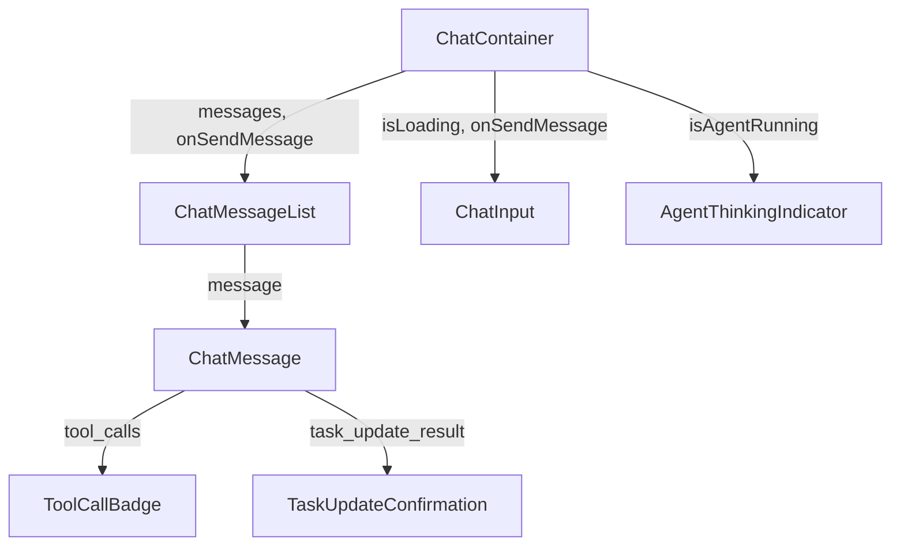

# DSD-002_FEAT-003 フロントエンド詳細設計書（Redmineタスク更新・進捗報告）

| 項目 | 値 |
|---|---|
| ドキュメントID | DSD-002_FEAT-003 |
| バージョン | 1.0 |
| 作成日 | 2026-03-03 |
| 機能ID | FEAT-003 |
| 機能名 | Redmineタスク更新・進捗報告 |
| 入力元 | BSD-003, BSD-004, BSD-005 |
| ステータス | 初版 |

---

## 目次

1. 機能概要
2. コンポーネント構成
3. コンポーネント詳細設計
4. 状態管理設計
5. ルーティング設計
6. チャット画面（SCR-003）の更新関連UI設計
7. APIクライアント設計
8. SSEストリーミング処理
9. エラーハンドリング
10. アクセシビリティ設計
11. 後続フェーズへの影響

---

## 1. 機能概要

### 1.1 対象画面

FEAT-003（タスク更新・進捗報告）は主にチャット画面（SCR-003）を通じて操作される。フロントエンドの役割は以下の通り:

1. **ユーザー入力の受付**: チャット入力欄でステータス更新・コメント追加の指示を受け付ける
2. **エージェント実行のストリーミング表示**: バックエンドからのSSEを受信してリアルタイムで応答を表示する
3. **更新完了フィードバックの表示**: エージェントがタスクを更新した結果をチャットバブルに表示する
4. **ツール実行インジケータ**: エージェントがRedmine APIを呼び出している最中の状態を視覚的に示す

### 1.2 ユーザーインタラクションシナリオ

**シナリオA: ステータス更新**
```
ユーザー: 「#123を完了にして」
  ↓ [送信]
エージェント: [実行中インジケータ] update_task_statusを呼び出し中...
エージェント: タスク #123「設計書作成」を「完了」に更新しました！
```

**シナリオB: コメント追加**
```
ユーザー: 「#45に"設計レビュー完了、明日マージします"とコメントして」
  ↓ [送信]
エージェント: [実行中インジケータ]
エージェント: タスク #45「コードレビュー」にコメントを追加しました。
```

---

## 2. コンポーネント構成

### 2.1 コンポーネントツリー

```
app/
├── (routes)/
│   └── chat/
│       └── page.tsx               # チャット画面ページ
└── components/
    ├── chat/
    │   ├── ChatContainer.tsx       # チャット全体のコンテナ（状態管理の上位）
    │   ├── ChatMessageList.tsx     # メッセージ一覧表示
    │   ├── ChatMessage.tsx         # 個別メッセージバブル（user/assistant）
    │   ├── ChatInput.tsx           # 入力欄と送信ボタン
    │   ├── AgentThinkingIndicator.tsx  # エージェント実行中インジケータ
    │   ├── ToolCallBadge.tsx       # ツール呼び出し状態バッジ
    │   └── TaskUpdateConfirmation.tsx  # タスク更新完了表示カード
    └── ui/
        ├── Button.tsx              # 共通ボタン（Shadcn/ui）
        ├── Textarea.tsx            # テキストエリア（Shadcn/ui）
        └── Toast.tsx               # トースト通知（Shadcn/ui）
```

### 2.2 コンポーネント間データフロー



---

## 3. コンポーネント詳細設計

### 3.1 ChatContainer.tsx

**役割**: チャット画面全体の状態管理・SSE接続管理。

```typescript
// app/components/chat/ChatContainer.tsx

"use client";

import { useState, useCallback, useRef } from "react";
import { ChatMessageList } from "./ChatMessageList";
import { ChatInput } from "./ChatInput";
import { AgentThinkingIndicator } from "./AgentThinkingIndicator";
import { useChat } from "@/hooks/useChat";
import type { Message } from "@/types/chat";

interface ChatContainerProps {
  conversationId: string;
}

export function ChatContainer({ conversationId }: ChatContainerProps) {
  const {
    messages,
    isLoading,
    error,
    sendMessage,
    clearError,
  } = useChat(conversationId);

  return (
    <div className="flex flex-col h-full">
      {/* メッセージ一覧エリア */}
      <div className="flex-1 overflow-y-auto p-4">
        <ChatMessageList messages={messages} />
        {isLoading && <AgentThinkingIndicator />}
      </div>

      {/* エラー表示 */}
      {error && (
        <div className="px-4 py-2 bg-red-50 border-t border-red-200">
          <p className="text-sm text-red-600">{error}</p>
          <button
            onClick={clearError}
            className="text-xs text-red-500 underline mt-1"
          >
            閉じる
          </button>
        </div>
      )}

      {/* 入力エリア */}
      <div className="border-t border-gray-200 p-4">
        <ChatInput
          onSendMessage={sendMessage}
          isDisabled={isLoading}
          placeholder="タスクの更新・コメント追加を指示してください..."
        />
      </div>
    </div>
  );
}
```

### 3.2 ChatMessage.tsx

**役割**: 個別メッセージの表示。ユーザーメッセージ・エージェント応答・ツール実行結果を表示する。

```typescript
// app/components/chat/ChatMessage.tsx

"use client";

import { memo } from "react";
import ReactMarkdown from "react-markdown";
import { ToolCallBadge } from "./ToolCallBadge";
import { TaskUpdateConfirmation } from "./TaskUpdateConfirmation";
import type { Message, ToolCall } from "@/types/chat";

interface ChatMessageProps {
  message: Message;
}

export const ChatMessage = memo(function ChatMessage({ message }: ChatMessageProps) {
  const isUser = message.role === "user";
  const isAssistant = message.role === "assistant";

  return (
    <div
      className={`flex mb-4 ${isUser ? "justify-end" : "justify-start"}`}
      role="article"
      aria-label={isUser ? "あなたのメッセージ" : "エージェントの応答"}
    >
      {/* エージェントアイコン */}
      {isAssistant && (
        <div className="w-8 h-8 rounded-full bg-blue-500 flex items-center justify-center mr-2 flex-shrink-0">
          <span className="text-white text-xs font-bold">AI</span>
        </div>
      )}

      <div className={`max-w-[80%] ${isUser ? "items-end" : "items-start"} flex flex-col gap-2`}>
        {/* ツール呼び出しバッジ（エージェントメッセージのみ） */}
        {isAssistant && message.toolCalls && message.toolCalls.length > 0 && (
          <div className="flex flex-wrap gap-1">
            {message.toolCalls.map((toolCall) => (
              <ToolCallBadge key={toolCall.id} toolCall={toolCall} />
            ))}
          </div>
        )}

        {/* メッセージバブル */}
        {message.content && (
          <div
            className={`px-4 py-3 rounded-2xl ${
              isUser
                ? "bg-blue-500 text-white rounded-tr-sm"
                : "bg-gray-100 text-gray-900 rounded-tl-sm"
            }`}
          >
            {isAssistant ? (
              <ReactMarkdown
                className="prose prose-sm max-w-none"
                components={{
                  // リンクを新しいタブで開く
                  a: ({ href, children }) => (
                    <a href={href} target="_blank" rel="noopener noreferrer">
                      {children}
                    </a>
                  ),
                }}
              >
                {message.content}
              </ReactMarkdown>
            ) : (
              <p className="text-sm whitespace-pre-wrap">{message.content}</p>
            )}
          </div>
        )}

        {/* タスク更新完了カード（エージェントメッセージ内にタスク更新結果がある場合） */}
        {isAssistant && message.taskUpdateResult && (
          <TaskUpdateConfirmation result={message.taskUpdateResult} />
        )}

        {/* タイムスタンプ */}
        <span className="text-xs text-gray-400 px-1">
          {new Date(message.createdAt).toLocaleTimeString("ja-JP", {
            hour: "2-digit",
            minute: "2-digit",
          })}
        </span>
      </div>
    </div>
  );
});
```

### 3.3 AgentThinkingIndicator.tsx

**役割**: エージェントが処理中（ツール呼び出し中・応答生成中）であることを示すインジケータ。

```typescript
// app/components/chat/AgentThinkingIndicator.tsx

"use client";

import { useEffect, useState } from "react";

interface AgentThinkingIndicatorProps {
  currentAction?: string; // 「Redmineを更新中...」等のアクション説明
}

export function AgentThinkingIndicator({ currentAction }: AgentThinkingIndicatorProps) {
  const [dots, setDots] = useState(".");

  // ドットアニメーション
  useEffect(() => {
    const interval = setInterval(() => {
      setDots((prev) => (prev.length >= 3 ? "." : prev + "."));
    }, 500);
    return () => clearInterval(interval);
  }, []);

  return (
    <div
      className="flex items-center gap-2 mb-4"
      role="status"
      aria-label="エージェントが処理中です"
      aria-live="polite"
    >
      {/* エージェントアイコン */}
      <div className="w-8 h-8 rounded-full bg-blue-500 flex items-center justify-center flex-shrink-0">
        <span className="text-white text-xs font-bold">AI</span>
      </div>

      {/* インジケータバブル */}
      <div className="bg-gray-100 rounded-2xl rounded-tl-sm px-4 py-3">
        <div className="flex items-center gap-2">
          {/* 点滅アニメーション */}
          <div className="flex gap-1">
            {[0, 1, 2].map((i) => (
              <div
                key={i}
                className="w-2 h-2 bg-gray-400 rounded-full animate-bounce"
                style={{ animationDelay: `${i * 0.15}s` }}
              />
            ))}
          </div>
          {currentAction && (
            <span className="text-sm text-gray-500">{currentAction}{dots}</span>
          )}
        </div>
      </div>
    </div>
  );
}
```

### 3.4 ToolCallBadge.tsx

**役割**: エージェントがどのツールを呼び出したかを示す小さなバッジ。

```typescript
// app/components/chat/ToolCallBadge.tsx

"use client";

import type { ToolCall } from "@/types/chat";

// ツール名の表示ラベルマッピング
const TOOL_LABELS: Record<string, string> = {
  update_task_status: "ステータス更新",
  add_task_comment: "コメント追加",
  list_issues: "タスク検索",
  get_issue: "タスク取得",
  create_issue: "タスク作成",
  update_task_priority: "優先度変更",
  update_task_due_date: "期日変更",
  get_priority_report: "優先タスク分析",
};

// ツール名のアイコンマッピング
const TOOL_ICONS: Record<string, string> = {
  update_task_status: "✓",
  add_task_comment: "💬",
  list_issues: "🔍",
  get_issue: "📋",
  create_issue: "➕",
  update_task_priority: "⚡",
  update_task_due_date: "📅",
  get_priority_report: "📊",
};

interface ToolCallBadgeProps {
  toolCall: ToolCall;
}

export function ToolCallBadge({ toolCall }: ToolCallBadgeProps) {
  const label = TOOL_LABELS[toolCall.name] ?? toolCall.name;
  const icon = TOOL_ICONS[toolCall.name] ?? "🔧";

  const statusColors = {
    running: "bg-blue-100 text-blue-700 border-blue-200",
    completed: "bg-green-100 text-green-700 border-green-200",
    failed: "bg-red-100 text-red-700 border-red-200",
  };

  return (
    <span
      className={`inline-flex items-center gap-1 px-2 py-1 rounded-full text-xs border font-medium ${
        statusColors[toolCall.status] ?? statusColors.completed
      }`}
      title={`ツール: ${toolCall.name}`}
    >
      <span aria-hidden="true">{icon}</span>
      {label}
      {toolCall.status === "running" && (
        <span className="ml-1 inline-block w-2 h-2 bg-current rounded-full animate-pulse" />
      )}
    </span>
  );
}
```

### 3.5 TaskUpdateConfirmation.tsx

**役割**: タスク更新が完了した際に表示する確認カード。タスクのステータス変更やコメント追加の結果を視覚的に表示する。

```typescript
// app/components/chat/TaskUpdateConfirmation.tsx

"use client";

import { CheckCircle, MessageSquare, ExternalLink } from "lucide-react";

interface TaskUpdateResult {
  type: "status_update" | "comment_added";
  issueId: number;
  issueTitle: string;
  newStatus?: string;
  comment?: string;
  redmineUrl?: string;
}

interface TaskUpdateConfirmationProps {
  result: TaskUpdateResult;
}

export function TaskUpdateConfirmation({ result }: TaskUpdateConfirmationProps) {
  return (
    <div
      className="border border-green-200 rounded-lg p-3 bg-green-50 max-w-sm"
      role="status"
      aria-label="タスク更新完了"
    >
      <div className="flex items-start gap-2">
        {result.type === "status_update" ? (
          <CheckCircle className="w-4 h-4 text-green-600 mt-0.5 flex-shrink-0" />
        ) : (
          <MessageSquare className="w-4 h-4 text-green-600 mt-0.5 flex-shrink-0" />
        )}
        <div className="min-w-0">
          <p className="text-sm font-medium text-green-800">
            {result.type === "status_update" ? "ステータス更新完了" : "コメント追加完了"}
          </p>
          <p className="text-xs text-green-700 mt-0.5 truncate">
            #{result.issueId} {result.issueTitle}
          </p>
          {result.newStatus && (
            <p className="text-xs text-green-600 mt-1">
              → <span className="font-medium">{result.newStatus}</span>
            </p>
          )}
          {result.redmineUrl && (
            <a
              href={result.redmineUrl}
              target="_blank"
              rel="noopener noreferrer"
              className="inline-flex items-center gap-1 text-xs text-green-600 hover:text-green-800 mt-1 underline"
            >
              Redmineで確認
              <ExternalLink className="w-3 h-3" />
            </a>
          )}
        </div>
      </div>
    </div>
  );
}
```

### 3.6 ChatInput.tsx

**役割**: テキスト入力欄と送信ボタン。Enterキーで送信、Shift+Enterで改行。

```typescript
// app/components/chat/ChatInput.tsx

"use client";

import { useState, useRef, useCallback } from "react";
import { Send } from "lucide-react";
import { Button } from "@/components/ui/Button";
import { Textarea } from "@/components/ui/Textarea";

interface ChatInputProps {
  onSendMessage: (content: string) => void;
  isDisabled: boolean;
  placeholder?: string;
}

export function ChatInput({ onSendMessage, isDisabled, placeholder }: ChatInputProps) {
  const [inputValue, setInputValue] = useState("");
  const textareaRef = useRef<HTMLTextAreaElement>(null);

  const handleSend = useCallback(() => {
    const trimmed = inputValue.trim();
    if (!trimmed || isDisabled) return;

    onSendMessage(trimmed);
    setInputValue("");

    // テキストエリアの高さをリセット
    if (textareaRef.current) {
      textareaRef.current.style.height = "auto";
    }
  }, [inputValue, isDisabled, onSendMessage]);

  const handleKeyDown = useCallback(
    (e: React.KeyboardEvent<HTMLTextAreaElement>) => {
      // Enterキーで送信（Shift+Enterは改行）
      if (e.key === "Enter" && !e.shiftKey) {
        e.preventDefault();
        handleSend();
      }
    },
    [handleSend]
  );

  // テキストエリアの自動高さ調整
  const handleChange = useCallback((e: React.ChangeEvent<HTMLTextAreaElement>) => {
    setInputValue(e.target.value);
    e.target.style.height = "auto";
    e.target.style.height = `${Math.min(e.target.scrollHeight, 200)}px`;
  }, []);

  return (
    <div className="flex items-end gap-2">
      <Textarea
        ref={textareaRef}
        value={inputValue}
        onChange={handleChange}
        onKeyDown={handleKeyDown}
        placeholder={placeholder ?? "メッセージを入力... (Enter で送信、Shift+Enter で改行)"}
        disabled={isDisabled}
        rows={1}
        className="flex-1 min-h-[44px] max-h-[200px] resize-none"
        aria-label="メッセージ入力"
      />
      <Button
        onClick={handleSend}
        disabled={isDisabled || !inputValue.trim()}
        size="icon"
        aria-label="送信"
      >
        <Send className="w-4 h-4" />
      </Button>
    </div>
  );
}
```

---

## 4. 状態管理設計

### 4.1 型定義

```typescript
// types/chat.ts

export interface Message {
  id: string;
  conversationId: string;
  role: "user" | "assistant" | "tool";
  content: string;
  toolCalls?: ToolCall[];
  taskUpdateResult?: TaskUpdateResult;
  createdAt: string; // ISO 8601
  isStreaming?: boolean; // SSEストリーミング中かどうか
}

export interface ToolCall {
  id: string;
  name: string;
  input: Record<string, unknown>;
  output?: string;
  status: "running" | "completed" | "failed";
}

export interface TaskUpdateResult {
  type: "status_update" | "comment_added";
  issueId: number;
  issueTitle: string;
  newStatus?: string;
  comment?: string;
  redmineUrl?: string;
}

export interface Conversation {
  id: string;
  title: string;
  messages: Message[];
  createdAt: string;
  updatedAt: string;
}
```

### 4.2 useChat カスタムフック

```typescript
// hooks/useChat.ts

"use client";

import { useState, useCallback, useRef } from "react";
import type { Message, ToolCall } from "@/types/chat";

interface UseChatReturn {
  messages: Message[];
  isLoading: boolean;
  error: string | null;
  sendMessage: (content: string) => void;
  clearError: () => void;
}

export function useChat(conversationId: string): UseChatReturn {
  const [messages, setMessages] = useState<Message[]>([]);
  const [isLoading, setIsLoading] = useState(false);
  const [error, setError] = useState<string | null>(null);
  const abortControllerRef = useRef<AbortController | null>(null);

  const sendMessage = useCallback(
    async (content: string) => {
      if (!content.trim() || isLoading) return;

      // 前回のリクエストをキャンセル
      abortControllerRef.current?.abort();
      abortControllerRef.current = new AbortController();

      // ユーザーメッセージを即座に追加
      const userMessage: Message = {
        id: `user-${Date.now()}`,
        conversationId,
        role: "user",
        content,
        createdAt: new Date().toISOString(),
      };
      setMessages((prev) => [...prev, userMessage]);
      setIsLoading(true);
      setError(null);

      // エージェントメッセージのプレースホルダー
      const assistantMessageId = `assistant-${Date.now()}`;
      setMessages((prev) => [
        ...prev,
        {
          id: assistantMessageId,
          conversationId,
          role: "assistant",
          content: "",
          toolCalls: [],
          createdAt: new Date().toISOString(),
          isStreaming: true,
        },
      ]);

      try {
        const response = await fetch(
          `/api/v1/conversations/${conversationId}/messages`,
          {
            method: "POST",
            headers: {
              "Content-Type": "application/json",
              Accept: "text/event-stream",
            },
            body: JSON.stringify({ content }),
            signal: abortControllerRef.current.signal,
          }
        );

        if (!response.ok) {
          const errorData = await response.json();
          throw new Error(errorData.error?.message ?? "メッセージの送信に失敗しました");
        }

        // SSEストリームの読み取り
        await processSSEStream(response, assistantMessageId, setMessages);
      } catch (err) {
        if (err instanceof DOMException && err.name === "AbortError") {
          return; // キャンセルされた場合は無視
        }
        const message = err instanceof Error ? err.message : "不明なエラーが発生しました";
        setError(message);
        // エラー時はプレースホルダーのエージェントメッセージを削除
        setMessages((prev) => prev.filter((m) => m.id !== assistantMessageId));
      } finally {
        setIsLoading(false);
        // isStreamingフラグをクリア
        setMessages((prev) =>
          prev.map((m) =>
            m.id === assistantMessageId ? { ...m, isStreaming: false } : m
          )
        );
      }
    },
    [conversationId, isLoading]
  );

  const clearError = useCallback(() => setError(null), []);

  return { messages, isLoading, error, sendMessage, clearError };
}
```

### 4.3 SSEストリーム処理

```typescript
// hooks/useChat.ts （続き）

/**
 * SSEストリームを処理し、メッセージ状態を更新する。
 * バックエンドから以下のイベント形式を受信する:
 * - message_start: ストリーミング開始
 * - content_delta: テキストの差分
 * - tool_call: ツール呼び出し開始
 * - tool_result: ツール実行完了
 * - message_end: ストリーミング終了
 */
async function processSSEStream(
  response: Response,
  messageId: string,
  setMessages: React.Dispatch<React.SetStateAction<Message[]>>
): Promise<void> {
  const reader = response.body?.getReader();
  if (!reader) throw new Error("レスポンスBodyの読み取りに失敗しました");

  const decoder = new TextDecoder();
  let buffer = "";

  try {
    while (true) {
      const { done, value } = await reader.read();
      if (done) break;

      buffer += decoder.decode(value, { stream: true });
      const lines = buffer.split("\n\n");
      buffer = lines.pop() ?? "";

      for (const line of lines) {
        if (!line.startsWith("data: ")) continue;
        const dataStr = line.slice(6);
        if (dataStr === "[DONE]") return;

        try {
          const event = JSON.parse(dataStr);
          handleSSEEvent(event, messageId, setMessages);
        } catch {
          // JSON解析エラーは無視
        }
      }
    }
  } finally {
    reader.releaseLock();
  }
}

function handleSSEEvent(
  event: Record<string, unknown>,
  messageId: string,
  setMessages: React.Dispatch<React.SetStateAction<Message[]>>
): void {
  switch (event.type) {
    case "content_delta":
      // テキストを追記
      setMessages((prev) =>
        prev.map((m) =>
          m.id === messageId
            ? { ...m, content: m.content + (event.delta as string) }
            : m
        )
      );
      break;

    case "tool_call":
      // ツール呼び出し開始バッジを追加
      setMessages((prev) =>
        prev.map((m) => {
          if (m.id !== messageId) return m;
          const toolCall: ToolCall = {
            id: event.tool_call_id as string,
            name: event.tool as string,
            input: event.input as Record<string, unknown>,
            status: "running",
          };
          return {
            ...m,
            toolCalls: [...(m.toolCalls ?? []), toolCall],
          };
        })
      );
      break;

    case "tool_result":
      // ツール実行完了バッジの更新
      setMessages((prev) =>
        prev.map((m) => {
          if (m.id !== messageId) return m;
          const updatedToolCalls = (m.toolCalls ?? []).map((tc) =>
            tc.id === event.tool_call_id
              ? {
                  ...tc,
                  output: event.output as string,
                  status: "completed" as const,
                }
              : tc
          );

          // タスク更新結果の抽出（update_task_status/add_task_commentの場合）
          let taskUpdateResult = m.taskUpdateResult;
          if (
            event.tool === "update_task_status" ||
            event.tool === "add_task_comment"
          ) {
            try {
              const output = JSON.parse(event.output as string);
              taskUpdateResult = {
                type:
                  event.tool === "update_task_status"
                    ? "status_update"
                    : "comment_added",
                issueId: output.issue_id as number,
                issueTitle: output.title as string,
                newStatus: output.new_status as string | undefined,
                redmineUrl: output.redmine_url as string | undefined,
              };
            } catch {
              // パース失敗は無視
            }
          }

          return {
            ...m,
            toolCalls: updatedToolCalls,
            taskUpdateResult,
          };
        })
      );
      break;
  }
}
```

---

## 5. ルーティング設計

### 5.1 Next.js App Router構成

```
app/
├── layout.tsx              # ルートレイアウト（ヘッダー・サイドバー）
├── page.tsx                # ダッシュボード（/）
├── chat/
│   └── page.tsx            # チャット画面（/chat）
│       └── 動的ルート不要（会話IDはURLパラメータで管理）
└── tasks/
    ├── page.tsx            # タスク一覧（/tasks）
    ├── [id]/
    │   └── page.tsx        # タスク詳細（/tasks/[id]）
    └── new/
        └── page.tsx        # タスク作成（/tasks/new）
```

### 5.2 チャット画面のURL設計

チャット画面は `/chat` の単一URLで管理する。会話IDはNext.jsの状態またはlocalStorageで保持する。

```typescript
// app/chat/page.tsx

import { ChatContainer } from "@/components/chat/ChatContainer";

export default function ChatPage() {
  // 会話IDの生成・取得ロジック（初回アクセス時に新規会話を作成）
  return (
    <main className="h-[calc(100vh-64px)] flex flex-col">
      <div className="px-4 py-3 border-b border-gray-200 bg-white">
        <h1 className="text-lg font-semibold text-gray-900">チャット</h1>
        <p className="text-sm text-gray-500">
          タスクの更新やコメント追加などを自然言語で指示できます
        </p>
      </div>
      <ChatContainer conversationId="current" />
    </main>
  );
}
```

---

## 6. チャット画面（SCR-003）の更新関連UI設計

### 6.1 ステータス更新完了時のUI状態

```
[更新前]
ユーザー: 「#123を完了にして」

[実行中]
エージェント: [●●●] [✓ ステータス更新 ⟳]

[更新後]
エージェント: [✓ ステータス更新] [💬 コメント追加]
             タスク #123「設計書作成」を完了に更新しました！
             ┌─────────────────────────────────┐
             │ ✓ ステータス更新完了             │
             │ #123 設計書作成                  │
             │ → 完了                           │
             │ Redmineで確認 ↗                 │
             └─────────────────────────────────┘
```

### 6.2 エラー時のUI状態

```
[チケット不存在の場合]
エージェント: チケット #9999 が見つかりませんでした。
             チケット番号を確認してご再指示ください。

[Redmine接続エラーの場合]
エージェント: ⚠ Redmineとの接続に失敗しました。
             しばらく後に再試行するか、Redmineが起動しているか
             ご確認ください。
```

### 6.3 アシストメッセージ（入力補助）

タスク更新関連の操作を促すプレースホルダーの例:
- 「#123を完了にして」
- 「#45に"進捗報告: 80%完了"とコメントして」
- 「設計書タスクを進行中に変更して」

---

## 7. APIクライアント設計

### 7.1 APIクライアントの実装

```typescript
// lib/api/chat.ts

const API_BASE_URL = process.env.NEXT_PUBLIC_API_BASE_URL ?? "http://localhost:8000";

/**
 * 会話へのメッセージ送信（SSEストリーム返却）
 */
export async function sendChatMessage(
  conversationId: string,
  content: string,
  signal?: AbortSignal
): Promise<Response> {
  const response = await fetch(
    `${API_BASE_URL}/api/v1/conversations/${conversationId}/messages`,
    {
      method: "POST",
      headers: {
        "Content-Type": "application/json",
        Accept: "text/event-stream",
      },
      body: JSON.stringify({ content }),
      signal,
    }
  );

  if (!response.ok) {
    const errorBody = await response.json().catch(() => ({}));
    const errorMessage =
      errorBody?.error?.message ?? `HTTP ${response.status}: ${response.statusText}`;
    throw new Error(errorMessage);
  }

  return response;
}

/**
 * 新規会話の作成
 */
export async function createConversation(): Promise<{ id: string }> {
  const response = await fetch(`${API_BASE_URL}/api/v1/conversations`, {
    method: "POST",
    headers: { "Content-Type": "application/json" },
    body: JSON.stringify({}),
  });

  if (!response.ok) {
    throw new Error("会話の作成に失敗しました");
  }

  const data = await response.json();
  return data.data;
}
```

---

## 8. SSEストリーミング処理

### 8.1 SSEイベント仕様（バックエンドとのインターフェース）

| イベントタイプ | ペイロード | 処理内容 |
|---|---|---|
| `message_start` | `{message_id: string}` | ストリーミング開始の初期化 |
| `content_delta` | `{delta: string}` | テキストを追記表示 |
| `tool_call` | `{tool_call_id, tool, input}` | ToolCallBadgeを「実行中」で追加 |
| `tool_result` | `{tool_call_id, tool, output}` | ToolCallBadgeを「完了」に更新、TaskUpdateConfirmationを表示 |
| `message_end` | `{total_tokens: number}` | ストリーミング終了処理 |

### 8.2 ストリーミング中断とAbortController

```typescript
// ページ離脱時やコンポーネントアンマウント時にストリームを中断する
useEffect(() => {
  return () => {
    abortControllerRef.current?.abort();
  };
}, []);
```

---

## 9. エラーハンドリング

### 9.1 エラー種別と表示方式

| エラー種別 | 検出方法 | 表示方式 | ユーザーへのメッセージ |
|---|---|---|---|
| ネットワークエラー | fetch失敗 | エラーバナー（チャット下部） | 「ネットワークエラーが発生しました。接続を確認してください」 |
| バックエンドAPIエラー | HTTP 4xx/5xx | エラーバナー | レスポンスのerror.messageをそのまま表示 |
| チケット不存在 | SSEのtool_result（エラー内容） | チャットバブル内 | エージェントがチャットで回答（UIレベルでは通常表示） |
| タイムアウト | AbortError (30秒超過) | エラーバナー | 「処理がタイムアウトしました。再試行してください」 |
| ストリーム切断 | SSEリーダーのエラー | エラーバナー | 「接続が切断されました。再試行してください」 |

### 9.2 Toast通知

タスク更新完了時のToast通知（操作フィードバック）:

```typescript
// タスク更新完了時のトースト通知
import { toast } from "@/components/ui/use-toast";

function showTaskUpdateToast(result: TaskUpdateResult) {
  toast({
    title:
      result.type === "status_update"
        ? "ステータスを更新しました"
        : "コメントを追加しました",
    description: `#${result.issueId} ${result.issueTitle}`,
    duration: 3000,
    variant: "default",
  });
}
```

---

## 10. アクセシビリティ設計

### 10.1 ARIA属性

| コンポーネント | ARIA属性 | 目的 |
|---|---|---|
| ChatMessageList | `role="log"`, `aria-live="polite"` | スクリーンリーダーへの新着メッセージ通知 |
| ChatMessage（ユーザー） | `aria-label="あなたのメッセージ"` | ロールの明示 |
| ChatMessage（エージェント） | `aria-label="エージェントの応答"` | ロールの明示 |
| AgentThinkingIndicator | `role="status"`, `aria-live="polite"` | 処理中状態の通知 |
| TaskUpdateConfirmation | `role="status"` | 更新完了の通知 |
| ChatInput（Textarea） | `aria-label="メッセージ入力"` | 入力欄の説明 |
| 送信ボタン | `aria-label="送信"` | ボタンの説明 |

### 10.2 キーボード操作

| 操作 | キー | 挙動 |
|---|---|---|
| メッセージ送信 | `Enter` | メッセージを送信する |
| 改行 | `Shift + Enter` | テキストエリア内で改行する |
| 送信中止 | `Escape` | SSEストリームを中断する（未実装: フェーズ2考慮） |

---

## 11. 後続フェーズへの影響

| 影響先 | 内容 |
|---|---|
| DSD-003_FEAT-003 | APIレスポンスのSSEイベント形式仕様の確認（tool_result のpayload構造） |
| IMP-002_FEAT-003 | フロントエンド実装: useChat フック・ChatContainer・ToolCallBadge・TaskUpdateConfirmation のTDD実装 |
| IT-001_FEAT-003 | 結合テスト: チャット画面からタスク更新操作のE2Eフロー確認 |
| DSD-008_FEAT-003 | フロントエンド単体テスト: useChat フックのSSEイベント処理テスト |
