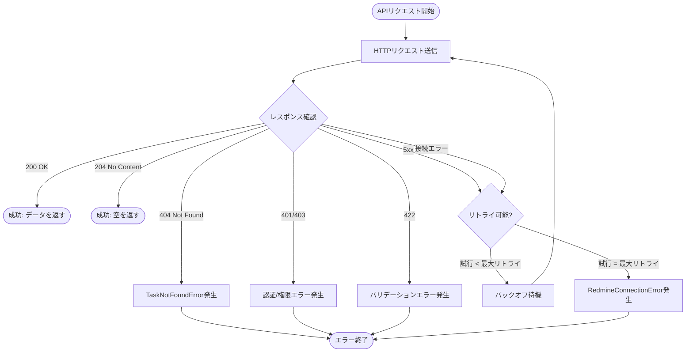

# DSD-005_FEAT-003 外部インターフェース詳細設計書（Redmine Issue更新API）

| 項目 | 値 |
|---|---|
| ドキュメントID | DSD-005_FEAT-003 |
| バージョン | 1.0 |
| 作成日 | 2026-03-03 |
| 機能ID | FEAT-003 |
| 機能名 | Redmineタスク更新・進捗報告 |
| 入力元 | BSD-007, BSD-009 |
| ステータス | 初版 |

---

## 目次

1. 外部インターフェース概要
2. Redmine REST API仕様（Issue更新）
3. Redmineステータスマスタ
4. Redmineデータフォーマット詳細
5. RedmineAdapter 実装仕様
6. ACL変換マッピング
7. リトライ・タイムアウト設計
8. エラーハンドリング
9. 後続フェーズへの影響

---

## 1. 外部インターフェース概要

### 1.1 対象外部システム

| 外部システムID | システム名 | 役割 |
|---|---|---|
| EXT-001 | Redmine | タスク（Issue）管理システム。MCPクライアント経由でREST APIを呼び出す |

### 1.2 FEAT-003で使用するRedmine APIエンドポイント

| No. | メソッド | エンドポイント | 用途 | MCP ツール名 |
|---|---|---|---|---|
| 1 | GET | `/issues/{id}.json` | Issue存在確認・現在の状態取得 | `get_issue` |
| 2 | PUT | `/issues/{id}.json` | Issue更新（ステータス・コメント） | `update_issue` |

### 1.3 接続情報

| 項目 | 値 |
|---|---|
| ベースURL | `${REDMINE_URL}`（環境変数）例: `http://localhost:8080` |
| プロトコル | HTTP（ローカル環境）/ HTTPS（本番環境） |
| 認証方式 | `X-Redmine-API-Key` ヘッダー（環境変数 `REDMINE_API_KEY`） |
| データ形式 | JSON（`Content-Type: application/json`） |
| 文字コード | UTF-8 |
| 接続タイムアウト | 10秒 |
| 読み取りタイムアウト | 30秒 |

---

## 2. Redmine REST API仕様（Issue更新）

### 2.1 GET `/issues/{id}.json`（Issue存在確認）

**目的**: タスク更新前にIssueが存在することを確認する。存在確認と同時に現在のステータス・タイトル等を取得する。

**HTTPメソッド**: GET

**URLパラメータ**:

| パラメータ | 型 | 必須 | 説明 |
|---|---|---|---|
| `id` | integer | 必須 | Redmine Issue ID |

**クエリパラメータ**:

| パラメータ | 型 | 必須 | 説明 |
|---|---|---|---|
| `include` | string | 任意 | 含める関連データ（例: `journals,watchers`） |

**リクエストヘッダー**:

```http
GET /issues/123.json HTTP/1.1
Host: localhost:8080
X-Redmine-API-Key: {REDMINE_API_KEY}
Content-Type: application/json
```

**レスポンス（成功 200 OK）**:

```json
{
  "issue": {
    "id": 123,
    "project": {
      "id": 1,
      "name": "パーソナルエージェント開発"
    },
    "tracker": {
      "id": 1,
      "name": "バグ"
    },
    "status": {
      "id": 2,
      "name": "進行中"
    },
    "priority": {
      "id": 2,
      "name": "通常"
    },
    "author": {
      "id": 1,
      "name": "山田 太郎"
    },
    "assigned_to": {
      "id": 1,
      "name": "山田 太郎"
    },
    "subject": "設計書作成",
    "description": "システム設計書を作成する",
    "start_date": "2026-03-01",
    "due_date": "2026-03-31",
    "done_ratio": 80,
    "is_private": false,
    "estimated_hours": null,
    "created_on": "2026-03-01T09:00:00Z",
    "updated_on": "2026-03-03T10:00:00Z",
    "closed_on": null
  }
}
```

**エラーレスポンス**:

| HTTPステータス | 発生条件 | 対処 |
|---|---|---|
| 404 Not Found | 指定IDのIssueが存在しない | `TaskNotFoundError` を発生させる |
| 401 Unauthorized | APIキーが無効 | 設定エラーとしてログに記録し、ユーザーに通知 |
| 403 Forbidden | アクセス権限なし | アクセス拒否エラーとしてユーザーに通知 |

---

### 2.2 PUT `/issues/{id}.json`（Issue更新）

**目的**: Issueのステータス変更・コメント追加（notes）・進捗率変更などを行う。

**HTTPメソッド**: PUT

**URLパラメータ**:

| パラメータ | 型 | 必須 | 説明 |
|---|---|---|---|
| `id` | integer | 必須 | Redmine Issue ID |

**リクエストヘッダー**:

```http
PUT /issues/123.json HTTP/1.1
Host: localhost:8080
X-Redmine-API-Key: {REDMINE_API_KEY}
Content-Type: application/json
```

**リクエストボディ（ステータス更新）**:

```json
{
  "issue": {
    "status_id": 3
  }
}
```

**リクエストボディ（ステータス更新 + コメント）**:

```json
{
  "issue": {
    "status_id": 3,
    "notes": "設計レビューが完了したため完了に変更"
  }
}
```

**リクエストボディ（コメントのみ追加）**:

```json
{
  "issue": {
    "notes": "進捗報告: フロントエンド実装完了。バックエンドは85%完了。"
  }
}
```

**リクエストボディ（done_ratioを含む更新）**:

```json
{
  "issue": {
    "status_id": 2,
    "done_ratio": 80,
    "notes": "80%完了。残りはレビュー対応のみ。"
  }
}
```

**リクエストボディフィールド一覧**:

| フィールド | 型 | 必須 | 説明 | FEAT-003での使用 |
|---|---|---|---|---|
| `status_id` | integer | 任意 | ステータスID | 使用（UC-003） |
| `notes` | string | 任意 | コメント追加（Journalとして記録） | 使用（UC-003/UC-004） |
| `done_ratio` | integer | 任意 | 完了率（0〜100） | 任意使用 |
| `subject` | string | 任意 | タイトル変更 | 未使用（FEAT-003） |
| `description` | string | 任意 | 説明変更 | 未使用（FEAT-003） |
| `priority_id` | integer | 任意 | 優先度ID変更 | 未使用（FEAT-004で使用） |
| `assigned_to_id` | integer | 任意 | 担当者変更 | 未使用（FEAT-003） |
| `due_date` | string | 任意 | 期日変更（YYYY-MM-DD） | 未使用（FEAT-004で使用） |

**レスポンス（成功）**:

Redmine REST APIのPUT `/issues/{id}.json` は成功時に **HTTP 204 No Content** または **HTTP 200 OK** を返す（Redmineのバージョンにより異なる）。

- **HTTP 204 No Content**: レスポンスボディなし（多くのRedmineバージョンで採用）
- **HTTP 200 OK**: 更新後のIssue情報を返す場合もある

**実装上の注意**: 更新後の状態を取得するため、PUT呼び出し後に `GET /issues/{id}.json` を呼び出して最新状態を取得する。

**エラーレスポンス**:

| HTTPステータス | 発生条件 | 対処 |
|---|---|---|
| 404 Not Found | 指定IDのIssueが存在しない | `TaskNotFoundError` を発生させる |
| 401 Unauthorized | APIキーが無効 | 設定エラーとしてログに記録 |
| 403 Forbidden | 更新権限なし | アクセス拒否エラーとしてユーザーに通知 |
| 422 Unprocessable Entity | Redmineのバリデーションエラー | エラー内容をユーザーに返す |
| 500 Internal Server Error | Redmineサーバーエラー | リトライ後にエラーをユーザーに通知 |

**Redmineエラーレスポンス形式**:

```json
{
  "errors": [
    "ステータスを変更するためのトランジションが存在しません"
  ]
}
```

---

## 3. Redmineステータスマスタ

### 3.1 デフォルトステータス一覧

Redmineの標準インストール時のデフォルトステータス。環境によって変更されている場合がある。

| status_id | 名称（英語） | 名称（日本語） | is_closed | 説明 |
|---|---|---|---|---|
| 1 | New | 未着手 | false | 新規作成されたチケット |
| 2 | In Progress | 進行中 | false | 作業中のチケット |
| 3 | Resolved | 解決済み | false | 解決済み（レビュー待ち）。Closedとして扱う場合もある |
| 4 | Feedback | フィードバック | false | フィードバック待ち |
| 5 | Closed | 完了 | true | 完了・クローズ済み |
| 6 | Rejected | 却下 | true | 却下されたチケット |

**重要（ISSUE-M02対応）**: ステータスIDのマッピングは環境変数で設定する。ハードコードは禁止。

| 環境変数名 | 本システムの意味 | デフォルト値 | Redmineデフォルト設定での対応 |
|---|---|---|---|
| `REDMINE_STATUS_ID_OPEN` | 未着手 | `1` | Redmine status_id=1 (New) |
| `REDMINE_STATUS_ID_IN_PROGRESS` | 進行中 | `2` | Redmine status_id=2 (In Progress) |
| `REDMINE_STATUS_ID_CLOSED` | 完了 | `3` | Redmine status_id=5 (Closed) または 3 (Resolved) |
| `REDMINE_STATUS_ID_REJECTED` | 却下 | `5` | Redmine status_id=6 (Rejected) |

**設定方法**: 環境変数に接続先Redmineの実際のステータスIDを設定すること。実際のステータスIDは `GET /issue_statuses.json`（3.2節参照）で確認できる。デフォルト値はRedmineのデフォルトインストール時の値を想定しているが、カスタマイズされたRedmine環境では変更が必要な場合がある。

### 3.2 ステータスマスタ取得API

```http
GET /issue_statuses.json HTTP/1.1
Host: localhost:8080
X-Redmine-API-Key: {REDMINE_API_KEY}
```

**レスポンス**:

```json
{
  "issue_statuses": [
    {"id": 1, "name": "新規", "is_closed": false, "is_default": true},
    {"id": 2, "name": "進行中", "is_closed": false, "is_default": false},
    {"id": 3, "name": "完了", "is_closed": true, "is_default": false},
    {"id": 5, "name": "却下", "is_closed": true, "is_default": false}
  ]
}
```

---

## 4. Redmineデータフォーマット詳細

### 4.1 日時フォーマット

Redmine APIが返す日時フィールドはUTC形式のISO 8601文字列:

```
"created_on": "2026-03-01T09:00:00Z"
"updated_on": "2026-03-03T10:00:00Z"
"closed_on": null
```

内部での変換:
```python
from datetime import datetime, timezone

# Redmine日時文字列 → Pythonの datetime（UTC）
def parse_redmine_datetime(value: str) -> datetime:
    return datetime.fromisoformat(value.replace("Z", "+00:00"))
```

### 4.2 notes フィールドの特性

- `notes` フィールドに値を設定してPUTリクエストを送ると、RedmineはIssueにJournal（コメント）を追加する
- `notes` はPUTリクエストのボディにのみ含まれ、GETレスポンスには含まれない
- Journalを取得するには `GET /issues/{id}.json?include=journals` を使用する
- `notes` の最大文字数はRedmineのデータベース設定に依存するが、一般的に65535文字（text型）

### 4.3 done_ratio フィールド

- `done_ratio`: 完了率（0〜100の整数）
- Redmineの設定によっては `done_ratio` の自動計算が有効になっており、手動設定が無効になる場合がある
- 本システムでは `done_ratio` の直接設定は任意サポートとする

---

## 5. RedmineAdapter 実装仕様

### 5.1 クラス定義

```python
import httpx
import asyncio
import logging
from typing import Any, Optional
from app.domain.exceptions import (
    TaskNotFoundError,
    RedmineConnectionError,
)

logger = logging.getLogger(__name__)

class RedmineAdapter:
    """
    Redmine REST APIとのHTTP通信を担うインフラストラクチャ層クラス。
    ACL（Anti-Corruption Layer）として機能し、RedmineのAPIレスポンスを
    内部ドメインモデルに変換する前処理を行う。
    """

    def __init__(
        self,
        base_url: str,
        api_key: str,
        connect_timeout: float = 10.0,
        read_timeout: float = 30.0,
        max_retries: int = 3,
    ):
        self.base_url = base_url.rstrip("/")
        self.api_key = api_key
        self.max_retries = max_retries
        self.retry_delays = [1.0, 2.0, 4.0]  # 指数バックオフ
        self._client = httpx.AsyncClient(
            timeout=httpx.Timeout(
                connect=connect_timeout,
                read=read_timeout,
                write=30.0,
                pool=5.0,
            ),
            headers=self._build_headers(),
        )

    def _build_headers(self) -> dict:
        """認証ヘッダーを含む共通HTTPヘッダーを生成する。"""
        return {
            "X-Redmine-API-Key": self.api_key,
            "Content-Type": "application/json",
            "Accept": "application/json",
        }

    async def get_issue(self, issue_id: int) -> dict:
        """
        Redmine Issue を取得する。

        Args:
            issue_id: Redmine Issue ID

        Returns:
            Redmine APIレスポンス（issue オブジェクトを含む dict）

        Raises:
            TaskNotFoundError: 指定IDのIssueが存在しない場合
            RedmineConnectionError: 接続失敗（リトライ上限到達後）
        """
        path = f"/issues/{issue_id}.json"
        response_data = await self._request_with_retry("GET", path)
        logger.info("Issue取得成功: issue_id=%d", issue_id)
        return response_data

    async def update_issue(self, issue_id: int, payload: dict) -> dict:
        """
        Redmine Issue を更新する。

        PUTリクエスト成功後、GETでIssueの最新状態を取得して返す。

        Args:
            issue_id: Redmine Issue ID
            payload: 更新内容（{"issue": {"status_id": 3, "notes": "..."}} の形式）

        Returns:
            更新後のRedmine Issueデータ（get_issueの返却値）

        Raises:
            TaskNotFoundError: 指定IDのIssueが存在しない場合
            RedmineConnectionError: 接続失敗（リトライ上限到達後）
        """
        # セキュリティチェック: delete_issueの呼び出しブロック（追加の安全策）
        if "deleted" in str(payload).lower():
            logger.warning("削除操作の試行を検出・ブロック（update_issueメソッド内）: BR-02違反")
            raise ValueError("削除操作は実行できません（BR-02）")

        path = f"/issues/{issue_id}.json"
        logger.info(
            "Issue更新開始: issue_id=%d, update_fields=%s",
            issue_id,
            list(payload.get("issue", {}).keys()),
        )

        # PUT リクエスト（204 No Contentを期待）
        await self._request_with_retry("PUT", path, json=payload, expect_204=True)

        # 更新後の状態をGETで取得
        updated_data = await self.get_issue(issue_id)
        logger.info("Issue更新完了: issue_id=%d", issue_id)
        return updated_data

    async def _request_with_retry(
        self,
        method: str,
        path: str,
        json: Optional[dict] = None,
        expect_204: bool = False,
    ) -> Any:
        """
        リトライ付きHTTPリクエストを実行する。

        Args:
            method: HTTPメソッド（GET/PUT/POST）
            path: URLパス（ベースURL除く）
            json: リクエストボディ（JSON）
            expect_204: True の場合、204レスポンスをOKとして扱う

        Returns:
            JSONレスポンスデータ（expect_204=Trueの場合はNone）

        Raises:
            TaskNotFoundError: 404 Not Foundの場合
            RedmineConnectionError: リトライ上限到達後
        """
        url = f"{self.base_url}{path}"
        last_error: Optional[Exception] = None

        for attempt in range(self.max_retries):
            try:
                response = await self._client.request(
                    method=method,
                    url=url,
                    json=json,
                )

                if response.status_code == 404:
                    # 404はリトライしない
                    issue_id = self._extract_issue_id_from_path(path)
                    raise TaskNotFoundError(issue_id)

                if response.status_code in {401, 403, 422}:
                    # 認証・権限・バリデーションエラーはリトライしない
                    self._handle_client_error(response)

                if response.status_code == 204:
                    if expect_204:
                        return None
                    raise RedmineConnectionError("予期しない204レスポンスを受信しました")

                if response.status_code == 200:
                    return response.json()

                # 5xx エラーはリトライ対象
                if response.status_code >= 500:
                    logger.warning(
                        "Redmineサーバーエラー (試行 %d/%d): status=%d, url=%s",
                        attempt + 1,
                        self.max_retries,
                        response.status_code,
                        url,
                    )
                    last_error = RedmineConnectionError(
                        f"Redmineサーバーエラー: HTTP {response.status_code}"
                    )

            except (httpx.ConnectError, httpx.TimeoutException) as e:
                logger.warning(
                    "Redmine接続エラー (試行 %d/%d): %s, url=%s",
                    attempt + 1,
                    self.max_retries,
                    type(e).__name__,
                    url,
                )
                last_error = RedmineConnectionError(
                    f"Redmineへの接続に失敗しました: {type(e).__name__}"
                )

            except TaskNotFoundError:
                raise  # 404はリトライしない

            # 最終試行でない場合はバックオフ待機
            if attempt < self.max_retries - 1:
                delay = self.retry_delays[attempt]
                logger.info("リトライ待機: %.1f秒後に再試行", delay)
                await asyncio.sleep(delay)

        raise last_error or RedmineConnectionError(
            "Redmineとの接続に失敗しました（リトライ上限到達）"
        )

    def _handle_client_error(self, response: httpx.Response) -> None:
        """クライアントエラー（4xx）の処理。"""
        if response.status_code == 401:
            raise RedmineConnectionError(
                "Redmine認証エラー: APIキーが無効です。REDMINE_API_KEY環境変数を確認してください。"
            )
        if response.status_code == 403:
            raise RedmineConnectionError(
                "Redmineアクセス拒否: このOperationを実行する権限がありません。"
            )
        if response.status_code == 422:
            try:
                error_data = response.json()
                errors = error_data.get("errors", [])
                error_msg = "、".join(errors)
            except Exception:
                error_msg = response.text
            raise ValueError(f"Redmineバリデーションエラー: {error_msg}")

    def _extract_issue_id_from_path(self, path: str) -> int:
        """URLパスからIssue IDを抽出する。例: '/issues/123.json' → 123"""
        parts = path.strip("/").split("/")
        for part in parts:
            try:
                return int(part.replace(".json", ""))
            except ValueError:
                continue
        return 0

    async def close(self) -> None:
        """HTTPクライアントを閉じる。"""
        await self._client.aclose()

    async def __aenter__(self):
        return self

    async def __aexit__(self, *args):
        await self.close()
```

---

## 6. ACL変換マッピング

Anti-Corruption Layerとして、Redmineのデータモデルをシステムのドメインモデルへ変換する。

### 6.1 Redmineレスポンス → 内部ドメインモデル

| Redmineフィールド | 型 | 内部モデルフィールド | 変換ルール |
|---|---|---|---|
| `issue.id` | integer | `Task.redmine_issue_id` | 整数のまま保持 |
| `issue.subject` | string | `Task.title` | そのまま |
| `issue.status.id` | integer | `Task.status` (TaskStatus) | `TaskStatus.from_id(status_id)` で値オブジェクトに変換 |
| `issue.status.name` | string | `Task.status.name` | そのまま（日本語ロケール対応） |
| `issue.priority.id` | integer | `Task.priority` (TaskPriority) | `TaskPriority.from_id(priority_id)` で値オブジェクトに変換 |
| `issue.assigned_to.name` | string \| null | `Task.assignee` | null許容 |
| `issue.due_date` | string \| null ("YYYY-MM-DD") | `Task.due_date` | `date.fromisoformat()` でdateオブジェクトに変換。null許容 |
| `issue.updated_on` | string (UTC ISO 8601) | `Task.updated_at` | `datetime.fromisoformat().replace("Z", "+00:00")` でdatetimeに変換 |

### 6.2 内部ドメインモデル → Redmineリクエスト

| 内部パラメータ | 型 | Redmineフィールド | 変換ルール |
|---|---|---|---|
| `status_id` | int | `issue.status_id` | そのまま |
| `notes` | str | `issue.notes` | そのまま（UTF-8文字列） |
| `done_ratio` | int | `issue.done_ratio` | そのまま（0〜100） |

### 6.3 変換実装

```python
def build_update_payload(
    status_id: Optional[int] = None,
    notes: Optional[str] = None,
    done_ratio: Optional[int] = None,
) -> dict:
    """
    内部パラメータからRedmine PUTリクエストのpayloadを生成する。

    Args:
        status_id: 新しいステータスID（None = 変更なし）
        notes: コメント（None = 追加なし）
        done_ratio: 完了率（None = 変更なし）

    Returns:
        Redmine PUT /issues/{id}.json のリクエストボディ
    """
    issue_data: dict = {}

    if status_id is not None:
        issue_data["status_id"] = status_id
    if notes is not None:
        issue_data["notes"] = notes
    if done_ratio is not None:
        if not (0 <= done_ratio <= 100):
            raise ValueError(f"done_ratioは0〜100の範囲で指定してください: {done_ratio}")
        issue_data["done_ratio"] = done_ratio

    if not issue_data:
        raise ValueError("少なくとも1つの更新フィールドを指定してください")

    return {"issue": issue_data}
```

---

## 7. リトライ・タイムアウト設計

### 7.1 タイムアウト設定

| タイムアウト種別 | 設定値 | 根拠 |
|---|---|---|
| 接続タイムアウト | 10秒 | BSD-007の共通方針 |
| 読み取りタイムアウト | 30秒 | Issue更新は通常1秒以内に完了するため、余裕を持って30秒 |
| 書き込みタイムアウト | 30秒 | notesが長い場合でも十分な時間 |
| プールタイムアウト | 5秒 | HTTPコネクションプールの待機上限 |

### 7.2 リトライ方針

| 項目 | 設定値 |
|---|---|
| 最大リトライ回数 | 3回 |
| リトライ間隔 | 指数バックオフ: 1秒 → 2秒 → 4秒 |
| リトライ対象エラー | 5xx サーバーエラー・接続タイムアウト・`ConnectError` |
| リトライ非対象エラー | 404 Not Found・401 Unauthorized・403 Forbidden・422 Unprocessable Entity |

### 7.3 タイムアウト・リトライフロー



---

## 8. エラーハンドリング

### 8.1 エラー種別・対処一覧

| エラー種別 | HTTPステータス | 例外クラス | 対処方法 | ユーザーへのメッセージ |
|---|---|---|---|---|
| Issue未存在 | 404 | `TaskNotFoundError` | リトライなし。即時例外発生 | 「タスク #{id} は存在しません。チケット番号をご確認ください」 |
| APIキー無効 | 401 | `RedmineConnectionError` | リトライなし。設定エラーとしてログ記録 | 「Redmine認証エラー: APIキーを確認してください」 |
| アクセス拒否 | 403 | `RedmineConnectionError` | リトライなし | 「このタスクへのアクセス権限がありません」 |
| バリデーションエラー | 422 | `ValueError` | リトライなし。Redmineのエラー内容をユーザーに返す | 「Redmineバリデーションエラー: {Redmineのエラーメッセージ}」 |
| サーバーエラー | 5xx | `RedmineConnectionError` | 最大3回リトライ後に例外発生 | 「Redmineとの接続に失敗しました。しばらく後に再試行してください」 |
| 接続タイムアウト | - | `RedmineConnectionError` | 最大3回リトライ後に例外発生 | 「Redmineとの接続がタイムアウトしました」 |
| DNS解決エラー | - | `RedmineConnectionError` | 最大3回リトライ後に例外発生 | 「Redmineに接続できません。REDMINE_URL設定を確認してください」 |

### 8.2 ログ設計

```python
# 正常系ログ（INFO）
logger.info("Issue更新開始: issue_id=%d, fields=%s", issue_id, update_fields)
logger.info("Issue更新完了: issue_id=%d, new_status=%s", issue_id, new_status)

# 警告ログ（WARNING） - リトライ発生時
logger.warning("Redmineサーバーエラー (試行 %d/%d): status=%d", attempt, max_retries, status_code)
logger.warning("接続タイムアウト (試行 %d/%d)", attempt, max_retries)

# エラーログ（ERROR） - リトライ上限到達時
logger.error("Redmine接続失敗（リトライ上限到達）: issue_id=%d", issue_id, exc_info=True)

# セキュリティログ（WARNING） - 削除操作試行時
logger.warning("BR-02違反: タスク削除操作の試行を検出・ブロック: issue_id=%d", issue_id)
```

**ログに含めないデータ**:
- `REDMINE_API_KEY`（APIキー）
- `notes` フィールドの内容（コメント本文に個人情報が含まれる可能性）
- `description` フィールドの内容

---

## 9. 後続フェーズへの影響

| 影響先 | 内容 |
|---|---|
| DSD-001_FEAT-003 | RedmineAdapterのget_issue/update_issueメソッドシグネチャとの整合確認 |
| DSD-004_FEAT-003 | Redmineステータスマッピングのコンフィグ実装（`GET /issue_statuses.json`による動的取得） |
| DSD-008_FEAT-003 | RedmineAdapterのモックを使ったテストケース設計 |
| IMP-001_FEAT-003 | RedmineAdapterの実装（httpxクライアント・リトライロジック） |
| IMP-003 | 環境変数（REDMINE_URL・REDMINE_API_KEY）のセットアップ手順 |
| IT-001_FEAT-003 | 結合テスト: Redmineスタブサーバーを使ったAPIレスポンス検証 |
