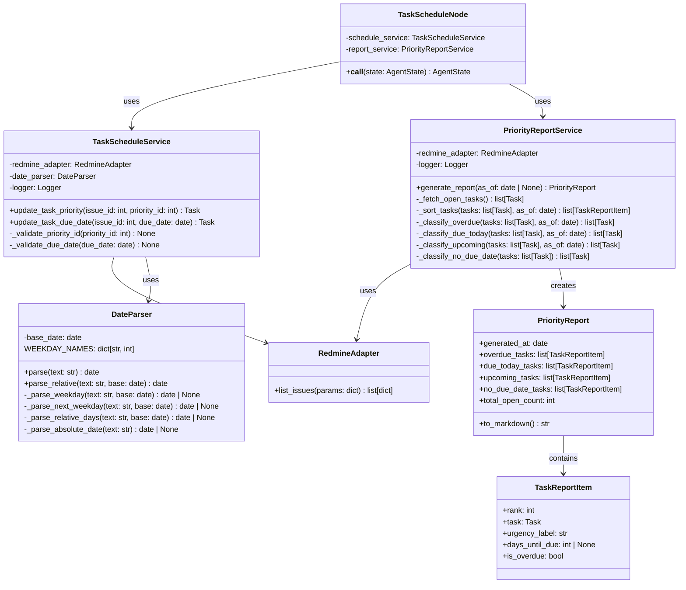
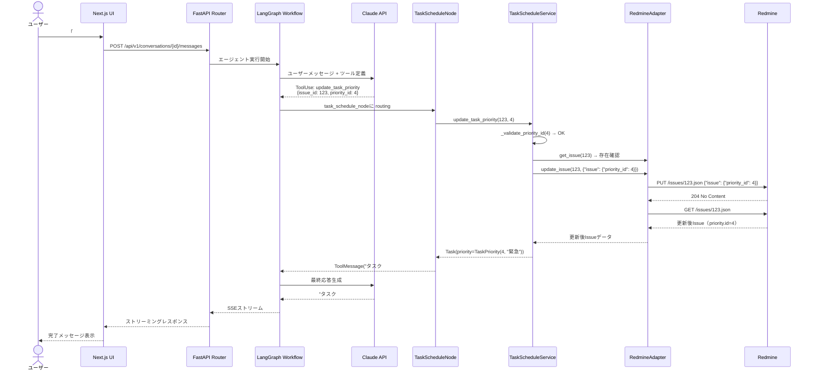
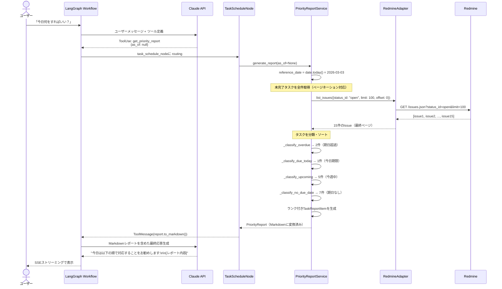
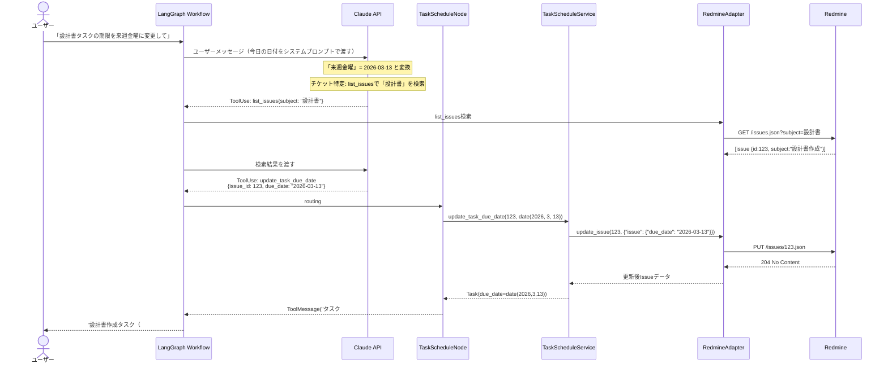

# DSD-001_FEAT-004 バックエンド機能詳細設計書（タスク優先度・スケジュール調整）

| 項目 | 値 |
|---|---|
| ドキュメントID | DSD-001_FEAT-004 |
| バージョン | 1.0 |
| 作成日 | 2026-03-03 |
| 機能ID | FEAT-004 |
| 機能名 | タスク優先度・スケジュール調整 |
| 入力元 | BSD-001, BSD-002, BSD-004, BSD-009, REQ-005 |
| ステータス | 初版 |

---

## 目次

1. 機能概要
2. レイヤード構成・モジュール配置
3. クラス図
4. ドメインモデル詳細
5. LangGraphノード設計
6. ツール関数仕様
7. 優先タスクレポートロジック
8. 自然言語日付解析
9. シーケンス図
10. エラーハンドリング方針
11. ログ設計
12. 後続フェーズへの影響

---

## 1. 機能概要

### 1.1 対象ユースケース

| UC-ID | ユースケース名 | 概要 |
|---|---|---|
| UC-005 | タスクの優先度を変更する | 「#123を緊急にして」などの指示でRedmineチケットの優先度を変更する |
| UC-006 | タスクの期日を変更する | 「設計書タスクの期限を来週金曜に変更して」などの指示で期日を更新する |
| UC-007 | 優先タスクのレポートを受け取る | 「今日何をすればいい？」に対して未完了タスクを分析して推奨順序を返す |

### 1.2 処理方式

- エントリポイント: POST `/api/v1/conversations/{id}/messages`（チャットメッセージ送信）
- エージェント実行: LangGraphワークフローが `update_task_priority`・`update_task_due_date`・`get_priority_report` ツールを選択・実行する
- Redmine連携: MCPクライアント経由でRedmine REST API `PUT /issues/{id}.json`・`GET /issues.json` を呼び出す
- レスポンス: SSEでストリーミング返却

### 1.3 ビジネスルール適用

| ルールID | 内容 | 実装箇所 |
|---|---|---|
| BR-02 | タスク削除禁止 | FEAT-003同様。delete操作のブロック |
| BR-05（新規） | 期日の解析失敗時はユーザーに確認 | `DateParser.parse` が失敗した場合は推論結果をLLMに返してユーザー確認を促す |
| BR-06（新規） | 優先タスクレポートは期限超過を最優先 | `PriorityReportService.generate_report` でソートロジックを実装 |

---

## 2. レイヤード構成・モジュール配置

### 2.1 パッケージ構成

```
backend/
├── app/
│   ├── presentation/
│   │   ├── routers/
│   │   │   └── tasks.py              # PUT /api/v1/tasks/{id}（FEAT-003と共用）
│   │   └── schemas/
│   │       └── task_update.py         # UpdateTaskRequest（priority/due_date対応追加）
│   ├── application/
│   │   ├── agent/
│   │   │   ├── workflow.py            # LangGraphワークフロー（FEAT-004ノード追加）
│   │   │   ├── nodes/
│   │   │   │   └── task_schedule_node.py  # タスクスケジュールノード
│   │   │   └── tools/
│   │   │       └── task_schedule_tools.py # update_task_priority / update_task_due_date / get_priority_report
│   │   └── services/
│   │       ├── task_schedule_service.py   # TaskScheduleService
│   │       └── priority_report_service.py # PriorityReportService
│   ├── domain/
│   │   ├── task/
│   │   │   ├── entities.py            # Task・TaskReport エンティティ（拡張）
│   │   │   └── value_objects.py       # TaskStatus・TaskPriority・DueDate
│   │   └── utils/
│   │       └── date_parser.py         # 自然言語日付解析ユーティリティ
│   └── infrastructure/
│       └── redmine/
│           └── redmine_adapter.py     # list_issues追加（FEAT-003と共用）
```

### 2.2 依存方向

FEAT-003と同様のレイヤードアーキテクチャを踏襲する。`PriorityReportService` は `RedmineAdapter.list_issues` を呼び出してタスク一覧を取得し、ドメインロジックで優先順位を計算する。

---

## 3. クラス図



---

## 4. ドメインモデル詳細

### 4.1 PriorityReport エンティティ

**概要**: 優先タスクレポートの集約ルート。未完了タスクを分析した結果を保持する。

```python
from dataclasses import dataclass, field
from datetime import date
from typing import Optional

@dataclass
class TaskReportItem:
    """優先タスクレポートの個別項目。"""
    rank: int                          # 推奨対応順位（1始まり）
    task: "Task"                       # タスクエンティティ
    urgency_label: str                 # 緊急度ラベル（「期限超過」「今日期限」「今週」「通常」）
    days_until_due: Optional[int]      # 期日までの日数（負数=超過、Noneは期日なし）
    is_overdue: bool                   # 期限超過フラグ


@dataclass
class PriorityReport:
    """
    優先タスクレポート。
    未完了タスクを期日・優先度・緊急度で分類し、対応順序を提示する。
    """
    generated_at: date                         # レポート生成日
    overdue_tasks: list[TaskReportItem]        # 期限超過タスク（最優先）
    due_today_tasks: list[TaskReportItem]      # 今日期限のタスク
    upcoming_tasks: list[TaskReportItem]       # 直近1週間以内のタスク
    no_due_date_tasks: list[TaskReportItem]    # 期日なしタスク
    total_open_count: int                      # 未完了タスク総数

    def to_markdown(self) -> str:
        """
        レポートをMarkdown形式の文字列に変換する。
        LangGraphエージェントの応答に組み込むための形式。
        """
        lines = [
            f"## 優先タスクレポート（{self.generated_at.strftime('%Y年%m月%d日')}時点）",
            f"未完了タスク数: {self.total_open_count}件",
            "",
        ]

        if self.overdue_tasks:
            lines.append("### 🚨 期限超過（要対応）")
            for item in self.overdue_tasks:
                overdue_days = abs(item.days_until_due) if item.days_until_due is not None else "?"
                lines.append(
                    f"{item.rank}. **#{item.task.redmine_issue_id}** {item.task.title}"
                    f"（{overdue_days}日超過・優先度: {item.task.priority.name}）"
                )
            lines.append("")

        if self.due_today_tasks:
            lines.append("### ⚡ 今日期限")
            for item in self.due_today_tasks:
                lines.append(
                    f"{item.rank}. **#{item.task.redmine_issue_id}** {item.task.title}"
                    f"（優先度: {item.task.priority.name}）"
                )
            lines.append("")

        if self.upcoming_tasks:
            lines.append("### 📅 今週中")
            for item in self.upcoming_tasks:
                due_str = item.task.due_date.strftime("%m/%d") if item.task.due_date else ""
                lines.append(
                    f"{item.rank}. **#{item.task.redmine_issue_id}** {item.task.title}"
                    f"（期日: {due_str}・優先度: {item.task.priority.name}）"
                )
            lines.append("")

        if self.no_due_date_tasks:
            lines.append("### 📋 期日なし")
            for item in self.no_due_date_tasks:
                lines.append(
                    f"{item.rank}. **#{item.task.redmine_issue_id}** {item.task.title}"
                    f"（優先度: {item.task.priority.name}）"
                )

        return "\n".join(lines)
```

### 4.2 DueDate 値オブジェクト

```python
@dataclass(frozen=True)
class DueDate:
    """タスクの期日を表す値オブジェクト。過去の日付設定を警告する。"""
    value: date

    def __post_init__(self):
        if not isinstance(self.value, date):
            raise TypeError("DueDateはdate型である必要があります")

    def is_past(self, reference_date: date) -> bool:
        """指定日時点で期日が過去かどうかを返す。"""
        return self.value < reference_date

    def days_until(self, reference_date: date) -> int:
        """指定日から期日までの日数を返す（負数は超過）。"""
        return (self.value - reference_date).days

    def is_within_week(self, reference_date: date) -> bool:
        """指定日から7日以内かどうかを返す。"""
        return 0 <= self.days_until(reference_date) <= 7
```

---

## 5. LangGraphノード設計

### 5.1 エージェントワークフローへの追加

FEAT-004では `task_schedule_node` を追加する。FEAT-003の `task_update_node` と同様に、LangGraphのグラフに条件分岐エッジを追加する。

```python
from langgraph.graph import StateGraph, END
from app.application.agent.nodes.task_update_node import TaskUpdateNode
from app.application.agent.nodes.task_schedule_node import TaskScheduleNode

# ルーター関数: ツール名に基づいてノードを選択
def route_tool_calls(state: AgentState) -> str:
    """
    LLMが選択したツール名に基づいて次のノードを決定する。
    """
    last_message = state.messages[-1]
    if not hasattr(last_message, "tool_calls") or not last_message.tool_calls:
        return END  # ツール呼び出しなし → 終了

    tool_names = [tc["name"] for tc in last_message.tool_calls]

    # FEAT-003: タスク更新・コメント追加
    if any(t in tool_names for t in ["update_task_status", "add_task_comment"]):
        return "task_update_node"

    # FEAT-004: 優先度変更・期日変更・優先タスクレポート
    if any(t in tool_names for t in [
        "update_task_priority", "update_task_due_date", "get_priority_report"
    ]):
        return "task_schedule_node"

    return END

# グラフ構築
workflow = StateGraph(AgentState)
workflow.add_node("agent_node", agent_node)
workflow.add_node("task_update_node", task_update_node)
workflow.add_node("task_schedule_node", task_schedule_node)
workflow.set_entry_point("agent_node")
workflow.add_conditional_edges("agent_node", route_tool_calls, {
    "task_update_node": "task_update_node",
    "task_schedule_node": "task_schedule_node",
    END: END,
})
workflow.add_edge("task_update_node", "agent_node")
workflow.add_edge("task_schedule_node", "agent_node")
```

### 5.2 TaskScheduleNode 実装仕様

```python
from langchain_core.messages import ToolMessage
from datetime import date

class TaskScheduleNode:
    """タスクスケジュールノード。優先度変更・期日変更・優先タスクレポートを処理する。"""

    def __init__(
        self,
        schedule_service: "TaskScheduleService",
        report_service: "PriorityReportService",
    ):
        self.schedule_service = schedule_service
        self.report_service = report_service

    async def __call__(self, state: "AgentState") -> dict:
        last_message = state.messages[-1]
        tool_messages = []

        for tool_call in last_message.tool_calls:
            tool_name = tool_call["name"]
            tool_args = tool_call["args"]
            tool_call_id = tool_call["id"]

            try:
                if tool_name == "update_task_priority":
                    result = await self.schedule_service.update_task_priority(
                        issue_id=tool_args["issue_id"],
                        priority_id=tool_args["priority_id"],
                    )
                    content = (
                        f"タスク #{result.redmine_issue_id}「{result.title}」の"
                        f"優先度を「{result.priority.name}」に変更しました。"
                    )

                elif tool_name == "update_task_due_date":
                    due_date = date.fromisoformat(tool_args["due_date"])
                    result = await self.schedule_service.update_task_due_date(
                        issue_id=tool_args["issue_id"],
                        due_date=due_date,
                    )
                    content = (
                        f"タスク #{result.redmine_issue_id}「{result.title}」の"
                        f"期日を「{result.due_date.strftime('%Y年%m月%d日')}」に変更しました。"
                    )

                elif tool_name == "get_priority_report":
                    as_of_str = tool_args.get("as_of")
                    as_of = date.fromisoformat(as_of_str) if as_of_str else None
                    report = await self.report_service.generate_report(as_of=as_of)
                    content = report.to_markdown()

                else:
                    content = f"未知のツール: {tool_name}"

            except Exception as e:
                content = f"エラー: {str(e)}"

            tool_messages.append(ToolMessage(content=content, tool_call_id=tool_call_id))

        return {"messages": tool_messages}
```

---

## 6. ツール関数仕様

### 6.1 update_task_priority ツール

**目的**: Redmineチケットの優先度を変更する。

```python
class UpdateTaskPriorityInput(BaseModel):
    issue_id: int = Field(
        description="優先度を変更するRedmine Issue ID（チケット番号）。"
    )
    priority_id: int = Field(
        description=(
            "新しい優先度のID。"
            "1=低, 2=通常, 3=高, 4=緊急, 5=即座に。"
            "「緊急にして」→4、「高くして」→3、「通常に戻して」→2。"
        )
    )

@tool(args_schema=UpdateTaskPriorityInput)
async def update_task_priority(issue_id: int, priority_id: int) -> str:
    """
    Redmineタスクの優先度を変更する。

    優先度IDの対応:
    - 1: 低（Low）
    - 2: 通常（Normal）
    - 3: 高（High）
    - 4: 緊急（Urgent）
    - 5: 即座に（Immediate）
    """
    pass
```

**引数詳細**:

| 引数名 | 型 | 必須 | 検証ルール |
|---|---|---|---|
| `issue_id` | int | 必須 | 1以上の整数。存在するチケットであること |
| `priority_id` | int | 必須 | {1, 2, 3, 4, 5} のいずれか |

### 6.2 update_task_due_date ツール

**目的**: Redmineチケットの期日（due_date）を変更する。

```python
class UpdateTaskDueDateInput(BaseModel):
    issue_id: int = Field(
        description="期日を変更するRedmine Issue ID（チケット番号）。"
    )
    due_date: str = Field(
        description=(
            "新しい期日。YYYY-MM-DD形式で指定する。"
            "「来週金曜」「3日後」などの自然言語はLLMが事前に変換してから渡す。"
            "例: '2026-03-07'（来週金曜）"
        )
    )

@tool(args_schema=UpdateTaskDueDateInput)
async def update_task_due_date(issue_id: int, due_date: str) -> str:
    """
    Redmineタスクの期日を変更する。
    due_dateはISO 8601形式（YYYY-MM-DD）で指定する。

    自然言語の期日表現（「来週金曜」「3日後」等）は
    LLMが現在日付を基に変換してから渡すこと。
    """
    pass
```

**引数詳細**:

| 引数名 | 型 | 必須 | 検証ルール |
|---|---|---|---|
| `issue_id` | int | 必須 | 1以上の整数。存在するチケットであること |
| `due_date` | str | 必須 | ISO 8601形式（YYYY-MM-DD）。バックエンドでも検証する |

### 6.3 get_priority_report ツール

**目的**: 未完了タスクを取得・分析し、優先対応順序のレポートを生成する。

```python
class GetPriorityReportInput(BaseModel):
    as_of: Optional[str] = Field(
        default=None,
        description=(
            "レポート基準日（YYYY-MM-DD形式）。"
            "省略時は今日の日付を使用する。"
        )
    )

@tool(args_schema=GetPriorityReportInput)
async def get_priority_report(as_of: Optional[str] = None) -> str:
    """
    未完了タスクを分析し、優先対応順序のレポートをMarkdown形式で返す。

    分析ロジック:
    1. 期限超過タスクを最優先（期日が古い順）
    2. 今日期限のタスク（優先度が高い順）
    3. 今週中のタスク（期日が近い順・優先度が高い順）
    4. 期日なしタスク（優先度が高い順）
    """
    pass
```

**引数詳細**:

| 引数名 | 型 | 必須 | 説明 |
|---|---|---|---|
| `as_of` | str \| None | 任意 | 基準日（YYYY-MM-DD）。省略時は今日 |

---

## 7. 優先タスクレポートロジック

### 7.1 PriorityReportService 実装仕様

```python
from datetime import date, timedelta
from typing import Optional

class PriorityReportService:
    """
    優先タスクレポートを生成するアプリケーションサービス。
    未完了タスクを期日・優先度・緊急度で分類し対応順序を提示する。
    """

    # 今週中として扱う日数の閾値（今日 + 7日以内）
    UPCOMING_DAYS_THRESHOLD = 7

    def __init__(self, redmine_adapter: "RedmineAdapter"):
        self.redmine_adapter = redmine_adapter

    async def generate_report(self, as_of: Optional[date] = None) -> PriorityReport:
        """
        優先タスクレポートを生成する。

        Args:
            as_of: レポート基準日（省略時は今日）

        Returns:
            PriorityReportオブジェクト

        Raises:
            RedmineConnectionError: Redmine接続失敗
        """
        reference_date = as_of or date.today()

        # 未完了タスクを全件取得
        tasks = await self._fetch_open_tasks()

        # タスクを分類
        overdue = self._classify_overdue(tasks, reference_date)
        due_today = self._classify_due_today(tasks, reference_date)
        upcoming = self._classify_upcoming(tasks, reference_date)
        no_due = self._classify_no_due_date(tasks)

        # 各カテゴリ内のソート
        overdue_sorted = sorted(overdue, key=lambda t: (
            t.due_date or date.max,  # 期日が古い順（NoneはMaxで末尾）
            -t.priority.id,          # 優先度が高い順（降順）
        ))
        due_today_sorted = sorted(due_today, key=lambda t: -t.priority.id)
        upcoming_sorted = sorted(upcoming, key=lambda t: (
            t.due_date or date.max,  # 期日が近い順
            -t.priority.id,          # 同日なら優先度が高い順
        ))
        no_due_sorted = sorted(no_due, key=lambda t: -t.priority.id)

        # ランク付き TaskReportItem の生成
        rank = 1
        overdue_items, rank = self._make_report_items(overdue_sorted, rank, reference_date, "期限超過")
        due_today_items, rank = self._make_report_items(due_today_sorted, rank, reference_date, "今日期限")
        upcoming_items, rank = self._make_report_items(upcoming_sorted, rank, reference_date, "今週中")
        no_due_items, rank = self._make_report_items(no_due_sorted, rank, reference_date, "期日なし")

        return PriorityReport(
            generated_at=reference_date,
            overdue_tasks=overdue_items,
            due_today_tasks=due_today_items,
            upcoming_tasks=upcoming_items,
            no_due_date_tasks=no_due_items,
            total_open_count=len(tasks),
        )

    async def _fetch_open_tasks(self) -> list["Task"]:
        """
        Redmineから未完了タスク（is_closed=False）を全件取得する。
        ページネーションを考慮して全件取得する（最大1000件）。
        """
        all_tasks = []
        offset = 0
        limit = 100

        while True:
            response = await self.redmine_adapter.list_issues({
                "status_id": "open",  # 未完了のみ
                "limit": limit,
                "offset": offset,
            })
            issues = response.get("issues", [])
            if not issues:
                break

            for issue_data in issues:
                task = Task.from_redmine_response({"issue": issue_data})
                all_tasks.append(task)

            offset += limit
            if len(issues) < limit:
                break  # 最終ページに達した

        return all_tasks

    def _classify_overdue(self, tasks: list["Task"], reference_date: date) -> list["Task"]:
        """期日が過去（reference_dateより前）のタスクを抽出する。"""
        return [
            t for t in tasks
            if t.due_date is not None and t.due_date < reference_date
        ]

    def _classify_due_today(self, tasks: list["Task"], reference_date: date) -> list["Task"]:
        """今日が期日のタスクを抽出する。"""
        return [
            t for t in tasks
            if t.due_date == reference_date
        ]

    def _classify_upcoming(self, tasks: list["Task"], reference_date: date) -> list["Task"]:
        """
        明日から7日以内（UPCOMING_DAYS_THRESHOLD以内）が期日のタスクを抽出する。
        """
        tomorrow = reference_date + timedelta(days=1)
        threshold = reference_date + timedelta(days=self.UPCOMING_DAYS_THRESHOLD)
        return [
            t for t in tasks
            if t.due_date is not None and tomorrow <= t.due_date <= threshold
        ]

    def _classify_no_due_date(self, tasks: list["Task"]) -> list["Task"]:
        """期日が設定されていないタスクを抽出する。"""
        return [t for t in tasks if t.due_date is None]

    def _make_report_items(
        self,
        tasks: list["Task"],
        start_rank: int,
        reference_date: date,
        urgency_label: str,
    ) -> tuple[list[TaskReportItem], int]:
        """TaskReportItemのリストを生成し、次のランク番号を返す。"""
        items = []
        rank = start_rank
        for task in tasks:
            days_until_due = None
            is_overdue = False
            if task.due_date is not None:
                delta = (task.due_date - reference_date).days
                days_until_due = delta
                is_overdue = delta < 0

            items.append(TaskReportItem(
                rank=rank,
                task=task,
                urgency_label=urgency_label,
                days_until_due=days_until_due,
                is_overdue=is_overdue,
            ))
            rank += 1
        return items, rank
```

### 7.2 ソートアルゴリズム詳細

**優先タスクレポートの優先順位決定ルール**:

```
優先順位 = [カテゴリ順] × [カテゴリ内ソート]

カテゴリ順:
  1. 期限超過（overdue）    ← 最優先
  2. 今日期限（due_today）
  3. 今週中（upcoming）
  4. 期日なし（no_due_date） ← 最後

カテゴリ内ソート:
  - 期限超過: 期日が古い順（最も古い超過が最優先）→ 同じ期日なら優先度が高い順
  - 今日期限: 優先度が高い順（id降順）
  - 今週中:   期日が近い順 → 同じ期日なら優先度が高い順
  - 期日なし: 優先度が高い順
```

---

## 8. 自然言語日付解析

### 8.1 DateParser 実装仕様

**目的**: 「来週金曜」「3日後」「明日」等の自然言語表現をdateオブジェクトに変換する。

**設計方針**: LLMが `update_task_due_date` ツールを呼び出す際、due_date引数はISO 8601形式（YYYY-MM-DD）で渡す。LLMがシステムプロンプトとtool descriptionによって変換を担うのが主な方式。`DateParser` はバックエンド側での追加解析・検証に使用する。

```python
from datetime import date, timedelta
from typing import Optional
import re

class DateParser:
    """
    自然言語の日付表現をdateオブジェクトに変換するユーティリティ。
    バックエンド側でLLMの変換ミスを検出・修正するために使用する。
    """

    WEEKDAY_NAMES_JA = {
        "月": 0, "月曜": 0, "月曜日": 0,
        "火": 1, "火曜": 1, "火曜日": 1,
        "水": 2, "水曜": 2, "水曜日": 2,
        "木": 3, "木曜": 3, "木曜日": 3,
        "金": 4, "金曜": 4, "金曜日": 4,
        "土": 5, "土曜": 5, "土曜日": 5,
        "日": 6, "日曜": 6, "日曜日": 6,
    }

    def __init__(self, base_date: Optional[date] = None):
        """
        Args:
            base_date: 相対日付の基準日（省略時は今日）
        """
        self.base_date = base_date or date.today()

    def parse(self, text: str) -> Optional[date]:
        """
        テキストを日付に変換する。変換できない場合はNoneを返す。

        対応パターン:
        - ISO 8601: "2026-03-07"
        - 日本語絶対日付: "3月7日", "3/7"
        - 相対日: "今日", "明日", "明後日"
        - 相対日数: "3日後", "1週間後"
        - 曜日: "金曜", "金曜日"（今週の当該曜日）
        - 来週曜日: "来週金曜", "来週金曜日"
        - 再来週曜日: "再来週月曜"
        """
        text = text.strip()
        base = self.base_date

        # ISO 8601形式
        result = self._parse_iso(text)
        if result:
            return result

        # 絶対的な表現
        if text == "今日":
            return base
        if text == "明日":
            return base + timedelta(days=1)
        if text == "明後日":
            return base + timedelta(days=2)

        # 相対日数: "N日後", "N週間後"
        result = self._parse_relative_days(text, base)
        if result:
            return result

        # 来週曜日: "来週金曜", "来週金曜日"
        result = self._parse_next_weekday(text, base)
        if result:
            return result

        # 今週の曜日: "金曜", "金曜日"
        result = self._parse_weekday(text, base)
        if result:
            return result

        # 月/日形式: "3/7", "3月7日"
        result = self._parse_month_day(text, base)
        if result:
            return result

        return None

    def _parse_iso(self, text: str) -> Optional[date]:
        """ISO 8601形式（YYYY-MM-DD）のパース。"""
        try:
            return date.fromisoformat(text)
        except ValueError:
            return None

    def _parse_relative_days(self, text: str, base: date) -> Optional[date]:
        """「N日後」「N週間後」形式のパース。"""
        # 「N日後」
        match = re.match(r"^(\d+)日後$", text)
        if match:
            return base + timedelta(days=int(match.group(1)))

        # 「N週間後」
        match = re.match(r"^(\d+)週間後$", text)
        if match:
            return base + timedelta(weeks=int(match.group(1)))

        # 「N週後」
        match = re.match(r"^(\d+)週後$", text)
        if match:
            return base + timedelta(weeks=int(match.group(1)))

        return None

    def _parse_weekday(self, text: str, base: date) -> Optional[date]:
        """「金曜」「金曜日」等の今週の曜日パース（今日以降の直近の該当曜日）。"""
        for name, weekday in self.WEEKDAY_NAMES_JA.items():
            if text == name:
                days_ahead = (weekday - base.weekday()) % 7
                if days_ahead == 0:
                    days_ahead = 7  # 今日と同じ曜日の場合は来週
                return base + timedelta(days=days_ahead)
        return None

    def _parse_next_weekday(self, text: str, base: date) -> Optional[date]:
        """「来週金曜」「来週金曜日」等の来週の曜日パース。"""
        # 「来週{曜日}」のパターン
        match = re.match(r"^来週(.+)$", text)
        if match:
            weekday_text = match.group(1)
            if weekday_text in self.WEEKDAY_NAMES_JA:
                target_weekday = self.WEEKDAY_NAMES_JA[weekday_text]
                # 来週月曜（次の月曜から始まる週）
                days_until_next_monday = (7 - base.weekday()) % 7
                if days_until_next_monday == 0:
                    days_until_next_monday = 7
                next_monday = base + timedelta(days=days_until_next_monday)
                return next_monday + timedelta(days=target_weekday)
        return None

    def _parse_month_day(self, text: str, base: date) -> Optional[date]:
        """「3/7」「3月7日」形式のパース（年は今年または来年を自動選択）。"""
        # 「M/D」形式
        match = re.match(r"^(\d{1,2})/(\d{1,2})$", text)
        if match:
            month, day = int(match.group(1)), int(match.group(2))
            return self._resolve_year(month, day, base)

        # 「M月D日」形式
        match = re.match(r"^(\d{1,2})月(\d{1,2})日$", text)
        if match:
            month, day = int(match.group(1)), int(match.group(2))
            return self._resolve_year(month, day, base)

        return None

    def _resolve_year(self, month: int, day: int, base: date) -> Optional[date]:
        """月日から年を解決する（今年または来年）。"""
        try:
            candidate = date(base.year, month, day)
            if candidate < base:
                # 過去の日付なら来年として解釈
                candidate = date(base.year + 1, month, day)
            return candidate
        except ValueError:
            return None
```

### 8.2 日付解析のサポートパターン一覧

| 入力テキスト | 出力（2026-03-03火曜基準） | 備考 |
|---|---|---|
| `"2026-03-07"` | `2026-03-07` | ISO 8601 |
| `"今日"` | `2026-03-03` | |
| `"明日"` | `2026-03-04` | |
| `"明後日"` | `2026-03-05` | |
| `"3日後"` | `2026-03-06` | |
| `"1週間後"` | `2026-03-10` | |
| `"金曜"` | `2026-03-06` | 今週金曜 |
| `"来週金曜"` | `2026-03-13` | 来週金曜 |
| `"3月7日"` | `2026-03-07` | 今年の3月7日 |
| `"3/7"` | `2026-03-07` | |
| `"来週月曜"` | `2026-03-09` | |

---

## 9. シーケンス図

### 9.1 優先度変更フロー（正常系）



### 9.2 優先タスクレポート生成フロー（正常系）



### 9.3 期日変更フロー（正常系）



---

## 10. エラーハンドリング方針

### 10.1 FEAT-004固有のエラー

| エラー種別 | 例外クラス | 対処 | ユーザーへのメッセージ |
|---|---|---|---|
| 無効な優先度ID | `InvalidPriorityIdError` | ToolMessageとして返す | 「無効な優先度IDです。有効値: 1=低, 2=通常, 3=高, 4=緊急, 5=即座に」 |
| 期日形式エラー | `ValueError` | ToolMessageとして返す | 「期日の形式が不正です。YYYY-MM-DD形式で指定してください」 |
| 未完了タスクが0件 | `EmptyReportError` | ToolMessageとして返す | 「未完了タスクはありません。全タスクが完了しています！」 |
| Redmine接続エラー | `RedmineConnectionError` | 503 SERVICE_UNAVAILABLE | 「Redmineとの接続に失敗しました」 |

### 10.2 優先タスクレポートの空データ処理

```python
async def generate_report(self, as_of: Optional[date] = None) -> PriorityReport:
    tasks = await self._fetch_open_tasks()

    # 未完了タスクが0件の場合
    if not tasks:
        reference_date = as_of or date.today()
        return PriorityReport(
            generated_at=reference_date,
            overdue_tasks=[],
            due_today_tasks=[],
            upcoming_tasks=[],
            no_due_date_tasks=[],
            total_open_count=0,
        )
    # ... 通常処理
```

---

## 11. ログ設計

```python
# 優先度変更ログ
logger.info("タスク優先度更新開始: issue_id=%d, priority_id=%d", issue_id, priority_id)
logger.info("タスク優先度更新完了: issue_id=%d, new_priority=%s", issue_id, result.priority.name)

# 期日変更ログ
logger.info("タスク期日更新開始: issue_id=%d, due_date=%s", issue_id, due_date.isoformat())
logger.info("タスク期日更新完了: issue_id=%d", issue_id)

# 優先タスクレポートログ
logger.info("優先タスクレポート生成開始: as_of=%s", reference_date.isoformat())
logger.info(
    "優先タスクレポート生成完了: total=%d, overdue=%d, today=%d, upcoming=%d",
    total_count, overdue_count, today_count, upcoming_count,
)

# 未完了タスク取得ログ
logger.info("未完了タスク取得: 合計%d件（%dページ）", total_count, page_count)
```

---

## 12. 後続フェーズへの影響

| 影響先 | 内容 |
|---|---|
| DSD-003_FEAT-004 | PUT /api/v1/tasks/{id} のpriority/due_date更新仕様・GET /api/v1/tasks?status=open の仕様 |
| DSD-005_FEAT-004 | RedmineAdapter.list_issues の外部インターフェース仕様 |
| DSD-008_FEAT-004 | TDD起点テスト: PriorityReportService・TaskScheduleService・DateParser のテストケース |
| IMP-001_FEAT-004 | バックエンド実装: PriorityReportService・TaskScheduleService・DateParser の実装 |
| IT-001_FEAT-004 | 結合テスト: 優先タスクレポートのE2Eフロー確認 |
