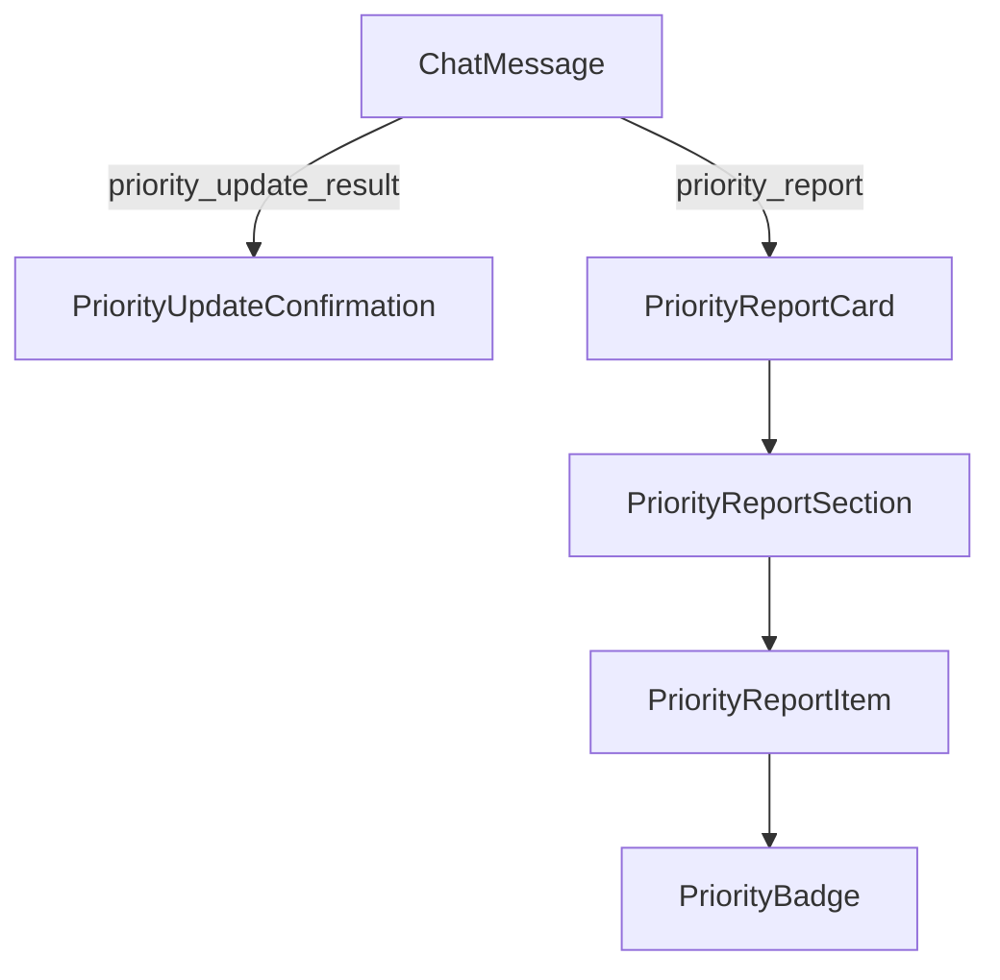

# DSD-002_FEAT-004 フロントエンド詳細設計書（タスク優先度・スケジュール調整）

| 項目 | 値 |
|---|---|
| ドキュメントID | DSD-002_FEAT-004 |
| バージョン | 1.0 |
| 作成日 | 2026-03-03 |
| 機能ID | FEAT-004 |
| 機能名 | タスク優先度・スケジュール調整 |
| 入力元 | BSD-003, BSD-004, BSD-005 |
| ステータス | 初版 |

---

## 目次

1. 機能概要
2. コンポーネント構成
3. コンポーネント詳細設計
4. 優先タスクレポートのMarkdown表示
5. 状態管理設計
6. ツール呼び出し表示
7. APIクライアント設計
8. エラーハンドリング
9. アクセシビリティ設計
10. 後続フェーズへの影響

---

## 1. 機能概要

### 1.1 対象画面

FEAT-004（タスク優先度・スケジュール調整）はチャット画面（SCR-003）で操作する。フロントエンドの主な役割は:

1. **優先度変更の確認表示**: 優先度変更完了をチャットバブルで表示
2. **期日変更の確認表示**: 期日変更完了をチャットバブルで表示
3. **優先タスクレポートのMarkdown表示**: `get_priority_report` ツールの結果をMarkdown形式で整形表示する。番号付きリスト・太字チケットID・優先度カラーを適用する

### 1.2 UIインタラクションシナリオ

**シナリオA: 優先度変更**
```
ユーザー: 「#123を緊急にして」
エージェント: [⚡ 優先度変更] タスク #123「設計書作成」の優先度を「緊急」に変更しました！
             ┌─────────────────────┐
             │ ⚡ 優先度変更完了    │
             │ #123 設計書作成      │
             │ → 緊急              │
             └─────────────────────┘
```

**シナリオB: 優先タスクレポート**
```
ユーザー: 「今日何をすればいい？」
エージェント: [📊 優先タスク分析]
             今日は以下の順で対応することをお勧めします：

             ## 優先タスクレポート（2026年03月03日時点）
             未完了タスク数: 8件

             ### 🚨 期限超過（要対応）
             1. **#45** コードレビュー（2日超過・優先度: 緊急）
             2. **#32** バグ修正（5日超過・優先度: 高）

             ### ⚡ 今日期限
             3. **#78** テスト実施（優先度: 高）

             ### 📅 今週中
             4. **#15** 設計書作成（期日: 03/06・優先度: 通常）
             ...
```

---

## 2. コンポーネント構成

### 2.1 新規追加・変更コンポーネント

FEAT-004では以下のコンポーネントを追加・変更する。ChatContainer・ChatMessage等のFEAT-003共通コンポーネントはそのまま使用する。

```
app/components/chat/
├── ChatMessage.tsx               # 変更: TaskPriorityUpdate表示を追加
├── PriorityUpdateConfirmation.tsx  # 新規: 優先度/期日変更完了カード
├── PriorityReportCard.tsx          # 新規: 優先タスクレポート表示カード
└── PriorityReportItem.tsx          # 新規: レポートの個別項目
```

### 2.2 コンポーネントツリー（FEAT-004追加分）



---

## 3. コンポーネント詳細設計

### 3.1 PriorityUpdateConfirmation.tsx

**役割**: 優先度変更・期日変更完了時に表示する確認カード。FEAT-003の`TaskUpdateConfirmation`を継承・拡張したコンポーネント。

```typescript
// app/components/chat/PriorityUpdateConfirmation.tsx

"use client";

import { ArrowUp, Calendar, CheckCircle } from "lucide-react";

type UpdateType = "priority_changed" | "due_date_changed";

interface PriorityUpdateResult {
  type: UpdateType;
  issueId: number;
  issueTitle: string;
  newPriority?: string;      // type="priority_changed" 時
  newPriorityId?: number;    // 優先度に応じた色付けに使用
  newDueDate?: string;       // type="due_date_changed" 時（表示用文字列）
  redmineUrl?: string;
}

interface PriorityUpdateConfirmationProps {
  result: PriorityUpdateResult;
}

// 優先度IDに対応する色クラス
const PRIORITY_COLORS: Record<number, string> = {
  1: "text-gray-500",   // 低
  2: "text-blue-500",   // 通常
  3: "text-yellow-500", // 高
  4: "text-orange-500", // 緊急
  5: "text-red-600",    // 即座に
};

const PRIORITY_BORDER_COLORS: Record<number, string> = {
  1: "border-gray-200 bg-gray-50",
  2: "border-blue-200 bg-blue-50",
  3: "border-yellow-200 bg-yellow-50",
  4: "border-orange-200 bg-orange-50",
  5: "border-red-200 bg-red-50",
};

export function PriorityUpdateConfirmation({ result }: PriorityUpdateConfirmationProps) {
  const colorClass = result.newPriorityId
    ? PRIORITY_COLORS[result.newPriorityId] ?? "text-gray-700"
    : "text-green-700";
  const borderClass = result.newPriorityId
    ? PRIORITY_BORDER_COLORS[result.newPriorityId] ?? "border-gray-200 bg-gray-50"
    : "border-green-200 bg-green-50";

  return (
    <div
      className={`border rounded-lg p-3 max-w-sm ${borderClass}`}
      role="status"
      aria-label={
        result.type === "priority_changed" ? "優先度変更完了" : "期日変更完了"
      }
    >
      <div className="flex items-start gap-2">
        {result.type === "priority_changed" ? (
          <ArrowUp className={`w-4 h-4 mt-0.5 flex-shrink-0 ${colorClass}`} />
        ) : (
          <Calendar className="w-4 h-4 mt-0.5 flex-shrink-0 text-green-600" />
        )}
        <div className="min-w-0">
          <p className={`text-sm font-medium ${colorClass}`}>
            {result.type === "priority_changed" ? "優先度変更完了" : "期日変更完了"}
          </p>
          <p className="text-xs text-gray-600 mt-0.5 truncate">
            #{result.issueId} {result.issueTitle}
          </p>
          {result.newPriority && (
            <p className={`text-xs mt-1 font-medium ${colorClass}`}>
              → {result.newPriority}
            </p>
          )}
          {result.newDueDate && (
            <p className="text-xs text-green-600 mt-1 font-medium">
              → {result.newDueDate}
            </p>
          )}
          {result.redmineUrl && (
            <a
              href={result.redmineUrl}
              target="_blank"
              rel="noopener noreferrer"
              className="inline-flex items-center gap-1 text-xs text-gray-500 hover:text-gray-700 mt-1 underline"
            >
              Redmineで確認
            </a>
          )}
        </div>
      </div>
    </div>
  );
}
```

### 3.2 PriorityReportCard.tsx

**役割**: 優先タスクレポートを構造化して表示するカード。バックエンドのMarkdown文字列をパースして視覚的に整形表示する。

```typescript
// app/components/chat/PriorityReportCard.tsx

"use client";

import { memo } from "react";
import ReactMarkdown from "react-markdown";
import { AlertTriangle, Zap, Calendar, Inbox } from "lucide-react";

interface PriorityReportCardProps {
  markdownContent: string;
  totalOpenCount: number;
  generatedAt: string; // "2026年03月03日" 形式
}

// セクション別のアイコン・色設定
const SECTION_CONFIG = {
  "期限超過": {
    icon: AlertTriangle,
    colorClass: "text-red-600",
    bgClass: "bg-red-50 border-red-200",
    headerClass: "text-red-700 font-bold",
  },
  "今日期限": {
    icon: Zap,
    colorClass: "text-orange-600",
    bgClass: "bg-orange-50 border-orange-200",
    headerClass: "text-orange-700 font-bold",
  },
  "今週中": {
    icon: Calendar,
    colorClass: "text-blue-600",
    bgClass: "bg-blue-50 border-blue-200",
    headerClass: "text-blue-700 font-semibold",
  },
  "期日なし": {
    icon: Inbox,
    colorClass: "text-gray-600",
    bgClass: "bg-gray-50 border-gray-200",
    headerClass: "text-gray-700 font-semibold",
  },
} as const;

export const PriorityReportCard = memo(function PriorityReportCard({
  markdownContent,
}: PriorityReportCardProps) {
  return (
    <div className="border border-gray-200 rounded-xl overflow-hidden max-w-lg">
      {/* ヘッダー */}
      <div className="bg-gray-800 text-white px-4 py-2 flex items-center gap-2">
        <span className="text-sm font-semibold">📊 優先タスクレポート</span>
      </div>

      {/* Markdownコンテンツ */}
      <div className="p-4 bg-white">
        <ReactMarkdown
          className="prose prose-sm max-w-none"
          components={{
            // h2: レポートタイトル
            h2: ({ children }) => (
              <h2 className="text-base font-bold text-gray-800 mb-1 pb-1 border-b border-gray-200">
                {children}
              </h2>
            ),
            // h3: セクションヘッダー（🚨 期限超過 など）
            h3: ({ children }) => {
              const text = String(children).replace(/[🚨⚡📅📋]/u, "").trim();
              const config = Object.entries(SECTION_CONFIG).find(([key]) =>
                text.includes(key)
              );
              const { headerClass } = config?.[1] ?? {
                headerClass: "text-gray-700 font-semibold",
              };
              return (
                <h3 className={`text-sm mt-3 mb-1 ${headerClass}`}>
                  {children}
                </h3>
              );
            },
            // ol: ランク付きリスト
            ol: ({ children }) => (
              <ol className="list-none space-y-1.5 pl-0">
                {children}
              </ol>
            ),
            // li: 個別タスクアイテム
            li: ({ children }) => (
              <li className="flex items-start gap-1 text-sm text-gray-700 py-0.5">
                <span className="text-gray-400 min-w-[1.5rem]">
                  {/* ランク番号はMarkdownのol/liレンダリングで自動付与 */}
                </span>
                <span className="flex-1">{children}</span>
              </li>
            ),
            // strong: チケットIDの太字強調（#123）
            strong: ({ children }) => (
              <strong className="text-blue-600 font-semibold">{children}</strong>
            ),
            // p: 通常テキスト
            p: ({ children }) => (
              <p className="text-sm text-gray-600 mb-1">{children}</p>
            ),
          }}
        >
          {markdownContent}
        </ReactMarkdown>
      </div>
    </div>
  );
});
```

### 3.3 PriorityBadge.tsx

**役割**: タスクの優先度を色付きバッジで表示する。

```typescript
// app/components/chat/PriorityBadge.tsx

"use client";

interface PriorityBadgeProps {
  priorityId: number;
  priorityName: string;
}

const PRIORITY_STYLES: Record<number, { bg: string; text: string; border: string }> = {
  1: { bg: "bg-gray-100", text: "text-gray-600", border: "border-gray-300" }, // 低
  2: { bg: "bg-blue-100", text: "text-blue-700", border: "border-blue-300" }, // 通常
  3: { bg: "bg-yellow-100", text: "text-yellow-700", border: "border-yellow-300" }, // 高
  4: { bg: "bg-orange-100", text: "text-orange-700", border: "border-orange-300" }, // 緊急
  5: { bg: "bg-red-100", text: "text-red-700", border: "border-red-300" }, // 即座に
};

export function PriorityBadge({ priorityId, priorityName }: PriorityBadgeProps) {
  const styles = PRIORITY_STYLES[priorityId] ?? PRIORITY_STYLES[2];

  return (
    <span
      className={`inline-flex items-center px-1.5 py-0.5 rounded text-xs font-medium border
        ${styles.bg} ${styles.text} ${styles.border}`}
    >
      {priorityName}
    </span>
  );
}
```

---

## 4. 優先タスクレポートのMarkdown表示

### 4.1 表示仕様

FEAT-004の優先タスクレポートは、バックエンドの `PriorityReport.to_markdown()` が生成したMarkdown文字列をフロントエンドで表示する。

**表示方式の選択**:
1. **標準Markdownレンダリング（採用）**: `react-markdown` でMarkdown文字列をそのままHTMLに変換する。`ChatMessage.tsx` の既存Markdownレンダリングロジックを使用する。
2. **構造化コンポーネント表示（オプション）**: SSEの `tool_result` イベントからJSONデータを受け取り、`PriorityReportCard` コンポーネントで構造化表示する。

**フェーズ1採用方式**: 標準Markdownレンダリング（方式1）を採用する。`ChatMessage.tsx` の `react-markdown` がMarkdown文字列を表示する。優先タスクレポートの内容はLLMが `get_priority_report` のtool_resultを解釈して最終応答として返す形式。

### 4.2 Markdown表示サンプル

```markdown
## 優先タスクレポート（2026年03月03日時点）
未完了タスク数: 8件

### 🚨 期限超過（要対応）
1. **#45** コードレビュー（2日超過・優先度: 緊急）
2. **#32** バグ修正（5日超過・優先度: 高）

### ⚡ 今日期限
3. **#78** テスト実施（優先度: 高）

### 📅 今週中
4. **#15** 設計書作成（期日: 03/06・優先度: 通常）
5. **#23** API実装（期日: 03/07・優先度: 高）

### 📋 期日なし
6. **#9** ドキュメント整備（優先度: 低）
```

### 4.3 CSS スタイリング（Markdown表示の強調）

```css
/* globals.css または tailwind.config.js のプラグインで定義 */
.prose strong {
  @apply text-blue-600 font-semibold;
}

.prose h3 {
  @apply text-sm font-semibold mt-3 mb-1;
}

.prose ol {
  @apply pl-4 space-y-1;
}

.prose li {
  @apply text-sm text-gray-700;
}
```

---

## 5. 状態管理設計

### 5.1 型定義の拡張（FEAT-004追加分）

```typescript
// types/chat.ts への追加

export interface PriorityUpdateResult {
  type: "priority_changed" | "due_date_changed";
  issueId: number;
  issueTitle: string;
  newPriority?: string;
  newPriorityId?: number;
  newDueDate?: string;     // 表示用日本語文字列（「2026年03月13日」）
  newDueDateIso?: string;  // ISO 8601形式（機械処理用）
  redmineUrl?: string;
}

// Message型のpriority_update_resultフィールドを追加
export interface Message {
  // ... 既存フィールド（FEAT-003から継承）
  priorityUpdateResult?: PriorityUpdateResult;  // FEAT-004追加
}
```

### 5.2 SSEイベント処理の拡張

FEAT-004のツール実行結果をSSEの `tool_result` イベントから抽出する処理を `useChat` フックに追加する。

```typescript
// hooks/useChat.ts の handleSSEEvent 関数への追記

case "tool_result":
  setMessages((prev) =>
    prev.map((m) => {
      if (m.id !== messageId) return m;
      const updatedToolCalls = /* ... ToolCallBadge更新 */;

      // FEAT-003: タスク更新結果
      let taskUpdateResult = m.taskUpdateResult;
      if (event.tool === "update_task_status" || event.tool === "add_task_comment") {
        // ...（FEAT-003の既存実装）
      }

      // FEAT-004: 優先度・期日変更結果
      let priorityUpdateResult = m.priorityUpdateResult;
      if (event.tool === "update_task_priority") {
        try {
          const output = JSON.parse(event.output as string);
          priorityUpdateResult = {
            type: "priority_changed",
            issueId: output.issue_id as number,
            issueTitle: output.title as string,
            newPriority: output.new_priority as string,
            newPriorityId: output.new_priority_id as number,
            redmineUrl: output.redmine_url as string | undefined,
          };
        } catch { /* パース失敗は無視 */ }
      }

      if (event.tool === "update_task_due_date") {
        try {
          const output = JSON.parse(event.output as string);
          priorityUpdateResult = {
            type: "due_date_changed",
            issueId: output.issue_id as number,
            issueTitle: output.title as string,
            newDueDate: output.new_due_date_display as string,
            newDueDateIso: output.new_due_date_iso as string,
            redmineUrl: output.redmine_url as string | undefined,
          };
        } catch { /* パース失敗は無視 */ }
      }

      return {
        ...m,
        toolCalls: updatedToolCalls,
        taskUpdateResult,
        priorityUpdateResult,
      };
    })
  );
  break;
```

---

## 6. ツール呼び出し表示

### 6.1 FEAT-004のToolCallBadge設定（既存コンポーネントへの追加）

`ToolCallBadge.tsx` の `TOOL_LABELS` と `TOOL_ICONS` にFEAT-004のツールを追加する。

```typescript
// 既存の TOOL_LABELS・TOOL_ICONS への追記（FEAT-003ですでに追加済みの場合は確認）

const TOOL_LABELS: Record<string, string> = {
  // ... FEAT-003の既存エントリ
  update_task_priority: "優先度変更",     // FEAT-004
  update_task_due_date: "期日変更",       // FEAT-004
  get_priority_report: "優先タスク分析",  // FEAT-004
};

const TOOL_ICONS: Record<string, string> = {
  // ... FEAT-003の既存エントリ
  update_task_priority: "⚡",  // FEAT-004
  update_task_due_date: "📅",  // FEAT-004
  get_priority_report: "📊",   // FEAT-004
};
```

### 6.2 優先タスク分析の進行状態表示

`get_priority_report` は複数のRedmine APIコールを伴うため、実行中はより詳細な進行状態を表示する。

```typescript
// AgentThinkingIndicator に currentAction プロップを活用

// agent_nodeのSSEイベントで以下のようなアクション情報を受け取る（将来実装）
// {"type": "agent_action", "description": "未完了タスクを取得中..."}
// {"type": "agent_action", "description": "優先順位を分析中..."}
```

---

## 7. APIクライアント設計

### 7.1 タスク更新APIクライアント（FEAT-004対応追加）

```typescript
// lib/api/tasks.ts への追記

interface UpdateTaskPriorityRequest {
  priority_id: number;
}

interface UpdateTaskDueDateRequest {
  due_date: string; // ISO 8601形式
}

/**
 * タスクの優先度を更新する（PUT /api/v1/tasks/{id}）
 */
export async function updateTaskPriority(
  taskId: string,
  request: UpdateTaskPriorityRequest
): Promise<TaskResponse> {
  const response = await fetch(`${API_BASE_URL}/api/v1/tasks/${taskId}`, {
    method: "PUT",
    headers: { "Content-Type": "application/json" },
    body: JSON.stringify({ priority: getPriorityName(request.priority_id) }),
  });

  if (!response.ok) {
    const errorData = await response.json().catch(() => ({}));
    throw new Error(errorData.error?.message ?? "優先度の更新に失敗しました");
  }

  const data = await response.json();
  return data.data;
}

/**
 * タスクの期日を更新する（PUT /api/v1/tasks/{id}）
 */
export async function updateTaskDueDate(
  taskId: string,
  request: UpdateTaskDueDateRequest
): Promise<TaskResponse> {
  const response = await fetch(`${API_BASE_URL}/api/v1/tasks/${taskId}`, {
    method: "PUT",
    headers: { "Content-Type": "application/json" },
    body: JSON.stringify({ due_date: request.due_date }),
  });

  if (!response.ok) {
    const errorData = await response.json().catch(() => ({}));
    throw new Error(errorData.error?.message ?? "期日の更新に失敗しました");
  }

  const data = await response.json();
  return data.data;
}

// priority_idからstatus名を返すヘルパー
function getPriorityName(priorityId: number): string {
  const names: Record<number, string> = {
    1: "low",
    2: "normal",
    3: "high",
    4: "urgent",
    5: "immediate",
  };
  return names[priorityId] ?? "normal";
}
```

---

## 8. エラーハンドリング

### 8.1 エラー種別と表示方式

| エラー種別 | 表示方式 | ユーザーへのメッセージ |
|---|---|---|
| 無効な優先度ID | チャットバブル（エージェントが説明） | 「優先度IDが無効です。低・通常・高・緊急・即座にのいずれかを指定してください」 |
| 無効な期日形式 | チャットバブル（エージェントが説明） | 「期日の指定方法が認識できませんでした。例: 「来週金曜」「3月7日」「2026-03-07」」 |
| 期日が大幅に過去 | チャットバブル（警告） | 「指定された期日（{日付}）は過去の日付です。設定しますか？」 |
| タスク不存在 | チャットバブル | 「タスク #XXX が見つかりません」 |
| Redmine接続エラー | エラーバナー | 「Redmineとの接続に失敗しました」 |
| 未完了タスク0件 | チャットバブル | 「未完了タスクはありません。全タスクが完了しています！」 |

### 8.2 過去の期日への警告表示

```typescript
// ChatMessage.tsx内でPriorityUpdateConfirmation表示時の警告チェック
function isPastDueDate(dueDateIso: string): boolean {
  const dueDate = new Date(dueDateIso);
  const today = new Date();
  today.setHours(0, 0, 0, 0);
  return dueDate < today;
}

// 過去の期日が設定された場合、黄色の警告スタイルで表示
const borderStyle = isPastDueDate(result.newDueDateIso ?? "")
  ? "border-yellow-300 bg-yellow-50"
  : "border-green-200 bg-green-50";
```

---

## 9. アクセシビリティ設計

### 9.1 ARIA属性

| コンポーネント | ARIA属性 | 目的 |
|---|---|---|
| PriorityUpdateConfirmation（優先度変更） | `role="status"`, `aria-label="優先度変更完了"` | 変更結果の通知 |
| PriorityUpdateConfirmation（期日変更） | `role="status"`, `aria-label="期日変更完了"` | 変更結果の通知 |
| PriorityReportCard | `role="region"`, `aria-label="優先タスクレポート"` | レポート領域の識別 |
| PriorityBadge | `aria-label="{優先度名}"` | バッジの意味説明 |

### 9.2 色のアクセシビリティ

優先度のカラー表示はカラーのみに依存しない。優先度名テキストを必ず表示し、色盲ユーザーもテキストで判別できるようにする。

| 優先度 | 色 | テキスト |
|---|---|---|
| 低 | グレー | 「低」 |
| 通常 | ブルー | 「通常」 |
| 高 | イエロー | 「高」 |
| 緊急 | オレンジ | 「緊急」 |
| 即座に | レッド | 「即座に」 |

---

## 10. 後続フェーズへの影響

| 影響先 | 内容 |
|---|---|
| DSD-003_FEAT-004 | APIレスポンス（priority/due_dateフィールド）の型定義確認 |
| IMP-002_FEAT-004 | フロントエンド実装: PriorityUpdateConfirmation・PriorityReportCard のTDD実装 |
| IT-001_FEAT-004 | 結合テスト: 優先度変更・期日変更・優先タスクレポートのE2Eフロー確認 |
| DSD-008_FEAT-004 | フロントエンド単体テスト: PriorityUpdateConfirmation・PriorityReportCardのレンダリングテスト |
