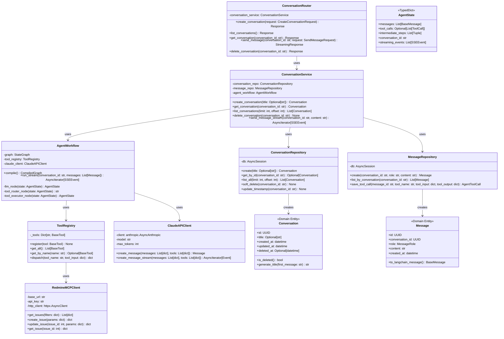
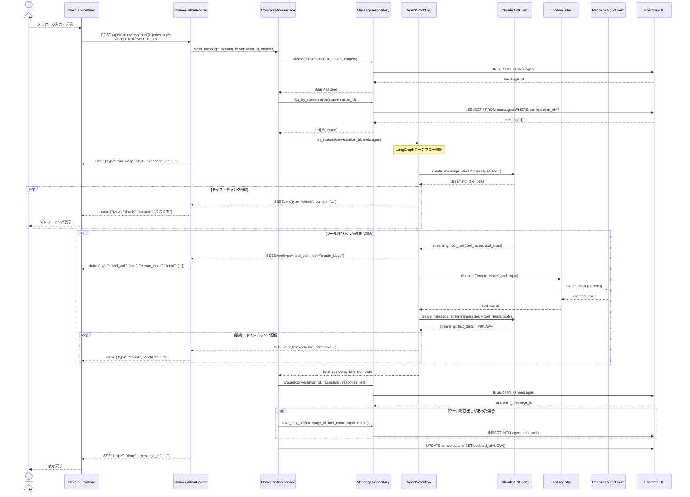
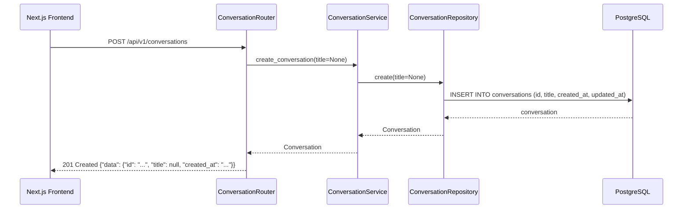
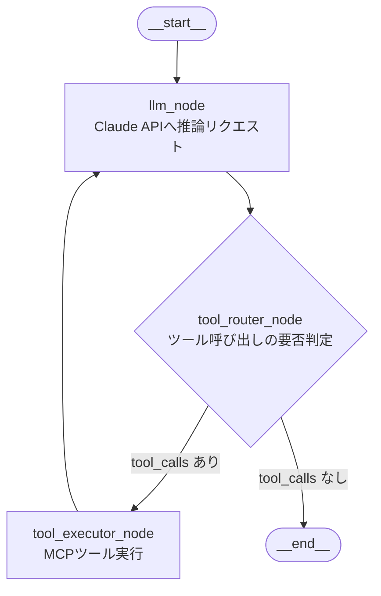

# DSD-001_FEAT-005 バックエンド機能詳細設計書（チャットUI）

| 項目 | 値 |
|---|---|
| ドキュメントID | DSD-001_FEAT-005 |
| バージョン | 1.0 |
| 作成日 | 2026-03-03 |
| 機能ID | FEAT-005 |
| 機能名 | チャットUI（chat-ui） |
| 入力元 | BSD-001, BSD-002, BSD-004, BSD-009, REQ-005（UC-008） |
| ステータス | 初版 |

---

## 目次

1. 機能概要
2. アーキテクチャ概要
3. モジュール構成
4. クラス図
5. シーケンス図
6. LangGraphワークフロー設計
7. ConversationService設計
8. SSEストリーミング実装
9. ToolRegistryおよびToolDispatch設計
10. エラーハンドリング
11. ログ設計
12. 後続フェーズへの影響

---

## 1. 機能概要

FEAT-005（チャットUI）のバックエンドは、以下の責務を担う。

| 責務 | 詳細 |
|---|---|
| LangGraphワークフロー実行 | ユーザーメッセージを受け取り、LangGraph エージェントを起動して Claude API 経由で推論・ツール実行する |
| 会話セッション管理 | 会話の作成・継続・取得・削除を管理する（PostgreSQL 永続化） |
| メッセージ永続化 | ユーザーメッセージとエージェント応答をDBに保存する |
| SSEストリーミング | エージェント応答チャンクをリアルタイムにフロントエンドへ配信する |
| ツールレジストリ | Redmine MCP ツール群を登録し、LangGraph ノードから呼び出せるようにする |

---

## 2. アーキテクチャ概要

### 2.1 レイヤー構成

本機能はBSD-001で定義したレイヤードアーキテクチャに従い、以下のレイヤーに実装する。

```
プレゼンテーション層（FastAPI Router）
    ├── app/chat/router.py          # HTTP ルーター（SSE エンドポイント定義）
    └── app/chat/schemas.py         # Pydantic リクエスト/レスポンススキーマ

アプリケーション層（Application Services）
    ├── app/agent/workflow.py       # LangGraphワークフロー定義・実行
    └── app/chat/service.py         # ConversationService（ユースケース制御）

ドメイン層（Domain Model）
    ├── app/chat/domain/models.py   # Conversation, Message エンティティ
    └── app/chat/domain/events.py   # ConversationStarted, AgentTaskCompleted イベント

インフラストラクチャ層（Infrastructure）
    ├── app/chat/repository.py      # ConversationRepository, MessageRepository（SQLAlchemy）
    ├── app/agent/tools/registry.py # ToolRegistry（MCPツール登録）
    └── app/integration/claude.py   # Claude API クライアント（Anthropic SDK）
```

### 2.2 パッケージ構成

BSD-009の4コンテキスト方針に基づき、以下のパッケージ構成とする。

```
backend/
├── app/
│   ├── main.py                    # FastAPI アプリケーションエントリーポイント
│   ├── config.py                  # 環境変数・設定管理
│   ├── database.py                # SQLAlchemy エンジン・セッション設定
│   ├── chat/                      # CTX-002: エージェント/チャットコンテキスト
│   │   ├── __init__.py
│   │   ├── router.py              # FastAPI ルーター
│   │   ├── schemas.py             # Pydantic スキーマ
│   │   ├── service.py             # ConversationService
│   │   ├── repository.py          # ConversationRepository, MessageRepository
│   │   └── domain/
│   │       ├── models.py          # ドメインモデル
│   │       └── events.py          # ドメインイベント
│   ├── agent/                     # LangGraph エージェント
│   │   ├── __init__.py
│   │   ├── workflow.py            # AgentWorkflow（LangGraph グラフ定義）
│   │   ├── state.py               # AgentState（グラフ状態型定義）
│   │   └── tools/
│   │       ├── __init__.py
│   │       ├── registry.py        # ToolRegistry
│   │       └── redmine_tools.py   # Redmine MCPツール定義
│   └── integration/
│       ├── __init__.py
│       ├── claude.py              # Claude API クライアント
│       └── mcp_client.py          # MCP Client（Redmine 連携）
├── tests/                         # テストコード（DSD-008 参照）
└── requirements.txt
```

---

## 3. モジュール構成

### 3.1 モジュール責務定義

| モジュール | クラス/関数 | 責務 |
|---|---|---|
| `app/chat/router.py` | `ConversationRouter` | HTTPエンドポイントの定義・リクエスト受付・SSEレスポンス返却 |
| `app/chat/service.py` | `ConversationService` | 会話作成・メッセージ保存・エージェント実行の制御 |
| `app/chat/repository.py` | `ConversationRepository` | conversations テーブルのCRUD操作 |
| `app/chat/repository.py` | `MessageRepository` | messages テーブルのCRUD操作 |
| `app/agent/workflow.py` | `AgentWorkflow` | LangGraphグラフの定義・実行・SSEイベント生成 |
| `app/agent/state.py` | `AgentState` | LangGraphグラフの状態型定義（TypedDict） |
| `app/agent/tools/registry.py` | `ToolRegistry` | ツールの登録・取得・ディスパッチ |
| `app/integration/claude.py` | `ClaudeAPIClient` | Anthropic SDK ラッパー・ストリーミング対応 |
| `app/integration/mcp_client.py` | `RedmineMCPClient` | Redmine REST API 呼び出しラッパー |

---

## 4. クラス図



---

## 5. シーケンス図

### 5.1 メッセージ送信・エージェント実行・SSE配信フロー



### 5.2 会話作成フロー



---

## 6. LangGraphワークフロー設計

### 6.1 グラフ構成

LangGraphのStateGraphを使用して以下のワークフローを定義する。



### 6.2 AgentState型定義

```python
# app/agent/state.py
from typing import TypedDict, List, Optional, Tuple, Annotated
from langchain_core.messages import BaseMessage
import operator

class ToolCallRecord(TypedDict):
    tool_name: str
    tool_input: dict
    tool_output: dict

class SSEEvent(TypedDict):
    type: str          # "chunk" | "tool_call" | "tool_result" | "done" | "error"
    content: Optional[str]
    tool: Optional[str]
    tool_input: Optional[dict]
    result: Optional[dict]
    message_id: Optional[str]
    error: Optional[str]

class AgentState(TypedDict):
    messages: Annotated[List[BaseMessage], operator.add]
    tool_calls: Optional[List[dict]]
    intermediate_steps: Annotated[List[ToolCallRecord], operator.add]
    conversation_id: str
    streaming_events: Annotated[List[SSEEvent], operator.add]
```

### 6.3 各ノードの実装仕様

#### llm_nodeノード

```python
async def llm_node(state: AgentState) -> AgentState:
    """
    Claude API にメッセージを送信し、推論結果を取得する。
    ストリーミングでテキストチャンクを生成する。
    """
    # 入力: state["messages"] = 会話履歴 + 今回のユーザーメッセージ
    # 出力:
    #   - テキスト応答: state["messages"] に AIMessage を追加
    #   - ツール呼び出し: state["tool_calls"] にツール呼び出し情報を設定
    #   - ストリーミングイベント: state["streaming_events"] に chunk イベントを追加
```

| 項目 | 詳細 |
|---|---|
| Claude APIモデル | claude-opus-4-6（環境変数 ANTHROPIC_MODEL で変更可能） |
| システムプロンプト | 「あなたはRedmineタスク管理を支援するAIアシスタントです。タスクの作成・更新・検索を行うツールを使用できます。タスクの削除は行いません。」 |
| ツール定義 | ToolRegistry.get_all() で取得した全ツールをAnthropic SDK形式のtool_choiceで渡す |
| max_tokens | 4096（環境変数 AGENT_MAX_TOKENS で変更可能） |
| タイムアウト | 30秒（環境変数 CLAUDE_TIMEOUT_SECONDS で変更可能） |

#### tool_router_nodeノード（条件分岐エッジ）

```python
def tool_router_node(state: AgentState) -> str:
    """
    state["tool_calls"] の有無でルーティングを決定する。
    """
    if state.get("tool_calls"):
        return "tool_executor_node"
    return "__end__"
```

#### tool_executor_nodeノード

```python
async def tool_executor_node(state: AgentState) -> AgentState:
    """
    tool_calls に含まれる各ツールを順次実行し、結果を messages に追加する。
    """
    # 入力: state["tool_calls"] = [{"id": "call_xxx", "name": "create_issue", "input": {...}}]
    # 処理:
    #   1. tool_calls を順次ループ
    #   2. ToolRegistry.dispatch(tool_name, tool_input) でツール実行
    #   3. ToolMessage を state["messages"] に追加
    #   4. state["intermediate_steps"] に実行記録を追加
    #   5. state["streaming_events"] に tool_result イベントを追加
    # 出力: state["tool_calls"] = None（クリア）
```

### 6.4 グラフのコンパイルと実行

```python
# app/agent/workflow.py
from langgraph.graph import StateGraph, END
from langgraph.checkpoint.memory import MemorySaver

class AgentWorkflow:
    def __init__(self, tool_registry: ToolRegistry, claude_client: ClaudeAPIClient):
        self.tool_registry = tool_registry
        self.claude_client = claude_client
        self._graph = self._build_graph()

    def _build_graph(self) -> StateGraph:
        graph = StateGraph(AgentState)
        graph.add_node("llm_node", self.llm_node)
        graph.add_node("tool_executor_node", self.tool_executor_node)
        graph.add_edge("__start__", "llm_node")
        graph.add_conditional_edges(
            "llm_node",
            self.tool_router_node,
            {"tool_executor_node": "tool_executor_node", "__end__": END}
        )
        graph.add_edge("tool_executor_node", "llm_node")
        return graph.compile()

    async def run_stream(
        self,
        conversation_id: str,
        messages: List[BaseMessage]
    ) -> AsyncIterator[SSEEvent]:
        initial_state = AgentState(
            messages=messages,
            tool_calls=None,
            intermediate_steps=[],
            conversation_id=conversation_id,
            streaming_events=[]
        )
        async for chunk in self._graph.astream(initial_state):
            for event in chunk.get("streaming_events", []):
                yield event
```

---

## 7. ConversationService設計

### 7.1 メソッド仕様

#### create_conversation

```
入力: title: Optional[str] = None
処理:
  1. ConversationRepository.create(title) で新規会話レコードを作成
  2. 作成したConversationを返す
出力: Conversation
例外: DatabaseError → HTTPException(500)
```

#### get_conversation

```
入力: conversation_id: str
処理:
  1. ConversationRepository.get_by_id(conversation_id) で会話を取得
  2. 存在しない場合は NotFoundException を発生させる
  3. 論理削除済みの場合も NotFoundException を発生させる
出力: Conversation
例外: NotFoundException → HTTPException(404)
```

#### send_message_stream

```
入力: conversation_id: str, content: str
処理:
  1. get_conversation(conversation_id) で会話の存在確認
  2. MessageRepository.create(conversation_id, "user", content) でユーザーメッセージを保存
  3. MessageRepository.list_by_conversation(conversation_id) で会話履歴を取得
  4. 会話履歴をLangChainのBaseMessageリストに変換
  5. AgentWorkflow.run_stream(conversation_id, messages) でエージェントを実行
  6. SSEイベントを yield する
  7. エージェント実行完了後、最終応答テキストとtool_callsをDBに保存
  8. ConversationRepository.update_timestamp(conversation_id) で更新日時を更新
出力: AsyncIterator[SSEEvent]
例外: NotFoundException → HTTPException(404)
       AgentExecutionError → SSEEvent(type="error")
```

### 7.2 メッセージ変換ロジック

DBのMessagesレコードをLangChainのBaseMessageに変換する。

| DB role | LangChain クラス |
|---|---|
| `user` | `HumanMessage(content=content)` |
| `assistant` | `AIMessage(content=content)` |
| `tool` | `ToolMessage(content=content, tool_call_id=tool_call_id)` |

---

## 8. SSEストリーミング実装

### 8.1 SSEイベント形式仕様

FastAPIのStreamingResponseを使用してSSEを実装する。

```python
# app/chat/router.py
from fastapi import APIRouter
from fastapi.responses import StreamingResponse
import json

async def event_generator(
    conversation_id: str,
    content: str,
    service: ConversationService
):
    """SSEイベントジェネレータ"""
    async for event in service.send_message_stream(conversation_id, content):
        data = json.dumps(event, ensure_ascii=False)
        yield f"data: {data}\n\n"
    yield "data: [DONE]\n\n"

@router.post("/conversations/{conversation_id}/messages")
async def send_message(
    conversation_id: str,
    request: SendMessageRequest,
    service: ConversationService = Depends(get_conversation_service)
):
    return StreamingResponse(
        event_generator(conversation_id, request.content, service),
        media_type="text/event-stream",
        headers={
            "Cache-Control": "no-cache",
            "X-Accel-Buffering": "no"  # Nginx バッファリング無効化
        }
    )
```

### 8.2 SSEイベント型定義

| イベントタイプ | ペイロード例 | 説明 |
|---|---|---|
| `message_start` | `{"type": "message_start", "message_id": "msg_xxx"}` | エージェント応答開始 |
| `chunk` | `{"type": "chunk", "content": "タスクを"}` | テキストチャンク |
| `tool_call` | `{"type": "tool_call", "tool": "create_issue", "input": {...}}` | ツール呼び出し開始 |
| `tool_result` | `{"type": "tool_result", "tool": "create_issue", "result": {...}}` | ツール実行結果 |
| `done` | `{"type": "done", "message_id": "msg_xxx"}` | エージェント応答完了 |
| `error` | `{"type": "error", "error": "Claude API接続エラー"}` | エラー発生 |

---

## 9. ToolRegistryおよびToolDispatch設計

### 9.1 ToolRegistry実装

```python
# app/agent/tools/registry.py
from langchain_core.tools import BaseTool
from typing import Dict, List, Optional

class ToolRegistry:
    """Redmine MCPツールの登録・管理・ディスパッチを行うレジストリ"""

    def __init__(self):
        self._tools: Dict[str, BaseTool] = {}

    def register(self, tool: BaseTool) -> None:
        self._tools[tool.name] = tool

    def get_all(self) -> List[BaseTool]:
        return list(self._tools.values())

    def get_by_name(self, name: str) -> Optional[BaseTool]:
        return self._tools.get(name)

    async def dispatch(self, tool_name: str, tool_input: dict) -> dict:
        tool = self.get_by_name(tool_name)
        if tool is None:
            raise ValueError(f"ツール '{tool_name}' が登録されていません")
        result = await tool.arun(tool_input)
        return result
```

### 9.2 Redmineツール定義

| ツール名 | 説明 | 入力パラメータ | MCP呼び出し |
|---|---|---|---|
| `create_issue` | タスク作成 | title, description, priority_id, due_date, project_id | POST /issues.json |
| `get_issues` | タスク一覧取得 | status_id, assigned_to_id, project_id, limit | GET /issues.json |
| `get_issue` | タスク詳細取得 | issue_id | GET /issues/{id}.json |
| `update_issue` | タスク更新 | issue_id, status_id, priority_id, due_date, notes | PUT /issues/{id}.json |
| `add_issue_note` | コメント追加 | issue_id, notes | PUT /issues/{id}.json（notes フィールドのみ） |

各ツールはLangChainのBaseToolを継承して実装し、ToolRegistryに登録する。

```python
# app/agent/tools/redmine_tools.py
from langchain_core.tools import BaseTool
from pydantic import BaseModel, Field

class CreateIssueInput(BaseModel):
    title: str = Field(description="タスクのタイトル（必須・最大200文字）")
    description: str = Field(default="", description="タスクの詳細説明")
    priority_id: int = Field(default=2, description="優先度ID（1:低 2:通常 3:高 4:緊急）")
    due_date: str = Field(default="", description="期日（YYYY-MM-DD形式）")
    project_id: int = Field(description="RedmineプロジェクトID")

class CreateIssueTool(BaseTool):
    name = "create_issue"
    description = "Redmineに新しいタスク（Issue）を作成する"
    args_schema = CreateIssueInput
    mcp_client: RedmineMCPClient

    async def _arun(self, **kwargs) -> dict:
        return await self.mcp_client.create_issue(kwargs)
```

---

## 10. エラーハンドリング

### 10.1 エラー分類と対応

| エラー種別 | 発生箇所 | 対応方法 | SSEイベント |
|---|---|---|---|
| 会話不存在 | ConversationService.get_conversation | HTTPException(404) を raise | - |
| Claude API タイムアウト | ClaudeAPIClient | asyncio.TimeoutError をキャッチし AgentExecutionError にラップ | `{"type": "error", "error": "処理がタイムアウトしました"}` |
| Claude API 接続失敗 | ClaudeAPIClient | anthropic.APIConnectionError をキャッチ | `{"type": "error", "error": "AIとの通信に失敗しました"}` |
| Redmine 接続失敗 | RedmineMCPClient | httpx.ConnectError をキャッチしリトライ（最大3回） | `{"type": "tool_result", "result": {"error": "Redmine接続失敗"}}` |
| ツール不存在 | ToolRegistry.dispatch | ValueError → `{"type": "error"}` として通知 | `{"type": "error", "error": "ツール実行エラー"}` |
| LangGraph実行エラー | AgentWorkflow.run_stream | 全例外をキャッチし error イベントを yield | `{"type": "error", "error": "エージェント実行エラー"}` |
| DBエラー | Repository層 | SQLAlchemyError をキャッチし HTTPException(500) | - |

### 10.2 Redmine リトライロジック

```python
# app/integration/mcp_client.py
import asyncio
import httpx
from tenacity import retry, stop_after_attempt, wait_exponential

class RedmineMCPClient:
    @retry(
        stop=stop_after_attempt(3),
        wait=wait_exponential(multiplier=1, min=1, max=10)
    )
    async def _request(self, method: str, path: str, **kwargs) -> dict:
        try:
            response = await self.http_client.request(method, path, **kwargs)
            response.raise_for_status()
            return response.json()
        except httpx.ConnectError as e:
            raise RedmineConnectionError(f"Redmine接続失敗: {e}") from e
        except httpx.TimeoutException as e:
            raise RedmineTimeoutError(f"Redmineタイムアウト: {e}") from e
```

---

## 11. ログ設計

### 11.1 ログ出力ポイント

| ログレベル | 出力タイミング | 内容 |
|---|---|---|
| INFO | 会話作成 | `conversation_id={id} created` |
| INFO | メッセージ受信 | `conversation_id={id} user_message received (length={len})` |
| INFO | エージェント実行開始 | `conversation_id={id} agent_workflow started` |
| INFO | ツール呼び出し | `tool={name} called (input_keys={keys})` |
| INFO | ツール実行完了 | `tool={name} completed (duration={ms}ms)` |
| INFO | エージェント実行完了 | `conversation_id={id} agent_workflow completed (duration={ms}ms)` |
| ERROR | Claude API エラー | `claude_api_error: {error_type} (conversation_id={id})` |
| ERROR | Redmine接続エラー | `redmine_connection_error (retry={n})` |
| ERROR | LangGraph実行エラー | `agent_workflow_error: {error_message} (conversation_id={id})` |

### 11.2 ログのマスキング

BSD-002（NFR-SEC-04）に従い、以下をログに出力しない。
- APIキー（ANTHROPIC_API_KEY, REDMINE_API_KEY）
- ユーザーメッセージの全文（先頭50文字に切り詰める）
- エージェント応答の全文（先頭50文字に切り詰める）

---

## 12. 後続フェーズへの影響

| 影響先 | 内容 |
|---|---|
| DSD-003_FEAT-005 | API詳細仕様（エンドポイント・SSEイベント形式・エラーレスポンス）の前提 |
| DSD-004_FEAT-005 | conversations・messages・agent_tool_calls テーブルの詳細定義の前提 |
| DSD-008_FEAT-005 | ConversationService・AgentWorkflow のテストケース設計の前提 |
| IMP-001_FEAT-005 | 本設計書に基づくバックエンド実装・TDDサイクル |
