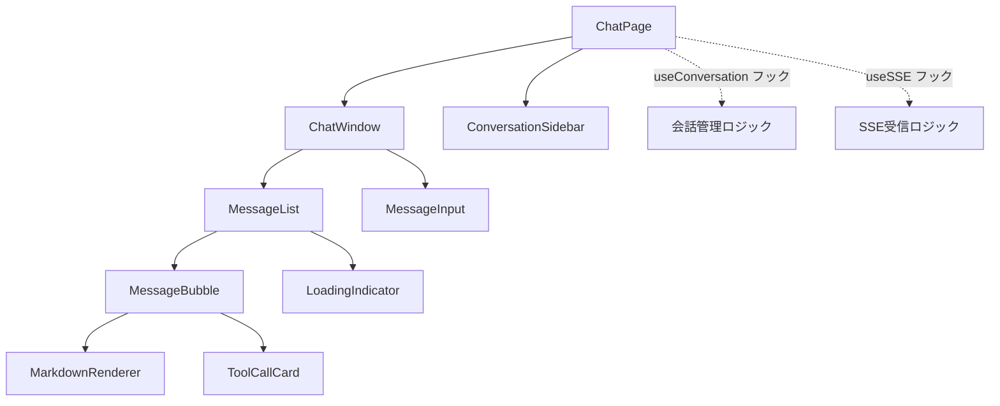
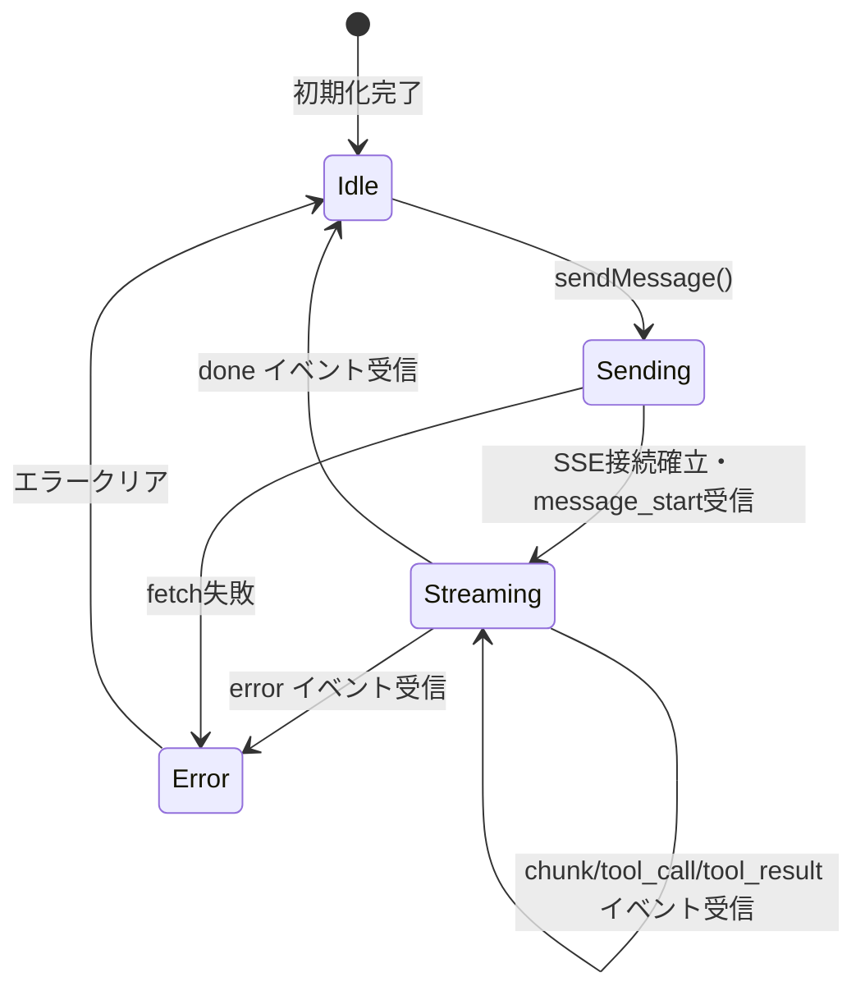

# DSD-002_FEAT-005 フロントエンド詳細設計書（チャットUI）

| 項目 | 値 |
|---|---|
| ドキュメントID | DSD-002_FEAT-005 |
| バージョン | 1.0 |
| 作成日 | 2026-03-03 |
| 機能ID | FEAT-005 |
| 機能名 | チャットUI（chat-ui） |
| 入力元 | BSD-003, BSD-004, BSD-001, REQ-005（UC-008） |
| ステータス | 初版 |

---

## 目次

1. 機能概要
2. ディレクトリ構成
3. コンポーネント構成
4. コンポーネント詳細設計
5. カスタムフック設計
6. SSEクライアント実装
7. 状態管理設計
8. ルーティング設計
9. スタイリング設計
10. エラーハンドリング
11. アクセシビリティ対応
12. 後続フェーズへの影響

---

## 1. 機能概要

FEAT-005（チャットUI）のフロントエンドは、以下の責務を担う。

| 責務 | 詳細 |
|---|---|
| チャット画面表示 | ユーザーとエージェントのメッセージをバブル形式で表示する |
| メッセージ送信 | テキスト入力欄からメッセージを送信する |
| SSEストリーミング受信 | EventSource API を使用してエージェント応答をリアルタイム表示する |
| 会話セッション管理 | 新規会話の作成・既存会話の継続を管理する |
| Markdownレンダリング | エージェント応答をMarkdown形式でレンダリングする |
| ツール呼び出し可視化 | エージェントのツール実行状況をチャット内に表示する |
| レスポンシブ対応 | PC・タブレット・スマートフォンに対応したUIを提供する |

---

## 2. ディレクトリ構成

```
frontend/
├── src/
│   ├── app/
│   │   ├── layout.tsx              # ルートレイアウト（ヘッダー・サイドバー）
│   │   ├── page.tsx                # ルートページ（ダッシュボードへリダイレクト）
│   │   └── chat/
│   │       └── page.tsx            # チャット画面ページ（SCR-003）
│   ├── components/
│   │   ├── chat/
│   │   │   ├── ChatPage.tsx        # チャット画面の親コンポーネント
│   │   │   ├── ChatWindow.tsx      # チャットウィンドウ（メッセージ一覧+入力欄）
│   │   │   ├── MessageList.tsx     # メッセージ一覧
│   │   │   ├── MessageBubble.tsx   # 個別メッセージバブル
│   │   │   ├── MessageInput.tsx    # メッセージ入力欄
│   │   │   ├── LoadingIndicator.tsx # ローディングインジケータ（ストリーミング中）
│   │   │   ├── ToolCallCard.tsx    # ツール呼び出し表示カード
│   │   │   └── MarkdownRenderer.tsx # Markdownレンダリングコンポーネント
│   │   ├── layout/
│   │   │   ├── Header.tsx          # グローバルヘッダー
│   │   │   └── Sidebar.tsx         # サイドバーナビゲーション
│   │   └── common/
│   │       ├── ErrorMessage.tsx    # エラーメッセージ表示
│   │       └── Toast.tsx           # トースト通知
│   ├── hooks/
│   │   ├── useConversation.ts      # 会話セッション管理カスタムフック
│   │   ├── useSSE.ts               # SSEクライアント管理カスタムフック
│   │   └── useAutoScroll.ts        # メッセージリスト自動スクロールフック
│   ├── lib/
│   │   ├── api.ts                  # APIクライアント（fetch ラッパー）
│   │   └── sse.ts                  # SSEクライアントユーティリティ
│   ├── types/
│   │   ├── chat.ts                 # チャット関連の型定義
│   │   └── sse.ts                  # SSEイベント型定義
│   └── styles/
│       └── globals.css             # グローバルスタイル
├── package.json
├── tsconfig.json
└── tailwind.config.ts
```

---

## 3. コンポーネント構成

### 3.1 コンポーネント階層図



### 3.2 コンポーネント責務一覧

| コンポーネント | 責務 | props |
|---|---|---|
| `ChatPage` | チャット画面全体の状態管理・レイアウト制御 | なし（ページコンポーネント） |
| `ChatWindow` | チャットウィンドウ（メッセージ一覧+入力エリア）のレイアウト | `messages`, `onSendMessage`, `isStreaming` |
| `MessageList` | メッセージ一覧の表示・自動スクロール | `messages`, `streamingMessage`, `isStreaming` |
| `MessageBubble` | 個別メッセージのバブル表示（user/assistant で色分け） | `message`, `isStreaming` |
| `MessageInput` | メッセージ入力欄・送信ボタン | `onSend`, `disabled` |
| `LoadingIndicator` | ドット点滅アニメーション（エージェント処理中表示） | `visible` |
| `ToolCallCard` | ツール呼び出し・実行結果の表示カード | `toolCall` |
| `MarkdownRenderer` | Markdownテキストのレンダリング | `content` |

---

## 4. コンポーネント詳細設計

### 4.1 ChatPage

**概要**: チャット画面全体のページコンポーネント。会話セッションと SSE ストリーミングを管理する。

```typescript
// src/components/chat/ChatPage.tsx
'use client';

import { useConversation } from '@/hooks/useConversation';
import { ChatWindow } from './ChatWindow';

export function ChatPage() {
  const {
    conversation,
    messages,
    streamingMessage,
    isStreaming,
    sendMessage,
    createNewConversation,
    error,
  } = useConversation();

  return (
    <div className="flex h-full">
      <div className="flex-1 flex flex-col">
        {error && <ErrorMessage message={error} />}
        <ChatWindow
          messages={messages}
          streamingMessage={streamingMessage}
          isStreaming={isStreaming}
          onSendMessage={sendMessage}
        />
      </div>
    </div>
  );
}
```

**状態（useConversation フック経由）:**

| 状態名 | 型 | 説明 |
|---|---|---|
| `conversation` | `Conversation \| null` | 現在の会話セッション |
| `messages` | `Message[]` | 会話内の全メッセージ |
| `streamingMessage` | `StreamingMessage \| null` | ストリーミング中のメッセージ（逐次更新） |
| `isStreaming` | `boolean` | エージェント応答ストリーミング中フラグ |
| `error` | `string \| null` | エラーメッセージ |

### 4.2 ChatWindow

**概要**: メッセージ一覧と入力欄を縦並びに配置するレイアウトコンポーネント。

```typescript
// src/components/chat/ChatWindow.tsx
interface ChatWindowProps {
  messages: Message[];
  streamingMessage: StreamingMessage | null;
  isStreaming: boolean;
  onSendMessage: (content: string) => void;
}

export function ChatWindow({
  messages,
  streamingMessage,
  isStreaming,
  onSendMessage,
}: ChatWindowProps) {
  return (
    <div className="flex flex-col h-full bg-gray-50">
      <div className="flex-1 overflow-hidden">
        <MessageList
          messages={messages}
          streamingMessage={streamingMessage}
          isStreaming={isStreaming}
        />
      </div>
      <div className="border-t bg-white p-4">
        <MessageInput onSend={onSendMessage} disabled={isStreaming} />
      </div>
    </div>
  );
}
```

### 4.3 MessageList

**概要**: メッセージ一覧を時系列に表示する。新しいメッセージが追加されると自動スクロールする。

```typescript
// src/components/chat/MessageList.tsx
interface MessageListProps {
  messages: Message[];
  streamingMessage: StreamingMessage | null;
  isStreaming: boolean;
}

export function MessageList({ messages, streamingMessage, isStreaming }: MessageListProps) {
  const scrollRef = useAutoScroll([messages, streamingMessage]);

  return (
    <div
      ref={scrollRef}
      className="h-full overflow-y-auto px-4 py-6 space-y-4"
    >
      {messages.map((message) => (
        <MessageBubble key={message.id} message={message} isStreaming={false} />
      ))}

      {/* ストリーミング中の仮メッセージ */}
      {streamingMessage && (
        <MessageBubble
          message={streamingMessage}
          isStreaming={isStreaming}
        />
      )}

      {/* ローディングインジケータ（ストリーミング開始前） */}
      {isStreaming && !streamingMessage && <LoadingIndicator />}
    </div>
  );
}
```

### 4.4 MessageBubble

**概要**: 個別メッセージのバブル表示。roleによってスタイルを切り替える。

```typescript
// src/components/chat/MessageBubble.tsx
interface MessageBubbleProps {
  message: Message | StreamingMessage;
  isStreaming: boolean;
}

export function MessageBubble({ message, isStreaming }: MessageBubbleProps) {
  const isUser = message.role === 'user';

  return (
    <div className={`flex ${isUser ? 'justify-end' : 'justify-start'}`}>
      {/* エージェントアイコン */}
      {!isUser && (
        <div className="w-8 h-8 rounded-full bg-blue-500 flex items-center justify-center mr-2 flex-shrink-0">
          <span className="text-white text-xs">AI</span>
        </div>
      )}

      <div className={`max-w-[75%] ${isUser ? 'order-first' : ''}`}>
        {/* ツール呼び出しカード（エージェントメッセージのみ） */}
        {!isUser && message.toolCalls && message.toolCalls.map((tc, i) => (
          <ToolCallCard key={i} toolCall={tc} />
        ))}

        {/* メッセージバブル */}
        {message.content && (
          <div className={`
            rounded-2xl px-4 py-3 shadow-sm
            ${isUser
              ? 'bg-blue-500 text-white rounded-br-sm'
              : 'bg-white text-gray-800 rounded-bl-sm border border-gray-100'
            }
          `}>
            {isUser ? (
              <p className="whitespace-pre-wrap text-sm">{message.content}</p>
            ) : (
              <MarkdownRenderer content={message.content} />
            )}
            {/* ストリーミングカーソル */}
            {isStreaming && <span className="animate-pulse">▋</span>}
          </div>
        )}
      </div>
    </div>
  );
}
```

**スタイル仕様:**

| role | 背景色 | テキスト色 | 配置 | 角丸 |
|---|---|---|---|---|
| `user` | `bg-blue-500` | `text-white` | 右寄せ | 右下以外角丸 |
| `assistant` | `bg-white` | `text-gray-800` | 左寄せ | 左下以外角丸 |

### 4.5 MessageInput

**概要**: メッセージ入力欄。Enterキーで送信、Shift+Enterで改行。

```typescript
// src/components/chat/MessageInput.tsx
interface MessageInputProps {
  onSend: (content: string) => void;
  disabled: boolean;
}

export function MessageInput({ onSend, disabled }: MessageInputProps) {
  const [value, setValue] = useState('');

  const handleKeyDown = (e: React.KeyboardEvent<HTMLTextAreaElement>) => {
    if (e.key === 'Enter' && !e.shiftKey) {
      e.preventDefault();
      handleSend();
    }
  };

  const handleSend = () => {
    const trimmed = value.trim();
    if (!trimmed || disabled) return;
    onSend(trimmed);
    setValue('');
  };

  return (
    <div className="flex items-end gap-2">
      <textarea
        value={value}
        onChange={(e) => setValue(e.target.value)}
        onKeyDown={handleKeyDown}
        disabled={disabled}
        placeholder="メッセージを入力... (Enterで送信、Shift+Enterで改行)"
        rows={1}
        className="flex-1 resize-none rounded-xl border border-gray-300 px-4 py-3
                   text-sm focus:outline-none focus:ring-2 focus:ring-blue-500
                   disabled:bg-gray-50 disabled:cursor-not-allowed
                   max-h-32 overflow-y-auto"
        style={{ minHeight: '48px' }}
      />
      <button
        onClick={handleSend}
        disabled={disabled || !value.trim()}
        className="rounded-xl bg-blue-500 px-4 py-3 text-white
                   hover:bg-blue-600 disabled:bg-gray-300 disabled:cursor-not-allowed
                   transition-colors duration-200"
        aria-label="送信"
      >
        <SendIcon className="w-5 h-5" />
      </button>
    </div>
  );
}
```

**入力制限:**

| 項目 | 仕様 |
|---|---|
| 最大文字数 | 4000文字（バックエンドAPIの制限に合わせる） |
| 最小文字数 | 1文字（空白のみ不可） |
| Enter送信 | Shift+Enterで改行、Enterのみで送信 |
| ストリーミング中 | 入力欄と送信ボタンをdisabledにする |

### 4.6 ToolCallCard

**概要**: エージェントのツール呼び出しと実行結果を折りたたみ式で表示する。

```typescript
// src/components/chat/ToolCallCard.tsx
interface ToolCallCardProps {
  toolCall: ToolCall;
}

export function ToolCallCard({ toolCall }: ToolCallCardProps) {
  const [isOpen, setIsOpen] = useState(false);

  const toolLabel: Record<string, string> = {
    create_issue: 'タスク作成',
    get_issues: 'タスク一覧取得',
    update_issue: 'タスク更新',
    get_issue: 'タスク詳細取得',
    add_issue_note: 'コメント追加',
  };

  return (
    <div className="mb-2 rounded-lg border border-gray-200 bg-gray-50 text-sm">
      <button
        onClick={() => setIsOpen(!isOpen)}
        className="w-full flex items-center justify-between px-3 py-2 text-gray-600"
      >
        <span className="flex items-center gap-2">
          <WrenchIcon className="w-4 h-4 text-amber-500" />
          {toolLabel[toolCall.tool] ?? toolCall.tool}
        </span>
        <ChevronIcon className={`w-4 h-4 transition-transform ${isOpen ? 'rotate-180' : ''}`} />
      </button>

      {isOpen && (
        <div className="px-3 pb-3 space-y-2">
          <div>
            <p className="text-xs font-medium text-gray-500 mb-1">入力</p>
            <pre className="text-xs bg-white rounded p-2 overflow-x-auto">
              {JSON.stringify(toolCall.input, null, 2)}
            </pre>
          </div>
          {toolCall.result && (
            <div>
              <p className="text-xs font-medium text-gray-500 mb-1">結果</p>
              <pre className="text-xs bg-white rounded p-2 overflow-x-auto">
                {JSON.stringify(toolCall.result, null, 2)}
              </pre>
            </div>
          )}
        </div>
      )}
    </div>
  );
}
```

### 4.7 MarkdownRenderer

**概要**: react-markdown を使用してエージェント応答をMarkdownレンダリングする。XSS対策としてrehype-sanitizeを適用する。

```typescript
// src/components/chat/MarkdownRenderer.tsx
import ReactMarkdown from 'react-markdown';
import rehypeSanitize from 'rehype-sanitize';
import remarkGfm from 'remark-gfm';

interface MarkdownRendererProps {
  content: string;
}

export function MarkdownRenderer({ content }: MarkdownRendererProps) {
  return (
    <ReactMarkdown
      rehypePlugins={[rehypeSanitize]}
      remarkPlugins={[remarkGfm]}
      className="prose prose-sm max-w-none text-gray-800"
      components={{
        // コードブロックのシンタックスハイライト（シンプル実装）
        code({ children, className }) {
          const isBlock = className?.includes('language-');
          return isBlock ? (
            <pre className="bg-gray-100 rounded p-3 overflow-x-auto">
              <code className="text-xs font-mono">{children}</code>
            </pre>
          ) : (
            <code className="bg-gray-100 rounded px-1 py-0.5 text-xs font-mono">
              {children}
            </code>
          );
        },
        // リンクを新しいタブで開く
        a({ href, children }) {
          return (
            <a href={href} target="_blank" rel="noopener noreferrer" className="text-blue-500 underline">
              {children}
            </a>
          );
        },
      }}
    />
  );
}
```

**依存パッケージ:**

| パッケージ | 用途 |
|---|---|
| `react-markdown` | Markdownレンダリング |
| `rehype-sanitize` | XSSサニタイゼーション（BSD-002対応） |
| `remark-gfm` | GitHub Flavored Markdown対応（テーブル・タスクリスト等） |

---

## 5. カスタムフック設計

### 5.1 useConversation

**概要**: 会話セッションの作成・管理・メッセージ送信を一元管理するカスタムフック。

```typescript
// src/hooks/useConversation.ts
import { useState, useCallback, useEffect } from 'react';
import { useSSE } from './useSSE';

interface UseConversationReturn {
  conversation: Conversation | null;
  messages: Message[];
  streamingMessage: StreamingMessage | null;
  isStreaming: boolean;
  error: string | null;
  sendMessage: (content: string) => Promise<void>;
  createNewConversation: () => Promise<void>;
}

export function useConversation(): UseConversationReturn {
  const [conversation, setConversation] = useState<Conversation | null>(null);
  const [messages, setMessages] = useState<Message[]>([]);
  const [streamingMessage, setStreamingMessage] = useState<StreamingMessage | null>(null);
  const [isStreaming, setIsStreaming] = useState(false);
  const [error, setError] = useState<string | null>(null);

  // 初回マウント時に新規会話を作成
  useEffect(() => {
    createNewConversation();
  }, []);

  const createNewConversation = useCallback(async () => {
    try {
      const response = await fetch('/api/v1/conversations', {
        method: 'POST',
        headers: { 'Content-Type': 'application/json' },
        body: JSON.stringify({}),
      });
      if (!response.ok) throw new Error('会話の作成に失敗しました');
      const data = await response.json();
      setConversation(data.data);
      setMessages([]);
      setStreamingMessage(null);
    } catch (e) {
      setError('会話の初期化に失敗しました');
    }
  }, []);

  const sendMessage = useCallback(async (content: string) => {
    if (!conversation || isStreaming) return;

    // 楽観的更新: ユーザーメッセージを即時表示
    const optimisticUserMessage: Message = {
      id: `temp-${Date.now()}`,
      role: 'user',
      content,
      createdAt: new Date().toISOString(),
    };
    setMessages(prev => [...prev, optimisticUserMessage]);
    setIsStreaming(true);
    setStreamingMessage({ role: 'assistant', content: '', toolCalls: [] });
    setError(null);

    try {
      const response = await fetch(
        `/api/v1/conversations/${conversation.id}/messages`,
        {
          method: 'POST',
          headers: {
            'Content-Type': 'application/json',
            'Accept': 'text/event-stream',
          },
          body: JSON.stringify({ content }),
        }
      );

      if (!response.ok) throw new Error('メッセージの送信に失敗しました');
      if (!response.body) throw new Error('レスポンスボディが空です');

      const reader = response.body.getReader();
      const decoder = new TextDecoder();

      let currentContent = '';
      let currentToolCalls: ToolCall[] = [];

      while (true) {
        const { done, value } = await reader.read();
        if (done) break;

        const text = decoder.decode(value, { stream: true });
        const lines = text.split('\n');

        for (const line of lines) {
          if (!line.startsWith('data: ')) continue;
          const dataStr = line.slice(6).trim();
          if (dataStr === '[DONE]') break;

          try {
            const event = JSON.parse(dataStr) as SSEEvent;
            handleSSEEvent(event, {
              onChunk: (chunk) => {
                currentContent += chunk;
                setStreamingMessage(prev => prev ? { ...prev, content: currentContent } : null);
              },
              onToolCall: (toolCall) => {
                currentToolCalls = [...currentToolCalls, toolCall];
                setStreamingMessage(prev => prev ? { ...prev, toolCalls: currentToolCalls } : null);
              },
              onDone: (messageId) => {
                const finalMessage: Message = {
                  id: messageId,
                  role: 'assistant',
                  content: currentContent,
                  toolCalls: currentToolCalls,
                  createdAt: new Date().toISOString(),
                };
                setMessages(prev => [...prev, finalMessage]);
                setStreamingMessage(null);
              },
              onError: (error) => {
                setError(error);
              },
            });
          } catch (parseError) {
            console.warn('SSEイベントのパースに失敗:', parseError);
          }
        }
      }
    } catch (e) {
      setError('エージェントとの通信に失敗しました。再試行してください。');
      setStreamingMessage(null);
    } finally {
      setIsStreaming(false);
    }
  }, [conversation, isStreaming]);

  return {
    conversation,
    messages,
    streamingMessage,
    isStreaming,
    error,
    sendMessage,
    createNewConversation,
  };
}
```

### 5.2 useAutoScroll

**概要**: メッセージ追加・ストリーミング更新時に自動スクロールするカスタムフック。

```typescript
// src/hooks/useAutoScroll.ts
import { useEffect, useRef } from 'react';

export function useAutoScroll(dependencies: unknown[]): React.RefObject<HTMLDivElement> {
  const scrollRef = useRef<HTMLDivElement>(null);

  useEffect(() => {
    if (scrollRef.current) {
      scrollRef.current.scrollTop = scrollRef.current.scrollHeight;
    }
  }, dependencies);

  return scrollRef;
}
```

---

## 6. SSEクライアント実装

### 6.1 SSEイベントハンドラ

```typescript
// src/lib/sse.ts

export interface SSEEvent {
  type: 'message_start' | 'chunk' | 'tool_call' | 'tool_result' | 'done' | 'error';
  content?: string;
  tool?: string;
  input?: Record<string, unknown>;
  result?: Record<string, unknown>;
  message_id?: string;
  error?: string;
}

export interface SSEEventHandlers {
  onChunk: (content: string) => void;
  onToolCall: (toolCall: ToolCall) => void;
  onDone: (messageId: string) => void;
  onError: (error: string) => void;
}

export function handleSSEEvent(event: SSEEvent, handlers: SSEEventHandlers): void {
  switch (event.type) {
    case 'chunk':
      if (event.content) {
        handlers.onChunk(event.content);
      }
      break;

    case 'tool_call':
      handlers.onToolCall({
        tool: event.tool ?? '',
        input: event.input ?? {},
        result: null,
      });
      break;

    case 'tool_result':
      handlers.onToolCall({
        tool: event.tool ?? '',
        input: {},
        result: event.result ?? {},
      });
      break;

    case 'done':
      handlers.onDone(event.message_id ?? '');
      break;

    case 'error':
      handlers.onError(event.error ?? '不明なエラーが発生しました');
      break;
  }
}
```

---

## 7. 状態管理設計

### 7.1 型定義

```typescript
// src/types/chat.ts

export interface Conversation {
  id: string;
  title: string | null;
  createdAt: string;
  updatedAt: string;
}

export type MessageRole = 'user' | 'assistant';

export interface ToolCall {
  tool: string;
  input: Record<string, unknown>;
  result: Record<string, unknown> | null;
}

export interface Message {
  id: string;
  role: MessageRole;
  content: string;
  toolCalls?: ToolCall[];
  createdAt: string;
}

/** ストリーミング中のメッセージ（idなし・更新中） */
export interface StreamingMessage {
  role: 'assistant';
  content: string;
  toolCalls: ToolCall[];
}
```

### 7.2 状態フロー図



---

## 8. ルーティング設計

### 8.1 ページルーティング

| パス | コンポーネント | 説明 |
|---|---|---|
| `/` | ダッシュボードページ | ルートはダッシュボードへ（FEAT-006） |
| `/chat` | ChatPage | チャット画面（FEAT-005） |
| `/dashboard` | DashboardPage | タスクダッシュボード（FEAT-006） |

### 8.2 Next.js App Router設定

```typescript
// src/app/chat/page.tsx
import { ChatPage } from '@/components/chat/ChatPage';

export default function ChatRoute() {
  return <ChatPage />;
}

export const metadata = {
  title: 'チャット | personal-agent',
};
```

### 8.3 APIプロキシ設定（Next.js rewrites）

フロントエンドからバックエンドへのAPIリクエストはNext.jsのrewrites設定でプロキシする。

```javascript
// next.config.js
module.exports = {
  async rewrites() {
    return [
      {
        source: '/api/:path*',
        destination: `${process.env.BACKEND_URL ?? 'http://localhost:8000'}/api/:path*`,
      },
    ];
  },
};
```

---

## 9. スタイリング設計

### 9.1 Tailwind CSS設定

BSD-003のデザイン方針に従い、以下のカラーパレットを使用する。

```typescript
// tailwind.config.ts
import type { Config } from 'tailwindcss';

const config: Config = {
  content: ['./src/**/*.{ts,tsx}'],
  theme: {
    extend: {
      colors: {
        primary: '#3B82F6',    // Blue 500
        secondary: '#6B7280',  // Gray 500
        accent: '#10B981',     // Green 500
        error: '#EF4444',      // Red 500
      },
      fontFamily: {
        sans: ['Noto Sans JP', 'Inter', 'sans-serif'],
      },
    },
  },
  plugins: [require('@tailwindcss/typography')],
};
```

### 9.2 レスポンシブ対応

| ブレークポイント | 対応内容 |
|---|---|
| デフォルト（モバイル） | サイドバー非表示、チャットウィンドウをフルスクリーン |
| `md`（768px以上） | サイドバー表示（折りたたみ可能） |
| `lg`（1024px以上） | サイドバー常時表示、チャットウィンドウは残り幅 |

```
モバイル:
+----------------------------------+
| [≡] personal-agent              |
+----------------------------------+
| チャット                          |
| [AI: こんにちは...]              |
| [User: タスクを作成...]          |
+----------------------------------+
| [入力欄________________] [送信]  |
+----------------------------------+

PC (lg):
+----------+------------------------+
| [ダッシュ| チャット               |
|  ボード] | [AI: こんにちは...]   |
| [チャット]| [User: タスクを...]   |
| [設定]   |                       |
|          | [入力欄______] [送信]  |
+----------+------------------------+
```

---

## 10. エラーハンドリング

### 10.1 エラーの種類と表示方法

| エラー種別 | 表示方法 | メッセージ例 |
|---|---|---|
| メッセージ送信失敗 | チャット内インラインエラー | 「エージェントとの通信に失敗しました。再試行してください。」 |
| SSEストリーミングエラー | チャット内 error イベントメッセージ | 「処理中にエラーが発生しました：Claude API接続エラー」 |
| 会話作成失敗 | トースト通知 | 「会話の初期化に失敗しました」 |
| ネットワーク切断 | トースト通知 | 「ネットワーク接続を確認してください」 |

### 10.2 エラーバウンダリ

```typescript
// src/components/common/ErrorBoundary.tsx
'use client';

export class ErrorBoundary extends React.Component<
  { children: React.ReactNode; fallback: React.ReactNode },
  { hasError: boolean }
> {
  state = { hasError: false };

  static getDerivedStateFromError() {
    return { hasError: true };
  }

  render() {
    if (this.state.hasError) {
      return this.props.fallback;
    }
    return this.props.children;
  }
}
```

---

## 11. アクセシビリティ対応

| 要件 | 実装方法 |
|---|---|
| キーボード操作 | Enterキー送信・Tabキーでフォーカス移動 |
| スクリーンリーダー対応 | aria-label属性・aria-live="polite"でストリーミングテキストを通知 |
| フォーカス管理 | メッセージ送信後に入力欄にフォーカスを戻す |
| コントラスト比 | WCAG AA基準（コントラスト比4.5:1以上）を確保 |
| ローディング状態 | aria-busy属性でロード中を示す |

```typescript
// ストリーミング中のaria-live設定
<div
  aria-live="polite"
  aria-atomic="false"
  className="sr-only"
>
  {streamingMessage?.content}
</div>
```

---

## 12. 後続フェーズへの影響

| 影響先 | 内容 |
|---|---|
| DSD-003_FEAT-005 | フロントエンドから呼び出すAPIエンドポイントの詳細仕様 |
| DSD-008_FEAT-005 | MessageBubble・MessageInput・useConversationのユニットテスト設計 |
| IMP-002_FEAT-005 | 本設計書に基づくフロントエンド実装・TDDサイクル |
