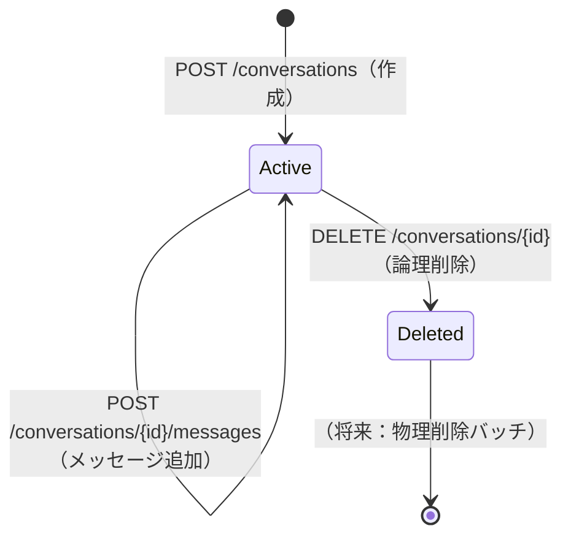

# DSD-004_FEAT-005 データベース詳細設計書（チャットUI）

| 項目 | 値 |
|---|---|
| ドキュメントID | DSD-004_FEAT-005 |
| バージョン | 1.0 |
| 作成日 | 2026-03-03 |
| 機能ID | FEAT-005 |
| 機能名 | チャットUI（chat-ui） |
| 入力元 | BSD-006, BSD-009, REQ-005（UC-008） |
| ステータス | 初版 |

---

## 目次

1. 設計概要
2. ER図
3. テーブル定義
4. インデックス定義
5. データライフサイクル
6. マイグレーションSQLスクリプト
7. SQLAlchemy ORMモデル定義
8. データ整合性制約
9. 後続フェーズへの影響

---

## 1. 設計概要

### 1.1 管理対象データ

FEAT-005（チャットUI）が管理するデータは、CTX-002（エージェントコンテキスト）に属する会話関連データである。BSD-006の設計方針を継承する。

| テーブル名 | 論理名 | 概要 | 集約 |
|---|---|---|---|
| `conversations` | 会話 | ユーザーとエージェントの対話セッション。集約ルート | Conversation集約（ルート） |
| `messages` | メッセージ | 会話内の個別メッセージ（user/assistant） | Conversation集約（従属） |
| `agent_tool_calls` | エージェントツール呼び出し | エージェントが実行したツール呼び出しの記録 | Conversation集約（従属） |

### 1.2 設計方針

BSD-006の方針を踏襲する。

| 方針 | 詳細 |
|---|---|
| DBMS | PostgreSQL 15+ |
| 文字コード | UTF-8 |
| タイムゾーン | 保存はすべてTIMESTAMPTZ（UTC）。表示時にJST変換 |
| 主キー | UUID v4（`gen_random_uuid()`） |
| 論理削除 | conversationsテーブルに`deleted_at`カラムを設ける |
| 正規化 | 第3正規形（3NF）を基本とする |
| ORM | SQLAlchemy（非同期: asyncpg） |
| マイグレーション | Alembic |

---

## 2. ER図

```mermaid
erDiagram
    conversations {
        uuid id PK "主キー（UUID v4）"
        varchar title NULL "会話タイトル（最大200文字）"
        timestamptz created_at NOT NULL "作成日時（UTC）"
        timestamptz updated_at NOT NULL "最終更新日時（UTC）"
        timestamptz deleted_at NULL "論理削除日時（NULLは有効）"
    }

    messages {
        uuid id PK "主キー（UUID v4）"
        uuid conversation_id FK NOT NULL "会話ID（外部キー）"
        varchar role NOT NULL "メッセージロール（user/assistant/tool）"
        text content NULL "メッセージ本文"
        integer token_count NULL "トークン数（コスト管理用）"
        timestamptz created_at NOT NULL "メッセージ送信日時（UTC）"
    }

    agent_tool_calls {
        uuid id PK "主キー（UUID v4）"
        uuid message_id FK NOT NULL "エージェントメッセージID（外部キー）"
        varchar tool_name NOT NULL "ツール名（create_issue等）"
        jsonb tool_input NOT NULL "ツール呼び出し入力パラメータ"
        jsonb tool_output NULL "ツール実行結果"
        varchar status NOT NULL "実行状態（success/failed）"
        timestamptz created_at NOT NULL "ツール呼び出し日時（UTC）"
    }

    conversations ||--o{ messages : "contains"
    messages ||--o{ agent_tool_calls : "triggers"
```

---

## 3. テーブル定義

### 3.1 `conversations`（会話）

**概要**: ユーザーとエージェントの対話セッション（Conversation集約ルート）。フェーズ1ではシングルユーザーのため`user_id`カラムは省略し、フェーズ2で追加する。

| カラム名 | 型 | 制約 | デフォルト | 説明 |
|---|---|---|---|---|
| `id` | `UUID` | PK, NOT NULL | `gen_random_uuid()` | 主キー（UUID v4） |
| `title` | `VARCHAR(200)` | NULL | NULL | 会話タイトル（最初のメッセージから自動生成。NULL許容） |
| `created_at` | `TIMESTAMPTZ` | NOT NULL | `NOW()` | 作成日時（UTC） |
| `updated_at` | `TIMESTAMPTZ` | NOT NULL | `NOW()` | 最終更新日時（UTC）。メッセージ追加時に自動更新 |
| `deleted_at` | `TIMESTAMPTZ` | NULL | NULL | 論理削除日時（NULL=有効、NULLでない=削除済） |

**ビジネスルール:**
- `deleted_at` がNULLでないレコードは論理削除済みとして扱い、APIから参照・更新できない
- `updated_at` はメッセージ送信時にも更新する（会話の最終アクティブ日時として機能）

### 3.2 `messages`（メッセージ）

**概要**: 会話内の個別メッセージ（Conversation集約の従属エンティティ）。ユーザーの入力とエージェントの応答を時系列で管理する。

| カラム名 | 型 | 制約 | デフォルト | 説明 |
|---|---|---|---|---|
| `id` | `UUID` | PK, NOT NULL | `gen_random_uuid()` | 主キー（UUID v4） |
| `conversation_id` | `UUID` | FK, NOT NULL | - | 会話ID（conversations.idへの外部キー） |
| `role` | `VARCHAR(20)` | NOT NULL | - | メッセージ送信者ロール。`user` / `assistant` のいずれか |
| `content` | `TEXT` | NULL | NULL | メッセージ本文（ツールのみの場合はNULL許容） |
| `token_count` | `INTEGER` | NULL | NULL | このメッセージのトークン数（コスト管理・将来的な利用制限用） |
| `created_at` | `TIMESTAMPTZ` | NOT NULL | `NOW()` | メッセージ送信日時（UTC） |

**roleの値定義:**

| 値 | 意味 | 例 |
|---|---|---|
| `user` | ユーザーが送信したメッセージ | 「タスクを作成して」 |
| `assistant` | エージェント（Claude）の応答 | 「タスクを作成しました。#123をご確認ください」 |

**ビジネスルール:**
- メッセージは追記のみ。更新・物理削除は行わない
- `conversation_id` が論理削除済みのconversationsを参照するメッセージは作成できない（アプリケーション層で制御）
- `content` はNULL許容だが、`role=user` または `role=assistant` の場合は必ずNULLでない値を持つ

### 3.3 `agent_tool_calls`（エージェントツール呼び出し）

**概要**: エージェントがメッセージ応答中に実行したツール呼び出しの記録。デバッグ・監査・将来のファインチューニング用途。

| カラム名 | 型 | 制約 | デフォルト | 説明 |
|---|---|---|---|---|
| `id` | `UUID` | PK, NOT NULL | `gen_random_uuid()` | 主キー（UUID v4） |
| `message_id` | `UUID` | FK, NOT NULL | - | エージェントメッセージID（messages.idへの外部キー） |
| `tool_name` | `VARCHAR(100)` | NOT NULL | - | ツール名（例: `create_issue`, `get_issues`） |
| `tool_input` | `JSONB` | NOT NULL | - | ツール呼び出しの入力パラメータ（JSON） |
| `tool_output` | `JSONB` | NULL | NULL | ツール実行結果（JSON）。エラー時はNULLの場合あり |
| `status` | `VARCHAR(20)` | NOT NULL | `'success'` | 実行状態（`success` / `failed`） |
| `created_at` | `TIMESTAMPTZ` | NOT NULL | `NOW()` | ツール呼び出し日時（UTC） |

**statusの値定義:**

| 値 | 意味 |
|---|---|
| `success` | ツール実行成功 |
| `failed` | ツール実行失敗（tool_outputにエラー情報を格納） |

**ビジネスルール:**
- エージェントツール呼び出しは追記のみ。更新・削除は行わない
- 1つのメッセージに対して複数のagent_tool_callsが存在できる（複数ツール実行の場合）

---

## 4. インデックス定義

### 4.1 conversations インデックス

| インデックス名 | カラム | 種別 | 用途 |
|---|---|---|---|
| `conversations_pkey` | `id` | PRIMARY KEY | 主キー検索 |
| `idx_conversations_updated_at` | `updated_at DESC` | B-tree | 会話一覧を更新日時降順で取得 |
| `idx_conversations_deleted_at` | `deleted_at` | B-tree（部分インデックス） | 論理削除フィルタ（WHERE deleted_at IS NULL の高速化） |

**部分インデックス定義:**
```sql
-- 有効な会話のみをインデックス対象とする（論理削除済みを除外）
CREATE INDEX idx_conversations_deleted_at
    ON conversations (deleted_at)
    WHERE deleted_at IS NULL;
```

### 4.2 messages インデックス

| インデックス名 | カラム | 種別 | 用途 |
|---|---|---|---|
| `messages_pkey` | `id` | PRIMARY KEY | 主キー検索 |
| `idx_messages_conversation_id` | `conversation_id` | B-tree | 会話IDによるメッセージ一覧取得 |
| `idx_messages_conversation_created` | `(conversation_id, created_at ASC)` | B-tree（複合） | 会話別・時系列順取得（LangGraphへの入力生成） |

**クエリパターンと対応インデックス:**
```sql
-- メッセージ一覧取得（最も頻繁なクエリ）
SELECT * FROM messages
WHERE conversation_id = $1
ORDER BY created_at ASC;
-- → idx_messages_conversation_created を使用
```

### 4.3 agent_tool_calls インデックス

| インデックス名 | カラム | 種別 | 用途 |
|---|---|---|---|
| `agent_tool_calls_pkey` | `id` | PRIMARY KEY | 主キー検索 |
| `idx_agent_tool_calls_message_id` | `message_id` | B-tree | メッセージIDによるツール呼び出し一覧取得 |
| `idx_agent_tool_calls_tool_name` | `tool_name` | B-tree | ツール別の呼び出し履歴検索（デバッグ用） |

---

## 5. データライフサイクル

### 5.1 会話データのライフサイクル



### 5.2 データ保存期間

| データ | 保存期間 | 削除方法 |
|---|---|---|
| conversations | ユーザーが削除するまで（論理削除） | DELETE API → deleted_at設定 |
| messages | 親conversationが存在する限り | 親conversationの論理削除に準拠 |
| agent_tool_calls | 親messageが存在する限り | 親conversationの論理削除に準拠 |

---

## 6. マイグレーションSQLスクリプト

### 6.1 テーブル作成スクリプト

```sql
-- ===========================================================================
-- FEAT-005 チャットUI マイグレーションスクリプト
-- バージョン: 001_create_chat_tables
-- 作成日: 2026-03-03
-- ===========================================================================

-- -------------------------
-- conversations テーブル
-- -------------------------
CREATE TABLE IF NOT EXISTS conversations (
    id          UUID            NOT NULL DEFAULT gen_random_uuid(),
    title       VARCHAR(200)    NULL,
    created_at  TIMESTAMPTZ     NOT NULL DEFAULT NOW(),
    updated_at  TIMESTAMPTZ     NOT NULL DEFAULT NOW(),
    deleted_at  TIMESTAMPTZ     NULL,

    CONSTRAINT conversations_pkey PRIMARY KEY (id)
);

COMMENT ON TABLE  conversations              IS '会話セッション（CTX-002: エージェントコンテキスト）';
COMMENT ON COLUMN conversations.id          IS '主キー（UUID v4）';
COMMENT ON COLUMN conversations.title       IS '会話タイトル（NULL=未設定。最初のメッセージから自動生成予定）';
COMMENT ON COLUMN conversations.created_at  IS '作成日時（UTC）';
COMMENT ON COLUMN conversations.updated_at  IS '最終更新日時（UTC）。メッセージ追加時に更新される';
COMMENT ON COLUMN conversations.deleted_at  IS '論理削除日時（NULL=有効なレコード）';

-- conversations インデックス
CREATE INDEX IF NOT EXISTS idx_conversations_updated_at
    ON conversations (updated_at DESC);

CREATE INDEX IF NOT EXISTS idx_conversations_deleted_at
    ON conversations (deleted_at)
    WHERE deleted_at IS NULL;

-- -------------------------
-- messages テーブル
-- -------------------------
CREATE TABLE IF NOT EXISTS messages (
    id              UUID            NOT NULL DEFAULT gen_random_uuid(),
    conversation_id UUID            NOT NULL,
    role            VARCHAR(20)     NOT NULL,
    content         TEXT            NULL,
    token_count     INTEGER         NULL,
    created_at      TIMESTAMPTZ     NOT NULL DEFAULT NOW(),

    CONSTRAINT messages_pkey
        PRIMARY KEY (id),
    CONSTRAINT messages_conversation_id_fk
        FOREIGN KEY (conversation_id)
        REFERENCES conversations (id)
        ON DELETE CASCADE,
    CONSTRAINT messages_role_check
        CHECK (role IN ('user', 'assistant'))
);

COMMENT ON TABLE  messages                  IS '会話内メッセージ（CTX-002: エージェントコンテキスト）';
COMMENT ON COLUMN messages.id              IS '主キー（UUID v4）';
COMMENT ON COLUMN messages.conversation_id IS '会話ID（conversations.id への外部キー）';
COMMENT ON COLUMN messages.role            IS 'メッセージロール（user: ユーザー入力 / assistant: エージェント応答）';
COMMENT ON COLUMN messages.content        IS 'メッセージ本文';
COMMENT ON COLUMN messages.token_count    IS 'トークン数（コスト管理用。Anthropic APIから取得）';
COMMENT ON COLUMN messages.created_at     IS 'メッセージ送信日時（UTC）';

-- messages インデックス
CREATE INDEX IF NOT EXISTS idx_messages_conversation_id
    ON messages (conversation_id);

CREATE INDEX IF NOT EXISTS idx_messages_conversation_created
    ON messages (conversation_id, created_at ASC);

-- -------------------------
-- agent_tool_calls テーブル
-- -------------------------
CREATE TABLE IF NOT EXISTS agent_tool_calls (
    id          UUID            NOT NULL DEFAULT gen_random_uuid(),
    message_id  UUID            NOT NULL,
    tool_name   VARCHAR(100)    NOT NULL,
    tool_input  JSONB           NOT NULL DEFAULT '{}',
    tool_output JSONB           NULL,
    status      VARCHAR(20)     NOT NULL DEFAULT 'success',
    created_at  TIMESTAMPTZ     NOT NULL DEFAULT NOW(),

    CONSTRAINT agent_tool_calls_pkey
        PRIMARY KEY (id),
    CONSTRAINT agent_tool_calls_message_id_fk
        FOREIGN KEY (message_id)
        REFERENCES messages (id)
        ON DELETE CASCADE,
    CONSTRAINT agent_tool_calls_status_check
        CHECK (status IN ('success', 'failed'))
);

COMMENT ON TABLE  agent_tool_calls              IS 'エージェントツール呼び出し記録（CTX-002: エージェントコンテキスト）';
COMMENT ON COLUMN agent_tool_calls.id          IS '主キー（UUID v4）';
COMMENT ON COLUMN agent_tool_calls.message_id  IS 'エージェントメッセージID（messages.id への外部キー）';
COMMENT ON COLUMN agent_tool_calls.tool_name   IS 'ツール名（例: create_issue, get_issues）';
COMMENT ON COLUMN agent_tool_calls.tool_input  IS 'ツール呼び出し入力パラメータ（JSONB）';
COMMENT ON COLUMN agent_tool_calls.tool_output IS 'ツール実行結果（JSONB。失敗時はエラー情報）';
COMMENT ON COLUMN agent_tool_calls.status      IS '実行状態（success: 成功 / failed: 失敗）';
COMMENT ON COLUMN agent_tool_calls.created_at  IS 'ツール呼び出し日時（UTC）';

-- agent_tool_calls インデックス
CREATE INDEX IF NOT EXISTS idx_agent_tool_calls_message_id
    ON agent_tool_calls (message_id);

CREATE INDEX IF NOT EXISTS idx_agent_tool_calls_tool_name
    ON agent_tool_calls (tool_name);
```

### 6.2 ロールバックスクリプト（downgrade）

```sql
-- ===========================================================================
-- FEAT-005 チャットUI ロールバックスクリプト
-- バージョン: 001_create_chat_tables（downgrade）
-- ===========================================================================

DROP TABLE IF EXISTS agent_tool_calls CASCADE;
DROP TABLE IF EXISTS messages CASCADE;
DROP TABLE IF EXISTS conversations CASCADE;
```

### 6.3 Alembic マイグレーションファイル

```python
# alembic/versions/001_create_chat_tables.py
"""create chat tables for FEAT-005

Revision ID: 001_feat005
Revises:
Create Date: 2026-03-03
"""

from alembic import op
import sqlalchemy as sa
from sqlalchemy.dialects.postgresql import UUID, JSONB, TIMESTAMPTZ

revision = '001_feat005'
down_revision = None
branch_labels = None
depends_on = None


def upgrade() -> None:
    # conversations テーブル
    op.create_table(
        'conversations',
        sa.Column('id', UUID(as_uuid=True), primary_key=True,
                  server_default=sa.text('gen_random_uuid()')),
        sa.Column('title', sa.String(200), nullable=True),
        sa.Column('created_at', TIMESTAMPTZ, nullable=False,
                  server_default=sa.text('NOW()')),
        sa.Column('updated_at', TIMESTAMPTZ, nullable=False,
                  server_default=sa.text('NOW()')),
        sa.Column('deleted_at', TIMESTAMPTZ, nullable=True),
    )
    op.create_index('idx_conversations_updated_at',
                    'conversations', ['updated_at'], postgresql_ops={'updated_at': 'DESC'})
    op.create_index('idx_conversations_deleted_at',
                    'conversations', ['deleted_at'],
                    postgresql_where=sa.text('deleted_at IS NULL'))

    # messages テーブル
    op.create_table(
        'messages',
        sa.Column('id', UUID(as_uuid=True), primary_key=True,
                  server_default=sa.text('gen_random_uuid()')),
        sa.Column('conversation_id', UUID(as_uuid=True), nullable=False),
        sa.Column('role', sa.String(20), nullable=False),
        sa.Column('content', sa.Text, nullable=True),
        sa.Column('token_count', sa.Integer, nullable=True),
        sa.Column('created_at', TIMESTAMPTZ, nullable=False,
                  server_default=sa.text('NOW()')),
        sa.ForeignKeyConstraint(['conversation_id'], ['conversations.id'],
                                ondelete='CASCADE'),
        sa.CheckConstraint("role IN ('user', 'assistant')", name='messages_role_check'),
    )
    op.create_index('idx_messages_conversation_id', 'messages', ['conversation_id'])
    op.create_index('idx_messages_conversation_created',
                    'messages', ['conversation_id', 'created_at'])

    # agent_tool_calls テーブル
    op.create_table(
        'agent_tool_calls',
        sa.Column('id', UUID(as_uuid=True), primary_key=True,
                  server_default=sa.text('gen_random_uuid()')),
        sa.Column('message_id', UUID(as_uuid=True), nullable=False),
        sa.Column('tool_name', sa.String(100), nullable=False),
        sa.Column('tool_input', JSONB, nullable=False, server_default=sa.text("'{}'")),
        sa.Column('tool_output', JSONB, nullable=True),
        sa.Column('status', sa.String(20), nullable=False, server_default='success'),
        sa.Column('created_at', TIMESTAMPTZ, nullable=False,
                  server_default=sa.text('NOW()')),
        sa.ForeignKeyConstraint(['message_id'], ['messages.id'], ondelete='CASCADE'),
        sa.CheckConstraint("status IN ('success', 'failed')",
                           name='agent_tool_calls_status_check'),
    )
    op.create_index('idx_agent_tool_calls_message_id', 'agent_tool_calls', ['message_id'])
    op.create_index('idx_agent_tool_calls_tool_name', 'agent_tool_calls', ['tool_name'])


def downgrade() -> None:
    op.drop_table('agent_tool_calls')
    op.drop_table('messages')
    op.drop_table('conversations')
```

---

## 7. SQLAlchemy ORMモデル定義

```python
# app/chat/models_db.py
from __future__ import annotations
import uuid
from datetime import datetime
from typing import Optional, List
from sqlalchemy import String, Text, Integer, ForeignKey, CheckConstraint
from sqlalchemy.dialects.postgresql import UUID, JSONB, TIMESTAMPTZ
from sqlalchemy.orm import DeclarativeBase, Mapped, mapped_column, relationship
from sqlalchemy.sql import func


class Base(DeclarativeBase):
    pass


class ConversationORM(Base):
    """conversations テーブルのORMモデル"""
    __tablename__ = "conversations"

    id: Mapped[uuid.UUID] = mapped_column(
        UUID(as_uuid=True), primary_key=True, default=uuid.uuid4
    )
    title: Mapped[Optional[str]] = mapped_column(String(200), nullable=True)
    created_at: Mapped[datetime] = mapped_column(
        TIMESTAMPTZ, nullable=False, server_default=func.now()
    )
    updated_at: Mapped[datetime] = mapped_column(
        TIMESTAMPTZ, nullable=False, server_default=func.now(), onupdate=func.now()
    )
    deleted_at: Mapped[Optional[datetime]] = mapped_column(TIMESTAMPTZ, nullable=True)

    # リレーション
    messages: Mapped[List[MessageORM]] = relationship(
        "MessageORM", back_populates="conversation", cascade="all, delete-orphan",
        order_by="MessageORM.created_at"
    )

    def is_deleted(self) -> bool:
        return self.deleted_at is not None


class MessageORM(Base):
    """messages テーブルのORMモデル"""
    __tablename__ = "messages"
    __table_args__ = (
        CheckConstraint("role IN ('user', 'assistant')", name="messages_role_check"),
    )

    id: Mapped[uuid.UUID] = mapped_column(
        UUID(as_uuid=True), primary_key=True, default=uuid.uuid4
    )
    conversation_id: Mapped[uuid.UUID] = mapped_column(
        UUID(as_uuid=True), ForeignKey("conversations.id", ondelete="CASCADE"),
        nullable=False
    )
    role: Mapped[str] = mapped_column(String(20), nullable=False)
    content: Mapped[Optional[str]] = mapped_column(Text, nullable=True)
    token_count: Mapped[Optional[int]] = mapped_column(Integer, nullable=True)
    created_at: Mapped[datetime] = mapped_column(
        TIMESTAMPTZ, nullable=False, server_default=func.now()
    )

    # リレーション
    conversation: Mapped[ConversationORM] = relationship(
        "ConversationORM", back_populates="messages"
    )
    tool_calls: Mapped[List[AgentToolCallORM]] = relationship(
        "AgentToolCallORM", back_populates="message", cascade="all, delete-orphan"
    )


class AgentToolCallORM(Base):
    """agent_tool_calls テーブルのORMモデル"""
    __tablename__ = "agent_tool_calls"
    __table_args__ = (
        CheckConstraint(
            "status IN ('success', 'failed')", name="agent_tool_calls_status_check"
        ),
    )

    id: Mapped[uuid.UUID] = mapped_column(
        UUID(as_uuid=True), primary_key=True, default=uuid.uuid4
    )
    message_id: Mapped[uuid.UUID] = mapped_column(
        UUID(as_uuid=True), ForeignKey("messages.id", ondelete="CASCADE"),
        nullable=False
    )
    tool_name: Mapped[str] = mapped_column(String(100), nullable=False)
    tool_input: Mapped[dict] = mapped_column(JSONB, nullable=False, default=dict)
    tool_output: Mapped[Optional[dict]] = mapped_column(JSONB, nullable=True)
    status: Mapped[str] = mapped_column(String(20), nullable=False, default="success")
    created_at: Mapped[datetime] = mapped_column(
        TIMESTAMPTZ, nullable=False, server_default=func.now()
    )

    # リレーション
    message: Mapped[MessageORM] = relationship(
        "MessageORM", back_populates="tool_calls"
    )
```

---

## 8. データ整合性制約

### 8.1 外部キー制約

| 制約名 | テーブル | 参照元カラム | 参照先テーブル | 参照先カラム | ON DELETE |
|---|---|---|---|---|---|
| `messages_conversation_id_fk` | messages | conversation_id | conversations | id | CASCADE |
| `agent_tool_calls_message_id_fk` | agent_tool_calls | message_id | messages | id | CASCADE |

### 8.2 CHECK制約

| 制約名 | テーブル | 条件 |
|---|---|---|
| `messages_role_check` | messages | `role IN ('user', 'assistant')` |
| `agent_tool_calls_status_check` | agent_tool_calls | `status IN ('success', 'failed')` |

### 8.3 アプリケーション層での整合性制御

DB制約に加え、アプリケーション層（ConversationService・Repository）で以下の整合性を担保する。

| ルール | 実装箇所 |
|---|---|
| 論理削除済みのconversationにはメッセージを追加しない | ConversationService.send_message_stream での存在チェック |
| 論理削除済みのconversationは取得APIから返さない | ConversationRepository.get_by_id でdeleted_at IS NULLをフィルタ |
| エージェント実行中（isStreaming=true）の並行メッセージ送信防止 | フロントエンドのuseConversationフックでisStreamingチェック |

---

## 9. 後続フェーズへの影響

| 影響先 | 内容 |
|---|---|
| IMP-001_FEAT-005 | SQLAlchemy ORMモデル・Repository実装の参照仕様 |
| IMP-004 | Alembicマイグレーションスクリプトの作成（本文書の6.3を参照） |
| DSD-008_FEAT-005 | DBレイヤーのテストケース設計（Repository層のCRUDテスト） |
| OPS-004 | バックアップ対象テーブル（conversations, messages, agent_tool_calls）の確認 |
