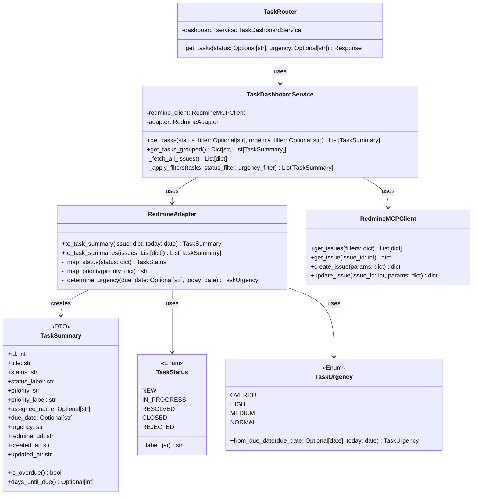
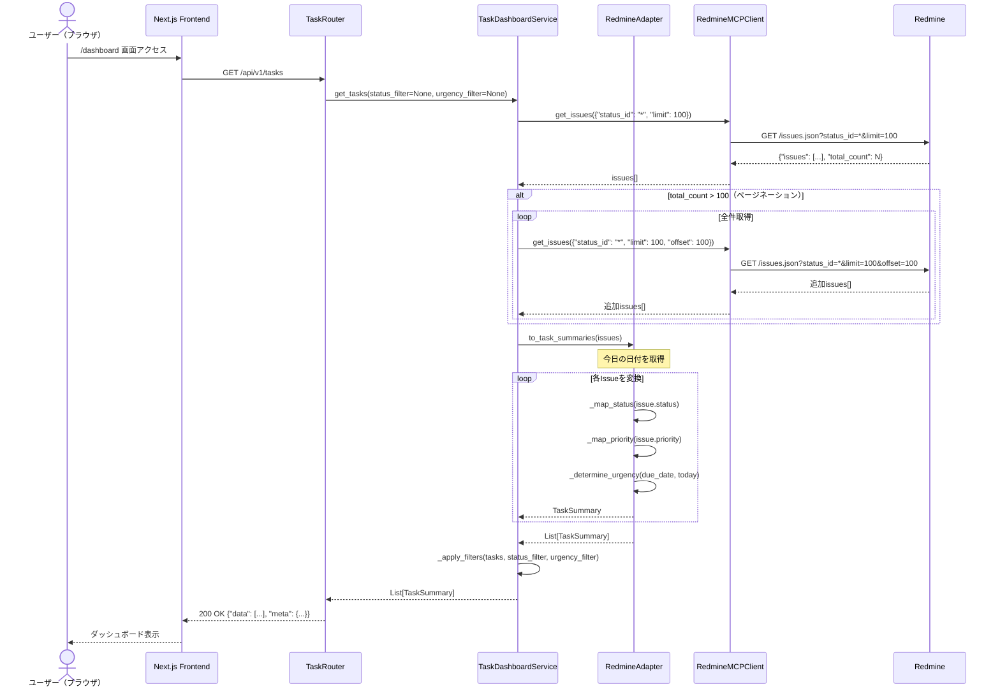
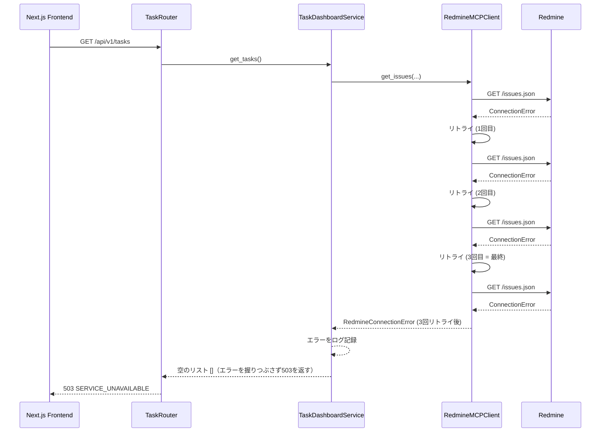

# DSD-001_FEAT-006 バックエンド機能詳細設計書（タスク一覧ダッシュボード）

| 項目 | 値 |
|---|---|
| ドキュメントID | DSD-001_FEAT-006 |
| バージョン | 1.0 |
| 作成日 | 2026-03-03 |
| 機能ID | FEAT-006 |
| 機能名 | タスク一覧ダッシュボード（task-dashboard） |
| 入力元 | BSD-001, BSD-004, BSD-005, BSD-009, REQ-005（UC-009） |
| ステータス | 初版 |

---

## 目次

1. 機能概要
2. アーキテクチャ概要
3. モジュール構成
4. クラス図
5. シーケンス図
6. TaskDashboardService設計
7. タスクデータ変換ロジック
8. ステータス別グルーピング処理
9. 期日チェックロジック
10. エラーハンドリング
11. ログ設計
12. 後続フェーズへの影響

---

## 1. 機能概要

FEAT-006（タスク一覧ダッシュボード）のバックエンドは、以下の責務を担う。

| 責務 | 詳細 |
|---|---|
| タスク一覧取得 | MCP経由でRedmineからタスク（Issue）一覧を取得する |
| タスクデータ変換 | RedmineのIssueデータを内部ドメインモデル（TaskSummary）に変換する |
| ステータス別グルーピング | タスクをRedmineステータスに基づいてグルーピングする |
| 期日チェック | 各タスクの期日と今日の日付を比較し、urgencyを判定する |
| フロントエンドへのAPI提供 | 加工済みタスクデータをREST APIで返す |

---

## 2. アーキテクチャ概要

### 2.1 レイヤー構成

```
プレゼンテーション層（FastAPI Router）
    └── app/task/router.py          # タスクダッシュボードルーター

アプリケーション層（Application Services）
    └── app/task/service.py         # TaskDashboardService

ドメイン層（Domain Model）
    └── app/task/domain/models.py   # TaskSummary DTO, TaskStatus, TaskUrgency

インフラストラクチャ層（Infrastructure）
    └── app/integration/mcp_client.py  # RedmineMCPClient（DSD-001_FEAT-005と共有）
```

### 2.2 パッケージ構成

BSD-009のCTX-001（タスク管理コンテキスト）に属するモジュール群。

```
backend/
├── app/
│   ├── task/                       # CTX-001: タスク管理コンテキスト
│   │   ├── __init__.py
│   │   ├── router.py               # FastAPI ルーター（GETエンドポイント）
│   │   ├── schemas.py              # Pydantic レスポンススキーマ
│   │   ├── service.py              # TaskDashboardService
│   │   └── domain/
│   │       ├── models.py           # TaskSummary, TaskStatus, TaskUrgency
│   │       └── adapters.py         # RedmineAdapter（ACLパターン）
│   └── integration/
│       └── mcp_client.py           # RedmineMCPClient（FEAT-005と共有）
```

---

## 3. モジュール構成

| モジュール | クラス/関数 | 責務 |
|---|---|---|
| `app/task/router.py` | `TaskRouter` | GET /api/v1/tasks エンドポイント定義 |
| `app/task/service.py` | `TaskDashboardService` | タスク一覧取得・変換・グルーピング・urgency判定 |
| `app/task/domain/models.py` | `TaskSummary` | Redmine Issueの内部表現（DTO） |
| `app/task/domain/models.py` | `TaskStatus` | ステータス値オブジェクト（Enum） |
| `app/task/domain/models.py` | `TaskUrgency` | 緊急度値オブジェクト（Enum） |
| `app/task/domain/adapters.py` | `RedmineAdapter` | Redmine JSON → TaskSummary変換（ACL） |
| `app/integration/mcp_client.py` | `RedmineMCPClient` | Redmine REST API呼び出し（FEAT-005と共有） |

---

## 4. クラス図



---

## 5. シーケンス図

### 5.1 ダッシュボードデータ取得フロー



### 5.2 Redmine接続失敗時のフロー



---

## 6. TaskDashboardService設計

### 6.1 get_tasksメソッド仕様

```python
# app/task/service.py
from datetime import date
from typing import Optional, List, Dict
import logging

logger = logging.getLogger(__name__)

class TaskDashboardService:

    def __init__(self, redmine_client: RedmineMCPClient):
        self.redmine_client = redmine_client
        self.adapter = RedmineAdapter()

    async def get_tasks(
        self,
        status_filter: Optional[str] = None,
        urgency_filter: Optional[str] = None,
    ) -> List[TaskSummary]:
        """
        Redmineから全タスクを取得し、変換・フィルタリングして返す。

        Args:
            status_filter: ステータスフィルタ（"new", "in_progress", "resolved", "closed"等）
            urgency_filter: 緊急度フィルタ（"overdue", "high", "medium", "normal"）

        Returns:
            フィルタリング・変換済みのTaskSummaryリスト

        Raises:
            RedmineConnectionError: Redmine接続失敗（3回リトライ後）
        """
        logger.info("TaskDashboardService.get_tasks started")

        # 全件取得（ページネーション対応）
        issues = await self._fetch_all_issues()
        logger.info(f"Fetched {len(issues)} issues from Redmine")

        # 今日の日付を取得（テスト時の注入を可能にするため分離）
        today = date.today()

        # Redmine Issue → TaskSummary に変換
        tasks = self.adapter.to_task_summaries(issues, today)

        # フィルタリング
        tasks = self._apply_filters(tasks, status_filter, urgency_filter)

        # urgency の優先度順にソート（overdue → high → medium → normal）
        urgency_order = {"overdue": 0, "high": 1, "medium": 2, "normal": 3}
        tasks.sort(key=lambda t: (urgency_order.get(t.urgency, 99), t.due_date or "9999-12-31"))

        logger.info(f"TaskDashboardService.get_tasks completed: {len(tasks)} tasks returned")
        return tasks

    async def _fetch_all_issues(self) -> List[dict]:
        """
        ページネーションを考慮してRedmineから全件取得する。
        Redmine APIの最大取得件数は100件/リクエストのため、
        total_countが100を超える場合は複数回リクエストする。
        """
        PAGE_SIZE = 100
        all_issues = []
        offset = 0

        while True:
            response = await self.redmine_client.get_issues({
                "status_id": "*",  # 全ステータス（オープン・クローズ含む）
                "limit": PAGE_SIZE,
                "offset": offset,
            })
            issues = response.get("issues", [])
            all_issues.extend(issues)

            total_count = response.get("total_count", 0)
            offset += PAGE_SIZE

            if offset >= total_count:
                break

        return all_issues

    def _apply_filters(
        self,
        tasks: List[TaskSummary],
        status_filter: Optional[str],
        urgency_filter: Optional[str],
    ) -> List[TaskSummary]:
        """ステータスと緊急度でフィルタリングする"""
        if status_filter:
            tasks = [t for t in tasks if t.status == status_filter]
        if urgency_filter:
            tasks = [t for t in tasks if t.urgency == urgency_filter]
        return tasks
```

---

## 7. タスクデータ変換ロジック（RedmineAdapter）

### 7.1 変換仕様

RedmineのIssue JSONを内部のTaskSummary DTOに変換する。BSD-009のACLパターンに従い、外部データモデルを内部ドメインモデルに変換する責務を担う。

```python
# app/task/domain/adapters.py
from datetime import date, datetime
from typing import Optional, List
import os

class RedmineAdapter:
    """
    RedmineのIssue JSONを内部ドメインモデル（TaskSummary）に変換するACL。
    CTX-001（タスク管理）の境界で機能する。
    """

    # Redmineのステータス名（英語）→ 日本語ラベルのマッピング
    STATUS_LABEL_MAP = {
        "New": "新規",
        "In Progress": "進行中",
        "Resolved": "解決済み",
        "Feedback": "フィードバック",
        "Closed": "完了",
        "Rejected": "却下",
    }

    # Redmineのステータス名 → 内部ステータス（snake_case）のマッピング
    STATUS_CODE_MAP = {
        "New": "new",
        "In Progress": "in_progress",
        "Resolved": "resolved",
        "Feedback": "feedback",
        "Closed": "closed",
        "Rejected": "rejected",
    }

    # Redmineの優先度名（英語）→ 日本語ラベルのマッピング
    PRIORITY_LABEL_MAP = {
        "Low": "低",
        "Normal": "通常",
        "High": "高",
        "Urgent": "緊急",
        "Immediate": "即時",
    }

    def to_task_summary(self, issue: dict, today: date) -> TaskSummary:
        """
        RedmineのIssue JSONをTaskSummaryに変換する。

        Args:
            issue: Redmine API の issues[] の1要素
            today: 今日の日付（期日チェック用）
        """
        # ステータスの変換
        status_name = issue.get("status", {}).get("name", "New")
        status_code = self.STATUS_CODE_MAP.get(status_name, "new")
        status_label = self.STATUS_LABEL_MAP.get(status_name, status_name)

        # 優先度の変換
        priority_name = issue.get("priority", {}).get("name", "Normal")
        priority_code = priority_name.lower()
        priority_label = self.PRIORITY_LABEL_MAP.get(priority_name, priority_name)

        # 担当者名の取得
        assignee = issue.get("assigned_to")
        assignee_name = assignee.get("name") if assignee else None

        # 期日の取得（"YYYY-MM-DD" 形式または None）
        due_date = issue.get("due_date")

        # 緊急度の判定
        urgency = self._determine_urgency(due_date, today)

        # Redmine URL の生成
        redmine_base_url = os.getenv("REDMINE_URL", "http://localhost:8080")
        redmine_url = f"{redmine_base_url}/issues/{issue['id']}"

        return TaskSummary(
            id=issue["id"],
            title=issue.get("subject", ""),
            status=status_code,
            status_label=status_label,
            priority=priority_code,
            priority_label=priority_label,
            assignee_name=assignee_name,
            due_date=due_date,
            urgency=urgency.value,
            redmine_url=redmine_url,
            created_at=issue.get("created_on", ""),
            updated_at=issue.get("updated_on", ""),
        )

    def to_task_summaries(self, issues: List[dict], today: Optional[date] = None) -> List[TaskSummary]:
        if today is None:
            today = date.today()
        return [self.to_task_summary(issue, today) for issue in issues]
```

### 7.2 Redmine IssueフィールドとTaskSummaryのマッピング表

| Redmine Issueフィールド | 型 | TaskSummaryフィールド | 変換処理 |
|---|---|---|---|
| `id` | integer | `id` | そのまま |
| `subject` | string | `title` | そのまま |
| `status.name` | string | `status` | STATUS_CODE_MAPで変換（例: "In Progress" → "in_progress"） |
| `status.name` | string | `status_label` | STATUS_LABEL_MAPで変換（例: "In Progress" → "進行中"） |
| `priority.name` | string | `priority` | lower()で変換（例: "High" → "high"） |
| `priority.name` | string | `priority_label` | PRIORITY_LABEL_MAPで変換（例: "High" → "高"） |
| `assigned_to.name` | string or null | `assignee_name` | assigned_toがnullなら None |
| `due_date` | "YYYY-MM-DD" or null | `due_date` | そのまま（nullの場合はNone） |
| （計算値） | - | `urgency` | due_dateと今日の日付から_determine_urgencyで算出 |
| （計算値） | - | `redmine_url` | `{REDMINE_URL}/issues/{id}` |
| `created_on` | ISO 8601 string | `created_at` | そのまま |
| `updated_on` | ISO 8601 string | `updated_at` | そのまま |

---

## 8. ステータス別グルーピング処理

### 8.1 ステータスグルーピング仕様

フロントエンドのKanbanビューのために、ステータス別のグルーピングを提供する。

```python
# app/task/service.py（追加メソッド）

# ステータスグループ定義
STATUS_GROUPS = {
    "todo": ["new"],
    "in_progress": ["in_progress", "feedback"],
    "done": ["resolved", "closed", "rejected"],
}

async def get_tasks_grouped(self) -> Dict[str, List[TaskSummary]]:
    """
    全タスクをステータスグループ別に分類して返す。

    Returns:
        {
            "todo": [...],        # 未着手
            "in_progress": [...], # 進行中
            "done": [...]         # 完了
        }
    """
    all_tasks = await self.get_tasks()

    grouped: Dict[str, List[TaskSummary]] = {
        "todo": [],
        "in_progress": [],
        "done": [],
    }

    for task in all_tasks:
        placed = False
        for group_name, statuses in self.STATUS_GROUPS.items():
            if task.status in statuses:
                grouped[group_name].append(task)
                placed = True
                break
        if not placed:
            # 未分類のステータスはtodoに入れる
            grouped["todo"].append(task)

    return grouped
```

---

## 9. 期日チェックロジック

### 9.1 urgency（緊急度）判定仕様

| 条件 | urgency値 | 日本語ラベル | 表示色（フロントエンド） |
|---|---|---|---|
| `due_date < today`（期限超過） | `"overdue"` | 期限超過 | 赤（`text-red-600`） |
| `today <= due_date <= today + 3日`（期日迫る） | `"high"` | 期日迫る | 黄橙（`text-amber-500`） |
| `today + 4日 <= due_date <= today + 7日` | `"medium"` | 今週中 | 黄（`text-yellow-500`） |
| `due_date > today + 7日` | `"normal"` | 通常 | グレー（`text-gray-500`） |
| `due_date == None`（期日未設定） | `"normal"` | 通常 | グレー（`text-gray-500`） |

```python
# app/task/domain/models.py

from enum import Enum
from datetime import date, timedelta
from typing import Optional

class TaskUrgency(str, Enum):
    OVERDUE = "overdue"   # 期限超過
    HIGH = "high"         # 期日迫る（3日以内）
    MEDIUM = "medium"     # 今週中（4〜7日）
    NORMAL = "normal"     # 通常（8日以上 or 期日なし）

    @classmethod
    def from_due_date(cls, due_date_str: Optional[str], today: date) -> "TaskUrgency":
        """
        due_dateと今日の日付からUrgencyを判定する。

        Args:
            due_date_str: 期日文字列（"YYYY-MM-DD"形式）またはNone
            today: 今日の日付

        Returns:
            TaskUrgency
        """
        if due_date_str is None:
            return cls.NORMAL

        try:
            due_date = date.fromisoformat(due_date_str)
        except ValueError:
            return cls.NORMAL

        days_diff = (due_date - today).days

        if days_diff < 0:
            return cls.OVERDUE        # 期限超過
        elif days_diff <= 3:
            return cls.HIGH           # 期日迫る（0〜3日）
        elif days_diff <= 7:
            return cls.MEDIUM         # 今週中（4〜7日）
        else:
            return cls.NORMAL         # 通常（8日以上）
```

### 9.2 期日チェックロジック詳細表

| due_date - today | days_diff | urgency | 例 |
|---|---|---|---|
| today > due_date | days_diff < 0 | `"overdue"` | 期日: 3/1, 今日: 3/3 → overdue |
| today == due_date | days_diff = 0 | `"high"` | 期日: 3/3, 今日: 3/3 → high（当日） |
| today + 1日 | days_diff = 1 | `"high"` | 期日: 3/4, 今日: 3/3 → high |
| today + 2日 | days_diff = 2 | `"high"` | 期日: 3/5, 今日: 3/3 → high |
| today + 3日 | days_diff = 3 | `"high"` | 期日: 3/6, 今日: 3/3 → high |
| today + 4日 | days_diff = 4 | `"medium"` | 期日: 3/7, 今日: 3/3 → medium |
| today + 7日 | days_diff = 7 | `"medium"` | 期日: 3/10, 今日: 3/3 → medium |
| today + 8日以上 | days_diff >= 8 | `"normal"` | 期日: 3/11, 今日: 3/3 → normal |
| 期日なし | N/A | `"normal"` | due_date=None → normal |

---

## 10. エラーハンドリング

### 10.1 エラー分類と対応

| エラー種別 | 発生箇所 | 対応方法 | HTTPレスポンス |
|---|---|---|---|
| Redmine接続失敗（3回リトライ後） | RedmineMCPClient | RedmineConnectionErrorをraiseし503を返す | 503 SERVICE_UNAVAILABLE |
| Redmineタイムアウト | RedmineMCPClient | RedmineTimeoutErrorをraiseし503を返す | 503 SERVICE_UNAVAILABLE |
| Redmineが0件返却 | TaskDashboardService | 空リストを返す（エラーではない） | 200 OK（空配列） |
| Issue JSONの不正フィールド | RedmineAdapter | KeyErrorをキャッチし、そのIssueをスキップする | 200 OK（スキップした件数をログ） |
| due_dateの不正フォーマット | TaskUrgency.from_due_date | ValueErrorをキャッチし、urgency="normal"として扱う | 200 OK |

### 10.2 エラーレスポンス（Redmine接続失敗）

```json
{
  "error": {
    "code": "SERVICE_UNAVAILABLE",
    "message": "Redmineへの接続に失敗しました。しばらく後に再試行してください。",
    "details": []
  }
}
```

---

## 11. ログ設計

### 11.1 ログ出力ポイント

| ログレベル | 出力タイミング | 内容 |
|---|---|---|
| INFO | タスク取得開始 | `TaskDashboardService.get_tasks started` |
| INFO | Redmineからのデータ取得完了 | `Fetched {N} issues from Redmine (total={total_count})` |
| INFO | 変換・フィルタリング完了 | `get_tasks completed: {N} tasks returned (filters: status={s}, urgency={u})` |
| WARNING | Issue変換スキップ | `Skipping invalid issue (id={id}): {error_message}` |
| ERROR | Redmine接続失敗 | `Redmine connection error (retry={n}/3): {error_message}` |
| ERROR | タスク取得失敗 | `get_tasks failed: {error_message}` |

---

## 12. 後続フェーズへの影響

| 影響先 | 内容 |
|---|---|
| DSD-003_FEAT-006 | GET /api/v1/tasks エンドポイントの詳細仕様（urgency・status_labelフィールド含む） |
| DSD-005_FEAT-006 | Redmine GET /issues の外部IF詳細仕様（ページネーション・全ステータス取得） |
| DSD-008_FEAT-006 | TaskDashboardService・RedmineAdapter・TaskUrgencyのテストケース |
| IMP-001_FEAT-006 | 本設計書に基づくバックエンド実装・TDDサイクル |
