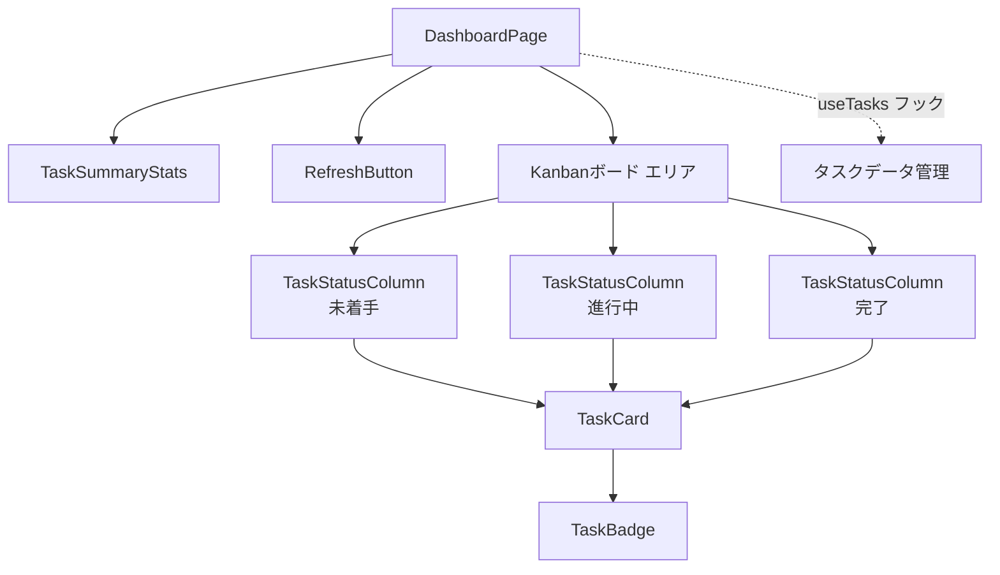
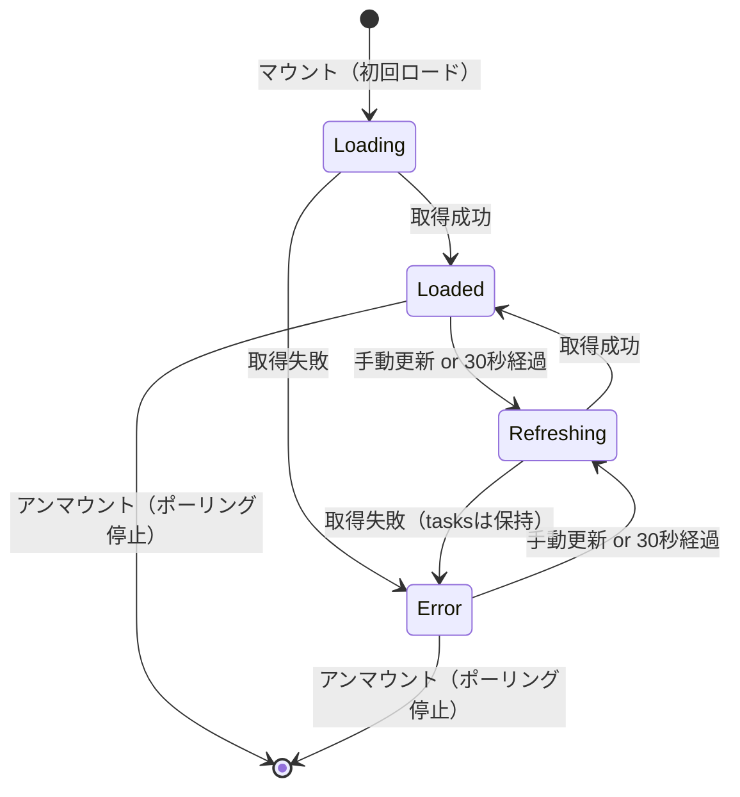

# DSD-002_FEAT-006 フロントエンド詳細設計書（タスク一覧ダッシュボード）

| 項目 | 値 |
|---|---|
| ドキュメントID | DSD-002_FEAT-006 |
| バージョン | 1.0 |
| 作成日 | 2026-03-03 |
| 機能ID | FEAT-006 |
| 機能名 | タスク一覧ダッシュボード（task-dashboard） |
| 入力元 | BSD-003, BSD-004, REQ-005（UC-009） |
| ステータス | 初版 |

---

## 目次

1. 機能概要
2. ディレクトリ構成
3. コンポーネント構成
4. コンポーネント詳細設計
5. カスタムフック設計（useTasks）
6. 自動更新（ポーリング）設計
7. ルーティング設計
8. スタイリング設計
9. エラーハンドリング
10. 後続フェーズへの影響

---

## 1. 機能概要

FEAT-006（タスク一覧ダッシュボード）のフロントエンドは、以下の責務を担う。

| 責務 | 詳細 |
|---|---|
| タスク一覧の表示 | Redmineから取得したタスクをKanbanスタイルで表示する |
| ステータス別カラム表示 | 未着手・進行中・完了の3カラムにタスクを分類して表示する |
| 緊急度ハイライト | 期限超過（赤）・期日迫る（黄橙）のタスクを色付きで目立たせる |
| Redmineリンク | タスクタイトルクリックでRedmineチケット詳細ページを新しいタブで開く |
| 自動更新 | 30秒ポーリングでタスクデータを自動更新する |
| 手動更新 | 更新ボタンで即時リフレッシュする |

---

## 2. ディレクトリ構成

```
frontend/
├── src/
│   ├── app/
│   │   ├── dashboard/
│   │   │   └── page.tsx            # ダッシュボード画面ページ（SCR-002ベース）
│   │   └── page.tsx                # ルートページ（/dashboard にリダイレクト）
│   ├── components/
│   │   └── dashboard/
│   │       ├── DashboardPage.tsx   # ダッシュボード画面の親コンポーネント
│   │       ├── TaskStatusColumn.tsx # ステータスカラム（Kanbanの1列）
│   │       ├── TaskCard.tsx        # 個別タスクカード
│   │       ├── TaskBadge.tsx       # 優先度・緊急度バッジ
│   │       ├── RefreshButton.tsx   # 手動更新ボタン
│   │       ├── TaskSummaryStats.tsx # タスク件数サマリー（合計・緊急度別）
│   │       └── EmptyState.tsx      # タスクがない場合の表示
│   ├── hooks/
│   │   └── useTasks.ts             # タスクデータ取得・自動更新カスタムフック
│   ├── types/
│   │   └── task.ts                 # タスク関連の型定義
│   └── lib/
│       └── api.ts                  # APIクライアント（fetch ラッパー）
```

---

## 3. コンポーネント構成

### 3.1 コンポーネント階層図



### 3.2 コンポーネント責務一覧

| コンポーネント | 責務 | props |
|---|---|---|
| `DashboardPage` | ダッシュボード全体の状態管理・レイアウト | なし（ページコンポーネント） |
| `TaskStatusColumn` | 単一ステータスカラムのタスク一覧表示 | `title`, `tasks`, `colorScheme` |
| `TaskCard` | 個別タスクの情報表示・Redmineリンク | `task` |
| `TaskBadge` | 優先度・緊急度のバッジ表示 | `type`, `value` |
| `RefreshButton` | 手動更新ボタン・更新中スピナー | `onRefresh`, `isLoading` |
| `TaskSummaryStats` | タスク件数サマリー統計 | `tasks` |
| `EmptyState` | タスクが0件の場合の空状態表示 | `message` |

---

## 4. コンポーネント詳細設計

### 4.1 DashboardPage

**概要**: ダッシュボード画面全体のページコンポーネント。useTasks フックでデータを管理する。

```typescript
// src/components/dashboard/DashboardPage.tsx
'use client';

import { useTasks } from '@/hooks/useTasks';
import { TaskStatusColumn } from './TaskStatusColumn';
import { RefreshButton } from './RefreshButton';
import { TaskSummaryStats } from './TaskSummaryStats';

const STATUS_COLUMNS = [
  {
    key: 'todo' as const,
    title: '未着手',
    colorScheme: 'gray' as const,
    statuses: ['new'],
  },
  {
    key: 'in_progress' as const,
    title: '進行中',
    colorScheme: 'blue' as const,
    statuses: ['in_progress', 'feedback'],
  },
  {
    key: 'done' as const,
    title: '完了',
    colorScheme: 'green' as const,
    statuses: ['resolved', 'closed'],
  },
];

export function DashboardPage() {
  const { tasks, isLoading, isRefreshing, error, refresh, lastUpdated } = useTasks();

  // タスクをステータスグループ別に分類
  const groupedTasks = STATUS_COLUMNS.reduce(
    (acc, col) => ({
      ...acc,
      [col.key]: tasks.filter((t) => col.statuses.includes(t.status)),
    }),
    {} as Record<string, Task[]>
  );

  return (
    <div className="flex flex-col h-full bg-gray-50">
      {/* ヘッダーエリア */}
      <div className="flex items-center justify-between px-6 py-4 bg-white border-b">
        <div>
          <h1 className="text-xl font-semibold text-gray-900">タスクダッシュボード</h1>
          {lastUpdated && (
            <p className="text-xs text-gray-400 mt-0.5">
              最終更新: {lastUpdated.toLocaleTimeString('ja-JP')}
            </p>
          )}
        </div>
        <RefreshButton onRefresh={refresh} isLoading={isLoading || isRefreshing} />
      </div>

      {/* エラー表示 */}
      {error && (
        <div className="mx-6 mt-4 p-3 bg-red-50 border border-red-200 rounded-lg text-sm text-red-700">
          {error}
        </div>
      )}

      {/* サマリー統計 */}
      <div className="px-6 py-4">
        <TaskSummaryStats tasks={tasks} />
      </div>

      {/* Kanbanボード */}
      <div className="flex-1 overflow-x-auto px-6 pb-6">
        <div className="flex gap-4 min-w-max">
          {STATUS_COLUMNS.map((col) => (
            <TaskStatusColumn
              key={col.key}
              title={col.title}
              tasks={groupedTasks[col.key] ?? []}
              colorScheme={col.colorScheme}
              isLoading={isLoading}
            />
          ))}
        </div>
      </div>
    </div>
  );
}
```

### 4.2 TaskStatusColumn

**概要**: 1つのステータスグループのタスクを縦列で表示するKanbanカラム。

```typescript
// src/components/dashboard/TaskStatusColumn.tsx

type ColorScheme = 'gray' | 'blue' | 'green';

interface TaskStatusColumnProps {
  title: string;
  tasks: Task[];
  colorScheme: ColorScheme;
  isLoading: boolean;
}

const headerColorMap: Record<ColorScheme, string> = {
  gray: 'bg-gray-200 text-gray-700',
  blue: 'bg-blue-100 text-blue-700',
  green: 'bg-green-100 text-green-700',
};

export function TaskStatusColumn({
  title,
  tasks,
  colorScheme,
  isLoading,
}: TaskStatusColumnProps) {
  return (
    <div className="w-80 flex-shrink-0 flex flex-col">
      {/* カラムヘッダー */}
      <div className={`flex items-center justify-between px-3 py-2 rounded-t-lg ${headerColorMap[colorScheme]}`}>
        <span className="text-sm font-medium">{title}</span>
        <span className="text-sm font-semibold bg-white bg-opacity-60 rounded-full px-2 py-0.5">
          {tasks.length}
        </span>
      </div>

      {/* タスクカード一覧 */}
      <div className="flex-1 bg-gray-100 rounded-b-lg p-2 space-y-2 min-h-48 overflow-y-auto max-h-[calc(100vh-280px)]">
        {isLoading ? (
          // ローディングスケルトン
          [...Array(3)].map((_, i) => (
            <div key={i} className="bg-white rounded-lg p-3 animate-pulse">
              <div className="h-4 bg-gray-200 rounded w-3/4 mb-2" />
              <div className="h-3 bg-gray-200 rounded w-1/2" />
            </div>
          ))
        ) : tasks.length === 0 ? (
          <EmptyState message="タスクはありません" />
        ) : (
          tasks.map((task) => (
            <TaskCard key={task.id} task={task} />
          ))
        )}
      </div>
    </div>
  );
}
```

### 4.3 TaskCard

**概要**: 個別タスクの情報をカード形式で表示。タイトルクリックでRedmineチケットを開く。

```typescript
// src/components/dashboard/TaskCard.tsx

interface TaskCardProps {
  task: Task;
}

// urgencyに応じた左ボーダー色
const urgencyBorderMap: Record<string, string> = {
  overdue: 'border-l-4 border-red-500',
  high: 'border-l-4 border-amber-400',
  medium: 'border-l-4 border-yellow-300',
  normal: 'border-l-2 border-gray-200',
};

export function TaskCard({ task }: TaskCardProps) {
  return (
    <div className={`bg-white rounded-lg p-3 shadow-sm hover:shadow-md transition-shadow ${urgencyBorderMap[task.urgency] ?? ''}`}>
      {/* タスクタイトル（Redmineリンク） */}
      <a
        href={task.redmine_url}
        target="_blank"
        rel="noopener noreferrer"
        className="text-sm font-medium text-gray-900 hover:text-blue-600 hover:underline line-clamp-2 block"
      >
        #{task.id} {task.title}
      </a>

      {/* バッジ・期日エリア */}
      <div className="flex items-center justify-between mt-2">
        <div className="flex gap-1">
          <TaskBadge type="priority" value={task.priority} label={task.priority_label} />
          {task.urgency !== 'normal' && (
            <TaskBadge type="urgency" value={task.urgency} label={urgencyLabel(task.urgency)} />
          )}
        </div>

        {/* 期日表示 */}
        {task.due_date && (
          <span className={`text-xs ${dueDateStyle(task.urgency)}`}>
            {formatDueDate(task.due_date)}
          </span>
        )}
      </div>

      {/* 担当者 */}
      {task.assignee_name && (
        <p className="text-xs text-gray-400 mt-1 truncate">
          担当: {task.assignee_name}
        </p>
      )}
    </div>
  );
}

function urgencyLabel(urgency: string): string {
  const labels: Record<string, string> = {
    overdue: '期限超過',
    high: '期日迫る',
    medium: '今週中',
  };
  return labels[urgency] ?? '';
}

function dueDateStyle(urgency: string): string {
  const styles: Record<string, string> = {
    overdue: 'text-red-600 font-medium',
    high: 'text-amber-500 font-medium',
    medium: 'text-yellow-600',
    normal: 'text-gray-500',
  };
  return styles[urgency] ?? 'text-gray-500';
}

function formatDueDate(dueDateStr: string): string {
  const due = new Date(dueDateStr);
  const today = new Date();
  const diffDays = Math.floor((due.getTime() - today.getTime()) / (1000 * 60 * 60 * 24));

  if (diffDays < 0) return `${Math.abs(diffDays)}日超過`;
  if (diffDays === 0) return '今日';
  if (diffDays === 1) return '明日';
  return `${due.getMonth() + 1}/${due.getDate()}`;
}
```

**TaskCardのレイアウト（ワイヤーフレーム）:**
```
+------------------------------------------+
| #123 タスクタイトルが長い場合は2行まで表示  |
|                                           |
| [高][期日迫る]              3/6           |
| 担当: 山田 太郎                            |
+------------------------------------------+
```

**左ボーダー色とurgencyの対応:**

| urgency | 左ボーダー色 | CSS |
|---|---|---|
| `overdue` | 赤（Red 500） | `border-l-4 border-red-500` |
| `high` | 黄橙（Amber 400） | `border-l-4 border-amber-400` |
| `medium` | 黄（Yellow 300） | `border-l-4 border-yellow-300` |
| `normal` | グレー（Gray 200） | `border-l-2 border-gray-200` |

### 4.4 TaskBadge

**概要**: 優先度・緊急度を小さなバッジで表示するコンポーネント。

```typescript
// src/components/dashboard/TaskBadge.tsx

type BadgeType = 'priority' | 'urgency';

interface TaskBadgeProps {
  type: BadgeType;
  value: string;
  label: string;
}

const priorityColorMap: Record<string, string> = {
  low: 'bg-gray-100 text-gray-600',
  normal: 'bg-blue-50 text-blue-600',
  high: 'bg-orange-50 text-orange-600',
  urgent: 'bg-red-50 text-red-600',
  immediate: 'bg-red-100 text-red-700 font-bold',
};

const urgencyColorMap: Record<string, string> = {
  overdue: 'bg-red-100 text-red-700',
  high: 'bg-amber-100 text-amber-700',
  medium: 'bg-yellow-100 text-yellow-700',
};

export function TaskBadge({ type, value, label }: TaskBadgeProps) {
  const colorClass = type === 'priority'
    ? (priorityColorMap[value] ?? 'bg-gray-100 text-gray-600')
    : (urgencyColorMap[value] ?? 'bg-gray-100 text-gray-600');

  return (
    <span className={`inline-flex items-center px-1.5 py-0.5 rounded text-xs ${colorClass}`}>
      {label}
    </span>
  );
}
```

### 4.5 TaskSummaryStats

**概要**: タスク件数の統計情報（全件数・urgency別件数）を表示する。

```typescript
// src/components/dashboard/TaskSummaryStats.tsx

interface TaskSummaryStatsProps {
  tasks: Task[];
}

export function TaskSummaryStats({ tasks }: TaskSummaryStatsProps) {
  const overdue = tasks.filter(t => t.urgency === 'overdue').length;
  const high = tasks.filter(t => t.urgency === 'high').length;
  const inProgress = tasks.filter(t => t.status === 'in_progress' || t.status === 'feedback').length;
  const total = tasks.length;

  return (
    <div className="grid grid-cols-4 gap-3">
      <StatCard label="全タスク" value={total} colorClass="text-gray-700" />
      <StatCard label="進行中" value={inProgress} colorClass="text-blue-600" />
      <StatCard label="期日迫る" value={high} colorClass="text-amber-600" />
      <StatCard label="期限超過" value={overdue} colorClass="text-red-600" />
    </div>
  );
}

function StatCard({ label, value, colorClass }: { label: string; value: number; colorClass: string }) {
  return (
    <div className="bg-white rounded-lg p-3 shadow-sm text-center">
      <p className={`text-2xl font-bold ${colorClass}`}>{value}</p>
      <p className="text-xs text-gray-500 mt-0.5">{label}</p>
    </div>
  );
}
```

### 4.6 RefreshButton

**概要**: 手動更新ボタン。更新中はスピナーを表示してクリックを無効化する。

```typescript
// src/components/dashboard/RefreshButton.tsx

interface RefreshButtonProps {
  onRefresh: () => void;
  isLoading: boolean;
}

export function RefreshButton({ onRefresh, isLoading }: RefreshButtonProps) {
  return (
    <button
      onClick={onRefresh}
      disabled={isLoading}
      className="flex items-center gap-2 px-3 py-2 text-sm text-gray-600
                 hover:text-gray-900 hover:bg-gray-100 rounded-lg transition-colors
                 disabled:opacity-50 disabled:cursor-not-allowed"
      aria-label="タスクを更新"
    >
      <RefreshIcon
        className={`w-4 h-4 ${isLoading ? 'animate-spin' : ''}`}
      />
      <span>{isLoading ? '更新中...' : '更新'}</span>
    </button>
  );
}
```

---

## 5. カスタムフック設計（useTasks）

### 5.1 useTasks フック

**概要**: タスクデータの取得・自動更新・手動更新を管理するカスタムフック。

```typescript
// src/hooks/useTasks.ts
import { useState, useEffect, useCallback, useRef } from 'react';

const POLLING_INTERVAL_MS = 30 * 1000; // 30秒

interface UseTasksReturn {
  tasks: Task[];
  isLoading: boolean;
  isRefreshing: boolean;
  error: string | null;
  refresh: () => Promise<void>;
  lastUpdated: Date | null;
}

export function useTasks(): UseTasksReturn {
  const [tasks, setTasks] = useState<Task[]>([]);
  const [isLoading, setIsLoading] = useState(true);    // 初回ロード中
  const [isRefreshing, setIsRefreshing] = useState(false); // 手動更新中
  const [error, setError] = useState<string | null>(null);
  const [lastUpdated, setLastUpdated] = useState<Date | null>(null);
  const pollingTimerRef = useRef<NodeJS.Timeout | null>(null);

  const fetchTasks = useCallback(async (isManualRefresh = false) => {
    if (isManualRefresh) {
      setIsRefreshing(true);
    }
    setError(null);

    try {
      const response = await fetch('/api/v1/tasks', {
        headers: { 'Cache-Control': 'no-cache' },
      });

      if (!response.ok) {
        if (response.status === 503) {
          throw new Error('Redmineへの接続に失敗しました。Redmineが起動しているか確認してください。');
        }
        throw new Error(`タスクの取得に失敗しました (${response.status})`);
      }

      const data = await response.json();
      setTasks(data.data ?? []);
      setLastUpdated(new Date());
    } catch (e) {
      const message = e instanceof Error ? e.message : 'タスクの取得中にエラーが発生しました';
      setError(message);
      // エラー時は既存のタスクを維持する（空にしない）
    } finally {
      setIsLoading(false);
      setIsRefreshing(false);
    }
  }, []);

  // 初回ロード
  useEffect(() => {
    fetchTasks(false);
  }, [fetchTasks]);

  // 30秒ポーリング
  useEffect(() => {
    pollingTimerRef.current = setInterval(() => {
      fetchTasks(false);
    }, POLLING_INTERVAL_MS);

    return () => {
      if (pollingTimerRef.current) {
        clearInterval(pollingTimerRef.current);
      }
    };
  }, [fetchTasks]);

  // 手動更新（タイマーをリセット）
  const refresh = useCallback(async () => {
    // 既存のポーリングタイマーをリセット
    if (pollingTimerRef.current) {
      clearInterval(pollingTimerRef.current);
    }
    await fetchTasks(true);
    // タイマーを再設定
    pollingTimerRef.current = setInterval(() => {
      fetchTasks(false);
    }, POLLING_INTERVAL_MS);
  }, [fetchTasks]);

  return {
    tasks,
    isLoading,
    isRefreshing,
    error,
    refresh,
    lastUpdated,
  };
}
```

### 5.2 ポーリング設計の詳細

| 項目 | 仕様 |
|---|---|
| ポーリング間隔 | 30秒（`POLLING_INTERVAL_MS = 30000`） |
| ポーリング開始 | コンポーネントマウント時 |
| ポーリング停止 | コンポーネントアンマウント時（useEffectのクリーンアップ） |
| 手動更新 | `refresh()` 呼び出し時にポーリングタイマーをリセット |
| エラー時の動作 | エラーをerrorステートに設定するが、既存のtasksデータは保持する |
| ページ非表示時 | `document.visibilityState`による制御は実装しない（フェーズ1では不要） |

---

## 6. 自動更新（ポーリング）設計

### 6.1 更新フロー



---

## 7. ルーティング設計

### 7.1 ページルーティング

| パス | コンポーネント | 説明 |
|---|---|---|
| `/` | → `/dashboard` リダイレクト | ルートはダッシュボードへ |
| `/dashboard` | DashboardPage | タスクダッシュボード（FEAT-006） |

```typescript
// src/app/page.tsx
import { redirect } from 'next/navigation';

export default function RootPage() {
  redirect('/dashboard');
}
```

```typescript
// src/app/dashboard/page.tsx
import { DashboardPage } from '@/components/dashboard/DashboardPage';

export default function DashboardRoute() {
  return <DashboardPage />;
}

export const metadata = {
  title: 'ダッシュボード | personal-agent',
};
```

---

## 8. スタイリング設計

### 8.1 ダッシュボード画面のレイアウト（ワイヤーフレーム）

```
+------------------------------------------+
| ダッシュボード              [更新ボタン]  |
| 最終更新: 10:30:05                        |
+------------------------------------------+
| [合計: 15] [進行中: 8] [期日迫る: 3] [超過: 1] |
+------------------------------------------+
| 未着手 (4)  | 進行中 (8)  | 完了 (3)    |
|------------|------------|------------|
| #101       | #201       | #301       |
| 設計書作成  | API実装    | テスト完了  |
| [高] 3/6   | [通常]     | [低] 完了  |
| 担当: 山田  | 担当: 鈴木  |            |
|------------|            |------------|
| #102       | #202       | #302       |
| 仕様確認   | DB設計     |   ...      |
| [期限超過]  | [期日迫る] |            |
+------------------------------------------+
```

### 8.2 レスポンシブ対応

| ブレークポイント | Kanbanカラムの表示 |
|---|---|
| デフォルト（モバイル） | 縦1列（全ステータスを縦にスタック） |
| `md`（768px以上） | 横3列（横スクロール可能） |

```typescript
// モバイルでは縦積み、PC以上では横並び
<div className="flex flex-col md:flex-row gap-4">
  {STATUS_COLUMNS.map(col => <TaskStatusColumn key={col.key} ... />)}
</div>
```

---

## 9. エラーハンドリング

### 9.1 エラーの種類と表示方法

| エラー種別 | 表示方法 | メッセージ例 |
|---|---|---|
| Redmine接続失敗（503） | ページ上部のエラーバナー（赤） | 「Redmineへの接続に失敗しました。Redmineが起動しているか確認してください。」 |
| 一般的なAPIエラー | ページ上部のエラーバナー（赤） | 「タスクの取得に失敗しました (500)」 |
| ネットワーク切断 | ページ上部のエラーバナー（赤） | 「タスクの取得中にエラーが発生しました」 |

**エラー時の動作:**
- 初回ロード失敗: エラーバナー表示 + 空のKanbanボード表示
- ポーリング中のエラー: エラーバナー表示 + 直前のtasksデータを維持表示
- 手動更新中のエラー: エラーバナー表示 + 直前のtasksデータを維持表示

---

## 10. 後続フェーズへの影響

| 影響先 | 内容 |
|---|---|
| DSD-003_FEAT-006 | フロントエンドが呼び出すGET /api/v1/tasksの詳細仕様 |
| DSD-008_FEAT-006 | TaskCard・TaskStatusColumn・useTasksのテストケース設計 |
| IMP-002_FEAT-006 | 本設計書に基づくフロントエンド実装・TDDサイクル |
